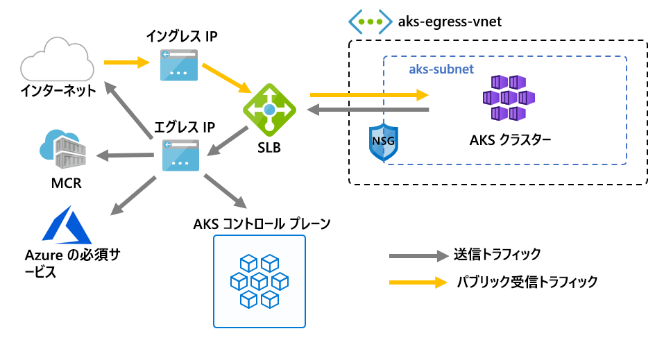

# <a name="customize-cluster-egress-with-a-user-defined-route-preview"></a>ユーザー定義ルートを使用してクラスターのエグレスをカスタマイズする (プレビュー)

AKS クラスターからのエグレスは、特定のシナリオに合わせてカスタマイズできます。 AKS の既定では、Standard SKU ロード バランサーがプロビジョニングされ、エグレス用に設定および使用されます。 ただし、パブリック IP が許可されていない場合、またはエグレスに追加のホップが必要な場合、既定の設定ではすべてのシナリオの要件を満たせない可能性があります。

この記事では、クラスターのエグレス ルートをカスタマイズして、パブリック IP を禁止し、クラスターをネットワーク仮想アプライアンス (NVA) の背後に配置することを必須にするなどのカスタム ネットワーク シナリオをサポートする方法について説明します。

> [!IMPORTANT]
> AKS のプレビュー機能はセルフサービスであり、オプトイン ベースでオファーされます。 プレビューは、「*現状のまま*」、 「*利用可能な限度で*」提供されており、サービス レベル契約 (SLA) および限定保証からは除外されています。 AKS プレビューは、*ベストエフォート* ベースでカスタマー サポートによって部分的にカバーされます。 したがって、これらのフィーチャーはプロダクション環境での使用を目的としたものではありません。 詳細については、次のサポート記事を参照してください。
>
> * [AKS のサポート ポリシー](support-policies.md)
> * [Azure サポートに関する FAQ](faq.md)

## <a name="prerequisites"></a>前提条件
* Azure CLI バージョン 2.0.81 以降
* Azure CLI プレビュー拡張機能バージョン 0.4.28 以降
* `2020-01-01` 以降の API バージョン

## <a name="install-the-latest-azure-cli-aks-preview-extension"></a>最新の Azure CLI AKS Preview 拡張機能をインストールする
クラスターの送信の種類を設定するには、Azure CLI AKS プレビュー拡張機能バージョン 0.4.18 以降が必要です。 az extension add コマンドを使用して Azure CLI AKS プレビュー拡張機能をインストールした上で、次の az extension update コマンドを使用して、利用可能な更新プログラムがあるかどうかを確認します。

```azure-cli
# Install the aks-preview extension
az extension add --name aks-preview

# Update the extension to make sure you have the latest version installed
az extension update --name aks-preview
```

## <a name="limitations"></a>制限事項
* プレビュー期間中は、クラスターの作成時にのみ `outboundType` を定義できます。後で更新することはできません。
* プレビュー期間中、`outboundType` AKS クラスターには Azure CNI を使用するようにします。 Kubernet は構成可能です。使用するには、ルート テーブルを AKS サブネットに手動で関連付ける必要があります。
* `outboundType` を設定するには、`vm-set-type` を `VirtualMachineScaleSets`、`load-balancer-sku` を `Standard` に設定した AKS クラスターが必要です。
* `outboundType` の値を `UDR` に設定するには、クラスターの送信接続が有効なユーザー定義ルートが必要です。
* `outboundType` の値を `UDR` に設定すると、ロード バランサーにルーティングされるイングレス ソース IP がクラスターのエグレス方向の送信先アドレスと**一致しない**可能性があります。

## <a name="overview-of-outbound-types-in-aks"></a>AKS の送信の種類の概要

AKS クラスターは、種類がロード バランサーまたはユーザー定義のルーティングの一意の `outboundType` を使用してカスタマイズできます。

> [!IMPORTANT]
> 送信の種類は、クラスターのエグレス トラフィックにのみ影響します。 詳細については、[イングレス コントローラーの設定](ingress-basic.md)に関する記事を参照してください。

### <a name="outbound-type-of-loadbalancer"></a>loadBalancer の送信の種類

`loadBalancer` が設定されている場合、AKS によって次の設定が自動的に完了します。 ロード バランサーは、AKS に割り当てられたパブリック IP を経由したエグレスに使用されます。 `loadBalancer` の送信の種類は、種類 `loadBalancer` の Kubernetes サービスをサポートします。このサービスでは、AKS リソース プロバイダーによって作成されたロード バランサーからのエグレスが想定されます。

次の設定は AKS によって行われます。
   * パブリック IP アドレスは、クラスターのエグレス用にプロビジョニングされます。
   * パブリック IP アドレスは、ロード バランサーのリソースに割り当てられます。
   * ロード バランサーのバックエンド プールは、クラスター内のエージェント ノードに設定されます。

既定で AKS クラスターにデプロイされるネットワーク トポロジを次に示します。これには `loadBalancer` の `outboundType` が使用されます。



### <a name="outbound-type-of-userdefinedrouting"></a>userDefinedRouting の送信の種類

> [!NOTE]
> 送信の種類の使用は高度なネットワーク シナリオであり、適切なネットワーク構成が必要です。

`userDefinedRouting` を設定しても、エグレス パスは AKS によって自動的に構成されません。 **ユーザー**が以下の操作を行うことが想定されています。

AKS クラスターは、構成済みのサブネットがある既存の仮想ネットワークにデプロイする必要があります。 Standard ロード バランサー (SLB) アーキテクチャを使用する場合は、明示的なエグレスを確立する必要があります。 そのためには、ファイアウォール、ゲートウェイ、オンプレミスなどのアプライアンスにエグレスの要求を送信するか、Standard ロード バランサーまたは特定のノードに割り当てられたパブリック IP でエグレスを実行できるようにする必要があります。

AKS リソース プロバイダーによって Standard ロード バランサー (SLB) がデプロイされます。 このロード バランサーには規則が構成されておらず、[規則が構成されるまで料金はかかりません](https://azure.microsoft.com/pricing/details/load-balancer/)。 SLB フロントエンドのパブリック IP アドレスは、AKS によって自動的にプロビジョニング**されません**。 ロード バランサーのバックエンド プールは、AKS によって自動的に構成**されません**。

## <a name="deploy-a-cluster-with-outbound-type-of-udr-and-azure-firewall"></a>UDR および Azure Firewall の送信の種類を使用してクラスターをデプロイする

送信の種類としてユーザー定義ルートを使用するクラスターのアプリケーションについて説明するために、Azure ファイアウォールとピアリングされた仮想ネットワーク上にクラスターを構成できます。


* イングレスは、ファイアウォール フィルターの経由が強制されています
   * 分離サブネットには、エージェント ノードにルーティングするための内部ロード バランサーがあります
   * エージェント ノードは専用サブネットに分離されています
* ユーザー定義ルートを使用して、エージェント ノードから Azure Firewall 内部 IP に対する送信要求が開始されます
   * AKS エージェント ノードからの要求は、AKS クラスターがデプロイされたサブネットに設定されている UDR に従います。
   * Azure Firewall は、パブリック IP フロントエンドから仮想ネットワークを出ます
   * AKS コントロール プレーンへのアクセスは、ファイアウォール フロントエンド IP アドレスが有効な NSG によって保護されます
   * パブリック インターネットまたはその他の Azure サービスへのアクセスは、ファイアウォール フロントエンド IP アドレスを送信先と送信元として行われます。

### <a name="set-configuration-via-environment-variables"></a>環境変数を使用して構成を設定する

リソースの作成に使用する一連の環境変数を定義します。

```bash
PREFIX="contosofin"
RG="${PREFIX}-rg"
LOC="eastus"
NAME="${PREFIX}outboundudr"
AKS_NAME="${PREFIX}aks"
VNET_NAME="${PREFIX}vnet"
AKSSUBNET_NAME="${PREFIX}akssubnet"
SVCSUBNET_NAME="${PREFIX}svcsubnet"
# DO NOT CHANGE FWSUBNET_NAME - This is currently a requirement for Azure Firewall.
FWSUBNET_NAME="AzureFirewallSubnet"
FWNAME="${PREFIX}fw"
FWPUBLICIP_NAME="${PREFIX}fwpublicip"
FWIPCONFIG_NAME="${PREFIX}fwconfig"
FWROUTE_TABLE_NAME="${PREFIX}fwrt"
FWROUTE_NAME="${PREFIX}fwrn"
FWROUTE_NAME_INTERNET="${PREFIX}fwinternet"
DEVSUBNET_NAME="${PREFIX}dev"
```

次に、サブスクリプション ID を設定します。

```azure-cli
# Get ARM Access Token and Subscription ID - This will be used for AuthN later.

ACCESS_TOKEN=$(az account get-access-token -o tsv --query 'accessToken')

# NOTE: Update Subscription Name
# Set Default Azure Subscription to be Used via Subscription ID

az account set -s <SUBSCRIPTION_ID_GOES_HERE>

# NOTE: Update Subscription Name for setting SUBID

SUBID=$(az account show -s '<SUBSCRIPTION_NAME_GOES_HERE>' -o tsv --query 'id')
```

## <a name="create-a-virtual-network-with-multiple-subnets"></a>複数のサブネットを含んだ仮想ネットワークを作成する

クラスター用、ファイアウォール用、サービス イングレス用の 3 つのサブネットを持つ仮想ネットワークをプロビジョニングします。


すべてのリソースを保持するリソース グループを作成します。

```azure-cli
# Create Resource Group

az group create --name $RG --location $LOC
```

AKS クラスターと Azure ファイアウォールをホストする 2 つの仮想ネットワークを作成します。 それぞれに独自のサブネットがあります。 AKS ネットワークから始めましょう。

```
# Dedicated virtual network with AKS subnet

az network vnet create \
    --resource-group $RG \
    --name $VNET_NAME \
    --address-prefixes 100.64.0.0/16 \
    --subnet-name $AKSSUBNET_NAME \
    --subnet-prefix 100.64.1.0/24

# Dedicated subnet for K8s services

az network vnet subnet create \
    --resource-group $RG \
    --vnet-name $VNET_NAME \
    --name $SVCSUBNET_NAME \
    --address-prefix 100.64.2.0/24

# Dedicated subnet for Azure Firewall (Firewall name cannot be changed)

az network vnet subnet create \
    --resource-group $RG \
    --vnet-name $VNET_NAME \
    --name $FWSUBNET_NAME \
    --address-prefix 100.64.3.0/24
```

## <a name="create-and-setup-an-azure-firewall-with-a-udr"></a>UDR を使用する Azure ファイアウォールの作成と設定

Azure Firewall の受信および送信規則を構成する必要があります。 ファイアウォールの主な目的は、組織が AKS クラスターに対してきめ細かなイングレスおよびエグレス トラフィック規則を設定できるようにすることです。


Azure Firewall フロントエンド アドレスとして使用される Standard SKU パブリック IP リソースを作成します。

```azure-cli
az network public-ip create -g $RG -n $FWPUBLICIP_NAME -l $LOC --sku "Standard"
```

Azure ファイアウォールを作成するには、プレビューの cli 拡張機能を登録します。
```azure-cli
# Install Azure Firewall preview CLI extension

az extension add --name azure-firewall

# Deploy Azure Firewall

az network firewall create -g $RG -n $FWNAME -l $LOC
```

これで、以前に作成した IP アドレスをファイアウォール フロントエンドに割り当てることができるようになります。
> [!NOTE]
> Azure ファイアウォールへのパブリック IP アドレスの設定には数分かかる場合があります。
> 
> 次のコマンドでエラーが繰り返し発生する場合は、既存のファイアウォールとパブリック IP を削除し、ポータルを使用してパブリック IP と Azure ファイアウォールを同時にプロビジョニングします。

```azure-cli
# Configure Firewall IP Config

az network firewall ip-config create -g $RG -f $FWNAME -n $FWIPCONFIG_NAME --public-ip-address $FWPUBLICIP_NAME --vnet-name $VNET_NAME
```

前のコマンドが正常に完了したら、後で構成できるようにファイアウォールのフロントエンド IP アドレスを保存します。

```bash
# Capture Firewall IP Address for Later Use

FWPUBLIC_IP=$(az network public-ip show -g $RG -n $FWPUBLICIP_NAME --query "ipAddress" -o tsv)
FWPRIVATE_IP=$(az network firewall show -g $RG -n $FWNAME --query "ipConfigurations[0].privateIpAddress" -o tsv)
```

### <a name="create-a-udr-with-a-hop-to-azure-firewall"></a>Azure Firewall へのホップがある UDR を作成する

Azure では、Azure のサブネット、仮想ネットワーク、およびオンプレミスのネットワーク間のトラフィックが自動的にルーティングされます。 Azure の既定のルーティングを変更する場合は、ルート テーブルを作成して変更します。

特定のサブネットに関連付ける空のルート テーブルを作成します。 ルート テーブルには、次のホップを以前の手順で作成した Azure Firewall と定義します。 各サブネットには、0 個または 1 個のルート テーブルを関連付けることができます。

```azure-cli
# Create UDR and add a route for Azure Firewall

az network route-table create -g $RG --name $FWROUTE_TABLE_NAME
az network route-table route create -g $RG --name $FWROUTE_NAME --route-table-name $FWROUTE_TABLE_NAME --address-prefix 0.0.0.0/0 --next-hop-type VirtualAppliance --next-hop-ip-address $FWPRIVATE_IP --subscription $SUBID
az network route-table route create -g $RG --name $FWROUTE_NAME_INTERNET --route-table-name $FWROUTE_TABLE_NAME --address-prefix $FWPUBLIC_IP/32 --next-hop-type Internet
```

Azure の既定のシステム ルートをオーバーライドする方法、またはサブネットのルート テーブルに新しいルートを追加する方法については、[仮想ネットワークのルート テーブルに関するドキュメント](../virtual-network/virtual-networks-udr-overview.md#user-defined)を参照してください。

## <a name="adding-network-firewall-rules"></a>ネットワーク ファイアウォール規則の追加

> [!WARNING]
> ファイアウォール規則を追加する例を次に示します。 AKS クラスターが機能するには、[必須のエグレス エンドポイント](egress.md)の記事で定義されているすべてのエグレス エンドポイントをアプリケーション ファイアウォール規則で有効にする必要があります。 これらのエンドポイントが有効ではない場合、クラスターは機能しません。

ネットワークとアプリケーションの規則の例を次に示します。 ここでは、任意のプロトコル、送信元アドレス、送信先アドレス、宛先ポートを許可するネットワーク規則を追加します。 また、AKS に必要なエンドポイントの**一部**用にアプリケーション規則も追加します。

運用環境のシナリオでは、アプリケーションに必要なエンドポイントと、[AKS の必須のエグレス](egress.md)の記事で定義されているエンドポイントへのアクセスのみを有効にすることをお勧めします。

```
# Add Network FW Rules

az network firewall network-rule create -g $RG -f $FWNAME --collection-name 'aksfwnr' -n 'netrules' --protocols 'Any' --source-addresses '*' --destination-addresses '*' --destination-ports '*' --action allow --priority 100

# Add Application FW Rules
# IMPORTANT: Add AKS required egress endpoints

az network firewall application-rule create -g $RG -f $FWNAME \
    --collection-name 'AKS_Global_Required' \
    --action allow \
    --priority 100 \
    -n 'required' \
    --source-addresses '*' \
    --protocols 'http=80' 'https=443' \
    --target-fqdns \
        'aksrepos.azurecr.io' \
        '*blob.core.windows.net' \
        'mcr.microsoft.com' \
        '*cdn.mscr.io' \
        '*.data.mcr.microsoft.com' \
        'management.azure.com' \
        'login.microsoftonline.com' \
        'ntp.ubuntu.com' \
        'packages.microsoft.com' \
        'acs-mirror.azureedge.net'
```

Azure Firewall サービスの詳細については、[Azure Firewall のドキュメント](https://docs.microsoft.com/azure/firewall/overview)を参照してください。

## <a name="associate-the-route-table-to-aks"></a>ルート テーブルを AKS に関連付ける

クラスターをファイアウォールに関連付けるには、クラスターのサブネットの専用サブネットから、以前の手順で作成したルート テーブルを参照する必要があります。 関連付けを行うには、クラスターとファイアウォールの両方を保持する仮想ネットワークに対して、クラスターのサブネットのルート テーブルを更新するコマンドを発行します。

```azure-cli
# Associate route table with next hop to Firewall to the AKS subnet

az network vnet subnet update -g $RG --vnet-name $VNET_NAME --name $AKSSUBNET_NAME --route-table $FWROUTE_TABLE_NAME
```

## <a name="deploy-aks-with-outbound-type-of-udr-to-the-existing-network"></a>UDR の送信の種類を使用して AKS を既存のネットワークにデプロイする

これで、AKS クラスターを既存の仮想ネットワーク セットアップにデプロイできるようになりました。 クラスターの送信の種類をユーザー定義ルーティングに設定するには、AKS に既存のサブネットを提供する必要があります。


### <a name="create-a-service-principal-with-access-to-provision-inside-the-existing-virtual-network"></a>既存の仮想ネットワーク内にプロビジョニングできるアクセス権を持つサービス プリンシパルを作成する

サービス プリンシパルは、クラスター リソースを作成するために AKS によって使用されます。 作成時に渡されるサービス プリンシパルは、AKS によって使用される VM、ストレージ、ロード バランサーなどの基になる AKS リソースを作成するために使用されます。 付与されたアクセス許可が少なすぎる場合、AKS クラスターをプロビジョニングすることはできません。

```azure-cli
# Create SP and Assign Permission to Virtual Network

az ad sp create-for-rbac -n "${PREFIX}sp" --skip-assignment
```

次に、以下の `APPID` と `PASSWORD` を、前のコマンド出力で自動生成されたサービス プリンシパル appid とサービス プリンシパル パスワードに置き換えます。 VNET リソース ID を参照してサービス プリンシパルにアクセス許可を付与し、AKS によってリソースをデプロイできるようにします。

```azure-cli
APPID="<SERVICE_PRINCIPAL_APPID_GOES_HERE>"
PASSWORD="<SERVICEPRINCIPAL_PASSWORD_GOES_HERE>"
VNETID=$(az network vnet show -g $RG --name $VNET_NAME --query id -o tsv)

# Assign SP Permission to VNET

az role assignment create --assignee $APPID --scope $VNETID --role Contributor

# View Role Assignment
az role assignment list --assignee $APPID --all -o table
```

### <a name="deploy-aks"></a>AKS をデプロイする

最後に、クラスター専用にした既存のサブネットに AKS クラスターをデプロイすることができます。 デプロイ先のターゲット サブネットは、環境変数 `$SUBNETID` で定義します。 前の手順では `$SUBNETID` 変数を定義しませんでした。 サブネット ID の値を設定するには、次のコマンドを使用します。

```azurecli
SUBNETID="/subscriptions/$SUBID/resourceGroups/$RG/providers/Microsoft.Network/virtualNetworks/$VNET_NAME/subnets/$AKSSUBNET_NAME"
```

サブネット上に存在する UDR に従うように送信の種類を定義し、内部に制限できるようになったロード バランサーの設定と IP プロビジョニングが AKS でスキップされるようにします。

[API サーバーの許可された IP 範囲](api-server-authorized-ip-ranges.md)の AKS 機能を追加して、API サーバーのアクセスをファイアウォールのパブリック エンドポイントのみに制限できます。 許可された IP 範囲機能は、コントロール プレーンにアクセスするために渡す必要がある NSG としてこの図に示されています。 許可された IP 範囲機能を有効にして API サーバーへのアクセスを制限する場合、開発者ツールでファイアウォールの仮想ネットワークからのジャンプボックスを使用するか、すべての開発者エンドポイントを許可された IP 範囲に追加する必要があります。

> [!TIP]
> (プライベート クラスター)[] などの新しい機能をクラスターのデプロイに追加できます。 許可された IP 範囲を使用する場合、API サーバーにアクセスするには、クラスター ネットワーク内にジャンプボックスが必要です。

```azure-cli
az aks create -g $RG -n $AKS_NAME -l $LOC \
  --node-count 3 \
  --network-plugin azure --generate-ssh-keys \
  --service-cidr 192.168.0.0/16 \
  --dns-service-ip 192.168.0.10 \
  --docker-bridge-address 172.22.0.1/29 \
  --vnet-subnet-id $SUBNETID \
  --service-principal $APPID \
  --client-secret $PASSWORD \
  --load-balancer-sku standard \
  --outbound-type userDefinedRouting \
  --api-server-authorized-ip-ranges $FWPUBLIC_IP
  ```

### <a name="enable-developer-access-to-the-api-server"></a>開発者の API サーバーへのアクセスを有効にする

許可された IP 範囲がクラスターに設定されているため、API サーバーにアクセスするには、許可された IP 範囲の AKS クラスター一覧に開発者ツールの IP アドレスを追加する必要があります。 もう 1 つの方法は、ファイアウォールの仮想ネットワーク内の別のサブネット内に必要なツールを使用してジャンプボックスを構成することです。

次のコマンドを使用して、許可された範囲にもう 1 つの IP アドレスを追加します

```bash
# Retrieve your IP address
CURRENT_IP=$(dig @resolver1.opendns.com ANY myip.opendns.com +short)

# Add to AKS approved list
az aks update -g $RG -n $AKS_NAME --api-server-authorized-ip-ranges $CURRENT_IP/32

```

 新しく作成された Kubernetes クラスターに接続するように `kubectl` を構成するには、[az aks get-credentials][az-aks-get-credentials] コマンドを使用します。 

 ```azure-cli
 az aks get-credentials -g $RG -n $AKS_NAME
 ```

### <a name="setup-the-internal-load-balancer"></a>内部ロード バランサーを設定する

AKS によって、[内部ロード バランサー](internal-lb.md)として設定できるクラスターと共にロード バランサーがデプロイされました。

内部ロード バランサーを作成するには、次の例に示すように、サービスの種類 LoadBalancer と azure-load-balancer-internal の注釈を含む internal-lb.yaml という名前のサービス マニフェストを作成します。

```yaml
apiVersion: v1
kind: Service
metadata:
  name: internal-app
  annotations:
    service.beta.kubernetes.io/azure-load-balancer-internal: "true"
    service.beta.kubernetes.io/azure-load-balancer-internal-subnet: "contosofinsvcsubnet"
spec:
  type: LoadBalancer
  ports:
  - port: 80
  selector:
    app: internal-app
```

kubectl apply を使用して内部ロード バランサーをデプロイし、YAML マニフェストの名前を指定します。

```bash
kubectl apply -f internal-lb.yaml
```

## <a name="deploy-a-kubernetes-service"></a>Kubernetes サービスをデプロイする

クラスターの送信の種類は UDR に設定されているため、クラスターの作成時に、エージェント ノードをロード バランサーのバックエンド プールとして関連付ける処理は AKS によって自動的に行われません。 ただし、バックエンド プールの関連付けは、Kubernetes サービスのデプロイ時に Kubernetes Azure クラウド プロバイダーによって処理されます。

以下の yaml を `example.yaml` という名前のファイルにコピーして、Azure 投票アプリケーションをデプロイします。

```yaml
apiVersion: apps/v1
kind: Deployment
metadata:
  name: azure-vote-back
spec:
  replicas: 1
  selector:
    matchLabels:
      app: azure-vote-back
  template:
    metadata:
      labels:
        app: azure-vote-back
    spec:
      nodeSelector:
        "beta.kubernetes.io/os": linux
      containers:
      - name: azure-vote-back
        image: redis
        resources:
          requests:
            cpu: 100m
            memory: 128Mi
          limits:
            cpu: 250m
            memory: 256Mi
        ports:
        - containerPort: 6379
          name: redis
---
apiVersion: v1
kind: Service
metadata:
  name: azure-vote-back
spec:
  ports:
  - port: 6379
  selector:
    app: azure-vote-back
---
apiVersion: apps/v1
kind: Deployment
metadata:
  name: azure-vote-front
spec:
  replicas: 1
  selector:
    matchLabels:
      app: azure-vote-front
  template:
    metadata:
      labels:
        app: azure-vote-front
    spec:
      nodeSelector:
        "beta.kubernetes.io/os": linux
      containers:
      - name: azure-vote-front
        image: microsoft/azure-vote-front:v1
        resources:
          requests:
            cpu: 100m
            memory: 128Mi
          limits:
            cpu: 250m
            memory: 256Mi
        ports:
        - containerPort: 80
        env:
        - name: REDIS
          value: "azure-vote-back"
---
apiVersion: v1
kind: Service
metadata:
  name: azure-vote-front
  annotations:
    service.beta.kubernetes.io/azure-load-balancer-internal: "true"
    service.beta.kubernetes.io/azure-load-balancer-internal-subnet: "contosofinsvcsubnet"
spec:
  type: LoadBalancer
  ports:
  - port: 80
  selector:
    app: azure-vote-front
```

次を実行してサービスをデプロイします。

```bash
kubectl apply -f example.yaml
```

## <a name="add-a-dnat-rule-to-azure-firewall"></a>Azure Firewall に DNAT 規則を追加する

受信接続を構成するには、DNAT 規則を Azure ファイアウォールに書き込む必要があります。 クラスターへの接続をテストするために、内部サービスによって公開されている内部 IP にルーティングされるように、ファイアウォール フロントエンド パブリック IP アドレスの規則を定義します。

送信先アドレスは、アクセス先のファイアウォールのポートなので、カスタマイズできます。 変換されたアドレスは、内部ロード バランサーの IP アドレスである必要があります。 変換されたポートは、Kubernetes サービスの公開ポートである必要があります。

Kubernetes サービスによって作成されたロード バランサーに割り当てられた内部 IP アドレスを指定する必要があります。 次を実行してアドレスを取得します。

```bash
kubectl get services
```

必要な IP アドレスは、次のように、EXTERNAL-IP 列に表示されます。

```bash
NAME               TYPE           CLUSTER-IP       EXTERNAL-IP   PORT(S)        AGE
azure-vote-back    ClusterIP      192.168.92.209   <none>        6379/TCP       23m
azure-vote-front   LoadBalancer   192.168.19.183   100.64.2.5    80:32106/TCP   23m
kubernetes         ClusterIP      192.168.0.1      <none>        443/TCP        4d3h
```

```azure-cli
az network firewall nat-rule create --collection-name exampleset --destination-addresses $FWPUBLIC_IP --destination-ports 80 --firewall-name $FWNAME --name inboundrule --protocols Any --resource-group $RG --source-addresses '*' --translated-port 80 --action Dnat --priority 100 --translated-address <INSERT IP OF K8s SERVICE>
```

## <a name="clean-up-resources"></a>リソースをクリーンアップする

> [!NOTE]
> Kubernetes の内部サービスを削除するときに、内部ロード バランサーがどのサービスからも使用されなくなった場合、Azure クラウド プロバイダーによって内部ロード バランサーは削除されます。 次のサービス デプロイでは、要求された構成のロード バランサーが見つからない場合に、ロード バランサーがデプロイされます。

Azure リソースをクリーンアップするには、AKS リソース グループを削除します。

```azure-cli
az group delete -g $RG
```

## <a name="validate-connectivity"></a>接続の検証

ブラウザーで Azure Firewall フロントエンド IP アドレスに移動して、接続を検証します。

Azure 投票アプリの画像が表示されます。

## <a name="next-steps"></a>次のステップ

[Azure ネットワークの UDR の概要](https://docs.microsoft.com/azure/virtual-network/virtual-networks-udr-overview)に関する記事を参照してください。

[ルート テーブルの作成、変更、削除の方法](https://docs.microsoft.com/azure/virtual-network/manage-route-table)に関する記事を参照してください。

<!-- LINKS - internal -->
[az-aks-get-credentials]: /cli/azure/aks?view=azure-cli-latest#az-aks-get-credentials
