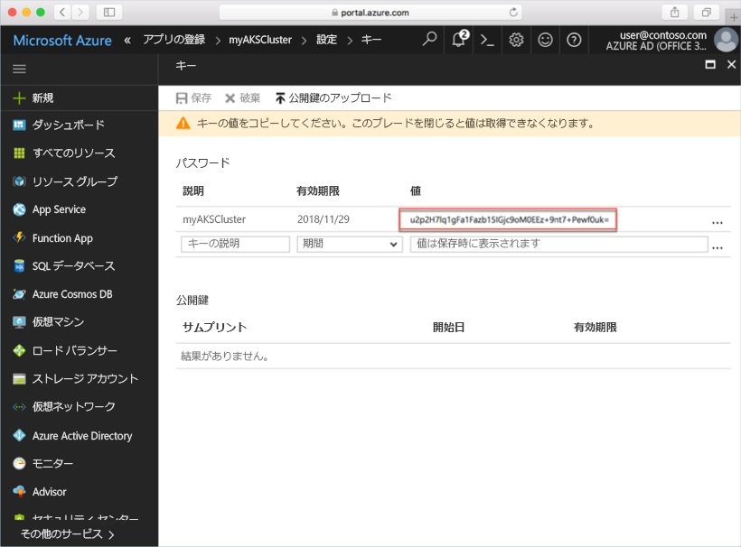
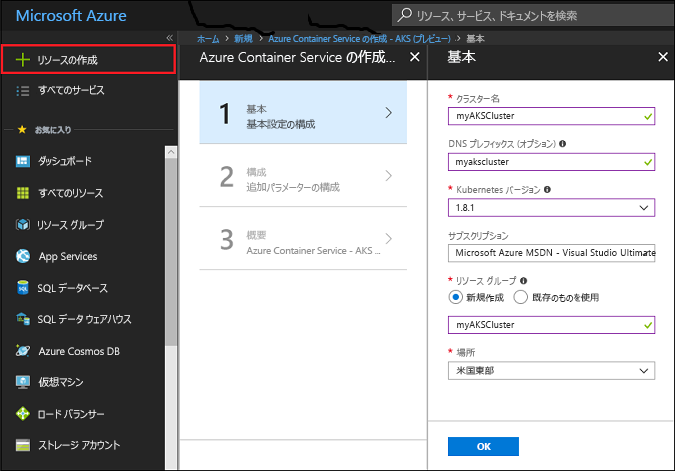
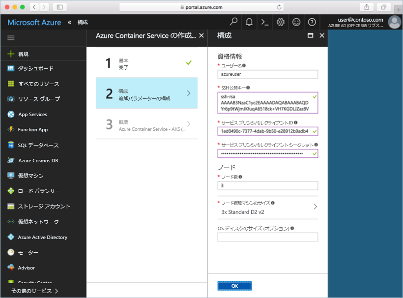

# <a name="deploy-an-azure-container-service-aks-cluster"></a>Azure Container Service (AKS) クラスターのデプロイ

このクイックスタートでは、Azure Portal を使用して AKS クラスターをデプロイします。 次に、このクラスターで、Web フロントエンドと Redis インスタンスで構成される複数コンテナー アプリケーションが実行されます。 完了すると、このアプリケーションはインターネット経由でアクセス可能になります。


このクイックスタートは、Kubernetes の基本的な概念を理解していることを前提としています。 Kubernetes の詳細については、[Kubernetes のドキュメント](https://kubernetes.io/docs/home/)を参照してください。

## <a name="sign-in-to-azure"></a>Azure へのサインイン

Azure Portal (http://portal.azure.com) にサインインします。

## <a name="create-service-principal"></a>サービス プリンシパルの作成

Azure Portal で AKS クラスターを作成する前に、サービス プリンシパルを作成する必要があります。 Azure では、サービス プリンシパルを使用して、AKS クラスターと関連付けられているインフラストラクチャを管理します。

**[Azure Active Directory]** > **[アプリの登録]** > **[新しいアプリケーションの登録]** を選択します。

アプリケーションの名前を入力します (任意の値を指定できます)。 アプリケーション タイプとして **[Web app / API] \(Web アプリ/API)** を選択します。 **[サインオン URL]** の値を入力します。有効な URL 形式であれば任意の値を指定できますが、実際のエンドポイントである必要はありません。

入力し終えたら **[作成]** を選択します。


新しく作成したアプリケーション登録を選択し、アプリケーション ID をメモします。 この値は、AKS クラスターを作成するときに必要になります。


次に、サービス プリンシパルの新しいパスワードを追加する必要があります。 **[すべての設定]** > **[キー]** の順に選択し、キーの説明に任意の値を入力します。 期間を選択します。これは、サービス プリンシパルが有効な期間です。

**[保存]** をクリックし、パスワードの値をメモします。 このパスワードは、AKS クラスターを作成するときに必要になります。



## <a name="create-aks-cluster"></a>AKS クラスターの作成

**[新規作成]** > **[コンテナー]** > **[Azure Container Service - AKS (preview)]\(Azure Container Service - AKS (プレビュー)\)** を選択します。

クラスター名、DNS プレフィックス、リソース グループ名、場所、クラスターの Kubernetes のバージョンを指定します。 クラスター名とリソース グループ名をメモします。これらの情報は、クラスターに接続するときに必要になります。

完了したら、**[OK]** を選択します。



構成フォームで、次の値を入力します。

- ユーザー名 - クラスター ノードの管理者アカウントに与えられた名前。
- SSH パブリック キー - クラスター ノードへのアクセスに使用されるキーと関連付けられています。
- サービス プリンシパルのクライアント ID - このドキュメントの前の手順で作成したサービス プリンシパルのアプリケーション ID。
- サービス プリンシパルのクライアント シークレット - このドキュメントの前の手順で作成したサービス プリンシパルのパスワード。
- ノード数 - 作成する AKS ノード数。
- ノードの仮想マシンのサイズ - AKS ノードの VM サイズ
- OS ディスクのサイズ - AKS ノードの OS ディスクのサイズ。

完了したら **[OK]** を選択し、検証が完了したらもう一度 **[OK]** を選択します。



少し待つと、AKS クラスターが展開され、使用できるようになります。

## <a name="connect-to-the-cluster"></a>クラスターへの接続

Kubernetes クラスターを管理するには、Kubernetes のコマンドライン クライアントである [kubectl](https://kubernetes.io/docs/user-guide/kubectl/) を使用します。 kubectl クライアントは Azure Cloud Shell に事前にインストールされています。

Azure Portal の右上にあるボタンをクリックして Cloud Shell を開きます。


Kubernetes クラスターに接続するように kubectl を構成するには、[az aks get-credentials](/cli/azure/aks?view=azure-cli-latest#az_aks_get_credentials) コマンドを実行します。

次のコマンドをコピーして Cloud Shell に貼り付けます。 必要に応じてリソース グループとクラスター名を変更します。

```azurecli-interactive
az aks get-credentials --resource-group myAKSCluster --name myAKSCluster
```

クラスターへの接続を確認するには、[kubectl get](https://kubernetes.io/docs/user-guide/kubectl/v1.6/#get) コマンドを使用して、クラスター ノードの一覧を返します。

```azurecli-interactive
kubectl get nodes
```

出力:

```
NAME                       STATUS    ROLES     AGE       VERSION
aks-agentpool-14693408-0   Ready     agent     6m        v1.8.1
aks-agentpool-14693408-1   Ready     agent     6m        v1.8.1
aks-agentpool-14693408-2   Ready     agent     7m        v1.8.1
```

## <a name="run-the-application"></a>アプリケーションの実行

Kubernetes のマニフェスト ファイルでは、どのようなコンテナー イメージを実行するかというようなことも含め、クラスターの望ましい状態を定義します。 この例では、マニフェストを使用して、Azure Vote アプリケーションを実行するために必要なすべてのオブジェクトを作成します。

`azure-vote.yml` という名前のファイルを作成し、そこに以下の YAML コードをコピーします。 Azure Cloud Shell で作業している場合、仮想システムまたは物理システムで作業するときと同じように vi または Nano を使用してこのファイルを作成できます。

```yaml
apiVersion: apps/v1beta1
kind: Deployment
metadata:
  name: azure-vote-back
spec:
  replicas: 1
  template:
    metadata:
      labels:
        app: azure-vote-back
    spec:
      containers:
      - name: azure-vote-back
        image: redis
        ports:
        - containerPort: 6379
          name: redis
---
apiVersion: v1
kind: Service
metadata:
  name: azure-vote-back
spec:
  ports:
  - port: 6379
  selector:
    app: azure-vote-back
---
apiVersion: apps/v1beta1
kind: Deployment
metadata:
  name: azure-vote-front
spec:
  replicas: 1
  template:
    metadata:
      labels:
        app: azure-vote-front
    spec:
      containers:
      - name: azure-vote-front
        image: microsoft/azure-vote-front:redis-v1
        ports:
        - containerPort: 80
        env:
        - name: REDIS
          value: "azure-vote-back"
---
apiVersion: v1
kind: Service
metadata:
  name: azure-vote-front
spec:
  type: LoadBalancer
  ports:
  - port: 80
  selector:
    app: azure-vote-front
```

[kubectl create](https://kubernetes.io/docs/user-guide/kubectl/v1.6/#create) コマンドを使用してアプリケーションを実行します。

```azurecli-interactive
kubectl create -f azure-vote.yml
```

出力:

```
deployment "azure-vote-back" created
service "azure-vote-back" created
deployment "azure-vote-front" created
service "azure-vote-front" created
```

## <a name="test-the-application"></a>アプリケーションをテストする

アプリケーションが実行されると、アプリケーション フロントエンドをインターネットに公開する [Kubernetes サービス](https://kubernetes.io/docs/concepts/services-networking/service/)が作成されます。 このプロセスが完了するまでに数分かかることがあります。

進行状況を監視するには、[kubectl get service](https://kubernetes.io/docs/user-guide/kubectl/v1.6/#get) コマンドを `--watch` 引数と一緒に使用します。

```azurecli-interactive
kubectl get service azure-vote-front --watch
```

最初に、*azure-vote-front* サービスの *EXTERNAL-IP* が "*保留中*" として表示されます。

```
NAME               TYPE           CLUSTER-IP   EXTERNAL-IP   PORT(S)        AGE
azure-vote-front   LoadBalancer   10.0.37.27   <pending>     80:30572/TCP   6s
```

*EXTERNAL-IP* アドレスが "*保留中*" から "*IP アドレス*" に変わったら、`CTRL-C` を使用して kubectl ウォッチ プロセスを停止します。

```
azure-vote-front   LoadBalancer   10.0.37.27   52.179.23.131   80:30572/TCP   2m
```

これで、外部 IP アドレスを参照して Azure Vote アプリを表示できるようになりました。


## <a name="delete-cluster"></a>クラスターを削除する

クラスターが不要になったら、クラスターのリソース グループを削除できます。削除すると、関連するすべてのリソースも削除されます。 この操作を行うには、Azure Portal で、リソース グループを選択し、[削除] ボタンをクリックします。 または、Cloud Shell で [az group delete](/cli/azure/group#delete) コマンドを実行します。

```azurecli-interactive
az group delete --name myAKSCluster --no-wait
```

## <a name="get-the-code"></a>コードの入手

このクイック スタートでは、事前に作成したコンテナー イメージを使用して、Kubernetes のデプロイを作成しました。 関連するアプリケーション コード、Dockerfile、および Kubernetes マニフェスト ファイルは、GitHub で入手できます。

[https://github.com/Azure-Samples/azure-voting-app-redis](https://github.com/Azure-Samples/azure-voting-app-redis.git)

## <a name="next-steps"></a>次のステップ

このクイック スタートでは、Kubernetes クラスターをデプロイし、そこに複数コンテナー アプリケーションをデプロイしました。

AKS の詳細を参照し、デプロイの例の完全なコードを確認するには、Kubernetes クラスター チュートリアルに進んでください。

> [!div class="nextstepaction"]
> [AKS クラスターの管理](./tutorial-kubernetes-prepare-app.md)

