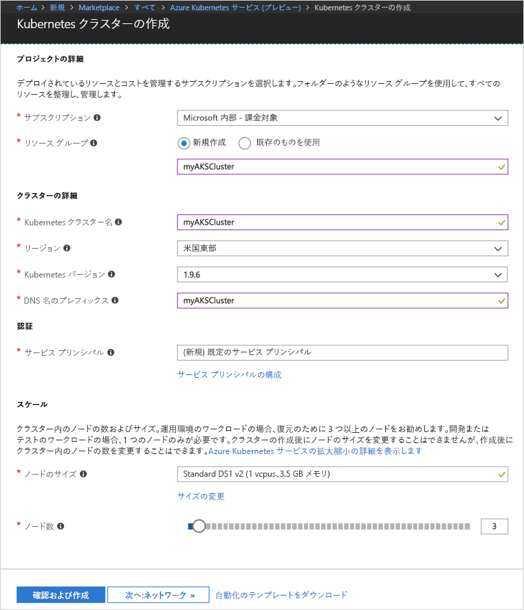
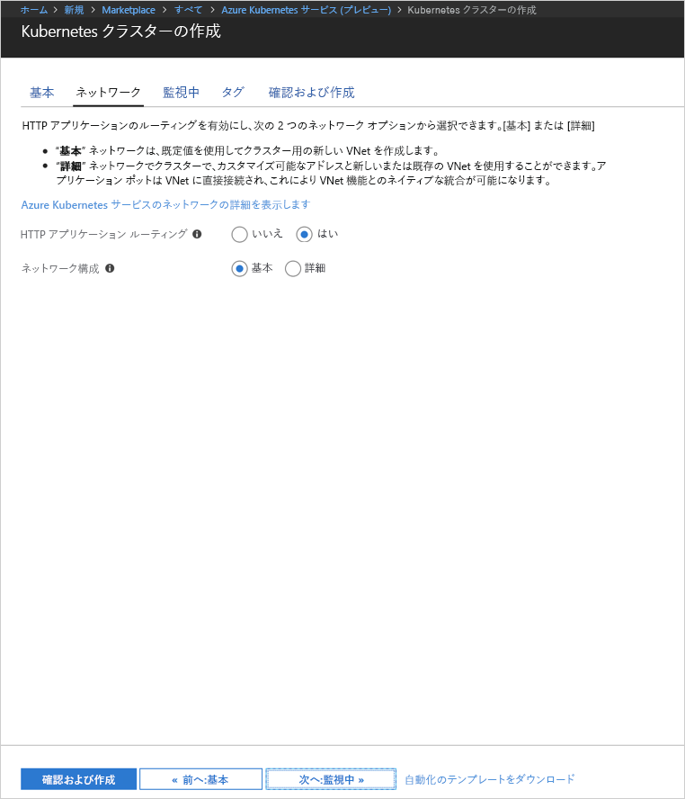
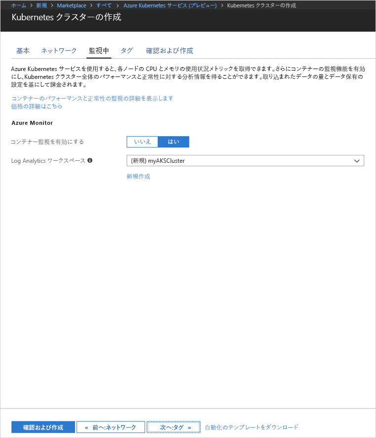
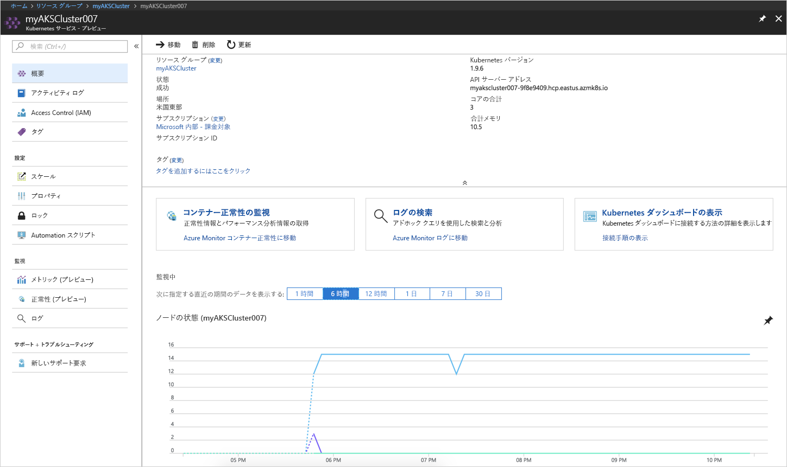
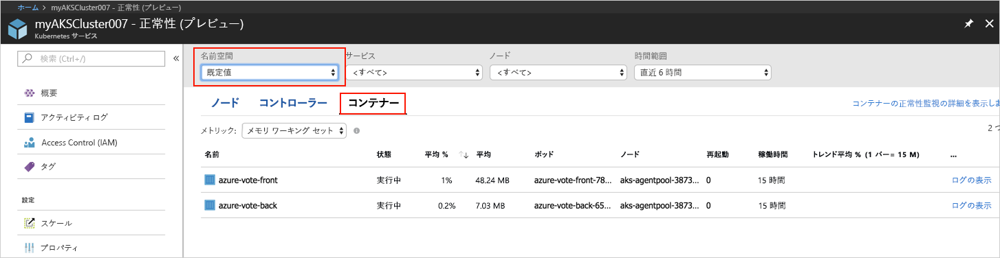
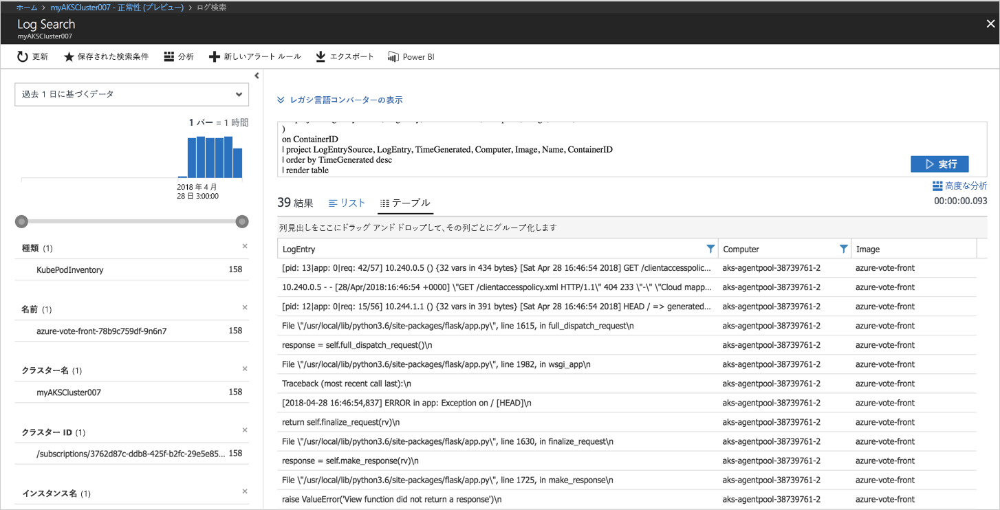

# <a name="quickstart-deploy-an-azure-kubernetes-service-aks-cluster"></a>クイック スタート: Azure Kubernetes Service (AKS) クラスターのデプロイ

このクイックスタートでは、Azure Portal を使用して AKS クラスターをデプロイします。 次に、このクラスターで、Web フロントエンドと Redis インスタンスで構成される複数コンテナー アプリケーションが実行されます。 完了すると、このアプリケーションはインターネット経由でアクセス可能になります。


このクイックスタートは、Kubernetes の基本的な概念を理解していることを前提としています。 Kubernetes について詳しくは、[Kubernetes のドキュメント][kubernetes-documentation]をご覧ください。

## <a name="sign-in-to-azure"></a>Azure へのサインイン

Azure Portal (http://portal.azure.com) にサインインします。


## <a name="create-aks-cluster"></a>AKS クラスターの作成

**[Create a resource] (リソースの作成)** を選択し、**[Kubernetes]** を検索して、**[Azure Kubernetes Service (プレビュー)]** > **[作成]** を選択します。

AKS クラスター の作成フォームの各見出しの下で、次の手順を実行します。

- **PROJECT DETAILS (プロジェクトの詳細)**: Azure サブスクリプションと、新規または既存の Azure リソース グループを選択します。
- **CLUSTER DETAILS (クラスターの詳細)**: AKS クラスターの名前、リージョン、バージョン、および DNS 名プレフィックスを入力します。
- **AUTHENTICATION (認証)**: 新しいサービス プリンシパルを作成するか、または既存のものを使用します。 既存の SPN を使用する場合は、SPN クライアント ID とシークレットを指定する必要があります。
- **SCALE (スケール)**: AKS ノードの VM サイズを選択します。 AKS クラスターがデプロイされた後に、VM サイズを変更することは**できません**。 また、クラスターにデプロイするノードの数を選択します。 ノード数は、クラスターをデプロイした後に調整**できます**。

完了したら、**[Next: Networking] (次へ: ネットワーク)** を選択します。



次のネットワーク オプションを構成します。

- **HTTP アプリケーション ルーティング** - パブリック DNS 名の自動作成で統合イングレス コントローラーを構成します。 HTTP ルーティングの詳細については、[AKS の HTTP ルーティングと DNS][http-routing]に関するページを参照してください。
- **ネットワーク構成** - [kubenet][kubenet] Kubernetes プラグインを使用した基本的なネットワーク構成、または [Azure CNI][azure-cni] を使用した高度なネットワーク構成から選択します。 ネットワーク オプションの詳細については、[AKS ネットワークの概要][aks-network]に関するページを参照してください。

完了したら、**[Next: Monitoring] (次へ: 監視)** を選択します。



AKS クラスターのデプロイ時に、AKS クラスターとクラスターで実行されているポッドの正常性を監視するように Azure Container Insights を構成できます。 コンテナーの正常性の監視の詳細については、[Azure Kubernetes Service の正常性の監視][aks-monitor]に関するページを参照してください。

**[はい]** を選択して、コンテナーの監視を有効にし、既存の Log Analytics ワークスペースを選択するか、または新規に作成します。

完了したら、**[Review + create] (レビュー + 作成)**、**[作成]** の順に選択します。



少し待つと、AKS クラスターが展開され、使用できるようになります。 AKS クラスター リソース グループを参照し、AKS リソースを選択して、AKS クラスター ダッシュボードを表示する必要があります。



## <a name="connect-to-the-cluster"></a>クラスターへの接続

Kubernetes クラスターを管理するには、Kubernetes のコマンドライン クライアントである [kubectl][kubectl] を使います。 kubectl クライアントは Azure Cloud Shell に事前にインストールされています。

Azure Portal の右上にあるボタンをクリックして Cloud Shell を開きます。


Kubernetes クラスターに接続するように kubectl を構成するには、[az aks get-credentials][az-aks-get-credentials] コマンドを実行します。

次のコマンドをコピーして Cloud Shell に貼り付けます。 必要に応じてリソース グループとクラスター名を変更します。

```azurecli-interactive
az aks get-credentials --resource-group myAKSCluster --name myAKSCluster
```

クラスターへの接続を確認するには、[kubectl get][kubectl-get] コマンドを使って、クラスター ノードの一覧を取得します。

```azurecli-interactive
kubectl get nodes
```

出力:

```
NAME                       STATUS    ROLES     AGE       VERSION
aks-agentpool-11482510-0   Ready     agent     9m        v1.9.6
aks-agentpool-11482510-1   Ready     agent     8m        v1.9.6
aks-agentpool-11482510-2   Ready     agent     9m        v1.9.6
```

## <a name="run-the-application"></a>アプリケーションの実行

Kubernetes のマニフェスト ファイルでは、どのようなコンテナー イメージを実行するかというようなことも含め、クラスターの望ましい状態を定義します。 この例では、マニフェストを使用して、Azure Vote アプリケーションを実行するために必要なすべてのオブジェクトを作成します。 これらのオブジェクトには、[Kubernetes デプロイ][kubernetes-deployment]が 2 つ含まれます。Azure Vote フロントエンド用と Redis インスタンス用です。 さらに、[Kubernetes サービス][kubernetes-service]が 2 つ作成されます。Redis インスタンスに使用される内部サービスと、Azure Vote アプリケーションにインターネットからアクセスするための外部サービスです。

`azure-vote.yaml` という名前のファイルを作成し、そこに以下の YAML コードをコピーします。 Azure Cloud Shell で作業している場合は、仮想システムまたは物理システムで作業するときと同じように、vi または Nano を使用してこのファイルを作成します。

```yaml
apiVersion: apps/v1beta1
kind: Deployment
metadata:
  name: azure-vote-back
spec:
  replicas: 1
  template:
    metadata:
      labels:
        app: azure-vote-back
    spec:
      containers:
      - name: azure-vote-back
        image: redis
        ports:
        - containerPort: 6379
          name: redis
---
apiVersion: v1
kind: Service
metadata:
  name: azure-vote-back
spec:
  ports:
  - port: 6379
  selector:
    app: azure-vote-back
---
apiVersion: apps/v1beta1
kind: Deployment
metadata:
  name: azure-vote-front
spec:
  replicas: 1
  template:
    metadata:
      labels:
        app: azure-vote-front
    spec:
      containers:
      - name: azure-vote-front
        image: microsoft/azure-vote-front:v1
        ports:
        - containerPort: 80
        env:
        - name: REDIS
          value: "azure-vote-back"
---
apiVersion: v1
kind: Service
metadata:
  name: azure-vote-front
spec:
  type: LoadBalancer
  ports:
  - port: 80
  selector:
    app: azure-vote-front
```

[kubectl create][kubectl-create] コマンドを使ってアプリケーションを実行します。

```azurecli-interactive
kubectl create -f azure-vote.yaml
```

出力:

```
deployment "azure-vote-back" created
service "azure-vote-back" created
deployment "azure-vote-front" created
service "azure-vote-front" created
```

## <a name="test-the-application"></a>アプリケーションをテストする

アプリケーションが実行されると、アプリケーションをインターネットに公開する [Kubernetes サービス][kubernetes-service] が作成されます。 このプロセスが完了するまでに数分かかることがあります。

進行状況を監視するには、[kubectl get service][kubectl-get] コマンドと `--watch` 引数を使います。

```azurecli-interactive
kubectl get service azure-vote-front --watch
```

最初に、*azure-vote-front* サービスの *EXTERNAL-IP* が "*保留中*" として表示されます。

```
NAME               TYPE           CLUSTER-IP   EXTERNAL-IP   PORT(S)        AGE
azure-vote-front   LoadBalancer   10.0.37.27   <pending>     80:30572/TCP   6s
```

*EXTERNAL-IP* アドレスが "*保留中*" から "*IP アドレス*" に変わったら、`CTRL-C` を使用して kubectl ウォッチ プロセスを停止します。

```
azure-vote-front   LoadBalancer   10.0.37.27   52.179.23.131   80:30572/TCP   2m
```

ここで、外部 IP アドレスにブラウザーでアクセスして Azure Vote App を表示してみましょう。


## <a name="monitor-health-and-logs"></a>正常性の監視とログ

コンテナーの洞察の監視が有効にされている場合、AKS クラスターとクラスターで実行されているポッドの両方の正常性メトリックスが AKS クラスター ダッシュボードで使用できます。 コンテナーの正常性の監視の詳細については、[Azure Kubernetes Service の正常性の監視][aks-monitor]に関するページを参照してください。

Azure Vote ポッドの現在の状態、稼働時間、およびリソース使用率を確認するには、AKS リソースに戻り、**[Monitor Container Health] (コンテナーの正常性の監視)** を選択し、**[既定]** の名前空間を選択して、**[コンテナー]** を選択します。 Azure Portal にこのデータが入力されるまで、数分かかる場合があります。



`azure-vote-front` ポッドのログを参照するには、**[ログの表示]** リンクを選択します。 これらのログには、コンテナーからの stdout ストリームと stderr ストリームが含まれます。



## <a name="delete-cluster"></a>クラスターを削除する

クラスターが不要になったら、クラスターのリソース を削除します。削除すると、関連するすべてのリソースも削除されます。 この操作を行うには、Azure Portal で、AKS クラスター ダッシュボードの削除ボタンを選択します。 または、Cloud Shell で [az aks delete][az-aks-delete] コマンドを実行します。

```azurecli-interactive
az aks delete --resource-group myAKSCluster --name myAKSCluster --no-wait
```

## <a name="get-the-code"></a>コードの入手

このクイック スタートでは、事前に作成したコンテナー イメージを使用して、Kubernetes のデプロイを作成しました。 関連するアプリケーション コード、Dockerfile、および Kubernetes マニフェスト ファイルは、GitHub で入手できます。

[https://github.com/Azure-Samples/azure-voting-app-redis][azure-vote-app]

## <a name="next-steps"></a>次の手順

このクイック スタートでは、Kubernetes クラスターをデプロイし、そこに複数コンテナー アプリケーションをデプロイしました。

AKS の詳細を参照し、デプロイの例の完全なコードを確認するには、Kubernetes クラスター チュートリアルに進んでください。

> [!div class="nextstepaction"]
> [AKS チュートリアル][aks-tutorial]

<!-- LINKS - external -->
[azure-vote-app]: https://github.com/Azure-Samples/azure-voting-app-redis.git
[azure-cni]: https://github.com/Azure/azure-container-networking/blob/master/docs/cni.md
[kubectl]: https://kubernetes.io/docs/user-guide/kubectl/
[kubectl-create]: https://kubernetes.io/docs/reference/generated/kubectl/kubectl-commands#create
[kubectl-get]: https://kubernetes.io/docs/reference/generated/kubectl/kubectl-commands#get
[kubenet]: https://kubernetes.io/docs/concepts/cluster-administration/network-plugins/#kubenet
[kubernetes-deployment]: https://kubernetes.io/docs/concepts/workloads/controllers/deployment/
[kubernetes-documentation]: https://kubernetes.io/docs/home/
[kubernetes-service]: https://kubernetes.io/docs/concepts/services-networking/service/

<!-- LINKS - internal -->
[az-aks-get-credentials]: /cli/azure/aks?view=azure-cli-latest#az_aks_get_credentials
[az-aks-delete]: /cli/azure/aks#az-aks-delete
[aks-monitor]: ../log-analytics/log-analytics-containers.md
[aks-network]: ./networking-overview.md
[aks-tutorial]: ./tutorial-kubernetes-prepare-app.md
[http-routing]: ./http-application-routing.md