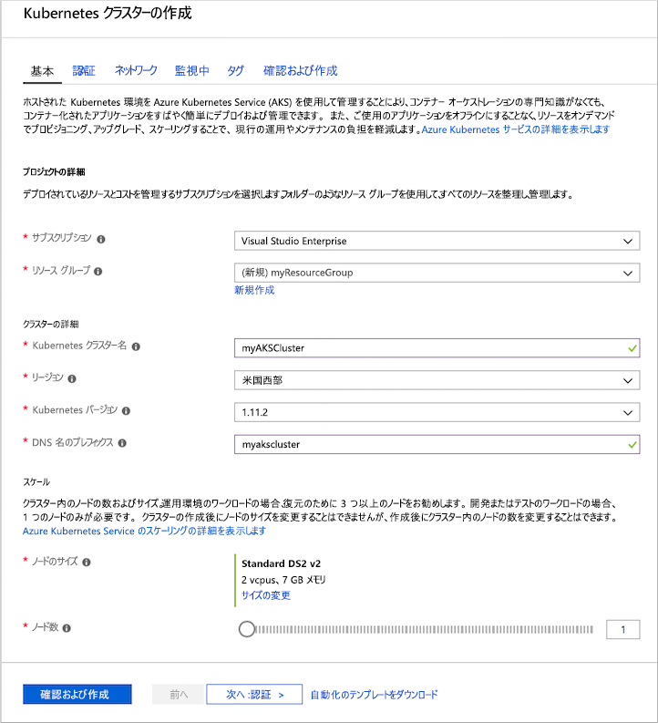
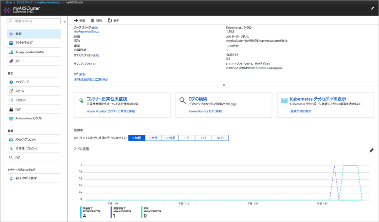
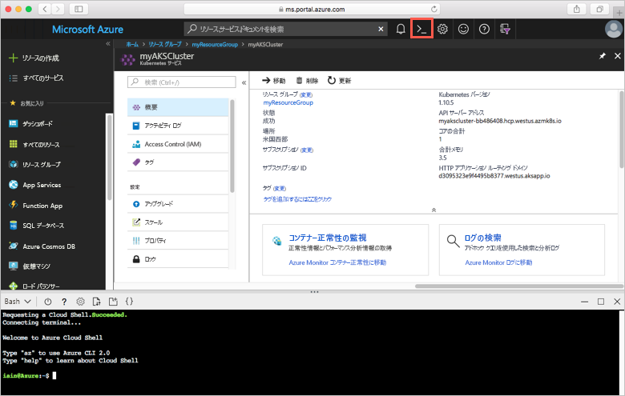
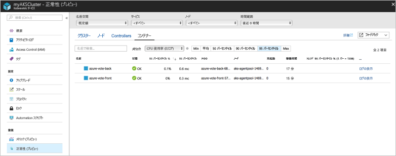
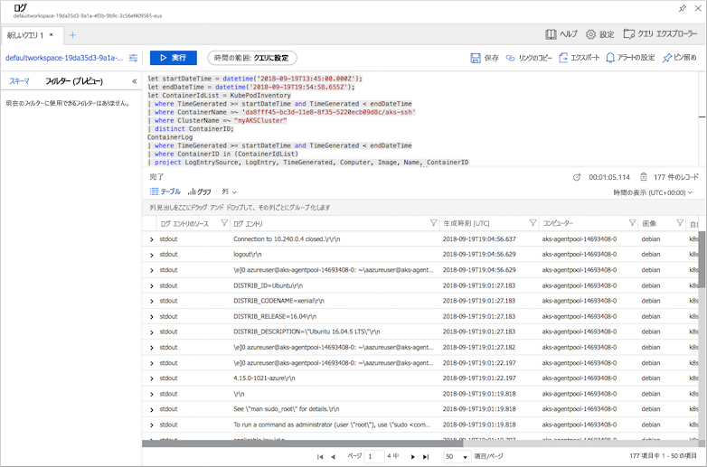

# <a name="quickstart-deploy-an-azure-kubernetes-service-aks-cluster"></a>クイック スタート:Azure Kubernetes Service (AKS) クラスターのデプロイ

このクイックスタートでは、Azure Portal を使用して AKS クラスターをデプロイします。 次に、このクラスターで、Web フロントエンドと Redis インスタンスで構成される複数コンテナー アプリケーションが実行されます。 完了すると、このアプリケーションはインターネット経由でアクセス可能になります。


このクイックスタートは、Kubernetes の基本的な概念を理解していることを前提としています。 Kubernetes について詳しくは、[Kubernetes のドキュメント][kubernetes-documentation]をご覧ください。

Azure サブスクリプションをお持ちでない場合は、開始する前に [無料アカウント](https://azure.microsoft.com/free/?WT.mc_id=A261C142F) を作成してください。

## <a name="sign-in-to-azure"></a>Azure へのサインイン

Azure Portal ( https://portal.azure.com ) にサインインします。

## <a name="create-an-aks-cluster"></a>AKS クラスターの作成

Azure portal の左上隅で、**[リソースの作成]** > **[Kubernetes Service]** を選択します。

AKS クラスターを作成するには、次の手順を実行します。

1. **[基本]** - 次のオプションを構成します。
    - *プロジェクトの詳細*:Azure サブスクリプションを選択し、Azure リソース グループ (たとえば、*myResourceGroup*) を選択または作成します。 **Kubernetes クラスター名** (たとえば、*myAKSCluster*) を入力します。
    - *クラスターの詳細*:AKS クラスターのリージョン、Kubernetes バージョン、および DNS 名プレフィックスを選択します。
    - *[規模の設定]*:AKS ノードの VM サイズを選択します。 AKS クラスターがデプロイされた後に、VM サイズを変更することは**できません**。
        - クラスターにデプロイするノードの数を選択します。 このクイック スタートでは、**[ノード数]** を *1* に設定します。 ノード数は、クラスターをデプロイした後に調整**できます**。
    
    

    **[次へ:認証]** を選択します。

1. **認証**:次のオプションを構成します。
    - 新しいサービス プリンシパルを作成するか、既存のものを使用するように "*構成*" します。 既存の SPN を使用する場合は、SPN クライアント ID とシークレットを指定する必要があります。
    - Kubernetes のロールベースのアクセス制御 (RBAC) のオプションを有効にします。 これらのコントロールを使用すると、AKS クラスターにデプロイされた Kubernetes リソースへのアクセスをより詳細に制御できます。

    **[次へ:ネットワーク]** を完了後に選択します。

1. **ネットワーク**:次のネットワーク オプションを構成します。
    
    - **[HTTP アプリケーションのルーティング]** - パブリック DNS 名の自動作成を使用して統合イングレス コントローラーを構成するには、**[はい]** を選択します。 HTTP ルーティングの詳細については、[AKS の HTTP ルーティングと DNS][http-routing]に関するページを参照してください。
    - **[ネットワーク構成]** - [Azure CNI][azure-cni] を使用した高度なネットワーク構成ではなく、[kubenet][kubenet] Kubernetes プラグインを使用した **[基本]** ネットワーク構成を選択します。 ネットワーク オプションの詳細については、[AKS ネットワークの概要][aks-network]に関するページを参照してください。
    
    **[次へ:監視]** を完了後に選択します。

1. AKS クラスターのデプロイ時に、AKS クラスターとクラスターで実行されているポッドの正常性を監視するように、コンテナーの Azure Monitor を構成することができます。 コンテナーの正常性の監視の詳細については、[Azure Kubernetes Service の正常性の監視][aks-monitor]に関するページを参照してください。

    **[はい]** を選択して、コンテナーの監視を有効にし、既存の Log Analytics ワークスペースを選択するか、または新規に作成します。
    
    準備ができたら、**[確認および作成]**、**[作成]** の順に選択します。

AKS クラスターを作成して、使用準備が完了するのには数分かかります。 AKS クラスター リソース グループ (たとえば、*myResourceGroup*) を参照し、AKS リソース (たとえば、*myAKSCluster*) を選択します。 次のスクリーンショットの例のように、AKS クラスターのダッシュボードが表示されます。



## <a name="connect-to-the-cluster"></a>クラスターへの接続

Kubernetes クラスターを管理するには、Kubernetes のコマンドライン クライアントである [kubectl][kubectl] を使います。 `kubectl` クライアントは Azure Cloud Shell に事前にインストールされています。

Azure Portal の右上にあるボタンをクリックして Cloud Shell を開きます。



Kubernetes クラスターに接続するように `kubectl` を構成するには、[az aks get-credentials][az-aks-get-credentials] コマンドを実行します。 次の例では、*myResourceGroup* という名前のリソース グループの *myAKSCluster* という名前のクラスターの資格情報を取得します。

```azurecli-interactive
az aks get-credentials --resource-group myResourceGroup --name myAKSCluster
```

クラスターへの接続を確認するには、[kubectl get][kubectl-get] コマンドを使って、クラスター ノードの一覧を取得します。

```azurecli-interactive
kubectl get nodes
```

次の出力例は、前の手順で作成した単一ノードを示しています。 ノードの状態が "準備完了" であることを確認します。

```
NAME                       STATUS    ROLES     AGE       VERSION
aks-agentpool-14693408-0   Ready     agent     10m       v1.11.2
```

## <a name="run-the-application"></a>アプリケーションの実行

Kubernetes のマニフェスト ファイルでは、どのようなコンテナー イメージを実行するかというようなことも含め、クラスターの望ましい状態を定義します。 このクイック スタートでは、マニフェストを使用して、サンプルの Azure Vote アプリケーションを実行するために必要なすべてのオブジェクトを作成します。 これらのオブジェクトには、[Kubernetes デプロイ][kubernetes-deployment]が 2 つ含まれます。Azure Vote フロントエンド用と Redis インスタンス用です。 さらに、[Kubernetes サービス][kubernetes-service]が 2 つ作成されます。Redis インスタンスに使用される内部サービスと、Azure Vote アプリケーションにインターネットからアクセスするための外部サービスです。

> [!TIP]
> このクイック スタートでは、アプリケーション マニフェストの作成と AKS クラスターへのデプロイを手動で行います。 より現実に即したシナリオでは、[Azure Dev Spaces][azure-dev-spaces] を使用することで、反復作業を迅速化し、AKS クラスター内で直接、コードをデバッグすることができます。 Dev Spaces は、OS プラットフォームと開発環境の垣根を越えて使用でき、チーム内の他のメンバーと連携することができます。

`azure-vote.yaml` という名前のファイルを作成し、そこに以下の YAML コードをコピーします。 Azure Cloud Shell で作業している場合は、仮想システムまたは物理システムで作業するときと同じように、`vi` または `Nano` を使用してこのファイルを作成します。

```yaml
apiVersion: apps/v1
kind: Deployment
metadata:
  name: azure-vote-back
spec:
  replicas: 1
  selector:
    matchLabels:
      app: azure-vote-back
  template:
    metadata:
      labels:
        app: azure-vote-back
    spec:
      containers:
      - name: azure-vote-back
        image: redis
        resources:
          requests:
            cpu: 100m
            memory: 128Mi
          limits:
            cpu: 250m
            memory: 256Mi
        ports:
        - containerPort: 6379
          name: redis
---
apiVersion: v1
kind: Service
metadata:
  name: azure-vote-back
spec:
  ports:
  - port: 6379
  selector:
    app: azure-vote-back
---
apiVersion: apps/v1
kind: Deployment
metadata:
  name: azure-vote-front
spec:
  replicas: 1
  selector:
    matchLabels:
      app: azure-vote-front
  template:
    metadata:
      labels:
        app: azure-vote-front
    spec:
      containers:
      - name: azure-vote-front
        image: microsoft/azure-vote-front:v1
        resources:
          requests:
            cpu: 100m
            memory: 128Mi
          limits:
            cpu: 250m
            memory: 256Mi
        ports:
        - containerPort: 80
        env:
        - name: REDIS
          value: "azure-vote-back"
---
apiVersion: v1
kind: Service
metadata:
  name: azure-vote-front
spec:
  type: LoadBalancer
  ports:
  - port: 80
  selector:
    app: azure-vote-front
```

[kubectl apply][kubectl-apply] コマンドを使ってアプリケーションを実行します。

```azurecli-interactive
kubectl apply -f azure-vote.yaml
```

次の出力例は、AKS クラスターに作成された Kubernetes リソースを示しています。

```
deployment "azure-vote-back" created
service "azure-vote-back" created
deployment "azure-vote-front" created
service "azure-vote-front" created
```

## <a name="test-the-application"></a>アプリケーションをテストする

アプリケーションが実行されると、アプリケーションをインターネットに公開する [Kubernetes サービス][kubernetes-service] が作成されます。 このプロセスが完了するまでに数分かかることがあります。

進行状況を監視するには、[kubectl get service][kubectl-get] コマンドと `--watch` 引数を使います。

```azurecli-interactive
kubectl get service azure-vote-front --watch
```

最初に、*azure-vote-front* サービスの *EXTERNAL-IP* が "*保留中*" として表示されます。

```
NAME               TYPE           CLUSTER-IP   EXTERNAL-IP   PORT(S)        AGE
azure-vote-front   LoadBalancer   10.0.37.27   <pending>     80:30572/TCP   6s
```

*EXTERNAL-IP* アドレスが "*保留中*" から "*IP アドレス*" に変わったら、`CTRL-C` を使用して kubectl ウォッチ プロセスを停止します。

```
azure-vote-front   LoadBalancer   10.0.37.27   52.179.23.131   80:30572/TCP   2m
```

次の例に示すように、Web ブラウザーを使用してサービスの外部 IP アドレスにアクセスして Azure Vote アプリを表示します。


## <a name="monitor-health-and-logs"></a>正常性の監視とログ

クラスターを作成したとき、コンテナーの分析情報の監視が有効になりました。 この監視機能は、AKS クラスターとクラスター上で動作するポッドの両方の正常性メトリックを提供します。 コンテナーの正常性の監視の詳細については、[Azure Kubernetes Service の正常性の監視][aks-monitor]に関するページを参照してください。

Azure Portal にこのデータが入力されるまで、数分かかる場合があります。 Azure Vote ポッドの現在の状態、稼働時間、およびリソース使用率を確認するには、Azure portal の AKS リソース (たとえば、*myAKSCluster*) に戻ります。 その後、次のようにして、正常性状態にアクセスすることができます。

1. 左側の **[監視]** の下で、**[Insights (プレビュー)]** を選択します
1. 上部の **[+ フィルターの追加]** を選択します
1. プロパティとして "*名前空間*" を選択し、*\<All but kube-system (kube-system 以外のすべて)\>* を選択します
1. **コンテナー**の表示を選択します。

次の例に示されているように、*azure-vote-back* コンテナーと *azure-vote-front* コンテナーが表示されます。



`azure-vote-front` ポッドのログを表示するには、コンテナーの一覧の右側にある **[コンテナー ログの表示]** リンクを選択します。 これらのログには、コンテナーからの *stdout* ストリームと *stderr* ストリームが含まれます。



## <a name="delete-cluster"></a>クラスターを削除する

クラスターが不要になったら、クラスターのリソース を削除します。削除すると、関連するすべてのリソースも削除されます。 この操作を行うには、Azure portal で、AKS クラスター ダッシュボードの **[削除]** ボタンを選択します。 または、Cloud Shell で [az aks delete][az-aks-delete] コマンドを使用することもできます。

```azurecli-interactive
az aks delete --resource-group myResourceGroup --name myAKSCluster --no-wait
```

> [!NOTE]
> クラスターを削除したとき、AKS クラスターで使用される Azure Active Directory サービス プリンシパルは削除されません。 サービス プリンシパルを削除する手順については、[AKS のサービス プリンシパルに関する考慮事項と削除][sp-delete]に関するページを参照してください。

## <a name="get-the-code"></a>コードの入手

このクイック スタートでは、事前に作成したコンテナー イメージを使用して、Kubernetes のデプロイを作成しました。 関連するアプリケーション コード、Dockerfile、および Kubernetes マニフェスト ファイルは、GitHub で入手できます。

[https://github.com/Azure-Samples/azure-voting-app-redis][azure-vote-app]

## <a name="next-steps"></a>次の手順

このクイック スタートでは、Kubernetes クラスターをデプロイし、そこに複数コンテナー アプリケーションをデプロイしました。

AKS の詳細を参照し、デプロイの例の完全なコードを確認するには、Kubernetes クラスター チュートリアルに進んでください。

> [!div class="nextstepaction"]
> [AKS チュートリアル][aks-tutorial]

<!-- LINKS - external -->
[azure-vote-app]: https://github.com/Azure-Samples/azure-voting-app-redis.git
[azure-cni]: https://github.com/Azure/azure-container-networking/blob/master/docs/cni.md
[kubectl]: https://kubernetes.io/docs/user-guide/kubectl/
[kubectl-apply]: https://kubernetes.io/docs/reference/generated/kubectl/kubectl-commands#apply
[kubectl-get]: https://kubernetes.io/docs/reference/generated/kubectl/kubectl-commands#get
[kubenet]: https://kubernetes.io/docs/concepts/cluster-administration/network-plugins/#kubenet
[kubernetes-deployment]: https://kubernetes.io/docs/concepts/workloads/controllers/deployment/
[kubernetes-documentation]: https://kubernetes.io/docs/home/
[kubernetes-service]: https://kubernetes.io/docs/concepts/services-networking/service/

<!-- LINKS - internal -->
[az-aks-get-credentials]: /cli/azure/aks?view=azure-cli-latest#az-aks-get-credentials
[az-aks-delete]: /cli/azure/aks#az-aks-delete
[aks-monitor]: ../monitoring/monitoring-container-health.md
[aks-network]: ./concepts-network.md
[aks-tutorial]: ./tutorial-kubernetes-prepare-app.md
[http-routing]: ./http-application-routing.md
[sp-delete]: kubernetes-service-principal.md#additional-considerations
[azure-dev-spaces]: https://docs.microsoft.com/azure/dev-spaces/
