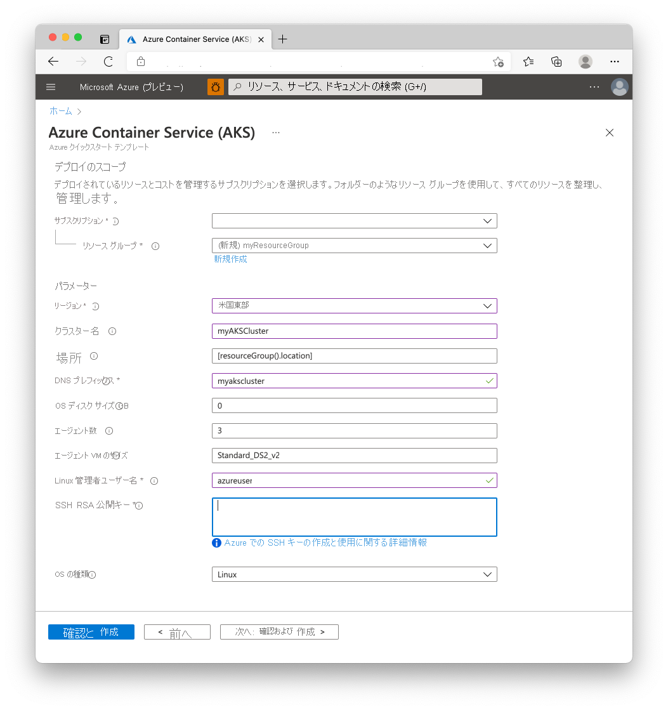

# <a name="quickstart-deploy-an-azure-kubernetes-service-aks-cluster-using-an-azure-resource-manager-template"></a>クイック スタート:Azure Resource Manager テンプレートを使用して Azure Kubernetes Service (AKS) クラスターをデプロイする

Azure Kubernetes Service (AKS) は、クラスターをすばやくデプロイおよび管理することができる、マネージド Kubernetes サービスです。 このクイック スタートでは、Azure Resource Manager テンプレートを使用して AKS クラスターをデプロイします。 このクラスターで、Web フロント エンドと Redis インスタンスが含まれている複数コンテナー アプリケーションが実行されます。


このクイックスタートは、Kubernetes の基本的な概念を理解していることを前提としています。 詳細については、「[Azure Kubernetes Services (AKS) における Kubernetes の中心概念][kubernetes-concepts]」を参照してください。

Azure サブスクリプションをお持ちでない場合は、開始する前に [無料アカウント](https://azure.microsoft.com/free/?WT.mc_id=A261C142F) を作成してください。

[!INCLUDE [cloud-shell-try-it.md](../../includes/cloud-shell-try-it.md)]

CLI をローカルにインストールして使用することを選択した場合、このクイック スタートでは Azure CLI バージョン 2.0.61 以降を実行していることが必要です。 バージョンを確認するには、`az --version` を実行します。 インストールまたはアップグレードする必要がある場合は、[Azure CLI のインストール][azure-cli-install]に関するページを参照してください。

## <a name="prerequisites"></a>前提条件

Resource Manager テンプレートを使用して AKS クラスターを作成するには、SSH 公開キーと Azure Active Directory サービス プリンシパルを指定します。 これらのリソースのいずれかが必要な場合は、後のセクションを参照してください。必要ない場合は、「[AKS クラスターの作成](#create-an-aks-cluster)」セクションに進んでください。

### <a name="create-an-ssh-key-pair"></a>SSH キー ペアの作成

AKS ノードにアクセスするには、SSH キー ペアを使用して接続します。 `ssh-keygen` コマンドを使用して、SSH 公開キーと秘密キーのファイルを生成します。 既定では、これらのファイルは *~/.ssh* ディレクトリに作成されます。 同じ名前の SSH キー ペアが指定された場所にある場合、それらのファイルは上書きされます。

次のコマンドでは、RSA 暗号化と 2048 ビット長を使用して SSH キー ペアが作成されます。

```azurecli-interactive
ssh-keygen -t rsa -b 2048
```

SSH キーの作成の詳細については、[Azure での認証用の SSH キーの作成と管理][ssh-keys]に関するページを参照してください。

### <a name="create-a-service-principal"></a>サービス プリンシパルの作成

AKS クラスターが他の Azure リソースと対話できるようにするために、Azure Active Directory のサービス プリンシパルを使用します。 [az ad sp create-for-rbac][az-ad-sp-create-for-rbac] コマンドを使用して、サービス プリンシパルを作成します。 `--skip-assignment` パラメーターで、余分なアクセス許可の割り当てを制限します。 既定では、このサービス プリンシパルは 1 年間有効です。

```azurecli-interactive
az ad sp create-for-rbac --skip-assignment
```

出力は次の例のようになります。

```json
{
  "appId": "8b1ede42-d407-46c2-a1bc-6b213b04295f",
  "displayName": "azure-cli-2019-04-19-21-42-11",
  "name": "http://azure-cli-2019-04-19-21-42-11",
  "password": "27e5ac58-81b0-46c1-bd87-85b4ef622682",
  "tenant": "73f978cf-87f2-41bf-92ab-2e7ce012db57"
}
```

*appId* と *password* を書き留めておいてください。 これらの値は、以降の手順で使用します。

## <a name="create-an-aks-cluster"></a>AKS クラスターの作成

このクイック スタートで使用されるテンプレートは、[Azure Kubernetes Service クラスターをデプロイする](https://azure.microsoft.com/resources/templates/101-aks/)ためのものです。 他の AKS サンプルについては、[AKS クイック スタートのテンプレート][aks-quickstart-templates]に関するサイトを参照してください。

1. Azure にサインインし、テンプレートを開くには次のイメージを選択します。

    [](https://portal.azure.com/#create/Microsoft.Template/uri/https%3A%2F%2Fraw.githubusercontent.com%2FAzure%2Fazure-quickstart-templates%2Fmaster%2F101-aks%2Fazuredeploy.json)

2. 次の値を選択または入力します。  

    このクイック スタートでは、 *[OS ディスク サイズ GB]* 、 *[エージェント数]* 、 *[エージェント VM のサイズ]* 、 *[OS の種類]* 、および *[Kubernetes バージョン]* を既定値のままにしておいてください。 以下のテンプレート パラメーターに、独自の値を指定します。

    * **サブスクリプション**:Azure サブスクリプションを選択します。
    * **[リソース グループ]** : **[新規作成]** を選択します。 リソース グループの一意の名前 (*myResourceGroup* など) を入力し、 **[OK]** を選択します。
    * **[場所]** :場所 (**米国東部**など) を選択します。
    * **[クラスター名]** : AKS クラスターの一意の名前 (*myAKSCluster* など) を入力します。
    * **[DNS プレフィックス]** : クラスターの一意の DNS プレフィックス (*myakscluster* など) を入力します。
    * **[Linux Admin Username]\(Linux 管理者ユーザー名\)** : SSH を使用して接続するためのユーザー名 (*azureuser* など) を入力します。
    * **[SSH RSA Public Key]\(SSH RSA 公開キー\)** : SSH キー ペアの "*公開*" 部分 (既定では、 *~/.ssh/id_rsa.pub* の内容) をコピーして貼り付けます。
    * **[サービス プリンシパルのクライアント ID]** : `az ad sp create-for-rbac` コマンドから、サービス プリンシパルの *appId* をコピーして貼り付けます。
    * **[サービス プリンシパルのクライアント シークレット]** : `az ad sp create-for-rbac` コマンドから、サービス プリンシパルの *password* をコピーして貼り付けます。
    * **上記の使用条件に同意する**: このボックスをオンにして同意します。

    

3. **[購入]** を選択します。

AKS クラスターの作成には数分かかります。 クラスターが正常にデプロイされるのを待ってから、次の手順に進みます。

## <a name="connect-to-the-cluster"></a>クラスターへの接続

Kubernetes クラスターを管理するには、Kubernetes のコマンドライン クライアントである [kubectl][kubectl] を使用します。 Azure Cloud Shell を使用している場合、`kubectl` は既にインストールされています。 `kubectl` をローカルにインストールするには、[az aks install-cli][az-aks-install-cli] コマンドを使用します。

```azurecli
az aks install-cli
```

Kubernetes クラスターに接続するように `kubectl` を構成するには、[az aks get-credentials][az-aks-get-credentials] コマンドを使用します。 このコマンドは、資格情報をダウンロードし、それを使用するように Kubernetes CLI を構成します。

```azurecli-interactive
az aks get-credentials --resource-group myResourceGroup --name myAKSCluster
```

クラスターへの接続を確認するには、[kubectl get][kubectl-get] コマンドを使用して、クラスター ノードの一覧を返します。

```azurecli-interactive
kubectl get nodes
```

次の出力例は、前の手順で作成したノードを示しています。 すべてのノードの状態が "*準備完了*" であることを確認します。

```
NAME                       STATUS   ROLES   AGE     VERSION
aks-agentpool-41324942-0   Ready    agent   6m44s   v1.12.6
aks-agentpool-41324942-1   Ready    agent   6m46s   v1.12.6
aks-agentpool-41324942-2   Ready    agent   6m45s   v1.12.6
```

## <a name="run-the-application"></a>アプリケーションの実行

Kubernetes のマニフェスト ファイルでは、どのコンテナー イメージを実行するかなど、クラスターの望ましい状態を定義します。 このクイック スタートでは、マニフェストを使用して、Azure Vote アプリケーションを実行するために必要なすべてのオブジェクトを作成します。 このマニフェストには 2 つの [Kubernetes デプロイ][kubernetes-deployment]が含まれています。1 つはサンプルの Azure Vote Python アプリケーション用で、もう 1 つは Redis インスタンス用です。2 つの Kubernetes サービスも作成されます - Redisインスタンス用の内部サービスと、インターネットから Azure Vote アプリケーションにアクセスするための外部サービスです。

> [!TIP]
> このクイック スタートでは、アプリケーション マニフェストの作成と AKS クラスターへのデプロイを手動で行います。 より現実に即したシナリオでは、[Azure Dev Spaces][azure-dev-spaces] を使用して、AKS クラスター内で直接、コードの反復とデバッグを迅速に実行することができます。 Dev Spaces は、OS プラットフォームと開発環境の垣根を越えて使用でき、チーム内の他のメンバーと連携することができます。

`azure-vote.yaml` という名前のファイルを作成し、以下の YAML 定義をコピーします。 Azure Cloud Shell を使用する場合は、仮想システムまたは物理システムで作業するときと同じように、`vi` または `nano` を使用してこのファイルを作成できます。

```yaml
apiVersion: apps/v1
kind: Deployment
metadata:
  name: azure-vote-back
spec:
  replicas: 1
  selector:
    matchLabels:
      app: azure-vote-back
  template:
    metadata:
      labels:
        app: azure-vote-back
    spec:
      nodeSelector:
        "beta.kubernetes.io/os": linux
      containers:
      - name: azure-vote-back
        image: redis
        resources:
          requests:
            cpu: 100m
            memory: 128Mi
          limits:
            cpu: 250m
            memory: 256Mi
        ports:
        - containerPort: 6379
          name: redis
---
apiVersion: v1
kind: Service
metadata:
  name: azure-vote-back
spec:
  ports:
  - port: 6379
  selector:
    app: azure-vote-back
---
apiVersion: apps/v1
kind: Deployment
metadata:
  name: azure-vote-front
spec:
  replicas: 1
  selector:
    matchLabels:
      app: azure-vote-front
  template:
    metadata:
      labels:
        app: azure-vote-front
    spec:
      nodeSelector:
        "beta.kubernetes.io/os": linux
      containers:
      - name: azure-vote-front
        image: microsoft/azure-vote-front:v1
        resources:
          requests:
            cpu: 100m
            memory: 128Mi
          limits:
            cpu: 250m
            memory: 256Mi
        ports:
        - containerPort: 80
        env:
        - name: REDIS
          value: "azure-vote-back"
---
apiVersion: v1
kind: Service
metadata:
  name: azure-vote-front
spec:
  type: LoadBalancer
  ports:
  - port: 80
  selector:
    app: azure-vote-front
```

[kubectl apply][kubectl-apply] コマンドを使用してアプリケーションをデプロイし、ご利用の YAML マニフェストの名前を指定します。

```azurecli-interactive
kubectl apply -f azure-vote.yaml
```

次の出力例は、正常に作成されたデプロイおよびサービスを示しています。

```
deployment "azure-vote-back" created
service "azure-vote-back" created
deployment "azure-vote-front" created
service "azure-vote-front" created
```

## <a name="test-the-application"></a>アプリケーションをテストする

アプリケーションが実行されると、Kubernetes サービスによってアプリケーション フロント エンドがインターネットに公開されます。 このプロセスが完了するまでに数分かかることがあります。

進行状況を監視するには、[kubectl get service][kubectl-get] コマンドを `--watch` 引数と一緒に使用します。

```azurecli-interactive
kubectl get service azure-vote-front --watch
```

最初に、*azure-vote-front* サービスの *EXTERNAL-IP* が "*保留中*" として表示されます。

```
NAME               TYPE           CLUSTER-IP   EXTERNAL-IP   PORT(S)        AGE
azure-vote-front   LoadBalancer   10.0.37.27   <pending>     80:30572/TCP   6s
```

*EXTERNAL-IP* アドレスが "*保留中*" から実際のパブリック IP アドレスに変わったら、`CTRL-C` を使用して `kubectl` ウォッチ プロセスを停止します。 次の出力例は、サービスに割り当てられている有効なパブリック IP アドレスを示しています。

```
azure-vote-front   LoadBalancer   10.0.37.27   52.179.23.131   80:30572/TCP   2m
```

Azure Vote アプリが動作していることを確認するには、Web ブラウザーを開いてサービスの外部 IP アドレスにアクセスします。


## <a name="delete-cluster"></a>クラスターを削除する

クラスターが必要なくなったら、[az group delete][az-group-delete] コマンドを使って、リソース グループ、コンテナー サービス、およびすべての関連リソースを削除してください。

```azurecli-interactive
az group delete --name myResourceGroup --yes --no-wait
```

> [!NOTE]
> クラスターを削除したとき、AKS クラスターで使用される Azure Active Directory サービス プリンシパルは削除されません。 サービス プリンシパルを削除する手順については、[AKS のサービス プリンシパルに関する考慮事項と削除][sp-delete]に関するページを参照してください。

## <a name="get-the-code"></a>コードの入手

このクイック スタートでは、Kubernetes のデプロイを作成するために、事前に作成したコンテナー イメージを使用しました。 関連するアプリケーション コード、Dockerfile、および Kubernetes マニフェスト ファイルは、GitHub で入手できます。

[https://github.com/Azure-Samples/azure-voting-app-redis][azure-vote-app]

## <a name="next-steps"></a>次の手順

このクイック スタートでは、Kubernetes クラスターをデプロイし、そこに複数コンテナー アプリケーションをデプロイしました。 作成したクラスターの [Kubernetes Web ダッシュボードにアクセス][kubernetes-dashboard]します。

AKS の詳細を参照し、デプロイの例の完全なコードを確認するには、Kubernetes クラスター チュートリアルに進んでください。

> [!div class="nextstepaction"]
> [AKS チュートリアル][aks-tutorial]

<!-- LINKS - external -->
[azure-vote-app]: https://github.com/Azure-Samples/azure-voting-app-redis.git
[kubectl]: https://kubernetes.io/docs/user-guide/kubectl/
[kubectl-apply]: https://kubernetes.io/docs/reference/generated/kubectl/kubectl-commands#apply
[kubectl-get]: https://kubernetes.io/docs/reference/generated/kubectl/kubectl-commands#get
[azure-dev-spaces]: https://docs.microsoft.com/azure/dev-spaces/
[aks-quickstart-templates]: https://azure.microsoft.com/resources/templates/?term=Azure+Kubernetes+Service

<!-- LINKS - internal -->
[kubernetes-concepts]: concepts-clusters-workloads.md
[aks-monitor]: https://aka.ms/coingfonboarding
[aks-tutorial]: ./tutorial-kubernetes-prepare-app.md
[az-aks-browse]: /cli/azure/aks?view=azure-cli-latest#az-aks-browse
[az-aks-create]: /cli/azure/aks?view=azure-cli-latest#az-aks-create
[az-aks-get-credentials]: /cli/azure/aks?view=azure-cli-latest#az-aks-get-credentials
[az-aks-install-cli]: /cli/azure/aks?view=azure-cli-latest#az-aks-install-cli
[az-group-create]: /cli/azure/group#az-group-create
[az-group-delete]: /cli/azure/group#az-group-delete
[azure-cli-install]: /cli/azure/install-azure-cli
[sp-delete]: kubernetes-service-principal.md#additional-considerations
[azure-portal]: https://portal.azure.com
[kubernetes-deployment]: concepts-clusters-workloads.md#deployments-and-yaml-manifests
[kubernetes-service]: concepts-network.md#services
[kubernetes-dashboard]: kubernetes-dashboard.md
[ssh-keys]: ../virtual-machines/linux/create-ssh-keys-detailed.md
[az-ad-sp-create-for-rbac]: /cli/azure/ad/sp#az-ad-sp-create-for-rbac
