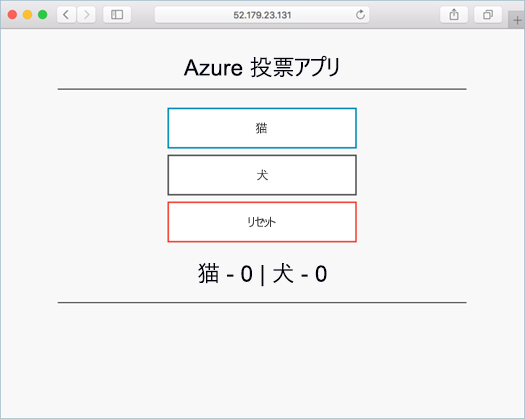
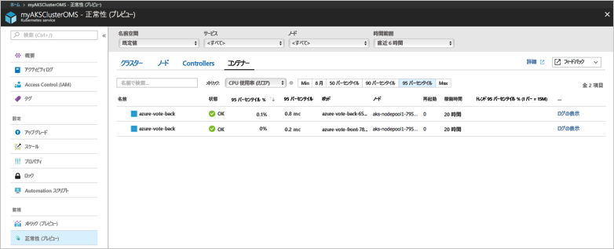
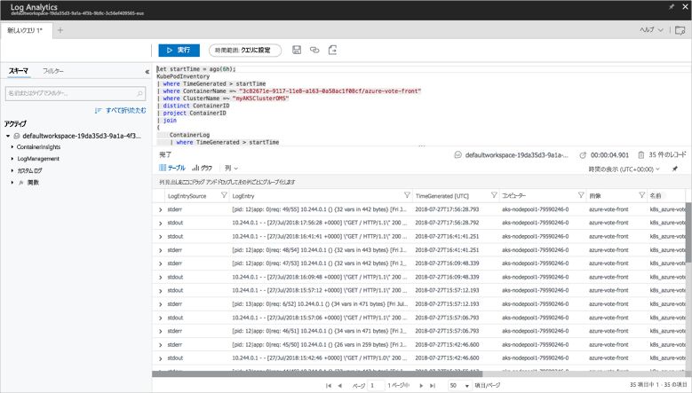

# <a name="quickstart-deploy-an-azure-kubernetes-service-aks-cluster"></a>クイック スタート: Azure Kubernetes Service (AKS) クラスターのデプロイ

このクイック スタートでは、Azure CLI を使用して AKS クラスターをデプロイします。 次に、このクラスターで、Web フロントエンドと Redis インスタンスで構成される複数コンテナー アプリケーションが実行されます。 完了すると、このアプリケーションはインターネット経由でアクセス可能になります。



このクイック スタートは、Kubernetes の概念についての基礎知識があることを前提としています。Kubernetes について詳しくは、[Kubernetes のドキュメント][kubernetes-documentation]をご覧ください。

[!INCLUDE [cloud-shell-try-it.md](../../includes/cloud-shell-try-it.md)]

CLI をローカルにインストールして使用することを選択する場合、このクイック スタートでは、Azure CLI バージョン 2.0.43 以降を実行している必要があります。 バージョンを確認するには、`az --version` を実行します。 インストールまたはアップグレードする必要がある場合は、[Azure CLI のインストール][azure-cli-install]に関するページを参照してください。

## <a name="create-a-resource-group"></a>リソース グループの作成

[az group create][az-group-create] コマンドでリソース グループを作成します。 Azure リソース グループとは、Azure リソースのデプロイと管理に使用する論理グループです。 リソース グループを作成する際は、場所を指定するよう求められます。 この場所は、Azure でリソースが実行される場所です。

次の例では、*myAKSCluster* という名前のリソース グループを場所 *eastus* に作成します。

```azurecli-interactive
az group create --name myAKSCluster --location eastus
```

出力:

```json
{
  "id": "/subscriptions/00000000-0000-0000-0000-000000000000/resourceGroups/myAKSCluster",
  "location": "eastus",
  "managedBy": null,
  "name": "myAKSCluster",
  "properties": {
    "provisioningState": "Succeeded"
  },
  "tags": null
}
```

## <a name="create-aks-cluster"></a>AKS クラスターの作成

AKS クラスターを作成するには、[az aks create][az-aks-create] コマンドを使用します。 次の例では、*myAKSCluster* という名前のクラスターを 1 つのノードで作成します。 コンテナー正常性監視は、*--enable-addons monitoring* パラメーターを使用して有効にすることもできます。 コンテナー正常性監視ソリューションの有効化について詳しくは、[Azure Kubernetes Service の正常性の監視][aks-monitor]に関するページをご覧ください。

```azurecli-interactive
az aks create --resource-group myAKSCluster --name myAKSCluster --node-count 1 --enable-addons monitoring --generate-ssh-keys
```

数分してコマンドが完了すると、このクラスターに関する情報が JSON 形式で表示されます。

## <a name="connect-to-the-cluster"></a>クラスターへの接続

Kubernetes クラスターを管理するには、Kubernetes のコマンドライン クライアントである [kubectl][kubectl] を使います。

Azure Cloud Shell を使用している場合、`kubectl` は既にインストールされています。 ローカルにインストールする場合には、[az aks install-cli][az-aks-install-cli] コマンドを使用します。


```azurecli
az aks install-cli
```

Kubernetes クラスターに接続するように `kubectl` を構成するには、[az aks get-credentials][az-aks-get-credentials] コマンドを使用します。 この手順では、資格情報をダウンロードし、Kubernetes CLI を構成してそれらの資格情報を使用します。

```azurecli-interactive
az aks get-credentials --resource-group myAKSCluster --name myAKSCluster
```

クラスターへの接続を確認するには、[kubectl get][kubectl-get] コマンドを使って、クラスター ノードの一覧を取得します。 ノードが表示されるまで数分かかる場合があります。

```azurecli-interactive
kubectl get nodes
```

出力:

```
NAME                          STATUS    ROLES     AGE       VERSION
k8s-myAKSCluster-36346190-0   Ready     agent     2m        v1.7.7
```

## <a name="run-the-application"></a>アプリケーションの実行

Kubernetes のマニフェスト ファイルでは、どのようなコンテナー イメージを実行するかというようなことも含め、クラスターの望ましい状態を定義します。 この例では、マニフェストを使用して、Azure Vote アプリケーションを実行するために必要なすべてのオブジェクトを作成します。 このマニフェストには、[Kubernetes デプロイ][kubernetes-deployment]が 2 つ含まれます。Azure Vote Python アプリケーション用と Redis インスタンス用です。 さらに、[Kubernetes サービス][kubernetes-service]が 2 つ作成されます。Redis インスタンスに使用される内部サービスと、Azure Vote アプリケーションにインターネットからアクセスするための外部サービスです。

`azure-vote.yaml` という名前のファイルを作成し、そこに以下の YAML コードをコピーします。 Azure Cloud Shell で作業している場合、仮想システムまたは物理システムで作業するときと同じように vi または Nano を使用してこのファイルを作成できます。

```yaml
apiVersion: apps/v1beta1
kind: Deployment
metadata:
  name: azure-vote-back
spec:
  replicas: 1
  template:
    metadata:
      labels:
        app: azure-vote-back
    spec:
      containers:
      - name: azure-vote-back
        image: redis
        ports:
        - containerPort: 6379
          name: redis
---
apiVersion: v1
kind: Service
metadata:
  name: azure-vote-back
spec:
  ports:
  - port: 6379
  selector:
    app: azure-vote-back
---
apiVersion: apps/v1beta1
kind: Deployment
metadata:
  name: azure-vote-front
spec:
  replicas: 1
  template:
    metadata:
      labels:
        app: azure-vote-front
    spec:
      containers:
      - name: azure-vote-front
        image: microsoft/azure-vote-front:v1
        ports:
        - containerPort: 80
        env:
        - name: REDIS
          value: "azure-vote-back"
---
apiVersion: v1
kind: Service
metadata:
  name: azure-vote-front
spec:
  type: LoadBalancer
  ports:
  - port: 80
  selector:
    app: azure-vote-front
```

[kubectl apply][kubectl-apply] コマンドを使ってアプリケーションを実行します。

```azurecli-interactive
kubectl apply -f azure-vote.yaml
```

出力:

```
deployment "azure-vote-back" created
service "azure-vote-back" created
deployment "azure-vote-front" created
service "azure-vote-front" created
```

## <a name="test-the-application"></a>アプリケーションをテストする

アプリケーションが実行されると、アプリケーション フロントエンドをインターネットに公開する [Kubernetes サービス][kubernetes-service]が作成されます。 このプロセスが完了するまでに数分かかることがあります。

進行状況を監視するには、[kubectl get service][kubectl-get] コマンドと `--watch` 引数を使います。

```azurecli-interactive
kubectl get service azure-vote-front --watch
```

最初に、*azure-vote-front* サービスの *EXTERNAL-IP* が "*保留中*" として表示されます。

```
NAME               TYPE           CLUSTER-IP   EXTERNAL-IP   PORT(S)        AGE
azure-vote-front   LoadBalancer   10.0.37.27   <pending>     80:30572/TCP   6s
```

*EXTERNAL-IP* アドレスが "*保留中*" から "*IP アドレス*" に変わったら、`CTRL-C` を使用して kubectl ウォッチ プロセスを停止します。

```
azure-vote-front   LoadBalancer   10.0.37.27   52.179.23.131   80:30572/TCP   2m
```

ここで、外部 IP アドレスにブラウザーでアクセスして Azure Vote App を表示してみましょう。


## <a name="monitor-health-and-logs"></a>正常性の監視とログ

AKS クラスターが作成されたとき、クラスター ノードとポッドの両方の正常性メトリックを取得するための監視が有効になりました。 これらの正常性メトリックは、Azure portal で利用できます。 コンテナーの正常性の監視の詳細については、[Azure Kubernetes Service の正常性の監視][aks-monitor]に関するページを参照してください。

Azure Vote ポッドの現在の状態、アップタイム、およびリソース使用率を確認するには、次の手順を実行します。

1. Web ブラウザーで、Azure portal[https://portal.azure.com][azure-portal] を開きます。
1. リソース グループ (たとえば、*myResourceGroup*) を選択し、次に AKS クラスター (たとえば、*myAKSCluster*) を選択します。 
1. **[Monitor コンテナーの正常性]** を選択し、**既定の**名前空間を選択し、**[コンテナー]** を選択します。

次の例に示すように、Azure portal にこのデータが入力されるまで数分かかる場合があります。



`azure-vote-front` ポッドのログを表示するには、コンテナーの一覧の右側にある **[ログの表示]** リンクを選択します。 これらのログには、コンテナーからの *stdout* ストリームと *stderr* ストリームが含まれます。



## <a name="delete-cluster"></a>クラスターを削除する

クラスターが必要なくなったら、[az group delete][az-group-delete] コマンドを使って、リソース グループ、コンテナー サービス、およびすべての関連リソースを削除してください。

```azurecli-interactive
az group delete --name myAKSCluster --yes --no-wait
```

> [!NOTE]
> クラスターを削除したとき、AKS クラスターで使用される Azure Active Directory サービス プリンシパルは削除されません。 サービス プリンシパルを削除する手順については、[AKS のサービス プリンシパルに関する考慮事項と削除][sp-delete]に関するページを参照してください。

## <a name="get-the-code"></a>コードの入手

このクイック スタートでは、事前に作成したコンテナー イメージを使用して、Kubernetes のデプロイを作成しました。 関連するアプリケーション コード、Dockerfile、および Kubernetes マニフェスト ファイルは、GitHub で入手できます。

[https://github.com/Azure-Samples/azure-voting-app-redis][azure-vote-app]

## <a name="next-steps"></a>次の手順

このクイック スタートでは、Kubernetes クラスターをデプロイし、そこに複数コンテナー アプリケーションをデプロイしました。

AKS の詳細を参照し、デプロイの例の完全なコードを確認するには、Kubernetes クラスター チュートリアルに進んでください。

> [!div class="nextstepaction"]
> [AKS チュートリアル][aks-tutorial]

<!-- LINKS - external -->
[azure-vote-app]: https://github.com/Azure-Samples/azure-voting-app-redis.git
[kubectl]: https://kubernetes.io/docs/user-guide/kubectl/
[kubectl-apply]: https://kubernetes.io/docs/reference/generated/kubectl/kubectl-commands#apply
[kubernetes-deployment]: https://kubernetes.io/docs/concepts/workloads/controllers/deployment/
[kubernetes-documentation]: https://kubernetes.io/docs/home/
[kubectl-get]: https://kubernetes.io/docs/reference/generated/kubectl/kubectl-commands#get
[kubernetes-service]: https://kubernetes.io/docs/concepts/services-networking/service/

<!-- LINKS - internal -->
[aks-monitor]: https://aka.ms/coingfonboarding
[aks-tutorial]: ./tutorial-kubernetes-prepare-app.md
[az-aks-browse]: /cli/azure/aks?view=azure-cli-latest#az-aks-browse
[az-aks-create]: /cli/azure/aks?view=azure-cli-latest#az-aks-create
[az-aks-get-credentials]: /cli/azure/aks?view=azure-cli-latest#az-aks-get-credentials
[az-aks-install-cli]: /cli/azure/aks?view=azure-cli-latest#az-aks-install-cli
[az-group-create]: /cli/azure/group#az-group-create
[az-group-delete]: /cli/azure/group#az-group-delete
[azure-cli-install]: /cli/azure/install-azure-cli
[sp-delete]: kubernetes-service-principal.md#additional-considerations
[azure-portal]: https://portal.azure.com
