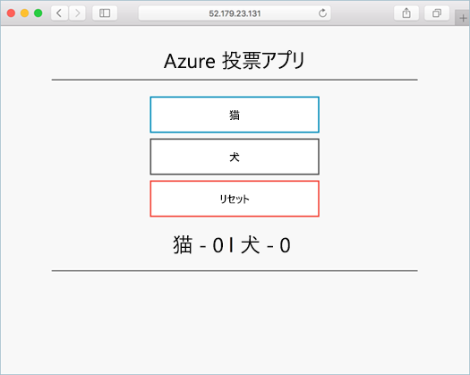

# <a name="quickstart-deploy-an-azure-kubernetes-service-cluster-using-the-azure-cli"></a>クイック スタート:Azure CLI を使用して Azure Kubernetes Service クラスターをデプロイする

このクイックスタートでは、Azure CLI を使用して Azure Kubernetes Service (AKS) クラスターをデプロイします。 AKS は、クラスターをすばやくデプロイおよび管理することができる、マネージド Kubernetes サービスです。 このクラスターで、Web フロント エンドと Redis インスタンスが含まれている複数コンテナー アプリケーションが実行されます。 その後、アプリケーションを実行するクラスターとポッドの正常性を監視する方法を示します。

Windows Server コンテナー (現在 AKS でプレビュー段階にあります) を使用する場合は、[Windows Server コンテナーをサポートする AKS クラスターの作成][windows-container-cli]に関するページを参照してください。



このクイックスタートは、Kubernetes の基本的な概念を理解していることを前提としています。 詳細については、「[Azure Kubernetes Services (AKS) における Kubernetes の中心概念][kubernetes-concepts]」を参照してください。

Azure サブスクリプションをお持ちでない場合は、開始する前に [無料アカウント](https://azure.microsoft.com/free/?WT.mc_id=A261C142F) を作成してください。

[!INCLUDE [cloud-shell-try-it.md](../../includes/cloud-shell-try-it.md)]

CLI をローカルにインストールして使用することを選択した場合、このクイック スタートでは Azure CLI バージョン 2.0.64 以降を実行していることが必要です。 バージョンを確認するには、`az --version` を実行します。 インストールまたはアップグレードする必要がある場合は、[Azure CLI のインストール][azure-cli-install]に関するページを参照してください。

> [!NOTE]
> このクイックスタートのコマンドを (Azure Cloud Shell ではなく) ローカルで実行する場合は、必ず管理者としてコマンドを実行してください。

## <a name="create-a-resource-group"></a>リソース グループを作成する

Azure リソース グループは、Azure リソースが展開され管理される論理グループです。 リソース グループを作成する際は、場所を指定するよう求められます。 この場所は、リソース グループのメタデータが格納される場所です。リソースの作成時に別のリージョンを指定しない場合は、Azure でリソースが実行される場所でもあります。 [az group create][az-group-create] コマンドを使用して、リソース グループを作成します。

次の例では、*myResourceGroup* という名前のリソース グループを *eastus* に作成します。

```azurecli-interactive
az group create --name myResourceGroup --location eastus
```

次の出力例では、正常に作成されたリソース グループが示されています。

```json
{
  "id": "/subscriptions/<guid>/resourceGroups/myResourceGroup",
  "location": "eastus",
  "managedBy": null,
  "name": "myResourceGroup",
  "properties": {
    "provisioningState": "Succeeded"
  },
  "tags": null
}
```

## <a name="create-aks-cluster"></a>AKS クラスターの作成

AKS クラスターを作成するには、[az aks create][az-aks-create] コマンドを使用します。 次の例では、*myAKSCluster* という名前のクラスターを 1 つのノードで作成します。 コンテナーの Azure Monitor は、 *--enable-addons monitoring* パラメーターを使用して有効にすることもできます。  これは完了までに数分かかる場合があります。

> [!NOTE]
> AKS クラスターを作成すると、AKS リソースを保存するための 2 つ目のリソース グループが自動的に作成されます。 詳細については、「[AKS と一緒にリソース グループが 2 つ作成されるのはなぜでしょうか?](https://docs.microsoft.com/azure/aks/faq#why-are-two-resource-groups-created-with-aks)」を参照してください。

```azurecli-interactive
az aks create --resource-group myResourceGroup --name myAKSCluster --node-count 1 --enable-addons monitoring --generate-ssh-keys
```

数分後、コマンドが完了し、クラスターに関する情報が JSON 形式で返されます。

## <a name="connect-to-the-cluster"></a>クラスターに接続する

Kubernetes クラスターを管理するには、Kubernetes のコマンドライン クライアントである [kubectl][kubectl] を使用します。 Azure Cloud Shell を使用している場合、`kubectl` は既にインストールされています。 `kubectl` をローカルにインストールするには、[az aks install-cli][az-aks-install-cli] コマンドを使用します。

```azurecli
az aks install-cli
```

Kubernetes クラスターに接続するように `kubectl` を構成するには、[az aks get-credentials][az-aks-get-credentials] コマンドを使用します。 このコマンドは、資格情報をダウンロードし、それを使用するように Kubernetes CLI を構成します。

```azurecli-interactive
az aks get-credentials --resource-group myResourceGroup --name myAKSCluster
```

クラスターへの接続を確認するには、クラスター ノードの一覧を返す [kubectl get][kubectl-get] コマンドを使用します。

```azurecli-interactive
kubectl get nodes
```

次の出力例は、前の手順で作成した単一ノードを示しています。 ノードの状態が "*準備完了*" であることを確認します。

```output
NAME                       STATUS   ROLES   AGE     VERSION
aks-nodepool1-31718369-0   Ready    agent   6m44s   v1.12.8
```

## <a name="run-the-application"></a>アプリケーションの実行

Kubernetes のマニフェスト ファイルでは、どのコンテナー イメージを実行するかなど、クラスターの望ましい状態を定義します。 このクイック スタートでは、マニフェストを使用して、Azure Vote アプリケーションを実行するために必要なすべてのオブジェクトを作成します。 このマニフェストには、 [Kubernetes デプロイ][kubernetes-deployment] が 2 つ含まれます。サンプル Azure Vote Python アプリケーション用と Redis インスタンス用です。 さらに、 [Kubernetes サービス][kubernetes-service] が 2 つ作成されます。Redis インスタンスに使用される内部サービスと、Azure Vote アプリケーションにインターネットからアクセスするための外部サービスです。

> [!TIP]
> このクイック スタートでは、アプリケーション マニフェストの作成と AKS クラスターへのデプロイを手動で行います。 より現実に即したシナリオでは、[Azure Dev Spaces][azure-dev-spaces] を使用して、AKS クラスター内で直接、コードの反復とデバッグを迅速に実行することができます。 Dev Spaces は、OS プラットフォームと開発環境の垣根を越えて使用でき、チーム内の他のメンバーと連携することができます。

`azure-vote.yaml` という名前のファイルを作成し、以下の YAML 定義をコピーします。 Azure Cloud Shell を使用する場合は、仮想システムまたは物理システムで作業するときと同じように、`vi` または `nano` を使用してこのファイルを作成できます。

```yaml
apiVersion: apps/v1
kind: Deployment
metadata:
  name: azure-vote-back
spec:
  replicas: 1
  selector:
    matchLabels:
      app: azure-vote-back
  template:
    metadata:
      labels:
        app: azure-vote-back
    spec:
      nodeSelector:
        "beta.kubernetes.io/os": linux
      containers:
      - name: azure-vote-back
        image: redis
        resources:
          requests:
            cpu: 100m
            memory: 128Mi
          limits:
            cpu: 250m
            memory: 256Mi
        ports:
        - containerPort: 6379
          name: redis
---
apiVersion: v1
kind: Service
metadata:
  name: azure-vote-back
spec:
  ports:
  - port: 6379
  selector:
    app: azure-vote-back
---
apiVersion: apps/v1
kind: Deployment
metadata:
  name: azure-vote-front
spec:
  replicas: 1
  selector:
    matchLabels:
      app: azure-vote-front
  template:
    metadata:
      labels:
        app: azure-vote-front
    spec:
      nodeSelector:
        "beta.kubernetes.io/os": linux
      containers:
      - name: azure-vote-front
        image: microsoft/azure-vote-front:v1
        resources:
          requests:
            cpu: 100m
            memory: 128Mi
          limits:
            cpu: 250m
            memory: 256Mi
        ports:
        - containerPort: 80
        env:
        - name: REDIS
          value: "azure-vote-back"
---
apiVersion: v1
kind: Service
metadata:
  name: azure-vote-front
spec:
  type: LoadBalancer
  ports:
  - port: 80
  selector:
    app: azure-vote-front
```

[kubectl apply][kubectl-apply] コマンドを使用してアプリケーションをデプロイし、ご利用の YAML マニフェストの名前を指定します。

```console
kubectl apply -f azure-vote.yaml
```

次の出力例は、正常に作成されたデプロイおよびサービスを示しています。

```output
deployment "azure-vote-back" created
service "azure-vote-back" created
deployment "azure-vote-front" created
service "azure-vote-front" created
```

## <a name="test-the-application"></a>アプリケーションをテストする

アプリケーションが実行されると、Kubernetes サービスによってアプリケーション フロント エンドがインターネットに公開されます。 このプロセスが完了するまでに数分かかることがあります。

進行状況を監視するには、[kubectl get service][kubectl-get] コマンドを `--watch` 引数と一緒に使用します。

```azurecli-interactive
kubectl get service azure-vote-front --watch
```

最初に、*azure-vote-front* サービスの *EXTERNAL-IP* が "*保留中*" として表示されます。

```output
NAME               TYPE           CLUSTER-IP   EXTERNAL-IP   PORT(S)        AGE
azure-vote-front   LoadBalancer   10.0.37.27   <pending>     80:30572/TCP   6s
```

*EXTERNAL-IP* アドレスが "*保留中*" から実際のパブリック IP アドレスに変わったら、`CTRL-C` を使用して `kubectl` ウォッチ プロセスを停止します。 次の出力例は、サービスに割り当てられている有効なパブリック IP アドレスを示しています。

```output
azure-vote-front   LoadBalancer   10.0.37.27   52.179.23.131   80:30572/TCP   2m
```

Azure Vote アプリが動作していることを確認するには、Web ブラウザーを開いてサービスの外部 IP アドレスにアクセスします。


AKS クラスターが作成されたとき、クラスター ノードとポッドの両方の正常性メトリックを取得するために、[コンテナーに対する Azure Monitor](../azure-monitor/insights/container-insights-overview.md) が有効になりました。 これらの正常性メトリックは、Azure portal で利用できます。

## <a name="delete-the-cluster"></a>クラスターを削除する

Azure の課金を回避するには、不要なリソースをクリーンアップする必要があります。  クラスターが必要なくなったら、[az group delete][az-group-delete] コマンドを使って、リソース グループ、コンテナー サービス、およびすべての関連リソースを削除してください。

```azurecli-interactive
az group delete --name myResourceGroup --yes --no-wait
```

> [!NOTE]
> クラスターを削除したとき、AKS クラスターで使用される Azure Active Directory サービス プリンシパルは削除されません。 サービス プリンシパルを削除する手順については、[AKS のサービス プリンシパルに関する考慮事項と削除][sp-delete]に関するページを参照してください。

## <a name="get-the-code"></a>コードの入手

このクイック スタートでは、Kubernetes のデプロイを作成するために、事前に作成したコンテナー イメージを使用しました。 関連するアプリケーション コード、Dockerfile、および Kubernetes マニフェスト ファイルは、GitHub で入手できます。

[https://github.com/Azure-Samples/azure-voting-app-redis][azure-vote-app]

## <a name="next-steps"></a>次のステップ

このクイック スタートでは、Kubernetes クラスターをデプロイし、そこに複数コンテナー アプリケーションをデプロイしました。 また、AKS クラスターの [Kubernetes Web ダッシュボードにアクセスする][kubernetes-dashboard]こともできます。

AKS の詳細を参照し、デプロイの例の完全なコードを確認するには、Kubernetes クラスター チュートリアルに進んでください。

> [!div class="nextstepaction"]
> [AKS チュートリアル][aks-tutorial]

<!-- LINKS - external -->
[azure-vote-app]: https://github.com/Azure-Samples/azure-voting-app-redis.git
[kubectl]: https://kubernetes.io/docs/user-guide/kubectl/
[kubectl-apply]: https://kubernetes.io/docs/reference/generated/kubectl/kubectl-commands#apply
[kubectl-get]: https://kubernetes.io/docs/reference/generated/kubectl/kubectl-commands#get
[azure-dev-spaces]: https://docs.microsoft.com/azure/dev-spaces/

<!-- LINKS - internal -->
[kubernetes-concepts]: concepts-clusters-workloads.md
[aks-monitor]: https://aka.ms/coingfonboarding
[aks-tutorial]: ./tutorial-kubernetes-prepare-app.md
[az-aks-browse]: /cli/azure/aks?view=azure-cli-latest#az-aks-browse
[az-aks-create]: /cli/azure/aks?view=azure-cli-latest#az-aks-create
[az-aks-get-credentials]: /cli/azure/aks?view=azure-cli-latest#az-aks-get-credentials
[az-aks-install-cli]: /cli/azure/aks?view=azure-cli-latest#az-aks-install-cli
[az-group-create]: /cli/azure/group#az-group-create
[az-group-delete]: /cli/azure/group#az-group-delete
[azure-cli-install]: /cli/azure/install-azure-cli
[sp-delete]: kubernetes-service-principal.md#additional-considerations
[azure-portal]: https://portal.azure.com
[kubernetes-deployment]: concepts-clusters-workloads.md#deployments-and-yaml-manifests
[kubernetes-service]: concepts-network.md#services
[kubernetes-dashboard]: kubernetes-dashboard.md
[windows-container-cli]: windows-container-cli.md
