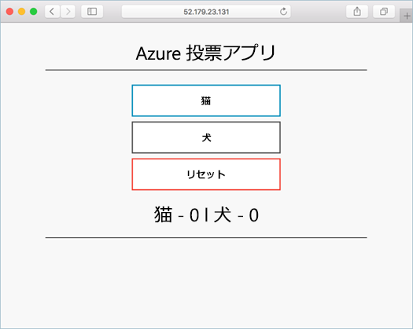

# <a name="run-applications-in-azure-container-service-aks"></a>Azure Container Service (AKS) でのアプリケーションの実行

このチュートリアルでは、サンプル アプリケーションを Kubernetes クラスターにデプロイします。 手順は次のとおりです。

> [!div class="checklist"]
> * Kubernetes マニフェスト ファイルを更新する
> * Kubernetes でアプリケーションを実行する
> * アプリケーションをテストする

後のチュートリアルでは、このアプリケーションをスケールアウトおよび更新し、Kubernetes クラスターを監視するように Operations Management Suite を構成します。

このチュートリアルは、Kubernetes の概念についての基礎知識があることを前提としています。Kubernetes の詳細については、[Kubernetes のドキュメント][kubernetes-documentation]をご覧ください。

## <a name="before-you-begin"></a>開始する前に

前のチュートリアルでは、アプリケーションをコンテナー イメージにパッケージ化し、このイメージを Azure Container Registry にアップロードして、Kubernetes クラスターを作成しました。 

このチュートリアルを完了するには、事前に作成した `azure-vote-all-in-one-redis.yaml` Kubernetes マニフェスト ファイルが必要です。 このファイルは、前のチュートリアルでは、アプリケーションのソース コードと共にダウンロードされました。 リポジトリの複製が作成されていること、およびディレクトリが複製されたディレクトリに変更されていることを確認します。

これらの手順を完了しておらず、手順を実行する場合は、「[チュートリアル 1 - コンテナー イメージを作成する][aks-tutorial-prepare-app]」に戻ってください。

## <a name="update-manifest-file"></a>マニフェスト ファイルを更新する

このチュートリアルでは、Azure Container Registry (ACR) を使用してコンテナー イメージを保存しています。 アプリケーションを実行する前に、Kubernetes マニフェスト ファイルの ACR ログイン サーバー名を更新する必要があります。

ACR ログイン サーバー名を取得するには、[az acr list][az-acr-list] コマンドを使います。

```azurecli
az acr list --resource-group myResourceGroup --query "[].{acrLoginServer:loginServer}" --output table
```

マニフェスト ファイルは、ログイン サーバー名 `microsoft` で事前作成されています。 任意のテキスト エディターでファイルを開きます。 この例では、ファイルは `vi` で開きます。

```console
vi azure-vote-all-in-one-redis.yaml
```

`microsoft` を ACR ログイン サーバー名に置き換えます。 この値は、マニフェスト ファイルの **47** 行にあります。

```yaml
containers:
- name: azure-vote-front
  image: microsoft/azure-vote-front:redis-v1
```

ファイルを保存して閉じます。

## <a name="deploy-application"></a>アプリケーションをデプロイする

[kubectl create][kubectl-create] コマンドを使ってアプリケーションを実行します。 このコマンドは、マニフェスト ファイルを解析し、定義されている Kubernetes オブジェクトを作成します。

```azurecli
kubectl create -f azure-vote-all-in-one-redis.yaml
```

出力:

```
deployment "azure-vote-back" created
service "azure-vote-back" created
deployment "azure-vote-front" created
service "azure-vote-front" created
```

## <a name="test-application"></a>アプリケーションをテストする

アプリケーションをインターネットに公開する [Kubernetes サービス][kubernetes-service]が作成されます。 このプロセスには数分かかることがあります。 

進行状況を監視するには、[kubectl get service][kubectl-get] コマンドと `--watch` 引数を使います。

```azurecli
kubectl get service azure-vote-front --watch
```

最初に、*azure-vote-front* サービスの *EXTERNAL-IP* が "*保留中*" として表示されます。
  
```
azure-vote-front   10.0.34.242   <pending>     80:30676/TCP   7s
```

*EXTERNAL-IP* アドレスが "*保留中*" から "*IP アドレス*" に変わったら、`CTRL-C` を使用して kubectl ウォッチ プロセスを停止します。 

```
azure-vote-front   10.0.34.242   52.179.23.131   80:30676/TCP   2m
```

アプリケーションを表示するには、外部 IP アドレスを参照します。



## <a name="next-steps"></a>次の手順

このチュートリアルでは、Azure vote アプリケーションを AKS の Kubernetes クラスターにデプロイしました。 次のタスクを行います。  

> [!div class="checklist"]
> * Kubernetes マニフェスト ファイルをダウンロードする
> * Kubernetes でアプリケーションを実行する
> * アプリケーションをテストする

次のチュートリアルに進んで、Kubernetes アプリケーションとその基になっている Kubernetes インフラストラクチャ両方のスケーリングに関して学習してください。 

> [!div class="nextstepaction"]
> [Kubernetes アプリケーションと Kubernetes インフラストラクチャをスケーリングする][aks-tutorial-scale]

<!-- LINKS - external -->
[kubectl-create]: https://kubernetes.io/docs/reference/generated/kubectl/kubectl-commands#create
[kubectl-get]: https://kubernetes.io/docs/reference/generated/kubectl/kubectl-commands#get
[kubernetes-documentation]: https://kubernetes.io/docs/home/
[kubernetes-service]: https://kubernetes.io/docs/concepts/services-networking/service/

<!-- LINKS - internal -->
[aks-tutorial-prepare-app]: ./tutorial-kubernetes-prepare-app.md
[aks-tutorial-scale]: ./tutorial-kubernetes-scale.md
[az-acr-list]: /cli/azure/acr#list
