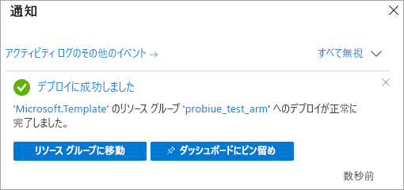

# <a name="quickstart-create-a-server---azure-resource-manager-template"></a>クイック スタート:サーバーを作成する - Azure Resource Manager テンプレート

このクイックスタートでは、Resource Manager テンプレートを使って、Azure サブスクリプションに Analysis Services サーバー リソースを作成する方法について説明します。

[!INCLUDE [About Azure Resource Manager](../../includes/resource-manager-quickstart-introduction.md)]

## <a name="prerequisites"></a>前提条件

* **Azure サブスクリプション**:[Azure 無料試用版](https://azure.microsoft.com/offers/ms-azr-0044p/)にアクセスしてアカウントを作成します。
* **Azure Active Directory**: お使いのサブスクリプションは、Azure Active Directory テナントに関連付けられている必要があります。 また、その Azure Active Directory でアカウントを使用して Azure にサインインしている必要があります。 詳細については、「[認証とユーザーのアクセス許可](analysis-services-manage-users.md)」を参照してください。

## <a name="create-a-server"></a>サーバーの作成

### <a name="review-the-template"></a>テンプレートを確認する

このクイック スタートで使用されるテンプレートは [Azure クイック スタート テンプレート](https://azure.microsoft.com/resources/templates/101-analysis-services-create/)からのものです。

:::code language="json" source="~/quickstart-templates/101-analysis-services-create/azuredeploy.json":::

このテンプレートには、1 つの [Microsoft.AnalysisServices/servers](https://docs.microsoft.com/azure/templates/microsoft.analysisservices/2017-08-01/servers) リソースがファイアウォール規則と共に定義されています。 

### <a name="deploy-the-template"></a>テンプレートのデプロイ

1. Azure にサインインして、テンプレートを開くには、次の [Azure へのデプロイ] リンクを選択します。 このテンプレートを使用して、Analysis Services サーバー リソースを作成し、必須のプロパティと省略可能なプロパティを指定します。

   <a href="https://portal.azure.com/#create/Microsoft.Template/uri/https%3A%2F%2Fraw.githubusercontent.com%2FAzure%2Fazure-quickstart-templates%2Fmaster%2F101-analysis-services-create%2Fazuredeploy.json"></a>

2. 次の値を選択または入力します。

    特に明記されていない場合は、既定値を使用してください。

    * **サブスクリプション**:Azure サブスクリプションを選択します。
    * **[リソース グループ]** : **[新規作成]** をクリックし、新しいリソース グループの一意の名前を入力します。
    * **[場所]** :リソース グループに作成したリソースの既定の場所を選択します。
    * **[サーバー名]** : サーバー リソースの名前を入力します。 
    * **[場所]** :Analysis Services の場合は無視してください。 場所は、[Server Location]\(サーバーの場所\) で指定します。
    * **[Server location]\(サーバーの場所\)** : Analysis Services サーバーの場所を入力します。 通常は、リソース グループに対して指定した既定の場所と同じリージョンになりますが、必須ではありません。 たとえば、「**米国中北部**」を入力します。 サポートされているリージョンについては、[リージョンごとの Analysis Services の利用の可否](analysis-services-overview.md#availability-by-region)を参照してください。
    * **[SKU 名]** : 作成する Analysis Services サーバーの SKU 名を入力します。 B1、B2、D1、S0、S1、S2、S3、S4、S8v2、S9v2 の中から選択します。 SKU の利用の可否は、リージョンによって異なります。 評価とテストには、S0 または D1 をお勧めします。
    * **Capacity**:クエリ レプリカのスケールアウト インスタンスの総数を入力します。 複数インスタンスのスケールアウトは、一部のリージョンに限りサポートされます。
    * **[ファイアウォール設定]** : サーバー用に定義するインバウンド ファイアウォール規則を入力します。 指定しなかった場合、ファイアウォールは無効になります。
    * **[Backup Blob Container Uri]\(バックアップ BLOB コンテナー URI\)** : 読み取り、書き込み、リストの各アクセス許可を持つプライベート Azure Blob Storage コンテナーの SAS URI を入力します。 [バックアップと復元](analysis-services-backup.md)を使用する場合のみ必須です。
    * **上記の使用条件に同意する**: 選択。

3. **[購入]** を選択します。 サーバーが正常にデプロイされると、次の通知が表示されます。

   

## <a name="validate-the-deployment"></a>デプロイの検証

Azure portal または Azure PowerShell を使用して、リソース グループとサーバー リソースが作成されたことを確認します。

#### <a name="powershell"></a>PowerShell

```azurepowershell-interactive
$resourceGroupName = Read-Host -Prompt "Enter the Resource Group name"
(Get-AzResource -ResourceType "Microsoft.AnalysisServices/servers" -ResourceGroupName $resourceGroupName).Name
 Write-Host "Press [ENTER] to continue..."
```

---

## <a name="clean-up-resources"></a>リソースをクリーンアップする

不要になったら、Azure portal、Azure CLI、Azure PowerShell のいずれかを使用してリソース グループとサーバー リソースを削除します。

# <a name="cli"></a>[CLI](#tab/CLI)

```azurecli-interactive
echo "Enter the Resource Group name:" &&
read resourceGroupName &&
az group delete --name $resourceGroupName &&
echo "Press [ENTER] to continue ..."
```

# <a name="powershell"></a>[PowerShell](#tab/PowerShell)

```azurepowershell-interactive
$resourceGroupName = Read-Host -Prompt "Enter the Resource Group name"
Remove-AzResourceGroup -Name $resourceGroupName
Write-Host "Press [ENTER] to continue..."
```

## <a name="next-steps"></a>次のステップ

このクイックスタートでは、Azure Resource Manager テンプレートを使用して、新しいリソース グループと Azure Analysis Services サーバー リソースを作成しました。 テンプレートを使用してサーバー リソースを作成したら、以下のことを検討してください。
- [クイック スタート: サーバーの作成 - PowerShell](analysis-services-create-powershell.md)
- [ポータルからサンプル モデルを追加する](analysis-services-create-sample-model.md)
- [サーバー管理者とユーザー ロールを構成する](tutorials/analysis-services-tutorial-roles.md)