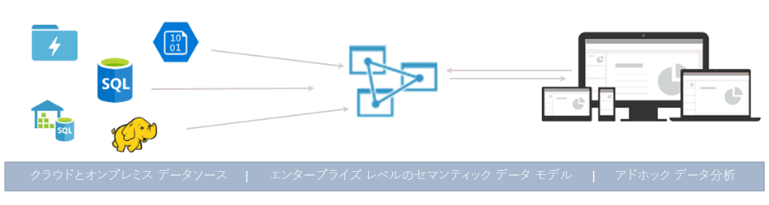
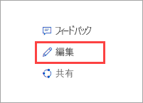

# Azure Analysis Services とは

Azure Analysis Services は、完全に管理されたサービスとしてのプラットフォーム (PaaS) であり、エンタープライズ レベルのデータ モデルをクラウドで提供します。 高度なマッシュアップとモデリング機能を使用して、複数のデータ ソースのデータの結合、メトリックの定義、単一の信頼された表形式のセマンティック データ モデルでのデータのセキュリティ保護を実行できます。 このデータ モデルは、アドホック データ分析用の大量のデータを参照するための簡単かつ迅速な方法をユーザーに提供します。

**ビデオ:**「[Azure Analysis Services Overview (Azure Analysis Services の概要)](https://sec.ch9.ms/ch9/d6dd/a1cda46b-ef03-4cea-8f11-68da23c5d6dd/AzureASoverview_high.mp4)」で、Azure Analysis Services が Microsoft の全体的な BI 機能とどのように調和しているかを確認してください。

## スピーディな起動と実行

Azure Portal から数分で[サーバーを作成する](analysis-services-create-server.md)ことができます。 また、Azure Resource Manager [テンプレート](../azure-resource-manager/resource-manager-create-first-template.md)と PowerShell を使用して、宣言型のテンプレートを使用するサーバーを作成できます。 1 つのテンプレートを使用して、他の Azure コンポーネント (ストレージ アカウントや Azure Functions など) と共にサーバー リソースをデプロイできます。 

**ビデオ:**「[Automating deployment (デプロイの自動化)](https://channel9.msdn.com/series/Azure-Analysis-Services/AzureAnalysisServicesAutomation)」で、Azure Automation を使用してサーバーを迅速に作成する方法を確認してください。

Azure Analysis Services とさまざまな Azure サービスを統合することにより、高度な分析ソリューションを構築できます。 [Azure Active Directory](../active-directory/fundamentals/active-directory-whatis.md) との統合によって、重要なデータのセキュリティをロールベースのアクセスによって確保することができます。 [Azure Data Factory](../data-factory/introduction.md) パイプラインには、モデルにデータを読み込むアクティビティを含めることによって統合します。 [Azure Automation](../automation/automation-intro.md) や [Azure Functions](../azure-functions/functions-overview.md) を使用すると、カスタム コードによるモデルの軽量オーケストレーションを行うことができます。 

## 必要に応じたレベルを選ぶ

Azure Analysis Services は、**Developer** レベル、**Basic** レベル、および **Standard** レベルでご利用いただけます。 各レベルのプランのコストは、処理能力、QPU、メモリ サイズによって異なります。 サーバーの作成時に、レベル内のプランを選択します。 プランは、同一レベル内で変更することも、上位レベルにアップグレードすることもできますが、上位レベルから下位レベルにダウングレードすることはできません。

### Developer レベル

このレベルは、評価、開発、およびテスト シナリオで推奨されます。 プランには Standard レベルと同じ機能が含まれますが、処理能力、QPU、およびメモリ サイズが制限されています。 クエリ レプリカのスケール アウトは、このレベルでは*利用できません*。 このレベルでは、SLA は適用されません。

|プラン  |QPU  |メモリ (GB)  |
|---------|---------|---------|
|D1    |    20     |    3     |

### Basic レベル

このレベルは、表形式モデルが小さく、ユーザーのコンカレンシー数が少なく、データの更新要件がシンプルな運用ソリューションで推奨されます。 クエリ レプリカのスケール アウトは、このレベルでは*利用できません*。 パースペクティブ、複数のパーティション、および DirectQuery 表形式モデル機能*は、このレベルではサポートされません*。  

|プラン  |QPU  |メモリ (GB)  |
|---------|---------|---------|
|B1    |    40     |    10     |
|B2    |    80     |    20     |

### Standard レベル

このレベルは、ユーザーの柔軟な同時実行が必要で、データ モデルが急速に拡大するミッション クリティカルな運用環境のアプリケーションに適しています。 ほぼリアルタイムでデータ モデルを更新する高度なデータ更新をサポートし、すべての表形式のモデリング機能をサポートします。

|プラン  |QPU  |メモリ (GB)  |
|---------|---------|---------|
|S1    |    40     |    10     |
|S2    |    100     |    25     |
|S3    |    200     |    50     |
|S4    |    400     |    100     |
|S8*    |    320     |    200     |
|S9*    |    640    |    400     |

\* すべてのリージョンで利用できるわけではありません。  

## リージョンごとの可用性

Azure Analysis Services は、世界中のリージョンでサポートされています。 サポートされているプランとクエリ レプリカの可用性は、選択したリージョンによって異なります。 プランとクエリ レプリカの可用性は、ニーズや各リージョンの利用可能なリソースに応じて変更することができます。 

### アメリカ合衆国

|リージョン  | サポートされているプラン | クエリ レプリカ (Standard プランのみ) |
|---------|---------|:---------:|
|ブラジル南部     |    B1、B2、S0、S1、S2、S4、D1     |     1    |
|カナダ中部    |     B1、B2、S0、S1、S2、S4、D1    |     1    |
|米国東部     |     B1、B2、S0、S1、S2、S4、D1    |    1     |
|米国東部 2     |     B1、B2、S0、S1、S2、S4、D1   |    7    |
|米国東部 2     |     S8、S9   |    1    |
|米国中北部     |     B1、B2、S0、S1、S2、S4、D1     |    1     |
|米国中央部     |    B1、B2、S0、S1、S2、S4、D1     |    1     |
|米国中南部     |    B1、B2、S0、S1、S2、S4、D1     |    1     |
|米国中西部   |     B1、B2、S0、S1、S2、S4、D1    |    3     |
|米国西部     |    B1、B2、S0、S1、S2、S4、D1    |    7   |
|米国西部     |    S8、S9   |    2  |
|米国西部 2    |    B1、B2、S0、S1、S2、S4、D1    |    3   |
|米国西部 2    |    S8、S9  |    1     |

### ヨーロッパ

|リージョン  | サポートされているプラン | クエリ レプリカ (Standard プランのみ) |
|---------|---------|:---------:|
|北ヨーロッパ     |    B1、B2、S0、S1、S2、S4、D1      |    7     |
|英国南部     |    B1、B2、S0、S1、S2、S4、D1      |     1    |
|西ヨーロッパ     |    B1、B2、S0、S1、S2、S4、D1   |    7    |
|西ヨーロッパ    |   S8、S9  |  1  |

### アジア太平洋 

|リージョン  | サポートされているプラン | クエリ レプリカ (Standard プランのみ) |
|---------|---------|:---------:|
|オーストラリア東部     |    B1、B2、S0、S1、S2、S4     |    3     |
|オーストラリア東部     |    S8、S9    |    1     |
|オーストラリア南東部     | B1、B2、S0、S1、S2、S4、D1       |    1     |
|東日本     |   B1、B2、S0、S1、S2、S4、D1       |    1     |
|東南アジア     |     B1、B2、S0、S1、S2、S4、S8、S9、D1     |   1      |
|インド西部     |    B1、B2、S0、S1、S2、S4、D1     |    1     |

## ニーズに合わせてスケール可能

### スケールアップ/スケールダウン、一時停止、および再開

サーバーをスケールアップ、スケールダウン、または一時停止します。 Azure Portal を使用するか、PowerShell を使用して即座に全体を制御します。 料金は使用した分だけになります。  

### リソースをスケールアウトしてクエリの応答速度を高める

スケールアウトにより、クライアント クエリは、クエリ プール内の複数の "*クエリ レプリカ*" に分散されます。 クエリ レプリカには、表形式モデルの同期コピーが格納されます。 クエリのワークロードを分散することによって、高クエリ ワークロード下における応答時間を短縮することができます。 モデルの処理操作をクエリ プールから切り離すことができるので、クライアントのクエリに処理操作による悪影響が及ぶことはありません。 

クエリ プールは、追加分として最大 7 つのクエリ レプリカ (ご使用のサーバーを含めて合計 8 つ) で作成することができます。 プール内に作成できるクエリ レプリカの数は、選択したプランとリージョンによって異なります。 クエリ レプリカをサーバーのリージョンの外部に分散させることはできません。 クエリ レプリカは、お使いのサーバーと同じ料金で課金されます。

レベルの変更と同じように、必要に応じてクエリ レプリカをスケールアウトできます。 スケールアウトの構成は、ポータルまたは REST API を使用して行います。 詳しくは、「[Azure Analysis Services のスケールアウト](analysis-services-scale-out.md)」をご覧ください。

## 価格

総コストは、多数の要素 (選択されたリージョン、レベル、クエリ レプリカ、一時停止/再開など) に依存します。 「[Azure Analysis Services の価格](https://azure.microsoft.com/pricing/details/analysis-services/)」の計算機を使用して、ご利用のリージョンの一般的な価格を確認してください。 このツールは、1 つのリージョンでの 1 つのサーバー インスタンスの価格を計算します。 クエリ レプリカは、サーバーと同じ料金で課金されることに留意してください。 

## SQL Server Analysis Services が基礎

Azure Analysis Services には、SQL Server Analysis Services Enterprise Edition が既に備えている数多くの優れた機能との互換性があります。 Azure Analysis Services は、[互換性レベル](analysis-services-compat-level.md) 1200 以降の表形式モデルをサポートします。 表形式モデルは、Tabular Model Scripting Language (TMSL) と表形式オブジェクト モデル (TOM) コードで表形式メタデータ オブジェクト定義に明記されたリレーショナル モデリング構造 (モデル、テーブル、列) です。 パーティション、パースペクティブ、行レベルのセキュリティ、双方向リレーションシップ、および翻訳のすべてがサポートされています。* SharePoint 用の多次元モデルと PowerPivot は、Azure Analysis Services では "*サポートされていません*"。

インメモリと DirectQuery モードの両方で表形式モデルがサポートされます。 インメモリ モード (既定値) の表形式モデルでは、複数のデータ ソースがサポートされます。 モデル データは高度に圧縮され、インメモリでキャッシュされるため、このモードは、大量のデータに対するクエリの応答を最速で提供します。 複雑なデータセットとクエリに対する最大の柔軟性も備えています。 パーティション分割によって増分読み込みが可能になり、並列処理が増加し、メモリの消費量が減少します。 計算テーブルなどの高度なデータ モデリング機能と、すべての DAX 関数がサポートされます。 データ ソースからキャッシュされたデータを更新するには、インメモリ モデルを更新 (処理) する必要があります。 Azure サービス プリンシパルのサポートによる PowerShell、TOM、TMSL、および REST を使用した無人の更新操作によって、モデル データが常に最新であることを柔軟に保証できます。 

DirectQuery モード* では、ストレージとクエリの実行でバックエンドのリレーショナル データベースを活用します。 1 つの SQL Server、SQL Server Data Warehouse、Azure SQL Database、Azure SQL Data Warehouse、Oracle、および Teradata データ ソース内の非常に大きなデータ セットがサポートされます。 バックエンド データ セットは、利用可能なサーバー リソースのメモリを超えることができます。 複雑なデータ モデルの更新シナリオは必要ありません。 また、データ ソースの種類や DAX 式などに制限があり、一部の高度なデータ モデリング機能もサポートされていません。 最適なモードを決定する前に、[DirectQuery モード](https://docs.microsoft.com/sql/analysis-services/tabular-models/directquery-mode-ssas-tabular)に関する記事を参照してください。

\* 利用できる機能はレベルによって異なります。

## サポートされるデータ ソース

Azure Analysis Services の表形式モデルは、単純なテキスト ファイルから Azure Data Lake Store 内のビッグ データに至るまでの多種多様なデータ ソースをサポートします。 詳細については、「[Azure Analysis Services でサポートされるデータ ソース](analysis-services-datasource.md)」を参照してください。

## データのセキュリティを確保

Azure Analysis Services は、機微なデータを複数のレベルのセキュリティで保護します。 サーバー レベル: ファイアウォール、Azure 認証、サーバー管理者ロール、およびサーバー側暗号化。 データ モデル レベルでは、ユーザー ロール、行レベルとオブジェクト レベルのセキュリティによってデータの安全性が確保され、意図したユーザーのみにデータが表示されることが保証されます。

### ファイアウォール

Azure Analysis Services ファイアウォールは、ルールに指定されている IP アドレス以外のすべてのクライアント接続をブロックします。 許可する IP アドレスを個々のクライアント IP または範囲で指定してルールを構成してください。 Power BI (サービス) 接続を許可またはブロックすることもできます。 ファイアウォールとルールは、ポータルまたは PowerShell を使用して構成します。 詳細については、[サーバー ファイアウォールの構成](analysis-services-qs-firewall.md)に関するページをご覧ください。

### Authentication

ユーザー認証は、[Azure Active Directory (AAD)](../active-directory/fundamentals/active-directory-whatis.md) によって処理されます。 ログインするとき、ユーザーは、データベースへのロール ベースのアクセスに基づく組織のアカウント ID を使用します。 ユーザー ID は、サーバーが存在しているサブスクリプションの既定の Azure Active Directory のメンバーである必要があります。 詳細については、「[認証とユーザーのアクセス許可](analysis-services-manage-users.md)」を参照してください。

### データのセキュリティ

Azure Analysis Services は、Azure Blob Storage を使用して、Analysis Services データベースのストレージとメタデータを保持します。 BLOB 内のデータ ファイルは、[Azure Blob Server Side Encryption (SSE)](../storage/common/storage-service-encryption.md) を使用して暗号化されます。 DirectQuery モードを使用している場合は、メタデータのみが格納されます。 実データは、クエリ時に暗号化プロトコル経由でデータ ソースからアクセスされます。

組織のオンプレミス データ ソースへの安全なアクセスは、[オンプレミス データ ゲートウェイ](analysis-services-gateway.md)をインストールして構成することにより実現します。 ゲートウェイは、DirectQuery モードとインメモリ モードの両方で、データへのアクセスを提供します。

### ロール

Analysis Services では、サーバーとモデルのデータベース操作、オブジェクト、およびデータへのアクセス権を付与する[ロール ベースの承認](https://docs.microsoft.com/sql/analysis-services/tabular-models/roles-ssas-tabular)を使用します。 サーバーまたはデータベースにアクセスするすべてのユーザーは、割り当てられているロール内の Azure AD ユーザー アカウントを使用してアクセスします。 サーバー管理者ロールは、サーバー リソース レベルで割り当てられます。 既定では、サーバーの作成時に使用されるアカウントが、サーバー管理者ロールに自動的に追加されます。 追加のユーザーとグループのアカウントは、ポータル、SSMS、または PowerShell を使用して追加されます。
  
データのクエリを実行する管理者以外のエンドユーザーは、データベース ロールを通してアクセス権が付与されます。 データベース ロールは、データベース内に個別のオブジェクトとして作成され、そのロールが作成されたデータベースにのみ適用されます。 データベース ロールは、(データベースの) 管理者によって定義され、読み取りと処理のアクセス許可が与えられます。 ユーザーとグループのアカウントは、SSMS または PowerShell を使用して追加されます。

### 行レベルのセキュリティ

すべての互換性レベルの表形式モデルは、行レベルのセキュリティをサポートします。 行レベルのセキュリティは、テーブルに行を定義する DAX 式を使用してモデル内に構成され、ユーザーがクエリを実行できる関連テーブルの複数の方向にあるすべての行が対象です。 読み取りと処理のアクセス許可に対して、DAX 式を使用した行フィルターが定義されます。 

### オブジェクト レベルのセキュリティ 

1400 互換性レベルの表形式モデルは、オブジェクト レベルのセキュリティをサポートします。これには、テーブル レベルのセキュリティと列レベルのセキュリティが含まれます。 オブジェクト レベルのセキュリティは、TMSL または TOM を使用して、Model.bim ファイルに JSON ベースのメタデータで設定されます。 詳細については、「[オブジェクト レベルのセキュリティ](https://docs.microsoft.com/sql/analysis-services/tabular-models/object-level-security)」を参照してください。

### サービス プリンシパルによる自動化

サービス プリンシパルは、リソース/サービス レベルの無人操作を実行する目的でテナント内で作成する Azure Active Directory アプリケーション リソースです。 サービス プリンシパルは、Azure Automation、PowerShell 無人モード、カスタム クライアント アプリケーション、Web アプリと共に使用され、データの更新、スケールアップ/スケールダウン、一時停止/再開などの一般的なタスクを自動化します。 ロール メンバーシップを介して、サービス プリンシパルにアクセス許可が割り当てられます。 詳細については、「[サービス プリンシパルによる自動化](analysis-services-service-principal.md)」を参照してください。

### Azure のガバナンス

Azure Analysis Services は、[Microsoft オンライン サービス使用条件](https://www.microsoftvolumelicensing.com/DocumentSearch.aspx?Mode=3&DocumentTypeId=31)および[Microsoft プライバシー表明](https://privacy.microsoft.com/privacystatement)の対象です。
Azure のセキュリティについて詳しくは、[Microsoft セキュリティ センター](https://www.microsoft.com/trustcenter)をご覧ください。

## 既に知っているツールの使用

### Visual Studio

無料の [SQL Server Data Tools (SSDT) for Visual Studio](https://msdn.microsoft.com/library/mt204009.aspx) を使用して、モデルを開発してデプロイします。 SSDT には、スピーディに開発を行うための Analysis Services プロジェクト テンプレートが用意されています。 現在、SSDT には、互換性レベル 1400 の表形式モデルに対応した最新の Get Data のデータ ソース クエリとマッシュアップ機能が含まれています。 Power BI Desktop と Excel 2016 の Get Data に慣れていれば、高度にカスタマイズされたデータ ソース クエリの作成が非常に簡単であることは既にわかっています。 

Visual Studio 2017 を使用している場合、インストール可能な無料の VSIX パッケージとして Microsoft Analysis Services プロジェクトが提供されます。 [Marketplace からダウンロード](https://marketplace.visualstudio.com/items?itemName=ProBITools.MicrosoftAnalysisServicesModelingProjects)できます。

### SQL Server Management Studio

[SQL Server Management Studio (SSMS)](https://docs.microsoft.com/sql/ssms/download-sql-server-management-studio-ssms) を使って、サーバーとモデル データベースを管理します。 クラウド内のサーバーに接続します。 XMLA クエリ ウィンドウから直接 TMSL スクリプトを実行したり、TMSL スクリプトと PowerShell を使用してタスクを自動化したりできます。 新しい機能が次々と登場するため、SSMS は毎月更新されます。

### PowerShell

サーバー リソースの作成、サーバー操作の中断/再開、サービス レベルの変更などのサーバー リソース管理タスクでは、Azure Resource Manager (AzureRM) コマンドレットが使用されます。 ロール メンバーの追加と削除、処理、TMSL スクリプトの実行など、その他のデータベース管理タスクでは、SqlServer モジュールのコマンドレットが使用されます。 詳細については、「[PowerShell で Azure Analysis Services を管理する](analysis-services-powershell.md)」を参照してください。

### オブジェクト モデルとスクリプト

表形式モデルは開発に要する時間が短く、高度なカスタマイズも可能です。 表形式モデルには、モデル オブジェクトを記述するための[表形式オブジェクト モデル](https://docs.microsoft.com/sql/analysis-services/tabular-model-programming-compatibility-level-1200/introduction-to-the-tabular-object-model-tom-in-analysis-services-amo) (TOM) が含まれます。 TOM は、[Tabular Model Scripting Language (TMSL)](https://docs.microsoft.com/sql/analysis-services/tabular-model-scripting-language-tmsl-reference) を通じて JSON 形式で公開され、[Microsoft.AnalysisServices.Tabular](https://msdn.microsoft.com/library/microsoft.analysisservices.tabular.aspx) 名前空間を通じて AMO データ定義言語で公開されています。 

## 最新のクライアント ツールをサポート

Power BI、Excel、Reporting Services、サードパーティ製ツールなど、データの探索と視覚化用の最新ツールがすべてサポートされているため、ユーザーは、モデル データに対して非常にインタラクティブで視覚的に優れた分析情報を取得できます。 

## 監視と診断

Azure Analysis Services は、Azure メトリックと統合され、豊富なリソース固有のメトリックを提供します。これらは、サーバーのパフォーマンスと正常性を監視するために役立ちます。 詳細については、[サーバー メトリックの監視](analysis-services-monitor.md)に関する記事をご覧ください。 メトリックは、[Azure リソース診断ログ](../monitoring-and-diagnostics/monitoring-overview-of-diagnostic-logs.md)に記録されます。 監視を行ってログを [Azure Storage](https://azure.microsoft.com/services/storage/) に送信し、それらを [Azure Event Hubs](https://azure.microsoft.com/services/event-hubs/) にストリーミング配信し、[Log Analytics](https://azure.microsoft.com/services/log-analytics/) ([Azure](https://www.microsoft.com/cloud-platform/operations-management-suite) のサービス) にエクスポートします。 詳細については、「[診断ログのセットアップ](analysis-services-logging.md)」を参照してください。

Azure Analysis Services は、[動的管理ビュー (DMV)](https://docs.microsoft.com/sql/analysis-services/instances/use-dynamic-management-views-dmvs-to-monitor-analysis-services) の使用もサポートします。 SQL 構文に基づいて、DMV は、メタデータとサーバー インスタンスに関する監視情報を返すスキーマ行セットとインターフェイスします。

## ドキュメント

ここには、Azure Analysis Services 固有のドキュメントが含まれています。 記事を検索するには、ブラウザー画面の左側にある目次を使用します。 

Azure Analysis Services の表形式モデルは、SQL Server Analysis Services の表形式モデルとほぼ同じなので、[SQL Server Analysis Services のドキュメント](https://docs.microsoft.com/sql/analysis-services/analysis-services)の概念、手順、開発、および参照に関する豊富な記事のライブラリを共有できます。 SQL Server Analysis Services ドキュメントの記事が Azure Analysis Services にも適用される場合は、記事のタイトルの下の [適用対象] バナーにその旨が表示されます。

### 投稿

この記事のような Analysis Services のドキュメントはオープン ソースです。 GitHub アカウントを持っている場合は、ブラウザー画面の右上隅にある [編集] (鉛筆) をクリックして、記事を編集できます。 ブラウザーのエディターを使用した後、[Propose file change]\(指定ファイルの変更\) をクリックします。 

投稿はドキュメント チームによってレビューされ、承認された場合は、投稿者の GitHub アカウント名が共同作成者として表示されます。 詳細については、「[Microsoft Docs 共同作成者ガイド](https://docs.microsoft.com/contribute/)」を参照してください。

Azure Analysis Services のドキュメントでは、[GitHub Issues](https://docs.microsoft.com/teamblog/a-new-feedback-system-is-coming-to-docs) も使用されます。 製品またはドキュメントに関するフィードバックを提供できます。 記事の下部にある**フィードバック**をご利用ください。 GitHub Issues は、まだ SQL Server Analysis Services のドキュメントでは有効になっていません。 

## ブログ

内容は急速に変化しています。 [Analysis Services チーム ブログ](https://blogs.msdn.microsoft.com/analysisservices/)と [Azure ブログ](https://azure.microsoft.com/blog/)で最新情報を入手できます。

## コミュニティ

Analysis Services には活気のあるユーザー コミュニティがあります。 [Azure Analysis Services フォーラム](https://aka.ms/azureanalysisservicesforum)の会話に参加してください。

## 次の手順

> [!div class="nextstepaction"]
> [Azure 無料アカウントにサインアップする](https://azure.microsoft.com/offers/ms-azr-0044p/)   

> [!div class="nextstepaction"]
> [クイック スタート: サーバーの作成 - ポータル](analysis-services-create-server.md)   

> [!div class="nextstepaction"]
> [クイック スタート: サーバーの作成 - PowerShell](analysis-services-create-powershell.md)  
