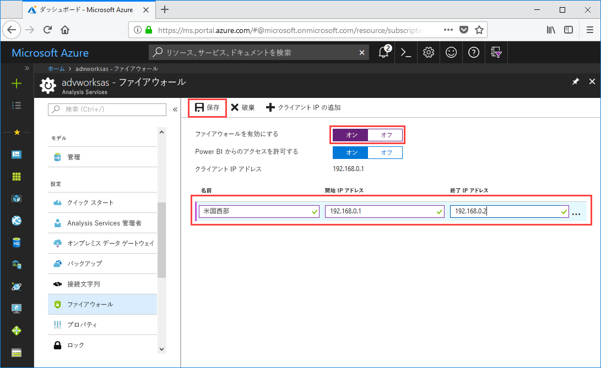

# クイック スタート: サーバーのファイアウォールの構成 - ポータル

このクイック スタートでは、Azure Analysis Services サーバーのファイアウォールを構成できます。 ファイアウォールを有効にし、IP アドレス範囲をサーバーにアクセスするコンピューターのみに構成することは、サーバーとデータの保護の重要な部分です。

## 前提条件

- サブスクリプションの Analysis Services サーバー。 詳しくは、「[クイック スタート: サーバーの作成 - ポータル](analysis-services-create-server.md)」または「[クイック スタート: サーバーの作成 - PowerShell](analysis-services-create-powershell.md)」をご覧ください。
- クライアント コンピューターの 1 つまたは複数の IP アドレス範囲 (必要な場合)。

## Azure ポータルにサインインします。 

[ポータルにサインイン](https://portal.azure.com)します。

## ファイアウォールを構成する

1. サーバーをクリックして [概要] ページを開きます。 
2. **[設定]** > **[ファイアウォール]** > **[ファイアウォールを有効にする]** で、**[オン]** をクリックします。
3. Power BI サービスからの DirectQuery アクセスを許可するには、**[Allow access from Power BI]\(Power BI からのアクセスを許可する\)** で **[オン]** をクリックします。  
4. (省略可能) 1 つまたは複数の IP アドレス範囲を指定します。 各範囲の名前、開始 IP アドレス、終了 IP アドレスを入力します。 
5. **[Save]** をクリックします。

     

## リソースのクリーンアップ

不要になった場合は、IP アドレス範囲を削除するか、ファイアウォールを無効にします。

## 次の手順
このクイック スタートでは、サーバーのファイアウォールを構成する方法を説明しました。 サーバーが存在し、ファイアウォールで保護されたので、ポータルからそれに基本的なサンプル データ モデルを追加できます。 サンプル モデルがあると、モデル データベース ロールの構成とクライアント接続のテストについて理解するのに役立ちます。 詳しくは、サンプル モデルの追加のチュートリアルに進んでください。

> [!div class="nextstepaction"]
> [チュートリアル: サーバーにサンプル モデルを追加する](analysis-services-create-sample-model.md)
