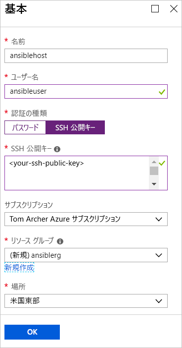
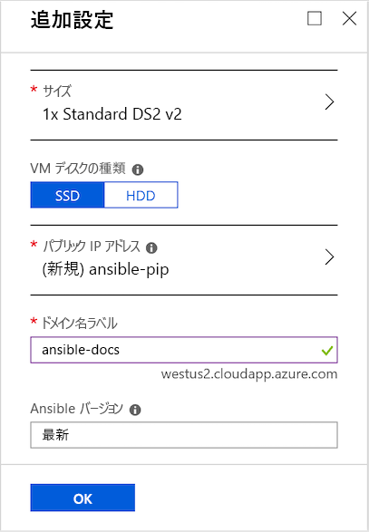
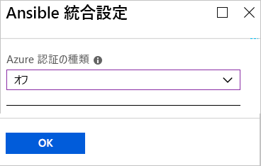

# クイック スタート:Azure 用の Ansible ソリューション テンプレートを CentOS にデプロイする

Azure 用の Ansible ソリューション テンプレートは、Azure と連携するよう構成された Ansible と一連のツールと共に、CentOS 仮想マシン上の Ansible インスタンスを構成するように設計されています。 ツールには次のものが含まれます。

- **Azure 用 Ansible モジュール** - [Azure 用 Ansible モジュール](./ansible-matrix.md)は、お客様が Azure 上のインフラストラクチャを作成および管理できるようにする一連のモジュールです。 既定では、これらのモジュールの最新バージョンがデプロイされます。 ただし、ソリューションテンプレートのデプロイ プロセスの間、お客様の環境に適したバージョン番号を指定できます。
- **Azure コマンド ライン インターフェイス (CLI) 2.0** - [Azure CLI 2.0](/cli/azure/?view=azure-cli-latest) は、Azure リソースを管理するためのクロスプラットフォーム コマンド ライン エクスペリエンスです。 
- **Azure リソースのマネージド ID** - [Azure リソースのマネージド ID](/azure/active-directory/managed-identities-azure-resources/overview) 機能では、クラウド アプリケーションの資格情報を安全に保つという課題に対処できます。

## 前提条件

[!INCLUDE [open-source-devops-prereqs-azure-subscription.md](../../includes/open-source-devops-prereqs-azure-subscription.md)]

## Ansible ソリューション テンプレートのデプロイ

1. [Azure Marketplace で Ansible ソリューション テンプレート](https://azuremarketplace.microsoft.com/en-%20%20us/marketplace/apps/azure-oss.ansible?tab=Overview)に移動します。

1. **[今すぐ入手する]** を選択します。

1. 利用規約、プライバシー ポリシー、Azure Marketplace の使用条件の詳細を示すウィンドウが表示されます。 **[続行]** をクリックします。

1. Azure portal が表示され、ソリューション テンプレートの説明が記載された Ansible ページが表示されます。 **作成** を選択します。

1. **[Ansible の作成]** ページに、いくつかのタブが表示されます。 **[基本]** タブで、必要な情報を入力します。

   - **[名前]** - お客様の Ansible インスタンスの名前を指定します。 デモの目的で、`ansiblehost` という名前が使用されています。
   - **[ユーザー名]** - Ansible インスタンスにアクセスできるユーザーの名前を指定します。 デモの目的で、`ansibleuser` という名前が使用されています。
   - **[認証の種類]** - **[パスワード]** または **[SSH 公開キー]** を選択します。 デモの目的で、 **[SSH 公開キー]** が選択されています。
   - **[パスワード]** と **[パスワードの確認]** - **[認証の種類]** に **[パスワード]** を選択する場合、これらの値にお客様のパスワードを入力します。
   - **[SSH 公開キー]** - **[認証の種類]** に **[SSH 公開キー]** を選択する場合、`ssh-rsa` で始まる一行形式でお客様の RSA 公開キーを入力します。
   - **[サブスクリプション]** - ドロップダウン リストからお客様の Azure サブスクリプションを選択します。
   - **[リソース グループ]** - ドロップダウン リストから既存のリソース グループを選択します。または、 **[新規作成]** を選択し、新しいリソース グループの名前を指定します。 デモの目的で、`ansiblerg` という名前の新しいリソース グループが使用されています。
   - **[場所]** - お客様のシナリオに適した場所をドロップダウン リストから選択します。

     

1. **[OK]** を選択します。

1. **[追加設定]** タブで、必要な情報を入力します。

   - **[サイズ]** - 既定値は Azure portal によって標準のサイズに設定されます。 お客様固有のシナリオに対応できる別のサイズを指定するには、矢印を選択して別のサイズの一覧を表示します。
   - **[VM ディスクの種類]** - **[SSD]** (Premium ソリッドステート ドライブ) または **[HDD]** (ハード ディスク ドライブ) を選択します。 デモの目的で、パフォーマンス上の利点がある **[SSD]** が選択されています。 これらの各種ディスク ストレージの詳細については、次の記事を参照してください。
       - [VM 向けの高パフォーマンスの Premium Storage とマネージド ディスク](/azure/virtual-machines/windows/premium-storage)
       - [Azure 仮想マシンのワークロード用の Standard SSD マネージド ディスク](/azure/virtual-machines/windows/disks-standard-ssd)
   - **[パブリック IP アドレス]** - 仮想マシンの外部から仮想マシンと通信したい場合にこの設定を指定します。 既定値は、`ansible-pip` という名前の新しいパブリック IP アドレスです。 別の IP アドレスを指定するには、矢印を選択して、その IP アドレスの属性 (名前、SKU、割り当てなど) を指定します。 
   - **[ドメイン名ラベル]** - 仮想マシンの公開ドメイン名を入力します。 名前は一意で、名前付け要件を満たしている必要があります。 仮想マシンの名前の指定について詳しくは、「[Azure リソースの名前付け規則](/azure/architecture/best-practices/resource-naming)」を参照してください。
   - **[Ansible バージョン]** - バージョン番号または値「`latest`」を指定して、最新バージョンをデプロイします。 **[Ansible バージョン]** の隣にある情報アイコンを選択して、利用可能なバージョンに関する詳しい情報を確認します。

     

1. **[OK]** を選択します。

1. **[Ansible Integration Settings]\(Ansible の統合設定\)**  タブで、認証の種類を指定します。 Azure リソースのセキュリティ保護の詳細については、「[Azure リソースのマネージド ID とは](/azure/active-directory/managed-identities-azure-resources/overview)」を参照してください。

    

1. **[OK]** を選択します。

1. **[概要]** ページが表示されます。検証プロセスが示されるほか、Ansible デプロイに関して指定された条件が一覧表示されます。 タブの下部にあるリンクでは、サポートされている Azure の言語とプラットフォームで使用するために**テンプレートとパラメーターをダウンロード**できます。 

     ![Ansible の [概要] タブを示す Azure portal タブ](./media/ansible-quick-deploy-solution-template/portal-ansible-setup-tab-4.png)

1. **[OK]** を選択します。

1. **[作成]** タブが表示されたら、 **[OK]** を選択して Ansible をデプロイします。

1. ポータル ページの上部にある **[通知]** アイコンを選択して、Ansible のデプロイを追跡します。 デプロイが完了したら、 **[リソース グループに移動]** を選択します。 

     ![Ansible の [概要] タブを示す Azure portal タブ](./media/ansible-quick-deploy-solution-template/portal-ansible-setup-complete.png)

1. リソース グループのページで、お客様の Ansible ホストの IP アドレスを取得してサインインし、Ansible を使用して Azure リソースを管理します。

## 次のステップ

> [!div class="nextstepaction"] 
> [クイック スタート: Ansible を使用して Azure で Linux 仮想マシンを構成する](./ansible-create-vm.md)