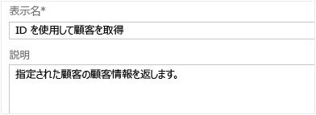

<properties 
	pageTitle="Azure API Management で API に操作を追加する方法" 
	description="Azure API Management で API に操作を追加する方法について説明します。" 
	services="api-management" 
	documentationCenter="" 
	authors="steved0x" 
	manager="dwrede" 
	editor=""/>

<tags 
	ms.service="api-management" 
	ms.workload="mobile" 
	ms.tgt_pltfrm="na" 
	ms.devlang="na" 
	ms.topic="article" 
	ms.date="11/18/2014" 
	ms.author="sdanie"/>

# Azure API Management で API に操作を追加する方法

API Management (プレビュー) 内の API を使用するためには、操作を追加する必要があります。このガイドでは、API Management 内の API に各種の操作を追加して構成する方法を説明します。

## このトピックの内容

-   [操作の追加][操作の追加]
-   [操作のキャッシュ][操作のキャッシュ]
-   [要求パラメーター][要求パラメーター]
-   [要求本文][要求本文]
-   [応答][応答]
-   [次のステップ][次のステップ]

## 操作の追加

操作を API に追加して構成するには、管理コンソールを使用します。管理コンソールにアクセスするには、ご利用の API Management サービスの Azure ポータルで **[管理コンソール]** をクリックします。

> まだ API Management サービス インスタンスを作成していない場合は、「[Azure API Management の使用][Azure API Management の使用]」チュートリアルの「[API Management インスタンスの作成][API Management インスタンスの作成]」を参照してください。

![API Management console][API Management console]

API Management ポータルで目的の API を選択し、**[操作]** タブを選択します。

![Operations][Operations]

**[操作の追加]** をクリックして新しい操作を追加します。**[新しい操作]** が表示され、**[署名]** タブが既定で選択されます。

![Add operation][Add operation]

**[HTTP 動詞]** ボックスの一覧で適切な HTTP 動詞を選択します。

![HTTP method][HTTP method]

1 つ以上の URL パス セグメントと 0 個以上のクエリ文字列パラメーターから構成される URL フラグメントを入力して、URL テンプレートを定義します。URL テンプレートは、API のベース URL に付加され、単一の HTTP 操作を識別します。URL テンプレートには、中かっこで識別される 1 つまたは複数の名前付き変数部分を含めることができます。テンプレート パラメーターと呼ばれるこれらの変数部分には、要求が API Management プラットフォームによって処理されるときに要求の URL から抽出された値が動的に割り当てられます。

![URL template][URL template]

必要に応じて、**[書き換え URL テンプレート]** に値を指定します。これにより、標準 URL テンプレートを使用してフロントエンドで受け取った要求を処理する一方で、書き換えテンプレートに従って変換された URL を介してバックエンドを呼び出すことができます。書き換えテンプレートでは、URL テンプレートのテンプレート パラメーターを使用する必要があります。次の例に、前の例の Web サービスでパス セグメントとしてエンコードされるコンテンツ タイプを、URL テンプレートを使用して API Management プラットフォーム経由で発行される API のクエリ パラメーターとして渡す方法を示します。

![URL template rewrite][URL template rewrite]

操作の呼び出し元は、`/customers?customerid=ALFKI` という形式を使用します。この値は、バックエンド サービスが起動されたときに `/Customers('ALFKI')` にマップされます。

**[表示名]** と **[説明]** には、操作の説明を指定します。これらの値は、開発者ポータルでこの API を使用する開発者向けのドキュメントを提供するために使用されます。

**[説明]** ボックスには、プレーンテキストまたは HTML 形式で操作の説明を指定できます。

## 操作のキャッシュ

応答のキャッシュを使用すると、API コンシューマーによって認識される遅延が小さくなります。さらに、帯域幅の消費が減り、API を実装する HTTP Web サービスの負荷が小さくなります。

操作のキャッシュをすばやく簡単に有効にするには、**[キャッシュ]** タブを選択し、**[有効]** チェック ボックスをオンにします。

![Caching][Caching]

**[期間]** は、操作の応答をキャッシュに保持する期間を指定します。既定値は、3,600 秒 (1 時間) です。

キャッシュ キーは、それぞれ異なるキャッシュ キーに対応する応答が別個のキャッシュ値を受け取るように、応答を区別するために使用されます。オプションで、**[クエリ文字列パラメーターごとにキャッシュ]** ボックスと **[ヘッダーごとにキャッシュ]** ボックスに、特定のクエリ文字列パラメーターとキャッシュ キー値の計算に使用する HTTP ヘッダーを入力します。これらの値を指定しない場合、完全な要求 URL と HTTP ヘッダー値 **Accept** および **Accept-Charset** がキャッシュ キーの生成に使用されます。

> キャッシュおよびキャッシュ ポリシーの詳細については、「[Azure API Management で操作の結果をキャッシュする方法][Azure API Management で操作の結果をキャッシュする方法]」を参照してください。

## 要求パラメーター

操作のパラメーターは、[パラメーター] タブで管理します。**[署名]** タブの **[URL テンプレート]** に指定されたパラメーターは自動的に追加されます。このパラメーターを変更するには、URL テンプレートを編集する必要があります。追加のパラメーターは手動で入力できます。

新しいクエリ パラメーターを追加するには、**[クエリ パラメーターの追加]** をクリックし、次の情報を入力します。

-   **[名前]** - パラメーター名。
-   **[説明]** - パラメーターの簡単な説明 (オプション)。
-   **[型]** - パラメーターの型。ボックスの一覧から選択します。
-   **[値]** - このパラメーターに割り当てることができる値。値の 1 つを既定値としてマークすることができます (オプション)。
-   **[必須]** - このパラメーターを必須にするには、このチェック ボックスをオンにします。

![Request parameters][Request parameters]

## 要求本文

操作 (PUT、POST など) で本文が許可される場合や本文が必要になる場合は、すべてのサポートされている表現形式 (json、XML など) でその例を示すことができます。

> 要求本文はドキュメント化の目的でのみ使用され、検証されません。

要求本文を入力するには、**[本文]** タブに切り替えます。

**[表現の追加]** をクリックし、目的のコンテンツ タイプの名前 (application/json など) を入力してドロップダウン リストの項目を絞り込み、目的の名前を選択します。次に、選択した形式の目的の要求本文の例をボックスに貼り付けます。

![Request body][Request body]

表現に加えて、オプションのテキスト説明を **[説明]** ボックスに指定することもできます。

## 応答

操作の結果として考えられるすべてのステータス コードの応答例を提供するようお勧めします。たとえば、ステータス コードごとに、対応する応答本文の例を複数 (サポートされるコンテンツ タイプごとに 1 つ) 設けます。

応答を追加するには、**[追加]** をクリックし、目的のステータス コードを入力して表示される項目を絞り込みます。この例では、ステータス コード **[200 OK]** を選択します。ドロップダウン リストにコードが表示されたら、目的のコードを選択します。応答コードが作成され、操作に追加されます。

![Response code][Response code]

**[表現の追加]** をクリックし、目的のコンテンツ タイプの名前 (application/json など) を入力してドロップダウン リストの項目を絞り込み、目的の名前を選択します。

![Body content type][Body content type]

選択した形式の応答本文の例をボックスに貼り付けます。

![Response body][Response body]

必要に応じて、オプションの説明を **[説明]** ボックスに追加します。

操作の構成が終わったら、**[保存]** をクリックします。

## 次のステップ

これで、操作が API に追加されました。次のステップでは、API を成果物に関連付けた後で発行して、開発者が操作を呼び出すことができるようにします。

-   [Azure API Management で成果物を作成して発行する方法][Azure API Management で成果物を作成して発行する方法]

  [操作のキャッシュ]: #operation-caching
  [要求パラメーター]: #request-parameters
  [要求本文]: #request-body
  [応答]: #responses
  [次のステップ]: #next-steps
  [操作の追加]: #add-operation
  [Azure API Management の使用]: ../api-management-get-started
  [API Management インスタンスの作成]: ../api-management-get-started/#create-service-instance
  [API Management console]: ./media/api-management-howto-add-operations/api-management-management-console.png
  [Operations]: ./media/api-management-howto-add-operations/api-management-operations.png
  [Add operation]: ./media/api-management-howto-add-operations/api-management-add-operation.png
  [HTTP method]: ./media/api-management-howto-add-operations/api-management-http-method.png
  [URL template]: ./media/api-management-howto-add-operations/api-management-url-template.png
  [URL template rewrite]: ./media/api-management-howto-add-operations/api-management-url-template-rewrite.png
  [Caching]: ./media/api-management-howto-add-operations/api-management-caching-tab.png
  [Azure API Management で操作の結果をキャッシュする方法]: ../api-management-howto-cache
  [Request parameters]: ./media/api-management-howto-add-operations/api-management-request-parameters.png
  [Request body]: ./media/api-management-howto-add-operations/api-management-request-body.png
  [Response code]: ./media/api-management-howto-add-operations/api-management-response-code.png
  [Body content type]: ./media/api-management-howto-add-operations/api-management-response-body-content-type.png
  [Response body]: ./media/api-management-howto-add-operations/api-management-response-body.png
  [Azure API Management で成果物を作成して発行する方法]: ../api-management-howto-add-products

<!--HONumber=46--> 
 