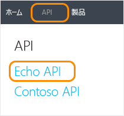

<properties 
	pageTitle="Azure API Management で操作の結果をキャッシュする方法" 
	description="API Management のサービスの呼び出しで、遅延、帯域幅の消費、Web サービスの負荷を改善させる方法について説明します。" 
	services="api-management" 
	documentationCenter="" 
	authors="steved0x" 
	manager="dwrede" 
	editor=""/>

<tags 
	ms.service="api-management" 
	ms.workload="mobile" 
	ms.tgt_pltfrm="na" 
	ms.devlang="na" 
	ms.topic="article" 
	ms.date="11/18/2014" 
	ms.author="sdanie"/>

# Azure API Management で操作の結果をキャッシュする方法

API Management (プレビュー) では、応答のキャッシュ用に操作を構成できます。応答のキャッシュを行うと、API の遅延、帯域幅の消費、頻繁に変更されないデータの Web サービスの負荷が大幅に小さくなります。

このチュートリアルでは、1 つのサンプル Echo API 操作のキャッシュ設定とポリシーを確認した後、開発者ポータルで操作を呼び出してキャッシュの動作を確認します。

## このトピックの内容

-   [キャッシュ用の操作の構成][キャッシュ用の操作の構成]
-   [キャッシュ ポリシーの確認][キャッシュ ポリシーの確認]
-   [操作の呼び出しとキャッシュのテスト][操作の呼び出しとキャッシュのテスト]
-   [次のステップ][次のステップ]

## キャッシュ用の操作の構成

このステップでは、サンプル Echo API の **GET Resource (cached)** 操作のキャッシュ設定を確認します。

> それぞれの API Management サービス インスタンスには、Echo API があらかじめ構成されています。API Management を体験、学習する目的で使用することができます。詳細については、「[Azure API Management の使用][Azure API Management の使用]」を参照してください。

最初に、ご利用の API Management サービスの Azure ポータルで **[管理コンソール]** をクリックします。API Management の管理ポータルが表示されます。

![API Management console][API Management console]

> まだ API Management サービス インスタンスを作成していない場合は、「[Azure API Management の使用][Azure API Management の使用]」チュートリアルの「[API Management インスタンスの作成][API Management インスタンスの作成]」を参照してください。

左側の **[API Management]** メニューの **[API]** をクリックし、**[Echo API]** をクリックします。

**[操作]** タブを選択します。**[操作]** ボックスの一覧の **[GET Resource (cached)]** 操作をクリックします。

![Echo API operations][Echo API operations]

**[キャッシュ]** タブを選択して、この操作のキャッシュ設定を表示します。

![Caching tab][Caching tab]

操作に対してキャッシュを有効にするには、**[有効]** チェック ボックスをオンにします。この例では、キャッシュは有効になっています。

それぞれの操作の応答は、**[クエリ文字列パラメーターごとにキャッシュ]** フィールドと **[ヘッダーごとにキャッシュ]** フィールドの値に基づいてキー付けされます。クエリ文字列パラメーターまたはヘッダーに基づいて複数の応答をキャッシュに格納するには、これらの 2 つのフィールドを使用して構成します。

**[期間]** は、キャッシュに入れられた応答の有効期間を指定します。この例では、期間は 1 時間に相当する **3,600** 秒に設定されています。

この例のキャッシュ構成を使用した場合、**GET Resource (cached)** 操作への最初の要求に対し、バックエンド サービスから応答が返されます。この応答は、キャッシュに格納され、指定されたヘッダーとクエリ文字列パラメーターによってキー付けされます。パラメーターが一致する後続の操作の呼び出しに対しては、キャッシュの有効期間が超過するまで、キャッシュに格納された応答が返されます。

## キャッシュ ポリシーの確認

**[キャッシュ]** タブで操作に対してキャッシュ設定を構成すると、操作に対してキャッシュ ポリシーが追加されます。これらのポリシーは、ポリシー エディターで表示および編集できます。

左側の **[API Management]** メニューの **[ポリシー]** をクリックし、**[操作]** ボックスの一覧の **[Echo API / GET Resource (cached)]** を選択します。

![Policy scope operation][Policy scope operation]

ポリシー エディターにこの操作のポリシーが表示されます。

![API Management policy editor][API Management policy editor]

この操作のポリシー定義には、前のステップで **[キャッシュ]** タブを使用して確認したキャッシュ構成を定義するポリシーが含まれています。

    <policies>
        <inbound>
            <base />
            <cache-lookup vary-by-developer="false" vary-by-developer-groups="false">
                <vary-by-header>Accept</vary-by-header>
                <vary-by-header>Accept-Charset</vary-by-header>
            </cache-lookup>
            <rewrite-uri template="/resource" />
        </inbound>
        <outbound>
            <base />
            <cache-store caching-mode="cache-on" duration="3600" />
        </outbound>
    </policies>

> ポリシー エディターでキャッシュ ポリシーに加えた変更は、操作の **[キャッシュ]** タブに反映されます (また、その逆の操作を行った場合も同様に変更が反映されます)。

## 操作の呼び出しとキャッシュのテスト

キャッシュの動作を確認するには、開発者ポータルから操作を呼び出します。右上にあるメニューの **[開発者ポータル]** をクリックします。

上部のメニューで **[API]** をクリックし、**[Echo API]** を選択します。

> アカウントに対して構成されている (またはアカウントから見える) API が 1 つしかない場合、[API] をクリックすると、その API の操作に直接誘導されます。

**[GET Resource (cached)]** 操作を選択し、**[コンソールを開く]** をクリックします。

![Open console][Open console]

コンソールを使用すると、開発者ポータルから直接操作を呼び出すことができます。

![コンソール][コンソール]

**[param1]** と **[param2]** については既定値のままにしておきます。

**[サブスクリプション キー]** ボックスの一覧で目的のキーを選択します。アカウントのサブスクリプションが 1 つしかない場合は自動的にそのサブスクリプションが選択されます。

**[要求ヘッダー]** ボックスに「**sampleheader:value1**」と入力します。

**[HTTP Get]** をクリックし、応答ヘッダーをメモしておきます。

**[要求ヘッダー]** ボックスに「**sampleheader:value2**」と入力します。**[HTTP Get]** をクリックします。

応答内の **sampleheader** の値が前と同じ **value1** であることに注目してください。異なる値をいくつか試して、最初の呼び出しでキャッシュに格納された応答が返されることを確かめます。

**[param2]** フィールドに「**25**」と入力し、**[HTTP Get]** をクリックします。

応答内の **sampleheader** の値が **value2** になっていることに注目してください。操作の結果はクエリ文字列によってキー付けされているため、以前のキャッシュに格納された応答は返されません。

## 次のステップ

-   「[Azure API Management の詳細な構成について][Azure API Management の詳細な構成について]」チュートリアルにあるその他のトピックもチェックしてください。
-   キャッシュ ポリシーの詳細については、「[Azure API Management ポリシー リファレンス][Azure API Management ポリシー リファレンス]」の「[キャッシュ ポリシー][キャッシュ ポリシー]」を参照してください。

  [キャッシュ用の操作の構成]: #configure-caching
  [キャッシュ ポリシーの確認]: #caching-policies
  [操作の呼び出しとキャッシュのテスト]: #test-operation
  [次のステップ]: #next-steps
  [Azure API Management の使用]: ../api-management-get-started
  [API Management console]: ./media/api-management-howto-cache/api-management-management-console.png
  [API Management インスタンスの作成]: ../api-management-get-started/#create-service-instance
  [Echo API operations]: ./media/api-management-howto-cache/api-management-echo-api-operations.png
  [Caching tab]: ./media/api-management-howto-cache/api-management-caching-tab.png
  [Policy scope operation]: ./media/api-management-howto-cache/api-management-operation-dropdown.png
  [API Management policy editor]: ./media/api-management-howto-cache/api-management-policy-editor.png
  [Open console]: ./media/api-management-howto-cache/api-management-open-console.png
  [コンソール]: ./media/api-management-howto-cache/api-management-console.png
  [Azure API Management の詳細な構成について]: ../api-management-get-started-advanced
  [Azure API Management ポリシー リファレンス]: ../api-management-policy-reference
  [キャッシュ ポリシー]: ../api-management-policy-reference/#caching-policies

<!--HONumber=46--> 
 