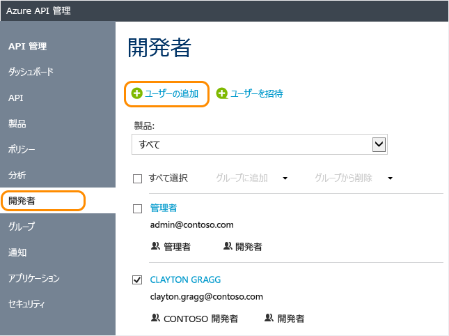

# Azure API Management でユーザー アカウントを管理する方法
API Management では、開発者は、API Management を使用して公開された API のユーザーになります。 このガイドでは、開発者を作成する方法と、API Management インスタンスで公開した API および成果物を案内する招待メッセージを開発者に送信する方法について説明します。 プログラムによるユーザー アカウントの管理については、「[API Management REST (API Management REST)](https://msdn.microsoft.com/library/azure/dn776326.aspx)」リファレンスの[ユーザー エンティティ](https://docs.microsoft.com/rest/api/apimanagement/apimanagementrest/azure-api-management-rest-api-user-entity)に関するドキュメントを参照してください。

## 前提条件

「[Create an Azure API Management instance (Azure API Management インスタンスを作成する)](get-started-create-service-instance.md)」の記事にあるタスクを完了します。

[!INCLUDE [api-management-navigate-to-instance.md](../../includes/api-management-navigate-to-instance.md)]

## 新しい開発者の作成

新しいユーザーを追加するには、このセクションの手順に従います。

1. 画面の左にある **[ユーザー]** タブを選択します。
2. **[+ 追加]** を押します。
3. 適切なユーザー情報を入力します。
4. **[追加]** をクリックします。

    

既定では、新しく作成された開発者アカウントは**アクティブ**になり、**開発者**グループに関連付けられます。 **[アクティブ]** 状態の開発者アカウントを使用すると、サブスクリプションがあるすべての API にアクセスできます。 新しく作成した開発者を追加のグループに関連付ける方法については、「[グループと開発者の関連付け][How to associate groups with developers]」を参照してください。

## 開発者の招待
開発者を招待するには、このセクションの手順に従います。

1. 画面の左にある **[ユーザー]** タブを選択します。
2. **[+ 招待]** を押します。

確認メッセージが表示されます。ただし、新しく招待した開発者は、招待を受け入れるまで一覧に表示されません。 

開発者を招待すると、招待された開発者に電子メールが送信されます。 この電子メールはテンプレートを使用して生成され、カスタマイズできます。 詳細については、「[電子メール テンプレートの構成][Configure email templates]」を参照してください。

招待が受け入れられると、そのアカウントがアクティブになります。

##  開発者アカウントの非アクティブ化および再アクティブ化

既定では、新しく作成または招待された開発者アカウントは **アクティブ**になります。 開発者アカウントを非アクティブ化するには、 **[ブロック]** をクリックします。 ブロックされている開発者アカウントを再アクティブ化するには、 **[アクティブ化]** をクリックします。 ブロックされている開発者アカウントは、開発者ポータルにアクセスすることも、API を呼び出すこともできません。 ユーザー アカウントを削除するには、 **[削除]** をクリックします。

ユーザーをブロックするには、次の手順に従います。

1. 画面の左にある **[ユーザー]** タブを選択します。
2. ブロックするユーザーをクリックします。
3. **[ブロック]** を押します。

## ユーザーのパスワードのリセット

プログラムによってユーザー アカウントを操作するには、「[API Management REST (API Management REST)](https://msdn.microsoft.com/library/azure/dn776326.aspx)」リファレンスの[ユーザー エンティティ](https://docs.microsoft.com/rest/api/apimanagement/apimanagementrest/azure-api-management-rest-api-user-entity)に関するドキュメントを参照してください。 ユーザー アカウントのパスワードを特定の値にリセットするには、 [ユーザーの更新](https://docs.microsoft.com/rest/api/apimanagement/apimanagementrest/azure-api-management-rest-api-user-entity#UpdateUser) 操作を使用して目的のパスワードを指定します。

## 次のステップ
開発者アカウントを作成した後は、このアカウントをロールに関連付け、成果物と API をサブスクライブできます。 詳細については、[グループを作成して使用する方法][How to create and use groups]に関するページを参照してください。

[api-management-management-console]: ./media/api-management-howto-create-or-invite-developers/api-management-management-console.png
[api-management-add-new-user]: ./media/api-management-howto-create-or-invite-developers/api-management-add-new-user.png
[api-management-create-developer]: ./media/api-management-howto-create-or-invite-developers/api-management-create-developer.png
[api-management-invite-developer]: ./media/api-management-howto-create-or-invite-developers/api-management-invite-developer.png
[api-management-new-developer]: ./media/api-management-howto-create-or-invite-developers/api-management-new-developer.png
[api-management-invite-developer-window]: ./media/api-management-howto-create-or-invite-developers/api-management-invite-developer-window.png
[api-management-invite-developer-confirmation]: ./media/api-management-howto-create-or-invite-developers/api-management-invite-developer-confirmation.png
[api-management-pending-verification]: ./media/api-management-howto-create-or-invite-developers/api-management-pending-verification.png
[api-management-view-developer]: ./media/api-management-howto-create-or-invite-developers/api-management-view-developer.png
[api-management-reset-password]: ./media/api-management-howto-create-or-invite-developers/api-management-reset-password.png

[Create a new developer]: #create-developer
[Invite a developer]: #invite-developer
[Deactivate or reactivate a developer account]: #block-developer
[Next steps]: #next-steps
[How to create and use groups]: api-management-howto-create-groups.md
[How to associate groups with developers]: api-management-howto-create-groups.md#associate-group-developer

[Get started with Azure API Management]: get-started-create-service-instance.md
[Create an API Management service instance]: get-started-create-service-instance.md
[Configure email templates]: api-management-howto-configure-notifications.md#email-templates
