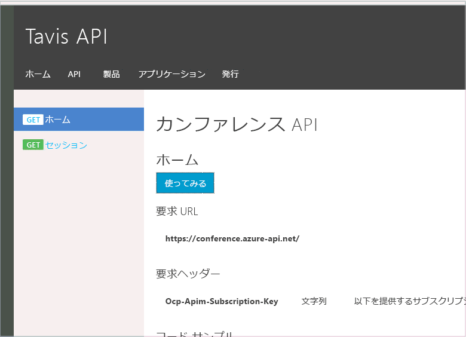

# <a name="monitor-your-apis-with-azure-api-management-event-hubs-and-runscope"></a>Azure API Management、Event Hubs、Runscope を使用した API の監視
[API Management サービス](api-management-key-concepts.md) は、HTTP API に送信された HTTP 要求の処理を強化する多くの機能を提供します。 しかし、要求と応答の存在は一時的なものです。 要求は、発行されると、API Management サービスを経由してバックエンド API に渡されます。 API によって要求が処理されると、応答が API コンシューマーに返されます。 API Management サービスでは Azure Portal ダッシュボードへの表示用に API に関するいくつかの重要な統計情報が保持されますが、それ以上の詳細は失われます。

API Management サービスで log-to-eventhub ポリシーを使用することにより、要求から応答まですべての詳細を [Azure イベント ハブ](../event-hubs/event-hubs-what-is-event-hubs.md)に送信できます。 API に送信される HTTP メッセージからイベントを生成するのにはさまざまな理由があります。 たとえば、更新プログラム、利用状況分析、例外のアラート、サード パーティの統合の監査証跡が該当します。   

この記事では、HTTP 要求と応答メッセージ全体をキャプチャしてイベント ハブに送信した後、HTTP ログと監視サービスを提供するサード パーティのサービスにそのメッセージをリレーする方法を示します。

## <a name="why-send-from-api-management-service"></a>API Management サービスから送信する理由
HTTP API フレームワークに接続できる HTTP ミドルウェアを作成して、HTTP 要求と応答をキャプチャし、それらをログおよび監視システムに送ることは可能です。 この方法の欠点は、HTTP ミドルウェアをバックエンド API に統合する必要があり、API のプラットフォームに対応させる必要があることです。 API が複数ある場合は、それぞれがミドルウェアをデプロイする必要があります。 多くの場合、バックエンド API を更新できない理由もいくつかあります。

Azure API Management サービスを使用してログ記録インフラストラクチャを統合すると、プラットフォームに依存しない一元的なソリューションを実現できます。 このソリューションがスケーラブルなのは、1 つには Azure API Management の [geo レプリケーション](api-management-howto-deploy-multi-region.md) 機能のおかげでもあります。

## <a name="why-send-to-an-azure-event-hub"></a>Azure Event ハブに送信する理由
Azure Event Hubs に固有のポリシーを作成する理由を問うのも理にかなっています。 要求を記録できる場所にはいろいろあります。 なぜ最終的な宛先に直接、要求を送信しないのでしょうか。  それも 1 つの方法です。 ただし、API Management サービスからログ記録を要求する場合は、メッセージのログ記録が API のパフォーマンスにどのように影響するかを考慮する必要があります。 負荷が段階的に増加する場合は、システム コンポーネントの使用可能なインスタンスを増やすか、geo レプリケーションを活用することで対処できます。 しかし、トラフィックが短期間で急増した場合、負荷がかかることでログ記録インフラストラクチャへの要求の処理速度が低下し始めると、要求が遅延する可能性があります。

Azure Event Hubs は、膨大な量のデータの受信に対応できるように設計されており、ほとんどの API で処理される HTTP 要求の数よりもはるかに大量のイベントを処理できます。 イベント ハブは、API Management サービスと、メッセージを格納して処理するインフラストラクチャとの間で高度なバッファーの一種として機能します。 これにより、API のパフォーマンスはログ記録インフラストラクチャの影響を受けることはありません。  

イベント ハブに渡されたデータは保持され、イベント ハブ コンシューマーによって処理されるまで待機します。 イベント ハブでは、データがどのように処理されるかは配慮されません。配慮されるのは、メッセージが正常に配信されるようにすることだけです。     

Event Hubs には、複数のコンシューマー グループにイベントをストリーム配信する機能があります。 これにより、イベントを異なるシステムで処理できます。 生成する必要があるイベントは 1 つだけになるため、API Management サービス内での API 要求の処理でさらに遅延が発生することなく、多くの統合シナリオのサポートが可能になります。

## <a name="a-policy-to-send-applicationhttp-messages"></a>application/http メッセージを送信するためのポリシー
イベント ハブでは、イベント データを単純な文字列として受け取ります。 その文字列の内容はユーザーが決めることができます。 HTTP 要求をパッケージ化し、それを Event Hubs に送信できるようにするには、要求または応答の情報を含む文字列の形式を設定する必要があります。 このような状況で再利用できる既存の形式がある場合は、独自の解析コードを記述する必要はありません。 最初、HTTP 要求と応答の送信には [HAR](http://www.softwareishard.com/blog/har-12-spec/) を使用することを考えていました。 しかし、この形式は、JSON ベースの形式で一連の HTTP 要求を格納するために最適化されています。 この形式には必須の要素が多数含まれていたため、ネットワーク経由で HTTP メッセージを渡すシナリオでは不必要に複雑さが増しました。  

代わりの方法として、HTTP 仕様の [RFC 7230](http://tools.ietf.org/html/rfc7230) に規定されている `application/http` メディア タイプを使用しました。 このメディア タイプでは、実際にネットワーク経由で HTTP メッセージを送信する際に使用されるのとまったく同じ形式が使用されますが、メッセージ全体を別の HTTP 要求の本文に含めることができます。 ここでは、本文を、Event Hubs に送信するメッセージとして使用します。 [Microsoft ASP.NET Web API 2.2 クライアント](https://www.nuget.org/packages/Microsoft.AspNet.WebApi.Client/) ライブラリには、この形式を解析してネイティブ `HttpRequestMessage` オブジェクトと `HttpResponseMessage` オブジェクトに変換できる便利なパーサーが含まれています。

このメッセージを作成できるようにするには、Azure API Management の C# ベースの [ポリシー式](https://msdn.microsoft.com/library/azure/dn910913.aspx) を使用する必要があります。 Azure Event Hubs に HTTP 要求メッセージを送信するポリシーを次に示します。

```xml
<log-to-eventhub logger-id="conferencelogger" partition-id="0">
@{
   var requestLine = string.Format("{0} {1} HTTP/1.1\r\n",
                                               context.Request.Method,
                                               context.Request.Url.Path + context.Request.Url.QueryString);

   var body = context.Request.Body?.As<string>(true);
   if (body != null && body.Length > 1024)
   {
       body = body.Substring(0, 1024);
   }

   var headers = context.Request.Headers
                          .Where(h => h.Key != "Authorization" && h.Key != "Ocp-Apim-Subscription-Key")
                          .Select(h => string.Format("{0}: {1}", h.Key, String.Join(", ", h.Value)))
                          .ToArray<string>();

   var headerString = (headers.Any()) ? string.Join("\r\n", headers) + "\r\n" : string.Empty;

   return "request:"   + context.Variables["message-id"] + "\n"
                       + requestLine + headerString + "\r\n" + body;
}
</log-to-eventhub>
```

### <a name="policy-declaration"></a>ポリシーの宣言
このポリシー式に関して触れておく必要があることがいくつかあります。 この log-to-eventhub ポリシーには、API Management サービス内で作成されたロガーの名前を参照する、logger-id という名前の属性があります。 API Management サービスでイベント ハブ ロガーを設定する方法の詳細については、「[Azure API Management で Azure Event Hubs にイベントを記録する方法](api-management-howto-log-event-hubs.md)」というドキュメントを参照してください。 2 番目の属性は、メッセージを格納するパーティションをイベント ハブに指示する省略可能なパラメーターです。 Event Hubs では、パーティションを使用してスケーラビリティを実現するため、2 つ以上のパーティションが必要になります。 メッセージの順次配信は、パーティション内でのみ保証されます。 どのパーティションにメッセージを格納するかをイベント ハブに指示しなかった場合は、ラウンドロビン アルゴリズムを使用して負荷が分散されます。 ただし、その場合、メッセージのいくつかは順序どおりに処理されない可能性があります。  

### <a name="partitions"></a>パーティション
メッセージが順番にコンシューマーに配信されるようにして、パーティションの負荷分散機能を利用するために、ここでは、HTTP 要求メッセージを 1 つのパーティションに送信し、HTTP 応答メッセージをもう 1 つのパーティションに送信することにしました。 これにより、負荷が均等に分散されるようになるため、すべての要求が順序どおりに使用されることとすべての応答が順序どおりに使用されることを保証できます。 応答が対応する要求の前に使用される可能性はありますが、それは問題ではありません。なぜなら、要求を応答に対応付けるために別のメカニズムを使用しており、要求が常に応答の前に処理されることがわかっているためです。

### <a name="http-payloads"></a>HTTP ペイロード
`requestLine` を作成した後は、要求本文を切り詰める必要があるかどうかを確認します。 要求本文は 1,024 に切り詰められます。 この値は増やすこともできます。ただし、個々のイベント ハブ メッセージは 256 KB に制限されているため、HTTP メッセージ本文によっては 1 つのメッセージに収まらなくなる可能性があります。 ログ記録および分析を実施する場合、HTTP 要求行とヘッダーのみからでも膨大な量の情報が生成される可能性があります。 また、多くの API 要求ではサイズの小さな本文のみが返されるため、サイズの大きな本文を切り詰めた場合の情報価値の損害は、本文の内容すべてを保持するための転送、処理、保管のコストの削減と比較すると非常に小さなものです。 本文の処理に関する最後の注意点として、`true` を As<string>() メソッドに渡す必要があります。これは、単に本文の内容を読み取るだけでなく、バックエンド API でも本文を読み取ることができるようにするためです。 このメソッドに true を渡すことで、本文をもう一度読み取ることができるように本文はバッファーに格納されます。 大きいファイルをアップロードする API や長いポーリング時間を使用する API がある場合は、この点に注意することが重要です。 このような場合は、本文の読み取りをまったく行わないようにするのが最善です。   

### <a name="http-headers"></a>HTTP ヘッダー
HTTP ヘッダーは、単純なキーと値のペアの形式のメッセージ形式に変換できます。 ここでは、資格情報が不必要に漏えいすることのないように、機密情報が格納される特定のフィールドを除去しています。 API キーとその他の資格情報が分析目的で使用される可能性はほとんどありません。 ユーザーやユーザーが使用している特定の製品について分析を行う場合は、 `context` オブジェクトから該当する情報を取得してメッセージに追加することができます。     

### <a name="message-metadata"></a>メッセージのメタデータ
イベント ハブに送信する完全なメッセージを作成する際、最初の行は実際には `application/http` メッセージの一部ではありません。 最初の行は追加のメタデータで、メッセージが要求メッセージと応答メッセージのどちらであるかを示す値と、要求を応答に関連付けるためのメッセージ ID で構成されています。 メッセージ ID は、次のような別のポリシーを使用して作成されます。

```xml
<set-variable name="message-id" value="@(Guid.NewGuid())" />
```

ここでは、要求メッセージを作成し、応答が返されるまでその要求メッセージを変数に格納した後、要求と応答を 1 つのメッセージとして送信することもできます。 ただし、要求と応答を個別に送信し、メッセージ ID を使用してその 2 つを関連付けることで、メッセージ サイズにおける柔軟性が若干向上し、メッセージの順序を維持しながら複数のパーティションを利用することができます。さらに、要求がログ記録ダッシュボードにより迅速に表示されるようになります。 また、一部のシナリオでは、API Management サービスでの致命的な要求エラーが原因でイベント ハブに有効な応答が送信されない場合もありますが、その要求の記録は残ります。

応答 HTTP メッセージを送信するポリシーは要求に似ています。完全なポリシーの構成の例を次に示します。

```xml
<policies>
  <inbound>
      <set-variable name="message-id" value="@(Guid.NewGuid())" />
      <log-to-eventhub logger-id="conferencelogger" partition-id="0">
      @{
          var requestLine = string.Format("{0} {1} HTTP/1.1\r\n",
                                                      context.Request.Method,
                                                      context.Request.Url.Path + context.Request.Url.QueryString);

          var body = context.Request.Body?.As<string>(true);
          if (body != null && body.Length > 1024)
          {
              body = body.Substring(0, 1024);
          }

          var headers = context.Request.Headers
                               .Where(h => h.Key != "Authorization" && h.Key != "Ocp-Apim-Subscription-Key")
                               .Select(h => string.Format("{0}: {1}", h.Key, String.Join(", ", h.Value)))
                               .ToArray<string>();

          var headerString = (headers.Any()) ? string.Join("\r\n", headers) + "\r\n" : string.Empty;

          return "request:"   + context.Variables["message-id"] + "\n"
                              + requestLine + headerString + "\r\n" + body;
      }
  </log-to-eventhub>
  </inbound>
  <backend>
      <forward-request follow-redirects="true" />
  </backend>
  <outbound>
      <log-to-eventhub logger-id="conferencelogger" partition-id="1">
      @{
          var statusLine = string.Format("HTTP/1.1 {0} {1}\r\n",
                                              context.Response.StatusCode,
                                              context.Response.StatusReason);

          var body = context.Response.Body?.As<string>(true);
          if (body != null && body.Length > 1024)
          {
              body = body.Substring(0, 1024);
          }

          var headers = context.Response.Headers
                                          .Select(h => string.Format("{0}: {1}", h.Key, String.Join(", ", h.Value)))
                                          .ToArray<string>();

          var headerString = (headers.Any()) ? string.Join("\r\n", headers) + "\r\n" : string.Empty;

          return "response:"  + context.Variables["message-id"] + "\n"
                              + statusLine + headerString + "\r\n" + body;
     }
  </log-to-eventhub>
  </outbound>
</policies>
```

`set-variable` ポリシーでは、`<inbound>` セクションと `<outbound>` セクション両方の `log-to-eventhub` ポリシーからアクセスできる値を作成します。  

## <a name="receiving-events-from-event-hubs"></a>Event Hubs からのイベントの受信
Azure Event Hubs からのイベントは、 [AMQP プロトコル](http://www.amqp.org/)を使用して受信します。 Microsoft Service Bus チームは、クライアント ライブラリでコンシューマー側のイベントを簡単に作成できるようにしました。 サポートされている方法は 2 つあり、1 つは*ダイレクト コンシューマー*、もう 1 つは `EventProcessorHost` クラスの使用です。 これらの 2 つの方法の例については、「 [Event Hubs のプログラミング ガイド](../event-hubs/event-hubs-programming-guide.md)」を参照してください。 簡単に 2 つの方法の違いを説明すると、`Direct Consumer`を使用すると完全に制御できるのに対して、`EventProcessorHost` を使用した場合は、一部の面倒な作業が自動的に処理されますが、これらのイベントをどのように処理するかについてはある程度憶測が立てられます。  

### <a name="eventprocessorhost"></a>EventProcessorHost
このサンプルでは、わかりやすくするために `EventProcessorHost` を使用していますが、これはこの特定のシナリオにとって最適ではない可能性があります。 `EventProcessorHost` では、特定のイベント プロセッサ クラス内でスレッドの問題について心配する必要がないようにする困難な処理が行われます。 ただし、このシナリオでは、メッセージを別の形式に変換し、非同期メソッドを使用してそれを別のサービスに渡しているだけです。 共有した状態を更新する必要はないため、スレッドの問題が発生するリスクはありません。 ほとんどのシナリオでは、 `EventProcessorHost` がおそらく最善の選択肢であり、最も簡単な方法であることは確実です。     

### <a name="ieventprocessor"></a>IEventProcessor
`EventProcessorHost` を使用する場合は、`ProcessEventAsync` メソッドを含む `IEventProcessor` インターフェイスの実装を作成することが中心的な考え方になります。 このメソッドの最も重要な部分を次に示します。

```csharp
async Task IEventProcessor.ProcessEventsAsync(PartitionContext context, IEnumerable<EventData> messages)
{

   foreach (EventData eventData in messages)
   {
       _Logger.LogInfo(string.Format("Event received from partition: {0} - {1}", context.Lease.PartitionId,eventData.PartitionKey));

       try
       {
           var httpMessage = HttpMessage.Parse(eventData.GetBodyStream());
           await _MessageContentProcessor.ProcessHttpMessage(httpMessage);
       }
       catch (Exception ex)
       {
           _Logger.LogError(ex.Message);
       }
   }
    ... checkpointing code snipped ...
}
```

EventData オブジェクトのリストがメソッドに渡されます。ここでは、そのリストに対して反復処理を行います。 各メソッドのバイトが HttpMessage オブジェクトに解析され、そのオブジェクトが IHttpMessageProcessor のインスタンスに渡されます。

### <a name="httpmessage"></a>HttpMessage
`HttpMessage` インスタンスには、3 つのデータが格納されます。

```csharp
public class HttpMessage
{
   public Guid MessageId { get; set; }
   public bool IsRequest { get; set; }
   public HttpRequestMessage HttpRequestMessage { get; set; }
   public HttpResponseMessage HttpResponseMessage { get; set; }

... parsing code snipped ...

}
```

`HttpMessage` インスタンスには、HTTP 要求を対応する HTTP 応答に関連付けるための `MessageId` GUID と、オブジェクトに HttpRequestMessage と HttpResponseMessage のインスタンスが含まれるかどうかを示すブール値が格納されます。 `System.Net.Http` の組み込みの HTTP クラスを使用することで、`System.Net.Http.Formatting` に含まれている `application/http` 解析コードを使用することができました。  

### <a name="ihttpmessageprocessor"></a>IHttpMessageProcessor
次に、`HttpMessage` インスタンスは、`IHttpMessageProcessor` の実装に転送されます。これは、Azure イベント ハブからのイベントの受信および解釈と実際のイベントの処理を分離するために作成したインターフェイスです。

## <a name="forwarding-the-http-message"></a>HTTP メッセージの転送
このサンプルでは、少しひねって HTTP 要求を [Runscope](http://www.runscope.com) にプッシュ送信しました。 Runscope は、HTTP デバッグ、ログ記録、および監視に特化したクラウド ベースのサービスです。 Runscope には Free レベルが用意されているため、簡単に試すことができます。これを使用すると、API Management サービスを通過する HTTP 要求をリアルタイムで確認することができます。

`IHttpMessageProcessor` の実装は次のようになります。

```csharp
public class RunscopeHttpMessageProcessor : IHttpMessageProcessor
{
   private HttpClient _HttpClient;
   private ILogger _Logger;
   private string _BucketKey;
   public RunscopeHttpMessageProcessor(HttpClient httpClient, ILogger logger)
   {
       _HttpClient = httpClient;
       var key = Environment.GetEnvironmentVariable("APIMEVENTS-RUNSCOPE-KEY", EnvironmentVariableTarget.User);
       _HttpClient.DefaultRequestHeaders.Authorization = new AuthenticationHeaderValue("bearer", key);
       _HttpClient.BaseAddress = new Uri("https://api.runscope.com");
       _BucketKey = Environment.GetEnvironmentVariable("APIMEVENTS-RUNSCOPE-BUCKET", EnvironmentVariableTarget.User);
       _Logger = logger;
   }

   public async Task ProcessHttpMessage(HttpMessage message)
   {
       var runscopeMessage = new RunscopeMessage()
       {
           UniqueIdentifier = message.MessageId
       };

       if (message.IsRequest)
       {
           _Logger.LogInfo("Sending HTTP request " + message.MessageId.ToString());
           runscopeMessage.Request = await RunscopeRequest.CreateFromAsync(message.HttpRequestMessage);
       }
       else
       {
           _Logger.LogInfo("Sending HTTP response " + message.MessageId.ToString());
           runscopeMessage.Response = await RunscopeResponse.CreateFromAsync(message.HttpResponseMessage);
       }

       var messagesLink = new MessagesLink() { Method = HttpMethod.Post };
       messagesLink.BucketKey = _BucketKey;
       messagesLink.RunscopeMessage = runscopeMessage;
       var runscopeResponse = await _HttpClient.SendAsync(messagesLink.CreateRequest());
       _Logger.LogDebug("Request sent to Runscope");
   }
}
```

[Runscope 用の既存のクライアント ライブラリ](http://www.nuget.org/packages/Runscope.net.hapikit/0.9.0-alpha)を利用し、`HttpRequestMessage` と `HttpResponseMessage` のインスタンスをサービスに簡単にプッシュ送信することができました。 Runscope API にアクセスするには、アカウントと API キーが必要です。 API キーを取得するための手順については、 [Runscope API にアクセスするアプリケーションの作成](http://blog.runscope.com/posts/creating-applications-to-access-the-runscope-api) に関するスクリーンキャストを参照してください。

## <a name="complete-sample"></a>完全なサンプル
サンプルの[ソース コード](https://github.com/darrelmiller/ApimEventProcessor)とテストは、GitHub から入手できます。 自身でサンプルを実行するには、[API Management サービス](get-started-create-service-instance.md)、[接続されたイベント ハブ](api-management-howto-log-event-hubs.md)、および[ストレージ アカウント](../storage/common/storage-create-storage-account.md)が必要です。   

このサンプルは、イベント ハブからのイベントをリッスンし、そのイベントを `HttpRequestMessage` オブジェクトと `HttpResponseMessage` オブジェクトに変換して、Runscope API に転送するだけの簡単なコンソール アプリケーションです。

次のアニメーション画像では、開発者ポータルで API に対する要求が行われ、コンソール アプリケーションでメッセージが受信、処理、転送された後、Runscope Traffic Inspector に要求と応答が表示されることを確認できます。



## <a name="summary"></a>概要
Azure API Management サービスでは、API を経由して送受信される HTTP トラフィックをキャプチャするための理想的な場所が用意されています。 Azure Event Hubs は、そのトラフィックをキャプチャして、ログ記録、監視、その他の高度な分析用のセカンダリ処理システムに供給するための、非常にスケーラブルで低コストのソリューションです。 数十行のコードを書くだけで、Runscope のようなサード パーティ製のトラフィック監視システムに簡単に接続できます。

## <a name="next-steps"></a>次のステップ
* Azure Event Hubs の詳細
  * [Azure Event Hubs の使用](../event-hubs/event-hubs-c-getstarted-send.md)
  * [EventProcessorHost を使用したメッセージの受信](../event-hubs/event-hubs-dotnet-standard-getstarted-receive-eph.md)
  * [Event Hubs のプログラミング ガイド](../event-hubs/event-hubs-programming-guide.md)
* API Management と Event Hubs の統合の詳細
  * [Azure API Management で Azure Event Hubs にイベントを記録する方法](api-management-howto-log-event-hubs.md)
  * [ロガーのエンティティ リファレンス](https://docs.microsoft.com/rest/api/apimanagement/apimanagementrest/azure-api-management-rest-api-logger-entity)
  * [log-to-eventhub ポリシー リファレンス](https://msdn.microsoft.com/library/azure/dn894085.aspx#log-to-eventhub)
