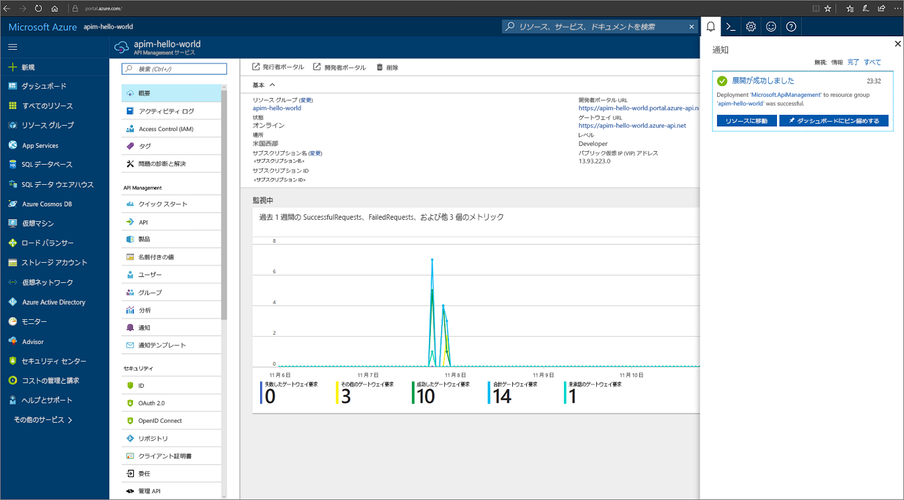
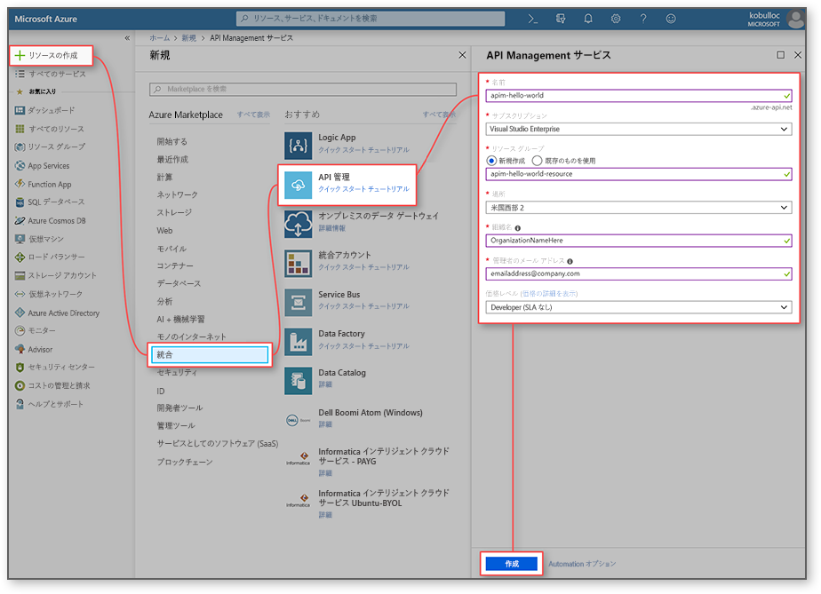
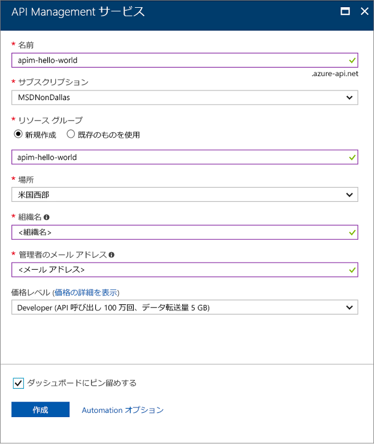
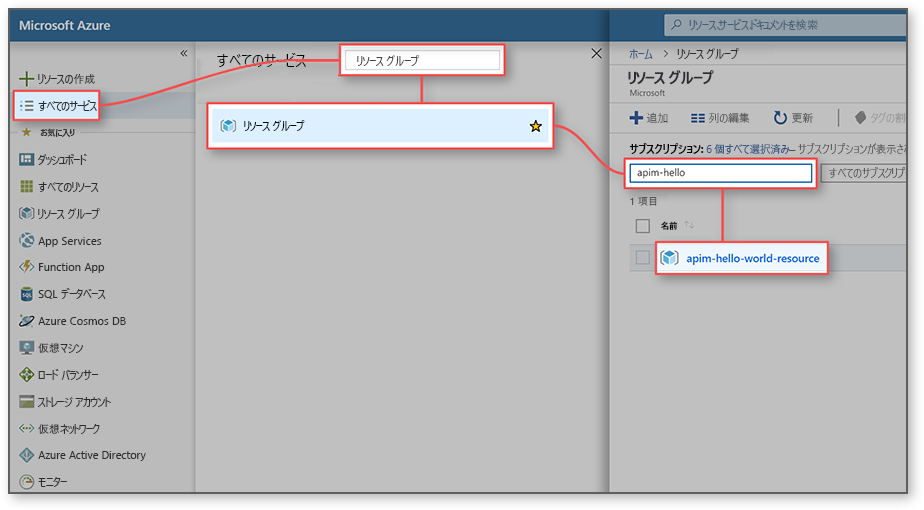
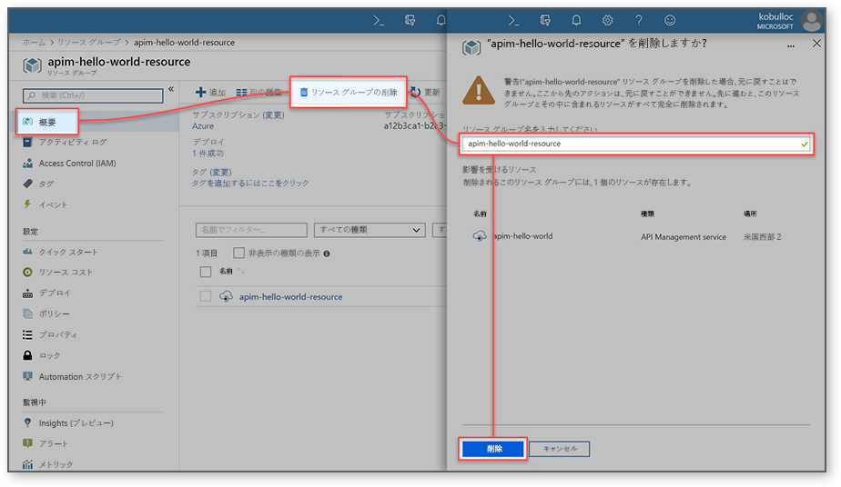

# Azure API Management サービスの新しいインスタンスの作成

API Management (APIM) が組織にもたらす利点は、外部、パートナー、社内の開発者に API を公開することによって、社内のデータやサービスの可能性を広げられることです。 API Management は、開発者の取り組み、ビジネス インサイト、分析、セキュリティ、保護を通じて API プログラムの価値を高め、企業にコア コンピテンシーをもたらします。 APIM を使用すると、任意の場所でホストされている既存のバックエンド サービスの最新の API ゲートウェイを作成し、管理できます。 詳細については、[概要](api-management-key-concepts.md)に関するトピックを参照してください。

このクイック スタートでは、Azure Portal を使用して新しい API Management インスタンスを作成する手順を説明します。

[!INCLUDE [quickstarts-free-trial-note](../../includes/quickstarts-free-trial-note.md)]

## Azure にログインする

Azure Portal (https://portal.azure.com) にログインします。

## 新しいサービスの作成

1. [Azure Portal](https://portal.azure.com/) で **[リソースの作成]** > **[Enterprise Integration]** > **[API management]** の順に選択します。

    または **[新規]** を選択し、検索ボックスに「`API management`」と入力して Enter キーを押します。 **Create** をクリックしてください。

2. **[API Management サービス]** ウィンドウで設定を入力します。

    

    | Setting                 | 推奨値                               | Description                                                                                                                                                                                                                                                                                                                         |
|-------------------------|-----------------------------------------------|-------------------------------------------------------------------------------------------------------------------------------------------------------------------------------------------------------------------------------------------------------------------------------------------------------------------------------------|
| **名前**                | API Management サービスの一意の名前 | この名前を後から変更することはできません。 サービスの名前は、*{name}.azure-api.net* の形式で既定のドメイン名を生成するために使用されます。 カスタム ドメイン名を使用する場合は、[カスタム ドメインの構成](configure-custom-domain.md)に関するページをご覧ください。   サービス名は、サービスおよび対応する Azure リソースへの参照に使用されます。 |
| **サブスクリプション**        | 該当するサブスクリプション                             | この新しいサービス インスタンスが作成されるサブスクリプション。 アクセスできる各種の Azure サブスクリプションの中から、サブスクリプションを 1 つ選択できます。                                                                                                                                                            |
| **リソース グループ**      | *apimResourceGroup*                           | 新規または既存のリソースを選択できます。 リソース グループとは、ライフサイクル、アクセス許可、ポリシーを共有するリソースの集まりです。 [こちら](../azure-resource-manager/resource-group-overview.md#resource-groups)をご覧ください。                                                                                                  |
| **場所**            | "*米国西部*"                                    | 近くの地理的リージョンを選択します。 ドロップダウン リストのボックスには、API Management サービスを利用できるリージョンのみが表示されます。                                                                                                                                                                                                          |
| **組織名**   | 組織の名前                 | この名前は、開発者ポータルのタイトルや通知用電子メールの送信者など、さまざまな場所に使用されます。                                                                                                                                                                                                             |
| **管理者のメール アドレス** | *admin@org.com*                               | **API Management** からのすべての通知が送信されるメール アドレスを設定します。                                                                                                                                                                                                                                              |
| **[価格レベル]**        | *開発者*                                   | サービスを評価するために **[開発者]** レベルを設定します。 このレベルは運用目的では使用できません。 API Management レベルのスケーリングの詳細については、[アップグレードとスケーリング](upgrade-and-scale.md)に関するをページをご覧ください。                                                                                                                                    |

3. **[作成]** を選択します。

    > [!TIP]
    > API Management サービスの作成には、通常 20 分から 30 分かかります。 **[ダッシュボードにピン留めする]** を選択すると、新しく作成したサービスの検索が簡単になります。

[!INCLUDE [api-management-navigate-to-instance.md](../../includes/api-management-navigate-to-instance.md)]

## リソースのクリーンアップ

不要になった場合は、次の手順に従って、リソース グループと、関連するすべてのリソースを削除できます。

1. Azure Portal で **[すべてのサービス]** を選択します。
2. 検索ボックスに「`resource groups`」と入力し、結果をクリックします。

    

3. 目的のリソース グループを見つけてクリックします。
4. **[リソース グループの削除]** をクリックします。

    

5. リソース グループの名前を入力して削除を確定します。
6. **[削除]** をクリックします。

## 次の手順

> [!div class="nextstepaction"]
> [最初の API をインポートして発行する](import-and-publish.md)
