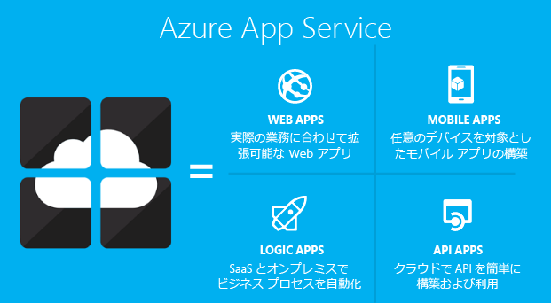
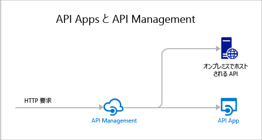

<properties 
	pageTitle="API Apps の概要 | Microsoft Azure" 
	description="Azure App Service を利用して、RESTful API を開発、ホスト、および使用する方法について説明します。" 
	services="app-service\api" 
	documentationCenter=".net" 
	authors="tdykstra" 
	manager="wpickett" 
	editor=""/>

<tags 
	ms.service="app-service-api" 
	ms.workload="web" 
	ms.tgt_pltfrm="na" 
	ms.devlang="na" 
	ms.topic="get-started-article" 
	ms.date="05/03/2016" 
	ms.author="tdykstra"/>

# API Apps の概要

Azure App Service の API アプリは、クラウドとオンプレミスでの API の開発、ホスト、および使用を容易にする機能を提供します。API アプリを使用すると、エンタープライズ レベルのセキュリティ、シンプルなアクセス制御、ハイブリッド接続、SDK の自動生成、および [Logic Apps](../app-service-logic/app-service-logic-what-are-logic-apps.md) とのシームレスな統合を利用できます。

[Azure App Service](../app-service/app-service-value-prop-what-is.md) は、Web、モバイル、および統合シナリオのための完全に管理されたプラットフォームです。API Apps は、[Azure App Service](../app-service/app-service-value-prop-what-is.md) によって提供される 4 種類のアプリの中の 1 つです。

## API Apps を使用する理由

API Apps の主要な機能を次に示します。

- **既存の API をそのまま使用できる** - API Apps を利用するために既存の API のコードを変更する必要はありません。お持ちのコードを API アプリにデプロイするだけです。API では、App Service でサポートされている任意の言語またはフレームワークを使用できます。たとえば、ASP.NET、C#、Java、PHP、Node.js、Python などを使用できます。

- **簡単な利用** - [Swagger API メタデータ](http://swagger.io/)に対するサポートの統合によって、さまざまなクライアントで API を簡単に利用できます。C#、Java、Javascript などのさまざまな言語で API のクライアント コードを自動的に生成します。コードの変更なしで [CORS](app-service-api-cors-consume-javascript.md) を簡単に構成します。詳細については、「[API の検出とコードの生成を行うための App Service API Apps のメタデータ](app-service-api-metadata.md)」と「[CORS を使用して JavaScript から API アプリを使用する](app-service-api-cors-consume-javascript.md)」を参照してください。

- **シンプルなアクセス制御** - コードを変更せずに、API アプリを不正なアクセスから保護します。組み込みの認証サービスでは、他のサービスからのアクセスまたはユーザーを表すクライアントからのアクセスから API をセキュリティで保護します。Azure Active Directory、Facebook、Twitter、Google、Microsoft アカウントなどが、ID プロバイダーとしてサポートされています。クライアントでは、Active Directory 認証ライブラリ (ADAL) または Mobile Apps SDK を使用できます。詳細については、「[Azure App Service での API Apps の認証と承認](app-service-api-authentication.md)」を参照してください。

- **Visual Studio の統合** - Visual Studio の専用ツールを使えば、API アプリを作成、デプロイ、使用、デバッグ、管理する作業が効率的になります。詳細については、[Azure SDK 2.8.1 for .NET の発表に関するページ](/blog/announcing-azure-sdk-2-8-1-for-net/)を参照してください。

- **Logic Apps との統合** - 作成した API アプリは、[App Service Logic Apps](../app-service-logic/app-service-logic-what-are-logic-apps.md) で使用できます。詳細については、「[App Service でホストされたカスタム API のロジック アプリでの使用](../app-service-logic/app-service-logic-custom-hosted-api.md)」と「[新しいスキーマ バージョン 2015-08-01-preview](../app-service-logic/app-service-logic-schema-2015-08-01.md)」を参照してください。

さらに、API アプリでは、[Web Apps](../app-service-web/app-service-web-overview.md) および [Mobile Apps](../app-service-mobile/app-service-mobile-value-prop.md) によって提供される機能を活用することができます。この逆も当てはまります。Web アプリまたはモバイル アプリを使用して API をホストする場合は、Swagger メタデータなどの API Apps の機能を活用してクライアント コードを生成し、CORS を活用してブラウザーのクロス ドメイン アクセスを実行できます。3 つの種類 (API、Web、モバイル) の異なる点は、Azure ポータルでこれらに対して使用する名前とアイコンのみです。

## API Apps と Azure API Management の違い

API Apps と [Azure API Management](../api-management/api-management-key-concepts.md) は補完的なサービスです。

* API Management は API 管理関連のサービスです。API Management フロントエンドを API に配置し、使用率を監視し、調整したり、入力と出力を操作したり、複数の API を 1 つのエンドポイントに統合したりします。管理対象の API は任意の場所でホストできます。
* API Apps は API のホスト関連のサービスです。このサービスには API の開発と使用を支援する機能がありますが、API Management で行うような監視、調整、操作、統合は行いません。API Management の機能が必要ない場合は、API Management を使用せずに API アプリで API をホストできます。

次の図に、API アプリおよび他の場所でホストされる API に対する API Management の使用例を示します。

API Management と API Apps の一部の機能には同じような働きがあります。たとえば、両方とも CORS サポートを自動化できます。2 つのサービスを共に使用する場合、CORS には API Management を使用します。これが API アプリのフロントエンドとして機能するためです。

## 使用の開始

サンプル コードのデプロイによって API Apps の使用を開始するには、使用するフレームワークに対応したチュートリアルを参照してください。

* [ASP.NET](app-service-api-dotnet-get-started.md) 
* [Node.JS](app-service-api-nodejs-api-app.md) 
* [Java](app-service-api-java-api-app.md) 

API アプリに関する質問がある場合は、[API Apps フォーラム](https://social.msdn.microsoft.com/Forums/ja-JP/home?forum=AzureAPIApps)でスレッドを開始します。

<!------HONumber=AcomDC_0511_2016-->