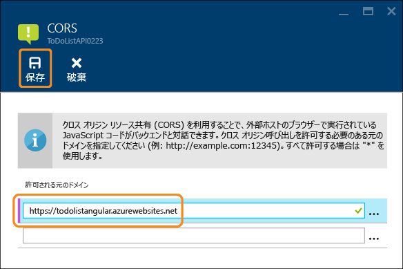

<properties
	pageTitle="CORS を使用して JavaScript から API アプリを使用する | Microsoft Azure"
	description="JavaScript クライアントから、および CORS を使用して Azure App Service の API アプリを使用する方法について説明します"
	services="app-service\api"
	documentationCenter=".net"
	authors="tdykstra"
	manager="wpickett"
	editor=""/>

<tags
	ms.service="app-service-api"
	ms.workload="na"
	ms.tgt_pltfrm="dotnet"
	ms.devlang="na"
	ms.topic="get-started-article"
	ms.date="02/05/2016"
	ms.author="tdykstra"/>

# CORS を使用して JavaScript から API アプリを使用する

## 概要

この記事には 2 つのセクションが含まれます。

* 「[Azure App Service での CORS の構成方法](#corsconfig)」セクションでは、API アプリ用に CORS を構成する一般的な方法について説明します。.NET、Node.js、Java など、App Service でサポートされるすべてのフレームワークに適用されます。 

* [記事の残りの部分](#tutorialstart)では、.NET サンプル アプリケーションをデプロイし、JavaScript のフロントエンドが Web API のバックエンドを呼び出すことができるように CORS を構成する方法について説明します。

##  Azure App Service での CORS の構成方法

### CORS とは

セキュリティ上の理由から、ブラウザーは JavaScript コードが含まれるドメイン以外のドメインに対して、JavaScript が API 呼び出しを行うことを禁止します。たとえば、contoso.com の Web ページから contoso.com API エンドポイントには呼び出しができますが、fabrikam.com エンドポイントには呼び出しができません。クロス オリジン リソース共有 (CORS) は、このようなクロス ドメインの API 呼び出しを行う必要があるシナリオを有効にするように設計されたインターネット プロトコルです。Azure App Service のこのようなシナリオの例として、API が API アプリを実行している間に JavaScript クライアントが Web アプリを実行している場合などがあります。

### App Service における CORS のサポート

App Service には、API アプリの呼び出しを許可するドメインを簡単に構成する仕組みが用意されています。CORS 機能は、API Apps サービスでサポートされるすべての言語で同じように動作します。

### Azure ポータルで CORS を構成する

8. ブラウザーで、[Azure ポータル](https://portal.azure.com/)に移動します。

9. **[参照]、[API Apps]** の順にクリックします。

	

11. 対象の API アプリを選択します。

	

10. **[API アプリ]** ブレードで、**[設定]** をクリックします。

	

11. **[API]** セクションを探し、**[CORS]** をクリックします。

12. テキスト ボックスに、JavaScript の呼び出し元として許可する URL を入力します。

	たとえば、todolistangular という名前の Web アプリに JavaScript アプリケーションをデプロイした場合、「https://todolistangular.azurewebsites.net」と入力します。代わりに、元のドメインをすべて受け入れることを指定するアスタリスク (*) を入力することができます。

13. **[保存]** をクリックします。

	

	**[保存]** をクリックすると、API アプリは、指定した URL からの JavaScript 呼び出しを受け付けるようになります。

### Azure リソース マネージャー ツールを使用して CORS を構成する

Azure PowerShell や Azure クロスプラットフォーム コマンドライン インターフェイスなどのコマンドライン ツール、または[リソース エクスプローラー](https://resources.azure.com/)を使用して、API アプリ用に CORS を構成することもできます。

これらのツールを使用して、<site name>/web リソースの Microsoft.Web/sites/config リソース タイプで `cors` プロパティを設定します。たとえば、**リソース エクスプローラー**から **[subscriptions]、{該当するサブスクリプション}、[resourceGroups]、{該当するリソース グループ}、[providers]、[Microsoft.Web]、[sites]、{該当サイト}、[config]、[web]** の順に移動すると、cors プロパティが表示されます。

		"cors": {
		    "allowedOrigins": [
		        "todolistangular.azurewebsites.net"
		    ]
		}

CORS を構成するための JSON を含んだ Azure リソース マネージャー テンプレートの例については、[サンプル アプリケーション リポジトリにある azuredeploy.json ファイル](https://github.com/azure-samples/app-service-api-dotnet-todo-list/blob/master/azuredeploy.json)を開いてください。

##  .NET 入門チュートリアルの続行

API アプリの Node.js または Java 入門シリーズに従って学習している場合は、次の記事「[Azure App Service での API Apps の認証と承認](app-service-api-authentication.md)」に進みます。

この記事の残りの部分は .NET 入門シリーズの続きであり、[最初のチュートリアル](app-service-api-dotnet-get-started.md)を問題なく完了したことを前提としています。

## 新しい Web アプリに ToDoListAngular プロジェクトをデプロイする

[最初のチュートリアル](app-service-api-dotnet-get-started.md)では、中間層の API アプリとデータ層の API アプリを作成しました。このチュートリアルでは、中間層の API アプリを呼び出す単一ページ アプリケーション (SPA) Web アプリを作成します。SPA を使用するは、中間層 API アプリで CORS を有効にする必要があります。

[ToDoList サンプル アプリケーション](https://github.com/Azure-Samples/app-service-api-dotnet-todo-list)の ToDoListAngular プロジェクトは、中間層の ToDoListAPI Web API プロジェクトを呼び出す簡単な AngularJS クライアントです。*app/scripts/todoListSvc.js* ファイルの JavaScript コードは、AngularJS HTTP プロバイダーを使用して API を呼び出します。

		angular.module('todoApp')
		.factory('todoListSvc', ['$http', function ($http) {
		    var apiEndpoint = "http://localhost:46439";
		
		    $http.defaults.useXDomain = true;
		    delete $http.defaults.headers.common['X-Requested-With']; 
		
		    return {
		        getItems : function(){
		            return $http.get(apiEndpoint + '/api/TodoList');
		        },

		        /* Get by ID, Put, and Delete methods not shown */

		        postItem : function(item){
		            return $http.post(apiEndpoint + '/api/TodoList', item);
		        }
		    };
		}]);

### ToDoListAngular プロジェクト用の新しい Web アプリを作成する

新しい Web アプリを作成してそれにプロジェクトをデプロイする手順は、このシリーズの最初のチュートリアルで示したものと同じです。ただし、**Web アプリ**から **API アプリ**への種類の変更は行いません。

1. **ソリューション エクスプローラー**で ToDoListAngular プロジェクトを右クリックし、**[発行]** をクリックします。

3.  **Web の発行**ウィザードの **[プロファイル]** タブで、**[Microsoft Azure App Service]** をクリックします。

5. **[App Service]** ダイアログ ボックスで、**[新規]** をクリックします。

3. **[App Service の作成]** ダイアログ ボックスの **[ホスティング]** タブで、種類が **[Web アプリ]** になっていることを確認します。

4. *azurewebsites.net* ドメインに固有の **Web アプリの名前** を入力します。

5. 使用する Azure **サブスクリプション**を選択します。

6. **[リソース グループ]** ドロップダウンで、先に作成したものと同じリソース グループを選択します。

4. **[App Service プラン]** ドロップダウンで、先に作成した同じプランを選択します。

7. **[作成]** をクリックします。

	Visual Studio により Web アプリが作成され、その発行プロファイルが作成され、**Web の発行**ウィザードの **[接続]** ステップが表示されます。

	**Web の発行**ウィザードの **[発行]** をクリックする前に、App Service で実行されている中間層の API アプリを呼び出すように新しい Web アプリを構成してください。

### Web アプリの設定で中間層の URL を設定する

1. [Azure ポータル](https://portal.azure.com/)にアクセスし、TodoListAngular (フロント エンド) プロジェクトをホストする目的で作成した Web アプリの **[Web アプリ]** ブレードに移動します。

2. **[設定]、[アプリケーションの設定]** の順にクリックします。

3. **[アプリ設定]** セクションで、次のキーと値を追加します。

	|キー|値|例
	|---|---|---|
	|toDoListAPIURL|https://{your middle tier API app name}.azurewebsites.net|https://todolistapi0121.azurewebsites.net|

4. **[保存]** をクリックします。

	Azure でコードを実行すると、Web.config ファイルにある localhost の URL がこの値で上書きされます。

	設定値を取得するコードは *index.cshtml* にあります。

		
		

	この設定は、*todoListSvc.js* 内のコードで使用されます。

		return {
		    getItems : function(){
		        return $http.get(apiEndpoint + '/api/TodoList');
		    },
		    getItem : function(id){
		        return $http.get(apiEndpoint + '/api/TodoList/' + id);
		    },
		    postItem : function(item){
		        return $http.post(apiEndpoint + '/api/TodoList', item);
		    },
		    putItem : function(item){
		        return $http.put(apiEndpoint + '/api/TodoList/', item);
		    },
		    deleteItem : function(id){
		        return $http({
		            method: 'DELETE',
		            url: apiEndpoint + '/api/TodoList/' + id
		        });
		    }
		};

### 新しい Web アプリに ToDoListAngular Web プロジェクトをデプロイする

*  Visual Studio から **Web の発行**ウィザードの **[接続]** ステップで、**[発行]** をクリックします。

	Visual Studio は、ToDoListAngular プロジェクトを新しい Web アプリにデプロイし、ブラウザーで Web アプリの URL を開きます。

### CORS を有効にしないでアプリケーションをテストする 

2. ブラウザー開発者ツールで、コンソール ウィンドウを開きます。

3. AngularJS UI が表示されているブラウザーのウィンドウで、**[To Do List]** リンクをクリックします。

	JavaScript のコードは中間層 API アプリの呼び出しを試みますが、フロントエンドはバックエンド (API アプリ URL) とは異なるドメイン (Web アプリ URL) で実行しているため、呼び出しは失敗します。ブラウザーの開発者ツールのコンソール ウィンドウには、クロス オリジンのエラー メッセージが表示されます。

	

## Azure App Service で CORS を構成する

このセクションでは、ToDoListAngular プロジェクト用に作成した Web アプリからの JavaScript 呼び出しを許可するように、中間層 API アプリを構成します。
 
8. ブラウザーで、[Azure ポータル](https://portal.azure.com/)に移動します。

9. ToDoListAPI (中間層) API アプリに移動します。

10. **[API アプリ]** ブレードで、**[設定]** をクリックします。

11. **[API]** セクションを探し、**[CORS]** をクリックします。

12. テキスト ボックスに、ToDoListAngular (フロントエンド) Web アプリの URL を入力します。たとえば、todolistangular0121 という名前の Web アプリに ToDoListAngular プロジェクトをデプロイした場合は、URL `https://todolistangular0121.azurewebsites.net` からの呼び出しを許可します。

	代わりに、元のドメインをすべて受け入れることを指定するアスタリスク (*) を入力することができます。

13. **[保存]** をクリックします。

	

### CORS を有効にしてアプリケーションをテストする

* ブラウザーを開き、Web アプリの HTTPS URL に移動します。 

	今度は、アプリケーションで To Do 項目を表示、追加、編集、削除できます。

	

## App Service の CORS と Web API の CORS

Web API プロジェクトでは、[Microsoft.AspNet.WebApi.Cors](https://www.nuget.org/packages/Microsoft.AspNet.WebApi.Cors/) の NuGet パッケージをインストールして、API が JavaScript の呼び出しを受け入れるドメインをコードで指定できます。
 
1 つの API アプリ内で、Web API CORS と App Service CORS の両方を使用しないでください。App Service CORS が優先され、Web API CORS は効果がありません。たとえば、App Service で元のドメインを 1 つ有効にして、Web API コードですべての元のドメインを有効にした場合、Azure API アプリは Azure で指定したドメインからの呼び出しのみを受け付けます。

Web API の CORS サポートは、App Service の CORS サポートよりも柔軟です。たとえば、コード内の異なるアクション メソッドにさまざまな承認済みのオリジンを指定することができます。一方、App Service CORS の場合、すべての API アプリのメソッドに承認済みのオリジンを 1 セット指定します。

### Web API コードで CORS を有効にする方法

次の手順では、Web API の CORS サポートを有効にするためのプロセスを概説します。詳細については、「[Enabling Cross-Origin Requests in ASP.NET Web API 2 (ASP.NET Web API 2 でのクロスオリジン要求の有効化)](http://www.asp.net/web-api/overview/security/enabling-cross-origin-requests-in-web-api)」を参照してください。

1. Web API プロジェクトで、[Microsoft.AspNet.WebApi.Cors](https://www.nuget.org/packages/Microsoft.AspNet.WebApi.Cors/) NuGet パッケージをインストールします。

1. 次の例に示すように、**WebApiConfig** クラスの **Register** メソッドに `config.EnableCors()` のコード行を追加します。

		public static class WebApiConfig
		{
		    public static void Register(HttpConfiguration config)
		    {
		        // Web API configuration and services
	            
		        // The following line enables you to control CORS by using Web API code
		        config.EnableCors();
	
		        // Web API routes
		        config.MapHttpAttributeRoutes();
	
		        config.Routes.MapHttpRoute(
		            name: "DefaultApi",
		            routeTemplate: "api/{controller}/{id}",
		            defaults: new { id = RouteParameter.Optional }
		        );
		    }
		}

1. Web API コントローラーで、`System.Web.Http.Cors` 名前空間に `using` ステートメントを追加し、コントローラー クラスまたは個々のアクション メソッドに `EnableCors` 属性を追加します。次の例では、コントローラー全体に CORS のサポートが適用されます。

		namespace ToDoListAPI.Controllers 
		{
		    [HttpOperationExceptionFilterAttribute]
		    [EnableCors(origins:"*", headers:"*", methods: "*")]
		    public class ToDoListController : ApiController
 
	> **注**: `EnableCors` 属性を持つすべてのパラメーターにワイルドカードを使用しているのはデモンストレーションのみを目的としています。この場合、すべてのオリジンとすべての HTTP 要求に対して API が開かれます。この属性は注意して使用してください。

## 次のステップ 

このチュートリアルでは、クライアントの JavaScript コードが、別のドメイン内の API を呼び出すための App Service の CORS サポートを有効にする方法を説明しました。引き続き API Apps の入門シリーズの記事で、[App Service の API アプリにおける認証](app-service-api-authentication.md)について説明します。

<!---HONumber=AcomDC_0218_2016-->