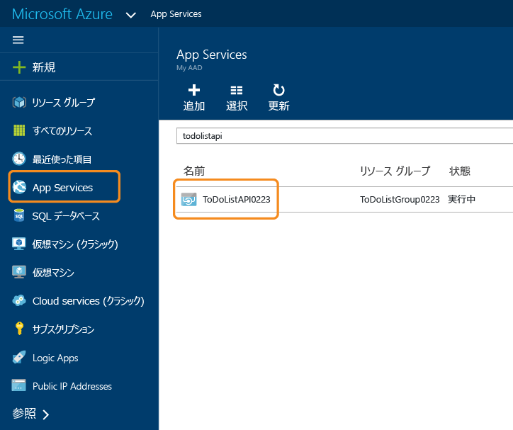
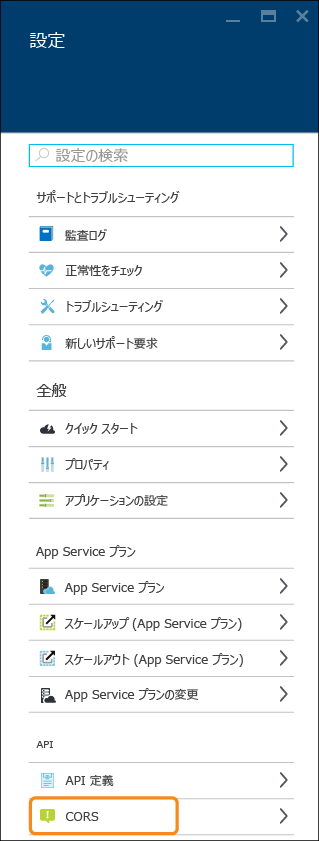
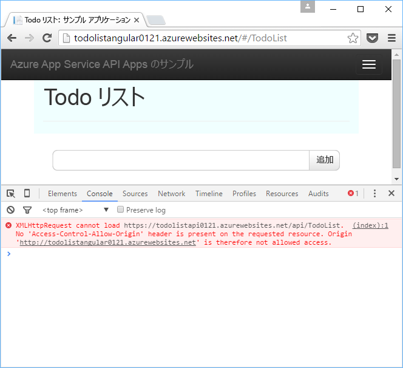
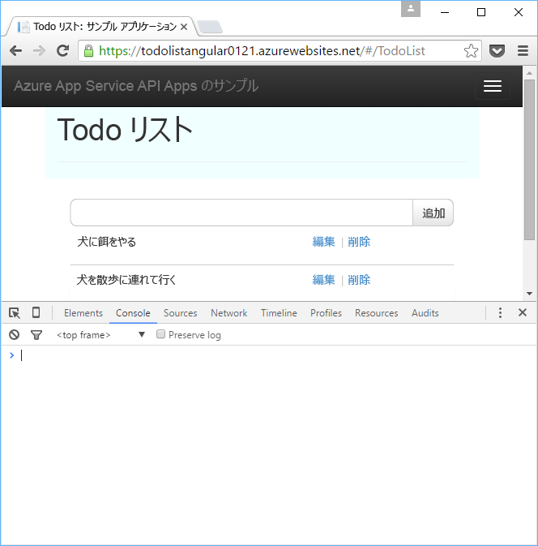

# CORS を使用して JavaScript から API アプリを使用する
App Service では、API アプリでホストされている API を JavaScript クライアントからドメインの境界を越えて呼び出すことができる [クロス オリジン リソース共有 (CORS)](https://en.wikipedia.org/wiki/Cross-origin_resource_sharing)をネイティブでサポートしています。 App Service を利用すると、API でコードを記述することなく API への CORS アクセスを構成することができます。

この記事には&2; つのセクションが含まれます。

* [CORS の構成方法](#corsconfig) に関するセクションでは、API アプリ、Web アプリ、またはモバイル アプリ用に CORS を構成する方法について概要を説明します。 .NET、Node.js、Java など、App Service でサポートされるすべてのフレームワークを対象としています。 
* 「[.NET 入門チュートリアルの続行](#tutorialstart)」セクション以降では、[API Apps の入門チュートリアル シリーズの第&1; 回](app-service-api-dotnet-get-started.md)で作成したアプリを基に、CORS の機能のデモンストレーションを行います。 

##  Azure App Service での CORS の構成方法
CORS は、Azure Portal、または [Azure Resource Manager](../azure-resource-manager/resource-group-overview.md) ツールを使用して構成できます。

#### Azure ポータルで CORS を構成する
1. ブラウザーで、 [Azure ポータル](https://portal.azure.com/)に移動します。
2. **[App Services]**をクリックした後、API アプリの名前をクリックします。
   
    
3. **[API アプリ]** ブレードの右側に表示される **[設定]** ブレードで、**[API]** セクションを探し、**[CORS]** をクリックします。
   
   
4. テキスト ボックスに、JavaScript の呼び出し元として許可する URL を入力します。

    たとえば、todolistangular という名前の Web アプリに JavaScript アプリケーションをデプロイした場合、「https://todolistangular.azurewebsites.net」と入力します。 代わりに、元のドメインをすべて受け入れることを指定するアスタリスク (*) を入力することができます。

1. [ **Save**] をクリックします。
   
   ![[保存] をクリックします。](./media/app-service-api-cors-consume-javascript/corsinportal.png)
   
   **[保存]**をクリックすると、API アプリは、指定した URL からの JavaScript 呼び出しを受け付けるようになります。

#### Azure リソース マネージャー ツールを使用して CORS を構成する
API アプリに使用する CORS は、コマンド ライン ツール ([Azure PowerShell](/powershell/azureps-cmdlets-docs)、[Azure CLI](../cli-install-nodejs.md) など) から [Azure Resource Manager テンプレート](../azure-resource-manager/resource-group-authoring-templates.md)を使って構成することもできます。 

CORS のプロパティを設定する Azure Resource Manager テンプレートの例については、 [このチュートリアルのサンプル アプリケーションのリポジトリにある azuredeploy.json ファイル](https://github.com/azure-samples/app-service-api-dotnet-todo-list/blob/master/azuredeploy.json)を参照してください。 テンプレートに次のようなセクションがあります。

        "cors": {
            "allowedOrigins": [
                "todolistangular.azurewebsites.net"
            ]
        }

##  .NET 入門チュートリアルの続行
API アプリの Node.js または Java の入門シリーズを読んでいる場合は、これで作業が完了しました。 「 [次のステップ](#next-steps) 」セクションに移動し、API Apps についてさらに学習を進めるうえでの推奨事項を確認してください。

この記事の残りの部分は .NET 入門シリーズの続きであり、 [最初のチュートリアル](app-service-api-dotnet-get-started.md)を問題なく完了したことを前提としています。

## 新しい Web アプリに ToDoListAngular プロジェクトをデプロイする
[最初のチュートリアル](app-service-api-dotnet-get-started.md)では、中間層の API アプリとデータ層の API アプリを作成しました。 このチュートリアルでは、中間層の API アプリを呼び出す単一ページ アプリケーション (SPA) Web アプリを作成します。 SPA を使用するには、中間層 API アプリで CORS を有効にする必要があります。 

[ToDoList サンプル アプリケーション](https://github.com/Azure-Samples/app-service-api-dotnet-todo-list)の ToDoListAngular プロジェクトは、中間層の ToDoListAPI Web API プロジェクトを呼び出す簡単な AngularJS クライアントです。 *app/scripts/todoListSvc.js* ファイルの JavaScript コードは、AngularJS HTTP プロバイダーを使用して API を呼び出します。 

        angular.module('todoApp')
        .factory('todoListSvc', ['$http', function ($http) {

            $http.defaults.useXDomain = true;
            delete $http.defaults.headers.common['X-Requested-With']; 

            return {
                getItems : function(){
                    return $http.get(apiEndpoint + '/api/TodoList');
                },

                /* Get by ID, Put, and Delete methods not shown */

                postItem : function(item){
                    return $http.post(apiEndpoint + '/api/TodoList', item);
                }
            };
        }]);

### ToDoListAngular プロジェクト用の新しい Web アプリを作成する
新しい App Service Web アプリを作成し、そのアプリにプロジェクトをデプロイする手順は、 [このシリーズの最初のチュートリアルで API アプリを作成してデプロイする際に示した手順](app-service-api-dotnet-get-started.md#createapiapp)と同様です。 ただしアプリの種類が **API アプリ**ではなく **Web アプリ**になります。  ダイアログのスクリーン ショットについては、次を参照してください。 

1. **ソリューション エクスプローラー**で ToDoListAngular プロジェクトを右クリックし、**[発行]** をクリックします。
2. **Web を発行**ウィザードの **[プロファイル]** タブで、**[Microsoft Azure App Service]** をクリックします。
3. **[App Service]** ダイアログ ボックスで、**[新規]** をクリックします。
4. **[App Service の作成]** ダイアログ ボックスの **[ホスティング]** タブで、*azurewebsites.net* ドメインに一意の **Web アプリ名**を入力します。 
5. 使用する Azure **サブスクリプション** を選択します。
6. **[リソース グループ]** ボックスの一覧で、先に作成したものと同じリソース グループを選択します。
7. **[App Service プラン]** ボックスの一覧で、先に作成した同じプランを選択します。 
8. **[作成]**をクリックします。
   
    Visual Studio により Web アプリが作成され、その発行プロファイルが作成され、**Web を発行**ウィザードの **[接続]** ステップが表示されます。
   
    まだ **[発行]** はクリックしないでください。 次のセクションで、App Service で実行されている中間層の API アプリを呼び出すように新しい Web アプリを構成します。 

### Web アプリの設定で中間層の URL を設定する
1. [Azure ポータル](https://portal.azure.com/)に移動し、TodoListAngular (フロント エンド) プロジェクトをホストする目的で作成した Web アプリの **[Web アプリ]** ブレードに移動します。
2. **[設定]、[アプリケーションの設定]** の順にクリックします。
3. **[アプリ設定]** セクションで、次のキーと値を追加します。
   
   | キー | 値 | 例 |
   | --- | --- | --- |
   | toDoListAPIURL |https://{中間層 API アプリ名}.azurewebsites.net |https://todolistapi0121.azurewebsites.net |
4. [ **Save**] をクリックします。
   
    Azure でコードを実行すると、 *Web.config* ファイルにある localhost の URL がこの値で上書きされます。 
   
    設定値を取得するコードは *index.cshtml*にあります。
   
        
        
   
    この設定は、 *todoListSvc.js* 内のコードで使用されます。
   
        return {
            getItems : function(){
                return $http.get(apiEndpoint + '/api/TodoList');
            },
            getItem : function(id){
                return $http.get(apiEndpoint + '/api/TodoList/' + id);
            },
            postItem : function(item){
                return $http.post(apiEndpoint + '/api/TodoList', item);
            },
            putItem : function(item){
                return $http.put(apiEndpoint + '/api/TodoList/', item);
            },
            deleteItem : function(id){
                return $http({
                    method: 'DELETE',
                    url: apiEndpoint + '/api/TodoList/' + id
                });
            }
        };

### 新しい Web アプリに ToDoListAngular Web プロジェクトをデプロイする
* Visual Studio の **Web を発行**ウィザードの **[接続]** ステップで、**[発行]** をクリックします。
  
   Visual Studio は、ToDoListAngular プロジェクトを新しい Web アプリにデプロイし、ブラウザーで Web アプリの URL を開きます。 

### CORS を有効にしないでアプリケーションをテストする
1. ブラウザー開発者ツールで、コンソール ウィンドウを開きます。
2. AngularJS UI が表示されているブラウザーのウィンドウで、 **[To Do List]** リンクをクリックします。
   
    JavaScript のコードは中間層 API アプリの呼び出しを試みますが、フロントエンドはバックエンドとは異なるドメインで実行しているため、呼び出しは失敗します。 ブラウザーの開発者ツールのコンソール ウィンドウには、クロス オリジンのエラー メッセージが表示されます。
   
    

## 中間層 API アプリ用に CORS を構成する
このセクションでは、中間層の ToDoListAPI API アプリに対して Azure で CORS 設定を構成します。 この設定により、ToDoListAngular プロジェクト用に作成した Web アプリからの JavaScript 呼び出しを、中間層の API アプリで受信できるようになります。

1. ブラウザーで、 [Azure ポータル](https://portal.azure.com/)に移動します。
2. **App Services**をクリックして、ToDoListAPI (中間層) の API アプリをクリックします。
   
    
3. **[API アプリ]** ブレードの右側に表示される **[設定]** ブレードで、**[API]** セクションを探し、**[CORS]** をクリックします。
   
   
4. テキスト ボックスに、ToDoListAngular (フロントエンド) Web アプリの URL を入力します。 たとえば、todolistangular0121 という名前の Web アプリに ToDoListAngular プロジェクトをデプロイした場合は、URL `https://todolistangular0121.azurewebsites.net`からの呼び出しを許可します。
   
   代わりに、元のドメインをすべて受け入れることを指定するアスタリスク (*) を入力することができます。
5. [ **Save**] をクリックします。
   
   ![[保存] をクリックします。](./media/app-service-api-cors-consume-javascript/corsinportal.png)
   
   **[保存]**をクリックすると、API アプリは、指定した URL からの JavaScript 呼び出しを受け付けるようになります。 このスクリーン ショットでは、ToDoListAPI0223 API アプリは ToDoListAngular Web アプリから JavaScript クライアントの呼び出しを受け入れています。

### CORS を有効にしてアプリケーションをテストする
* ブラウザーを開き、Web アプリの HTTPS URL に移動します。 
  
    今度は、アプリケーションで To Do 項目を表示、追加、編集、削除できます。 
  
    

## App Service の CORS と Web API の CORS
Web API プロジェクトでは、 [Microsoft.AspNet.WebApi.Cors](https://www.nuget.org/packages/Microsoft.AspNet.WebApi.Cors/) の NuGet パッケージをインストールして、API が JavaScript の呼び出しを受け入れるドメインをコードで指定できます。

Web API の CORS サポートは、App Service の CORS サポートよりも柔軟です。 たとえば、コード内の異なるアクション メソッドにさまざまな承認済みのオリジンを指定することができます。一方、App Service CORS の場合、すべての API アプリのメソッドに承認済みのオリジンを&1; セット指定します。

> [!NOTE]
> 1 つの API アプリ内で、Web API CORS と App Service CORS の両方を使用しないでください。 App Service CORS が優先され、Web API CORS は効果がありません。 たとえば、App Service で元のドメインを&1; つ有効にして、Web API コードですべての元のドメインを有効にした場合、Azure API アプリは Azure で指定したドメインからの呼び出しのみを受け付けます。
> 
> 

### Web API コードで CORS を有効にする方法
次の手順では、Web API の CORS サポートを有効にするためのプロセスを概説します。 詳細については、「 [Enabling Cross-Origin Requests in ASP.NET Web API 2 (ASP.NET Web API 2 でのクロスオリジン要求の有効化)](http://www.asp.net/web-api/overview/security/enabling-cross-origin-requests-in-web-api)」を参照してください。

1. Web API プロジェクトで、 [Microsoft.AspNet.WebApi.Cors](https://www.nuget.org/packages/Microsoft.AspNet.WebApi.Cors/) NuGet パッケージをインストールします。
2. 次の例に示すように、**WebApiConfig** クラスの **Register** メソッドに `config.EnableCors()` のコード行を追加します。 
   
        public static class WebApiConfig
        {
            public static void Register(HttpConfiguration config)
            {
                // Web API configuration and services
   
                // The following line enables you to control CORS by using Web API code
                config.EnableCors();
   
                // Web API routes
                config.MapHttpAttributeRoutes();
   
                config.Routes.MapHttpRoute(
                    name: "DefaultApi",
                    routeTemplate: "api/{controller}/{id}",
                    defaults: new { id = RouteParameter.Optional }
                );
            }
        }
3. Web API コントローラーで、`System.Web.Http.Cors` 名前空間に `using` ステートメントを追加し、コントローラー クラスまたは個々のアクション メソッドに `EnableCors` 属性を追加します。 次の例では、コントローラー全体に CORS のサポートが適用されます。
   
        namespace ToDoListAPI.Controllers 
        {
            [HttpOperationExceptionFilterAttribute]
            [EnableCors(origins:"https://todolistangular0121.azurewebsites.net", headers:"accept,content-type,origin,x-my-header", methods: "get,post")]
            public class ToDoListController : ApiController

## API アプリでの Azure API Management の使用
API アプリで Azure API Management を使用する場合は、API アプリではなく API Management で CORS を構成してください。 詳細については、次のリソースを参照してください。

* [Azure API Management Overview (Azure API Management の概要) (ビデオ。CORS の部分は 12:10 から)](https://azure.microsoft.com/documentation/videos/azure-api-management-overview/)
* [API Management cross domain policies (API Management のクロス ドメイン ポリシー)](https://msdn.microsoft.com/library/azure/dn894084.aspx#CORS)

## トラブルシューティング
このチュートリアルの途中で問題が発生した場合に備えて、ここではトラブルシューティングの方法をいくつか紹介します。

* 最新バージョンの [Visual Studio 2015 向け Azure SDK for .NET](http://go.microsoft.com/fwlink/?linkid=518003)を使用していることを確認します。
* CORS 設定で「`https`」を入力したことを確認し、さらに `https` を使用してフロントエンド Web アプリを実行していることを確認します。
* フロントエンドの Web アプリではなく中間層の API アプリで CORS 設定を入力したことを確認します。
* アプリケーション コードと Azure App Service の両方で CORS の設定を行っている場合、App Service の CORS 設定が、アプリケーション コードのどのような設定よりも優先されることに注意してください。 

トラブルシューティングを効率化する Visual Studio の機能の詳細については、 [Visual Studio での Azure App Service アプリのトラブルシューティング](../app-service-web/web-sites-dotnet-troubleshoot-visual-studio.md)に関するページを参照してください。

## 次のステップ
この記事では、クライアントの JavaScript コードが、別のドメイン内の API を呼び出すための App Service の CORS サポートを有効にする方法を説明しました。 API アプリの詳細については、[App Service での認証についての概要](../app-service/app-service-authentication-overview.md)を確認してから、[API アプリのユーザー認証](app-service-api-dotnet-user-principal-auth.md)のチュートリアルに進んでください。

