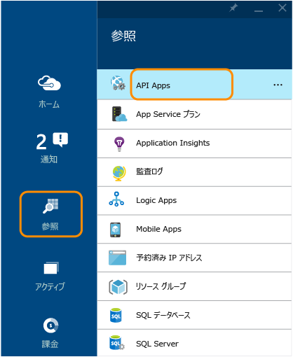
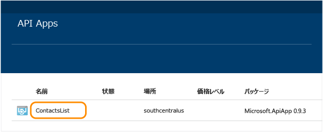
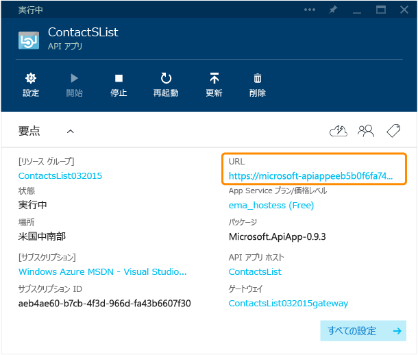
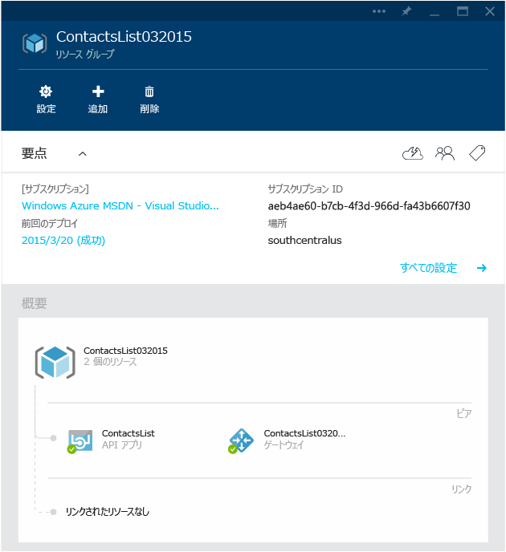
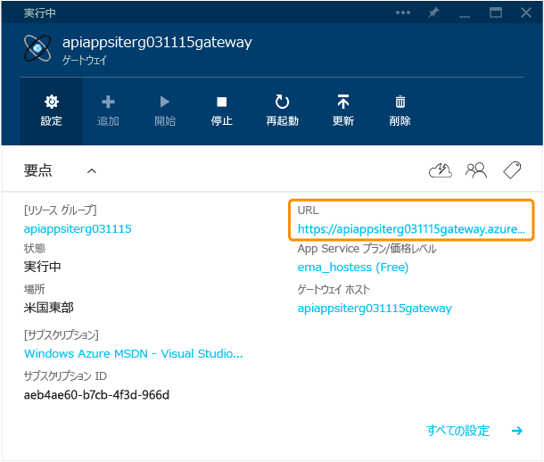
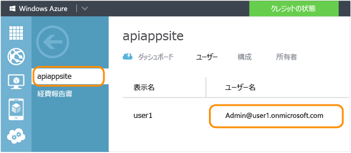
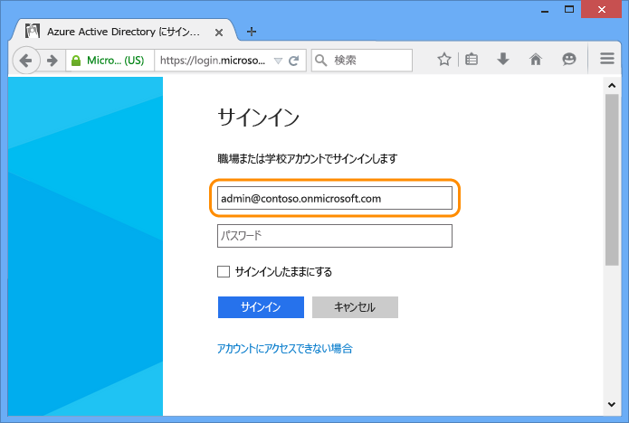
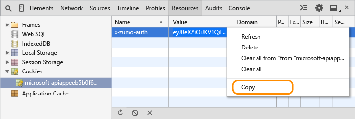

<properties 
	pageTitle="Azure API アプリの保護" 
	description="Visual Studio を使用して Azure API アプリを保護する方法について説明します。" 
	services="app-service\api" 
	documentationCenter=".net" 
	authors="tdykstra" 
	manager="wpickett" 
	editor="jimbe"/>

<tags 
	ms.service="app-service-api" 
	ms.workload="web" 
	ms.tgt_pltfrm="dotnet" 
	ms.devlang="na" 
	ms.topic="article" 
	ms.date="06/26/2015" 
	ms.author="tdykstra"/>

# API アプリの保護: Azure Active Directory またはソーシャル プロバイダーの認証の追加

## 概要

このチュートリアルでは、認証されたユーザーのみがアクセスできるように API アプリを保護する方法を示します。さらに、ASP.NET API アプリで使用できる、ログオンしているユーザーに関する情報を取得するためのコードも紹介します。

以下の手順を実行します。

- API アプリを呼び出して、動作していることを確認します。
- API アプリに認証ルールを適用します。
- API アプリをもう一度呼び出して、認証されていない要求が拒否されることを確認します。
- 構成したプロバイダーにログインします。
- API アプリをもう一度呼び出して、認証されたアクセスが機能することを確認します。
- ログオン ユーザーの要求を取得するコードを作成してテストします。

Azure App Service での認証の詳細については、[API Apps と Mobile Apps の認証](../app-service/app-service-authentication-overview.md)に関するページを参照してください。

## 前提条件

このチュートリアルでは、「[API アプリの作成](app-service-dotnet-create-api-app.md)」で作成し、「[API アプリのデプロイ](app-service-dotnet-deploy-api-app.md)」でデプロイした API アプリを使用します。

## ブラウザーを使用した API アプリの呼び出し 

API アプリにパブリックにアクセスできることを確認する最も簡単な方法は、ブラウザーから呼び出すことです。

1. ブラウザーで、[Azure プレビュー ポータル]に移動します。

3. ホーム ページで **[参照]、[API Apps]** の順にクリックし、次に、保護する API アプリの名前をクリックします。

	

	

3. **[API アプリ]** ブレードで、API アプリを呼び出すブラウザーのウィンドウを開くための **URL** をクリックします。

	

2. ブラウザーのアドレス バーに表示されている URL に `/api/contacts/get/` を追加します。

	たとえば、次の URL が API アプリの URL だとします。

    	https://microsoft-apiappeeb5bdsasd744e188be7fa26f239bd4b.azurewebsites.net/

	最終的な URL は次のようになります。

    	https://microsoft-apiappeeb5bdsasd744e188be7fa26f239bd4b.azurewebsites.net/api/contacts/get/

	API 呼び出しの処理方法は、ブラウザーによって異なります。次の図は、Chrome ブラウザーからの呼び出しが成功したようすを示しています。

	

2. 使用した URL は、このチュートリアルの後半でもう一度使用するため、保存してください。

## API アプリの保護

API アプリをデプロイしたときに、リソース グループにデプロイしました。Web アプリと他の API アプリを同じリソース グループに追加することができます。リソース グループ内の各 API アプリには、次の 3 種類のアクセス レベルのいずれかを設定することができます。<!--todo: diagram showing different accessibility settings-->

- **パブリック (匿名)** - すべてのユーザーがログインせずにリソース グループの外部から API アプリを呼び出すことができます。
- **パブリック (認証済み)** - 認証されたユーザーのみがリソース グループの外部から API アプリを呼び出すことができます。
- **内部** - 同一リソース グループに属する他の API アプリのみが API アプリを呼び出すことができます (Web アプリからの呼び出しは、Web アプリが同じリソース グループにある場合でも外部と見なさます)。

Visual Studio でリソース グループが作成されたときに、*ゲートウェイ*も作成されました。ゲートウェイは、リソース グループ内の API アプリ宛てのすべての要求を処理する、専用の Web アプリです。

[Azure プレビュー ポータル]でリソース グループのブレードに移動すると、図の API アプリとゲートウェイを確認できます。

### 認証を要求するように API アプリを構成する

認証された要求のみを受け入れるように API アプリを構成するには、API アプリのアクセス レベルを**[パブリック (認証済み)]** に設定します。さらに、Azure Active Directory、Google、Facebook などのプロバイダーからの認証を必要とするようにゲートウェイを構成します。

[AZURE.INCLUDE [app-service-api-config-auth](../../includes/app-service-api-config-auth.md)]

これで、認証されていないアクセスから API アプリが保護されます。次に、ゲートウェイを構成して、使用する認証プロバイダーを指定する必要があります。

### 認証プロバイダーを使用するようにゲートウェイを構成する

[AZURE.INCLUDE [app-service-api-gateway-config-auth](../../includes/app-service-api-gateway-config-auth.md)]

## 認証の動作の確認

**注:** 次の手順を実行する際にログインで問題が発生した場合は、プライベートまたは匿名でウィンドウを開いてみてください。
 
1. ブラウザーのウィンドウを開き、アドレス バーに、API アプリの `Get` メソッドを呼び出す URL を、先ほどと同様に入力します。

	今回は、API アプリへのアクセスを試みると、エラー メッセージが表示されます。

	

2. ブラウザーで、次のログイン URL に移動します。URL のパターンは次のとおりです。

    	http://[gatewayurl]/login/[providername]

	[Azure プレビュー ポータル]の **[ゲートウェイ]** ブレードで、ゲートウェイの URL を取得することができます (**[ゲートウェイ]** ブレードにアクセスするには、**[リソース グループ]** ブレードに表示される図内のゲートウェイをクリックします)。

	

	[providername] には、次の値のいずれかを指定する必要があります。
	
	* "microsoftaccount"
	* "facebook"
	* "twitter"
	* "google"
	* "aad"

	Azure Active Directory のサンプルのログイン URL を次に示します。

		https://dropboxrgaeb4ae60b7cb4f3d966dfa43.azurewebsites.net/login/aad/

	先ほどの URL とは異なり、今回は API アプリの名前が含まれていないことに注目してください。ゲートウェイは API アプリではなく、ユーザーを認証しています。ゲートウェイは、リソース グループ内のすべての API アプリの認証を処理します。

3. ブラウザーにログイン ページが表示されたら資格情報を入力します。
 
	Azure Active Directory のログインを構成している場合は、[Azure ポータル]の [Azure Active Directory] タブで作成したアプリケーションの **[ユーザー]** タブに一覧表示されているユーザー名から、admin@contoso.onmicrosoft.com などいずれかを選んで使用します。

	

	

4. "ログインが完了しました" というメッセージが表示されたら、API アプリの Get メソッドの URL をもう一度入力します。

	今回は認証済みであるため、呼び出しは成功します。ゲートウェイは、ユーザーが認証されたユーザーであると認識し、ユーザーの要求を API アプリに渡します。

	

	

	Swagger UI を有効にしている場合、Swagger UI ページにも移動できるようになりました。ただし、ページの右下隅に赤い**エラー** アイコンが表示されます。このアイコンをクリックすると、Swagger JSON ファイルにアクセスできないことを示すメッセージが表示されます。これは、Swagger で Zumo トークンを含めずに AJAX を呼び出し、JSON ファイルを取得しようとすることが原因です。これは、Swagger UI ページの動作を妨げません。

## Postman を使用した Post 要求の送信

ゲートウェイにログインすると、ゲートウェイは認証トークンを返信します。このトークンは、ゲートウェイを経由する外部のソースからのすべての要求に含まれている必要があります。ブラウザーで API にアクセスすると、通常、ブラウザーはトークンを cookie に格納し、後続のすべての呼び出しと共にこのトークンを API に送信します。

このため、バックグラウンドで行われている処理を確認することができます。チュートリアルこのセクションでは、ブラウザー ツールを使用して Post 要求を作成および送信し、cookie から認証トークンを取得して HTTP ヘッダーに含めます。このセクションは省略可能です。前のセクションで既に、API アプリが認証済みアクセスのみを受け付けることを検証済みです。

以下の手順では、Chrome ブラウザーで Postman ツールを使用する方法を示していますが、任意の REST クライアント ツールとブラウザー開発者ツールでもこれと同じ操作を実行できます。

1. Chrome ブラウザーのウィンドウで、前のセクションで示した認証の手順を実行してから、開発者ツールを開きます (F12)。

	![[リソース] タブに移動](./media/app-service-api-dotnet-add-authentication/resources.png)

3. Chrome 開発者ツールの **[リソース]** タブで、ゲートウェイの cookie を検索します。**x-zumo-auth** cookie のすべての値をトリプルクリックして選択します。

	**注:** cookie のすべての値を必ず取得してください。ダブルクリックでは、最初の部分しか取得されません。

5. **x-zumo-auth** cookie の **[値]** を右クリックし、**[コピー]** をクリックします。

	

4. Postman 拡張機能をまだ Chrome ブラウザーにインストールしていない場合は、インストールします。

6. Postman 拡張機能を開きます。

7. 要求 URL のフィールドに、先ほど使用した、API アプリの Get メソッドの URL を入力しますが、末尾の `get/` は省略します。
 
		http://[apiappurl]/api/contacts
    
8. **[ヘッダー]** をクリックし、*x-zumo-auth* ヘッダーを追加します。クリップボードからトークンの値を **[値]** フィールドに貼り付けます。

9. *Content-Type* ヘッダーに値 *application/json* を追加します。

10. **form-data** をクリックし、*contact* キーを追加して、次の値を指定します。

		{   "Id": 0,   "Name": "Li Yan",   "EmailAddress": "yan@contoso.com" }

11. [送信] をクリックします。

	API アプリは、応答 *201 Created* を返します。

	

12. この要求が認証トークンなしでは実行されないことを確認するために、認証ヘッダーを削除してから、もう一度 [送信] をクリックします。

	応答 *403 Forbidden* が返されます。

	

## ログオンしているユーザーに関する情報の取得

このセクションでは、ログオン ユーザーの名前と電子メール アドレスを取得して返すように ContactsList API アプリのコードを変更します。

1. Visual Studio で、[API アプリのデプロイ](app-service-dotnet-deploy-api-app.md)に関するトピックでデプロイした、このチュートリアルで必要な API アプリ プロジェクトを開きます。

3. apiapp.json ファイルを開き、API アプリで Azure Active Directory 認証を使用することを示す行を追加します。

		"authentication": [{"type": "aad"}]

	最終的な apiapp.json ファイルは、次の例のようになります。

		{
		    "$schema": "http://json-schema.org/schemas/2014-11-01/apiapp.json#",
		    "id": "ContactsList",
		    "namespace": "microsoft.com",
		    "gateway": "2015-01-14",
		    "version": "1.0.0",
		    "title": "ContactsList",
		    "summary": "",
		    "author": "",
		    "endpoints": {
		        "apiDefinition": "/swagger/docs/v1",
		        "status": null
		    },
		    "authentication": [{"type": "aad"}]
		}

	このチュートリアルでは、例として Azure Active Directory を使用しています。その他のプロバイダーについては、適切な識別子を使用します。有効なプロバイダー値を次に示します。

	* "aad"
	* "microsoftaccount"
	* "google"
	* "twitter"
	* "facebook" 

2. *ContactsController.cs* ファイルで、`Get` メソッドのコードを次のコードで置き換えます。

		var runtime = Runtime.FromAppSettings(Request);
		var user = runtime.CurrentUser;
		TokenResult token = await user.GetRawTokenAsync("aad");
		var name = (string)token.Claims["name"];
		var email = (string)token.Claims["http://schemas.xmlsoap.org/ws/2005/05/identity/claims/upn"];
		return new Contact[]
		{
		    new Contact { Id = 1, EmailAddress = email, Name = name }
		};

	このコードは、3 つのサンプルの連絡先ではなく、ログオン ユーザーの連絡先情報を返します。

	サンプル コードでは、Azure Active Directory を使用しています。その他のプロバイダーについては、前の手順に示すように、適切なトークン名と要求識別子を使用します。

	使用できる Azure Active Directory の要求については、[サポートされているトークンと要求の種類](https://msdn.microsoft.com/library/dn195587.aspx)に関するページを参照してください。

3. `Microsoft.Azure.AppService.ApiApps.Service` の using ステートメントを追加します。

		using Microsoft.Azure.AppService.ApiApps.Service;

3. プロジェクトを再デプロイします。

	Visual Studio は、[デプロイ](app-service-dotnet-deploy-api-app.md)に関するチュートリアルに従ってプロジェクトをデプロイしたときの設定を使用します。プロジェクトを右クリックし、**[発行]** をクリックします。次に、**[Web の発行]** ダイアログの **[発行]** をクリックします。

6. 保護されている API アプリに Get 要求を送信したときの手順に従います。

	応答メッセージに、ログインするときに使用したユーザーの名前と ID が表示されます。

	

## 次のステップ

ここまでは、Azure Active Directory またはソーシャル プロバイダーの認証を必要とすることによって Azure API アプリを保護する方法について説明しました。詳細については、[API Apps と Mobile Apps の認証](../app-service/app-service-authentication-overview.md)に関するページを参照してください。

[Azure ポータル]: https://manage.windowsazure.com/
[Azure プレビュー ポータル]: https://portal.azure.com/

<!---HONumber=July15_HO3-->