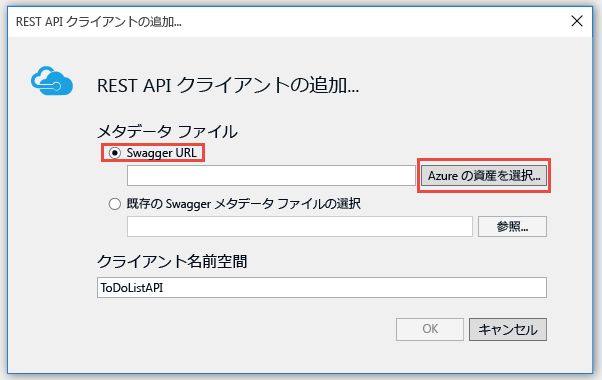

<properties
	pageTitle="App Service で API Apps と ASP.NET を使用する | Microsoft Azure"
	description="Visual Studio 2015 を使用して、Azure App Service で ASP.NET API アプリを作成、デプロイし、使用する方法について説明します。"
	services="app-service\api"
	documentationCenter=".net"
	authors="tdykstra"
	manager="wpickett"
	editor=""/>

<tags
	ms.service="app-service-api"
	ms.workload="na"
	ms.tgt_pltfrm="dotnet"
	ms.devlang="na"
	ms.topic="hero-article"
	ms.date="03/09/2016"
	ms.author="tdykstra"/>

# Azure App Service で API Apps と ASP.NET を使用する

[AZURE.INCLUDE [セレクター](../../includes/app-service-api-get-started-selector.md)]

## 概要

RESTful API の開発とホストに役立つ Azure App Service の機能の使用方法を説明するチュートリアル シリーズの第 1 回です。

* API メタデータの統合サポート
* CORS のサポート
* 認証と承認のサポート

サンプル アプリケーションを [API アプリ](app-service-api-apps-why-best-platform.md)と Azure App Service の Web アプリという 2 つのアプリにデプロイします。サンプル アプリは to-do リストです。AngularJS シングル ページ アプリケーション (SPA) のフロント エンド、ASP.NET Web API の中間層、ASP.NET Web API データ層があります。

次の図は、SPA フロント エンドのスクリーン ショットです。

このチュートリアルを完了すると、2 つの Web API が完成し、App Service API アプリで実行できるようになります。このチュートリアルを完了した後は、App Service Web アプリの SPA を使用し、クラウドでアプリケーション全体を実行します。以降のチュートリアルでは、認証と承認を追加します。

## 学習内容

このチュートリアルでは、次のことについて説明します。

* Visual Studio 2015 に組み込まれたツールを利用し、Azure App Service で API アプリと Web アプリを使用する方法。
* Swashbuckle NuGet パッケージを利用して API 検出を自動化し、Swagger API 定義 JSON を動的に生成する方法。
* 自動的に生成されたクライアント コードを使用し、.NET クライアントから API アプリを使用する方法。
* Azure ポータルを使用し、API アプリ メタデータのエンドポイントを構成する方法。

## 前提条件

[AZURE.INCLUDE [前提条件](../../includes/app-service-api-dotnet-get-started-prereqs.md)]

## サンプル アプリケーションのダウンロード 

1. [Azure-Samples/app-service-api-dotnet-to-do-list](https://github.com/Azure-Samples/app-service-api-dotnet-todo-list) リポジトリをダウンロードします。

	**[Download ZIP]** (ZIP のダウンロード) ボタンをクリックするか、ローカル コンピューターのリポジトリを複製します。

2. Visual Studio 2015 または 2013 で ToDoList ソリューションを開きます。

	この Visual Studio ソリューションは、説明と所有者で構成されるシンプルな to-do 項目を操作するサンプル アプリケーションです。

		public class ToDoItem 
		{ 
		    public int ID { get; set; } 
		    public string Description { get; set; } 
		    public string Owner { get; set; } 
		} 
 
	ソリューションには、3 つのプロジェクトが含まれています。

	

	* **ToDoListAngular** - フロントエンド: 中間層を呼び出す AngularJS SPA。 

	* **ToDoListAPI** - 中間層: to-do 項目に対して CRUD 操作を実行するデータ層を呼び出す ASP.NET Web API プロジェクト。

	* **ToDoListDataAPI** - データ層: to-do 項目に対して CRUD 操作を実行する ASP.NET Web API プロジェクト。to-do 項目はメモリに格納されます。つまり、アプリケーションを再起動するたびに、すべての変更は消去されます。

	データ層を呼び出すと、中間層から `Owner` フィールドにユーザー ID が渡されます。ダウンロード時のコードでは、ユーザー ID は常に "*" です。今後のチュートリアルで認証を追加すると、中間層からデータ層に実際のユーザー ID が渡されます。

2. ソリューションをビルドし、NuGet パッケージを復元します。

### 省略可能: アプリケーションをローカルで実行する

このセクションでは、クライアントをローカルで実行でき、API もローカルで実行されている間にはこれを呼び出すことができることを確認します。

**注:** これらのブラウザーでは、`http://localhost` の URL に対してクロス オリジン JavaScript の呼び出しを許可するため、これらの手順を Internet Explorer と Edge ブラウザーに使用できます。Chrome を使用している場合は、`--disable-web-security` スイッチでブラウザーを起動します。Firefox を使用している場合は、このセクションをスキップします。

1. 3 つのプロジェクトすべてをスタートアップ プロジェクトとして設定します。実行順序は ToDoListDataAPI、ToDoListAPI、ToDoListAngular です(**ソリューション エクスプローラー**でソリューションを右クリックして **[プロパティ]** をクリックし、**[マルチ スタートアップ プロジェクト]** を選択して、正しい順序でプロジェクトを設定し、各プロジェクトの **[アクション]** を **[開始]** に設定します)。  

2. F5 キーを押してプロジェクトを開始します。

	3 つのブラウザー ウィンドウが開きます。2 つのブラウザー ウィンドウに HTTP 403 エラー ページ (ディレクトリの参照は許可されない) が表示されますが、これは Web API プロジェクトでは正常な動作です。3 つ目のブラウザー ウィンドウに AngularJS の UI が表示されます。

3. AngularJS UI が表示されているブラウザーのウィンドウで、**[To Do List]** タブをクリックします。

	UI には、2 つの既定の to-do 項目が表示されます。

	

4. to-do 項目を追加、編集、削除して、アプリケーションの動作を確認します。

	すべての変更内容はメモリに保存され、アプリケーションを再起動すると消去されます。

3. ブラウザー ウィンドウを閉じます。

## Swagger のメタデータと UI の使用

[Swagger 2.0](http://swagger.io/) API メタデータのサポートは、Azure App Service に組み込まれています。それぞれの API アプリで、API のメタデータを Swagger の JSON 形式で返す URL エンドポイントを指定できます。そのエンドポイントから返されたメタデータを使用して、クライアント コードを生成できます。

Swagger のメタデータは、ASP.NET Web API プロジェクトで [Swashbuckle](https://www.nuget.org/packages/Swashbuckle) NuGet パッケージを使って動的に生成できます。Swashbuckle NuGet パッケージは、ダウンロードした ToDoListDataAPI プロジェクトと ToDoListAPI プロジェクトにあらかじめインストールされています。

チュートリアルのこのセクションでは、生成した Swagger 2.0 メタデータを確認し、Swagger メタデータに基づいてテスト UI を試します。

2. スタートアップ プロジェクトとして ToDoListDataAPI プロジェクトを設定します。 
 
4. F5 キーを押してデバッグ モードでプロジェクトを実行します。

	ブラウザーが開き、HTTP 403 エラー ページが表示されます。

12. ブラウザーのアドレス バーで、行の末尾に `swagger/docs/v1` を追加し、Return を押します。(URL は `http://localhost:45914/swagger/docs/v1` です。)

	これは API の Swagger 2.0 JSON メタデータを返すために Swashbuckle で使用される既定の URL です。

	Internet Explorer を使用している場合、*v1.json* ファイルをダウンロードするように求められます。

	

	Chrome、Firefox、または Edge を使用している場合、ブラウザーのウィンドウで JSON が表示されます。

	

	次の例は、API の Swagger メタデータの最初のセクションと Get メソッドの定義です。このメタデータに基づき、次の手順とチュートリアルの後半で使用する Swagger UI はクライアント コードを自動生成します。

		{
		  "swagger": "2.0",
		  "info": {
		    "version": "v1",
		    "title": "ToDoListDataAPI"
		  },
		  "host": "localhost:45914",
		  "schemes": [ "http" ],
		  "paths": {
		    "/api/ToDoList": {
		      "get": {
		        "tags": [ "ToDoList" ],
		        "operationId": "ToDoList_GetByOwner",
		        "consumes": [ ],
		        "produces": [ "application/json", "text/json", "application/xml", "text/xml" ],
		        "parameters": [
		          {
		            "name": "owner",
		            "in": "query",
		            "required": true,
		            "type": "string"
		          }
		        ],
		        "responses": {
		          "200": {
		            "description": "OK",
		            "schema": {
		              "type": "array",
		              "items": { "$ref": "#/definitions/ToDoItem" }
		            }
		          }
		        },
		        "deprecated": false
		      },

1. ブラウザーを閉じます。

3. **ソリューション エクスプローラー**の ToDoListDataAPI プロジェクトで、*App\_Start\\SwaggerConfig.cs* ファイルを開き、次のコードまで下にスクロールし、そのコメントを解除します。

		/*
		    })
		.EnableSwaggerUi(c =>
		    {
		*/

	*SwaggerConfig.cs* ファイルは、プロジェクトに Swashbuckle パッケージをインストールするときに作成されます。このファイルでは、さまざまな方法で Swashbuckle を構成できます。

	コメントを解除したコードにより、以降の手順で使用する Swagger UI が有効になります。API アプリ プロジェクト テンプレートを使用して Web API プロジェクトを作成すると、既定では、セキュリティ対策としてこのコードはコメントアウトされています。

5. プロジェクトを再度実行します。

3. ブラウザーのアドレス バーで、行の末尾に `swagger` を追加し、Return を押します。(URL は `http://localhost:45914/swagger` です。)

4. Swagger UI ページが表示されたら、**[ToDoList]** をクリックし、利用できるメソッドを確認します。

	

5. **[Get]** をクリックします。

6. `owner` パラメーターの値にアスタリスク (*) を入力し、**[Try it out]** をクリックします。

	

	Swagger UI から ToDoList Get メソッドが呼び出され、応答コードと JSON 結果が表示されます。

	

6. **[Post]** をクリックし、**[モデル スキーマ]** の下にあるボックスをクリックします。

	モデル スキーマをクリックすると、入力ボックスに事前入力されます。このボックスには、Post メソッドのパラメーター値を指定できます。Internet Explorer で動作しない場合は、別のブラウザーを使用するか、次の手順でパラメーター値を手動で入力します。

	

7. `contact` パラメーター入力ボックスの JSON を次の例のように変更するか、独自の説明文に書き換えます。

		{
		  "ID": 2,
		  "Description": "buy the dog a toy",
		  "Owner": "*"
		}

10. **[試してみる]** をクリックします。

	ToDoList API から、成功を示す HTTP 204 応答コードが返されます。

11. **[Get]、[実際に使ってみる]** を順にクリックします。

	Get メソッドの応答に、新しい to-do 項目が含まれるようになります。

12. Put、Delete、Get by ID メソッドも試します。

14. ブラウザーを閉じます。

Swashbuckle はあらゆる ASP.NET Web API プロジェクトで利用できます。Swagger メタデータ生成を既存のプロジェクトに追加する場合、Swashbuckle パッケージをインストールします。

**注: ** Swagger のメタデータには、各 API 操作の一意の ID が含まれます。既定では、Web API コントローラー メソッドに対して重複する Swagger 操作 ID が Swashbuckle によって生成される場合があります。この現象は、コントローラーに HTTP メソッドのオーバーロード (`Get()` と `Get(id)` など) が存在すると発生します。オーバーロードの扱い方については、「[Swashbuckle が生成する API 定義をカスタマイズする](app-service-api-dotnet-swashbuckle-customize.md)」を参照してください。Visual Studio から Azure API アプリ テンプレートを使って Web API プロジェクトを作成した場合、一意の操作 ID を生成するコードが *SwaggerConfig.cs* ファイルに自動的に追加されます。

## Azure で API アプリを作成して ToDoListAPI プロジェクトをデプロイする

このセクションでは、Visual Studio の **Web の発行**ウィザードに統合されている Azure ツールを使用し、Azure で新しい API アプリを作成します。次に、ToDoListDataAPI プロジェクトを新しい API アプリにデプロイし、今度はクラウドで実行中に Swagger UI を再実行して API を呼び出します。

1. **ソリューション エクスプローラー**で ToDoListDataAPI プロジェクトを右クリックし、**[発行]** をクリックします。

	

3.  **Web の発行**ウィザードの **[プロファイル]** ステップで、**[Microsoft Azure App Service]** をクリックします。

	

4. まだ行っていない場合は Azure アカウントにサインインし、有効期限が切れている場合は資格情報を更新します。

4. [App Service] ダイアログ ボックスで、使用する Azure **サブスクリプション**を選択して、**[新規]** をクリックします。

	

	**[App Service の作成]** ダイアログ ボックスの **[ホスティング]** タブが表示されます。

	デプロイの対象は、Swashbuckle がインストールされている Web API プロジェクトであるため、API アプリを作成する前提の画面になります。**API アプリ名**というタイトルが表示され、**[種類の変更]** ドロップダウン リストが **[API アプリ]** に設定されています。

	

	 新しく作成した API アプリ、Web アプリ、モバイル アプリで利用できる機能は、アプリの種類によって変わるわけではありません。チュートリアルで紹介する API アプリの全機能を 3 種類のアプリすべてで利用できます。違うのは、Azure ポータルに表示されるアプリの種類を示すアイコンとテキスト、ポータル内の一部のページにおける機能の表示順だけです。Azure ポータルは、Azure のリソースを管理するための Web インターフェイスです。このチュートリアルの後半で使用します。

	このチュートリアルでは、SPA フロントエンドは Web アプリで実行され、各 Web API バックエンドは API アプリで実行されていますが、3 つすべてが Web アプリである場合、または 3 つすべてが API アプリである場合は、すべての要素が同じように機能します。また、1 つの API アプリまたは Web アプリが SPA フロントエンドと中間層バックエンドの両方をホストすることもできます。

4. *azurewebsites.net* ドメイン内で一意の **[API アプリ名]** を入力します (ToDoListDataAPI に番号を付加するなどして一意にします)。

	Visual Studio により、プロジェクト名に date-time 文字列が追加された一意の名前が提案されます。その名前で問題なければ、それを利用して構いません。

	入力した名前が既に使用されている場合は、右側に緑色のチェック マークではなく赤色の感嘆符が表示されます。この場合、別の名前を入力する必要があります。

	Azure では、この名前がアプリケーションの URL のプレフィックスとして使用されます。URL 全体は、この名前に *.azurewebsites.net* を追加して構成されます。たとえば、名前が `ToDoListDataAPI` である場合、URL は `todolistdataapi.azurewebsites.net` です。

6. **[リソース グループ]** ドロップダウンで **[新規作成]** をクリックし、「ToDoListGroup」(またはお好きな名前) を入力します。

	リソース グループは、API アプリ、データベース、VM など、一連の Azure リソースをひとまとめにしたものです。このチュートリアルでは、新しいリソース グループを作成すると便利です。チュートリアルのために作成したすべての Azure リソースを 1 回の手順で簡単に削除できるからです。

	このボックスでは既存の[リソース グループ](../azure-portal/resource-group-portal.md)を選択するか、サブスクリプションの既存のリソース グループとは異なる名前を入力し、新しいリソース グループを作成できます。

4. **[App Service プラン]** ドロップダウンの隣にある **[新規]** ボタンをクリックします。

	スクリーン ショットの **[API アプリ名]**、**[サブスクリプション]**、**[リソース グループ]** に指定されている値はサンプルです。実際の値を使用してください。

	![[App Service の作成] ダイアログ](./media/app-service-api-dotnet-get-started/createas.png)

	以降の手順では、新しいリソース グループの App Service プランを作成します。App Service プランには、API アプリの実行環境となるコンピューティング リソースを指定します。たとえば、Free レベルを選択した場合、API アプリは共有 VM 上で実行され、一部の有料レベルを選択した場合は専用 VM で実行されます。App Service プランの詳細については、[App Service プランの概要](../app-service/azure-web-sites-web-hosting-plans-in-depth-overview.md)に関するページを参照してください。

5. **[App Service プランの構成]** ダイアログに「ToDoListPlan」(またはお好きな名前) を入力します。

5. **[場所]** ドロップダウン リストで、現在の所在地に最も近い場所を選択します。

	この設定によって、アプリが実行される Azure データ センターが指定されます。このチュートリアルでは、任意のリージョンを選択することができます。任意のリージョンを選択しても、大きな違いはありません。ただし、運用アプリでは、[待機時間](http://www.bing.com/search?q=web%20latency%20introduction&qs=n&form=QBRE&pq=web%20latency%20introduction&sc=1-24&sp=-1&sk=&cvid=eefff99dfc864d25a75a83740f1e0090)を最小限に抑えるために、アクセスするクライアントに最も近いサーバーを選択することをお勧めします。

5. **[サイズ]** ドロップダウンで、**[Free]** をクリックします。

	無料の価格レベルでこのチュートリアルに十分な性能が提供されます。

6. **[App Service プランの構成]** ダイアログで、**[OK]** をクリックします。

	

7. **[App Service の作成]** ダイアログ ボックスで、**[作成]** をクリックします。

	

	Visual Studio によって API アプリが作成されます。

	**注:** Azure App Service で API アプリを作成する方法は他にもあります。たとえば先ほど、既存のプロジェクトに対して Azure リソースを作成する方法を見てきましたが、それと同じように、Visual Studio で新しいプロジェクトを作成するときに、Azure リソースを作成することができます。[Azure ポータル](https://portal.azure.com/)、[Windows PowerShell 用の Azure コマンドレット](../powershell-install-configure.md)、[クロスプラットフォーム コマンドライン インターフェイス](../xplat-cli.md)を使用して、API アプリを作成することもできます。

	Visual Studio で API アプリの作成が完了すると、新しい API アプリに必要なすべての設定が含まれる発行プロファイルが作成されます。次の手順では、新しい発行プロファイルを使用し、プロジェクトをデプロイします。

8. **Web の発行**ウィザードの **[接続]** タブで、**[次へ]** をクリックします。

	ここで **[発行]** をクリックすると、すぐにプロジェクトを新しい API アプリにデプロイできますが、このチュートリアルでは、このダイアログにある他のタブで何ができるかを見ていくことにします。

	

	次のタブは **[設定]** タブです。ここで、ビルド構成のタブでデプロイの対象をデバッグ ビルドに変更すると、[リモート デバッグ](../app-service-web/web-sites-dotnet-troubleshoot-visual-studio.md#remotedebug)を行うことができます。このタブには他にも、次のようにさまざまな**ファイル発行オプション**があります。

	* 発行先の追加ファイルを削除する
	* 発行中にプリコンパイルする
	* App\_Data フォルダーのファイルを除外する

	このチュートリアルでは、いずれも必要ありません。これらの詳しい説明については、「[How to: Deploy a Web Project Using One-Click Publish in Visual Studio (方法: Visual Studio でワンクリック発行を使用して Web プロジェクトをデプロイする)](https://msdn.microsoft.com/library/dd465337.aspx)」を参照してください。

14. **[次へ]** をクリックします。

	

	**[プレビュー]** タブでは、プロジェクトから API アプリにコピーされるファイルを確認できます。既にデプロイ済みの API アプリにプロジェクトをデプロイした場合は、変更されたファイルだけがコピーされます。どのファイルがコピーされるかを確認するには、**[プレビューの開始]** ボタンをクリックしてください。

15. **[発行]** をクリックします。

	

	ToDoListDataAPI プロジェクトが新しい API アプリにデプロイされます。デプロイが成功したことを示すログが**出力**ウィンドウに表示され、"正常に作成されました" というページがブラウザー ウィンドウ (API アプリの URL) に表示されます。

	

	

11. ブラウザーのアドレス バーの URL に「swagger」を追加し、Enter キーを押します。(URL は `http://{apiappname}.azurewebsites.net/swagger` です。)

	ブラウザーに前に見た Swagger UI が表示されますが、今度はクラウドで実行しています。Get メソッドを実行すると、既定である 2 つの to-do 項目に戻ることがわかります。以前行った変更は、ローカル コンピューターのメモリに保存されています。

12. [Azure ポータル](https://portal.azure.com/) を開きます。

	Azure ポータルは、Azure のリソース (API アプリなど) を管理するための Web インターフェイスです。
 
14. **[参照]、[App Services]** の順にクリックします。

	

15. **[App Services]** ブレードで、新しい API アプリを探してクリックします (Azure ポータルでは、右側に表示されるウィンドウを*ブレード*といいます。)

	

	2 つのブレードが表示されます。1 つは、API アプリの概要を表示するブレードで、もう 1 つは、閲覧と変更が許可されている一連の設定を表示するブレードです。

16. **[設定]** ブレードの **[API]** セクションにある **[API 定義]** をクリックします。

	

	**[API 定義]** ブレードでは、JSON 形式で Swagger 2.0 メタデータを返す URL を指定できます。Visual Studio によって API アプリが作成されるとき、前述の Swashbuckle によって生成されるメタデータの既定値 (API アプリの基礎 URL + `/swagger/docs/v1`) に API 定義 URL が設定されます。

	

	クライアント コードを生成する API アプリを選択するとき、Visual Studio はこの URL からメタデータを取得します。

##  生成されたクライアント コードから API アプリを利用する

Azure API アプリと Swagger の統合の利点の 1 つは、自動コード生成です。生成されたクライアント クラスにより、API アプリを呼び出すコードの記述が容易になります。

このセクションでは、ASP.NET Web API コードから API アプリを使用する方法について確認します。

### クライアント コードの生成

API アプリのクライアント コードは、Visual Studio を使用して生成するか、コマンド ラインから生成することができます。このチュートリアルでは、Visual Studio を使用します。コマンドラインから実行する方法については、GitHub.com の [Azure/autorest](https://github.com/azure/autorest) リポジトリにある readme ファイルを参照してください。

ToDoListAPI プロジェクトには既に生成済みのクライアント コードがありますが、実際の方法を確認するために、いったんそれを削除してから生成し直します。

1. Visual Studio の**ソリューション エクスプローラー**で、ToDoListAPI プロジェクトの *ToDoListDataAPI* フォルダーを削除します。

	このフォルダーは、今まさに行おうとしているコード生成プロセスを使って作成されたものです。

	

2. ToDoListAPI プロジェクトを右クリックし、**[追加]、[REST API クライアント]** の順にクリックします。

	

3. **[REST API クライアントの追加]** ダイアログ ボックスの **[Swagger URL]** をクリックし、**[Azure 資産の選択]** をクリックします。

	

8. **[App Service]** ダイアログ ボックスで、このチュートリアルで使用しているリソース グループを展開し、API アプリを選択して、**[OK]** をクリックします。

	

	このダイアログ ボックスでは、API アプリが多すぎてスクロールできない場合、いくつかの方法で一覧の API アプリを整理できます。検索文字列を入力し、名前で API アプリを絞り込むこともできます。

	**[REST API クライアントの追加]** ダイアログに戻ると、ポータルで先に見た API 定義 URL 値がテキスト ボックスに入力されていることに注意してください。

	

	コード生成のためにメタデータを取得する代替方法は、参照ダイアログを利用する代わりに URL を直接入力します。また、**[既存の Swagger メタデータ ファイルを選択する]** オプションを使用する方法もあります。たとえば、クライアント コードを生成してから Azure にデプロイする場合、Web API プロジェクトをローカルで実行し、Swagger JSON ファイルの配信元となる URL に移動して JSON ファイルを保存し、それをここで選択してもかまいません。

9. **[REST API クライアントの追加]** ダイアログ ボックスで **[OK]** をクリックします。

	Visual Studio が API アプリを元に命名したフォルダーを作成し、クライアント クラスを生成します。

	

5. ToDoListAPI プロジェクトで *Controllers\\ToDoListController.cs* を開き、生成されたクライアントを使用して API を呼び出すコードを確認します。

	次のスニペットは、クライアント オブジェクトをインスタンス化し、Get メソッドを呼び出す方法を示しています。

		private ToDoListDataAPI db = new ToDoListDataAPI(new Uri(ConfigurationManager.AppSettings["toDoListDataAPIURL"]));
		
		public ActionResult Index()
		{
		    return View(db.Contacts.Get());
		}

	コンストラクターのパラメーターでは、`toDoListDataAPIURL` アプリ設定からエンドポイント URL を取得しています。アプリケーションをローカルで実行できるようにするため、Web.config ファイルで、その値を API プロジェクトのローカル IIS Express URL に設定します。コンストラクター パラメーターを省略した場合、既定のエンドポイントはコードの生成元の URL です。

6. クライアント クラスは、API アプリ名に基づいて別の名前で生成されます。プロジェクトで生成された型名と同じになるように、*Controllers\\ToDoListController.cs* のコードに変更を加えます。たとえば、API アプリに ToDoListDataAPI0121 という名前を付けた場合、コードは次のようになります。

		private ToDoListDataAPI0121 db = new ToDoListDataAPI0121(new Uri(ConfigurationManager.AppSettings["toDoListDataAPIURL"]));
		
		public ActionResult Index()
		{
		    return View(db.Contacts.Get());
		}

### 中間層をホストする API アプリを作成する

1. **ソリューション エクスプローラー**で (ToDoListDataAPI ではなく) ToDoListAPI プロジェクトを右クリックし、**[発行]** をクリックします。

3.  **Web の発行**ウィザードの **[プロファイル]** タブで、**[Microsoft Azure App Service]** をクリックします。

5. **[App Service]** ダイアログ ボックスで、**[新規]** をクリックします。

3. **[App Service の作成]** ダイアログ ボックスの **[ホスティング]** タブで、*azurewebsites.net* ドメインに一意の **API アプリ名**を入力します。

5. 使用する Azure **サブスクリプション**を選択します。

6. **[リソース グループ]** ドロップダウンで、先に作成したものと同じリソース グループを選択します。

4. **[App Service プラン]** ドロップダウンで、先に作成した同じプランを選択します。その値が既定値となります。

7. **[作成]** をクリックします。

	Visual Studio によって API アプリとその発行プロファイルが作成され、**Web の発行**ウィザードの **[接続]** ステップが表示されます。

3.  **Web の発行**ウィザードの **[接続]** ステップで、**[発行]** をクリックします。

	Visual Studio によって ToDoListAPI プロジェクトは新しい API アプリにデプロイされ、ブラウザーで API アプリの URL が開きます。"正常に作成されました" ページが表示されます。

### 中間層 API アプリでデータ層 API アプリの URL を設定する

仮にこの時点で中間層 API アプリを呼び出した場合、依然として Web.config ファイルに定義されている localhost の URL を使ってデータ層の呼び出しが試行されます。このセクションでは、中間層 API アプリの環境設定にデータ層 API アプリの URL を入力します。中間層 API アプリのコードでデータ層の URL 設定を取得すると、Web.config ファイル内の設定よりも、環境設定の方が優先されます。
 
1. [Azure ポータル](https://portal.azure.com/)を開き、TodoListAPI (中間層) プロジェクトをホストするために作成した API アプリの **[API アプリ]** ブレードに移動します。

2. API アプリの **[設定]** ブレードで **[アプリの設定]** をクリックします。
 
4. API アプリの **[アプリケーションの設定]** ブレードで **[アプリの設定]** セクションが表示されるまで下へスクロールし、次のキーと値を追加します。

	| **キー** | toDoListDataAPIURL |
	|---|---|
	| **値** | https://{your data tier API app name}.azurewebsites.net |
	| **例** | https://todolistdataapi0121.azurewebsites.net |

4. **[保存]** をクリックします。

	

	Azure でコードを実行すると、Web.config ファイルにある localhost の URL がこの値で上書きされます。

### ToDoListAPI から ToDoListDataAPI が呼び出されることをテストして確認する

11. ブラウザー ウィンドウで、先ほど作成した新しい中間層 API アプリの URL に移動します (ポータルから API アプリのメイン ブレードに表示される URL をクリックしてアクセスできます)。

13. ブラウザーのアドレス バーの URL に「swagger」を追加し、Enter キーを押します。(URL は `http://{apiappname}.azurewebsites.net/swagger` です。)

	ブラウザーには、ToDoListDataAPI の場合と同じ Swagger UI が表示されますが、今回 `owner` は、Get 操作の必須フィールドではありません。これは、中間層 API アプリからデータ層 API アプリに値が送信されているためです (認証のチュートリアルでは、`owner` パラメーターの実際のユーザー ID を中間層から送信しますが、ここではアスタリスクをハードコーディングしています。)

12. Get メソッドや他のメソッドを試して、中間層 API アプリからデータ層 API アプリが正常に呼び出されていることを確認します。

	

生成されるクライアントの詳細については、[AutoRest GitHub リポジトリ](https://github.com/azure/autorest)を参照してください。生成されたクライアントの使用に伴う問題に関してヘルプが必要な場合は、[AutoRest リポジトリで](https://github.com/azure/autorest/issues) issue を投稿してください。

##  省略可能: API アプリ プロジェクトをゼロから作成する

このチュートリアルでは、App Service にデプロイする ASP.NET Web API プロジェクトをダウンロードしており、新しいプロジェクトをゼロから作成することはしていません。API アプリにデプロイするプロジェクトを作成する場合は、標準的な Web API プロジェクトを作成して Swashbuckle パッケージをインストールするか、**[Azure API アプリ]** という新しいプロジェクト テンプレートを使用することができます。このテンプレートを使用するには、**[ファイル]、[新規]、[プロジェクト]、[ASP.NET Web アプリケーション]、[Azure API アプリ]** の順にクリックします。

**[Azure API アプリ]** プロジェクト テンプレートは、**空**の ASP.NET 4.5.2 テンプレートを選択し、Web API サポートを追加するためのチェック ボックスをオンにして、Swashbuckle パッケージをインストールしたものに相当します。加えて、Swagger の操作 ID が重複して作成されるのを防ぐための Swashbuckle 構成コードが追加されます。

## 省略可能: アプリの種類を変更する

[既に述べた](#apptype)ように API アプリ、Web アプリ、モバイル アプリの違いは、ポータルにおける表示だけです。すべて同じ機能を備えているため、アプリの種類を変更する必要性はまったくありません。

ただしポータルでの表示を変更する必要があれば、簡単な手順で実行できます。たとえば先ほど作成した API アプリを Web アプリに変更するには、次の手順に従います。

1. [リソース エクスプローラー](https://resources.azure.com/)を開きます。

2. 左側のナビゲーション ウィンドウで **[サブスクリプション]** を展開し、自分が使用してきたサブスクリプションを展開します。

4. **[resourceGroups]** を展開し、自分が使用してきたリソース グループを展開します。

5. **[Microsoft.Web]** を展開し、**[サイト]** を展開して、変更対象の API アプリを選択します。

6. **[編集]** をクリックします。

8. `kind` プロパティを探して、その値を "api" から "WebApp" に変更します。

	

9. **[PUT]** をクリックします。

10. Azure ポータルに移動すると、アプリの種類の変更に合わせてアイコンが変更されていることがわかります。

## 省略可能: Azure Resource Manager テンプレートにおける API 定義の URL

このチュートリアルでは、Visual Studio と Azure ポータルにおける API 定義の URL を見てきました。API アプリに使用する API 定義の URL は、コマンド ライン ツール ([Azure PowerShell](../powershell-install-configure.md)、[Azure CLI](../xplat-cli-install.md) など) から [Azure Resource Manager テンプレート](../resource-group-authoring-templates.md)を使って構成することもできます。

API 定義プロパティを設定する Azure Resource Manager テンプレートの例については、[このチュートリアルのサンプル アプリケーションのリポジトリにある azuredeploy.json ファイル](https://github.com/azure-samples/app-service-api-dotnet-todo-list/blob/master/azuredeploy.json)を参照してください。テンプレートに次のようなセクションがあります。

		"apiDefinition": {
		  "url": "https://todolistdataapi.azurewebsites.net/swagger/docs/v1"
		}

## トラブルシューティング

このチュートリアルの手順を行う際に問題が発生した場合は、必ず最新バージョンの Azure SDK for .NET を使用するようにしてください。これを行う最も簡単な方法としては、[Azure SDK for Visual Studio 2015 をダウンロード](http://go.microsoft.com/fwlink/?linkid=518003)します。最新バージョンをインストール済みの場合は、Web Platform Installer によってインストールが不要であることが示されます。

企業ネットワークを使用しており、ファイアウォールを介して Azure App Service にデプロイしようとしている場合は、Web デプロイのためにポート 443 と 8172 を開いてください。これらのポートを開くことができない場合は、次の「次のステップ」セクションで、その他のデプロイ オプションについて確認してください。

ASP.NET API アプリが Azure App Service で動作するようになったら、トラブルシューティングを容易にする Visual Studio の機能についてさらに学習できます。ログ記録、リモート デバッグなどの詳細については、「[Visual Studio を使用した Azure App Service のトラブルシューティング](../app-service-web/web-sites-dotnet-troubleshoot-visual-studio.md)」を参照してください。

## 次のステップ

このチュートリアルでは、API アプリを作成し、それにコードをデプロイし、クライアント コードを生成し、.NET クライアントから使用する方法について学習しました。API Apps 入門シリーズの次のチュートリアルでは、[CORS を利用し、JavaScript クライアントから API アプリを使用する](app-service-api-cors-consume-javascript.md)方法について学習します。それ以降のチュートリアルでは、認証と承認を実装する方法について説明します。

<!---HONumber=AcomDC_0406_2016-->