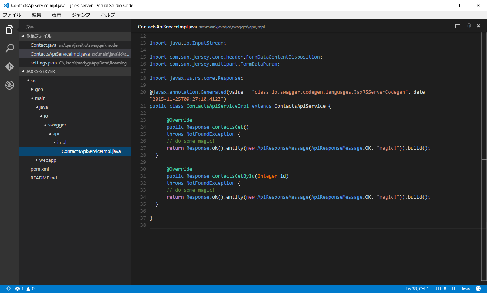
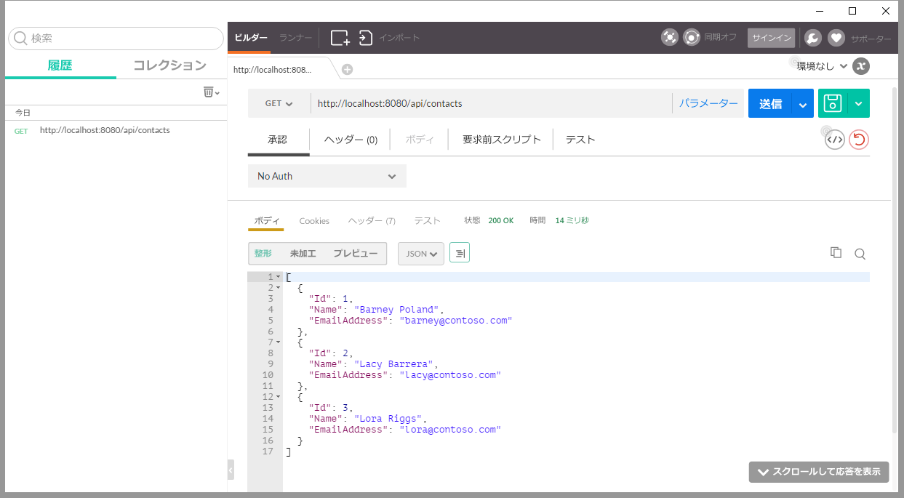
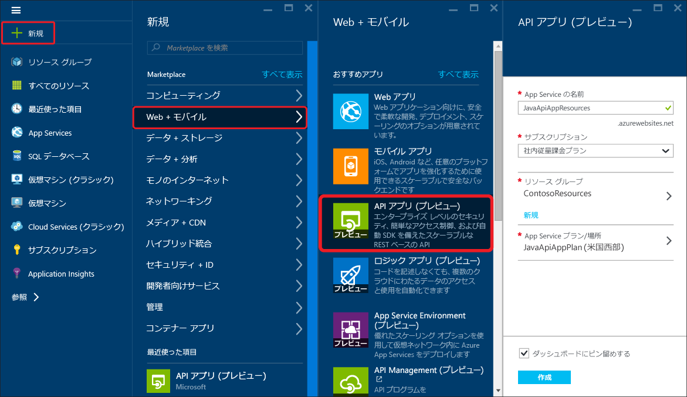
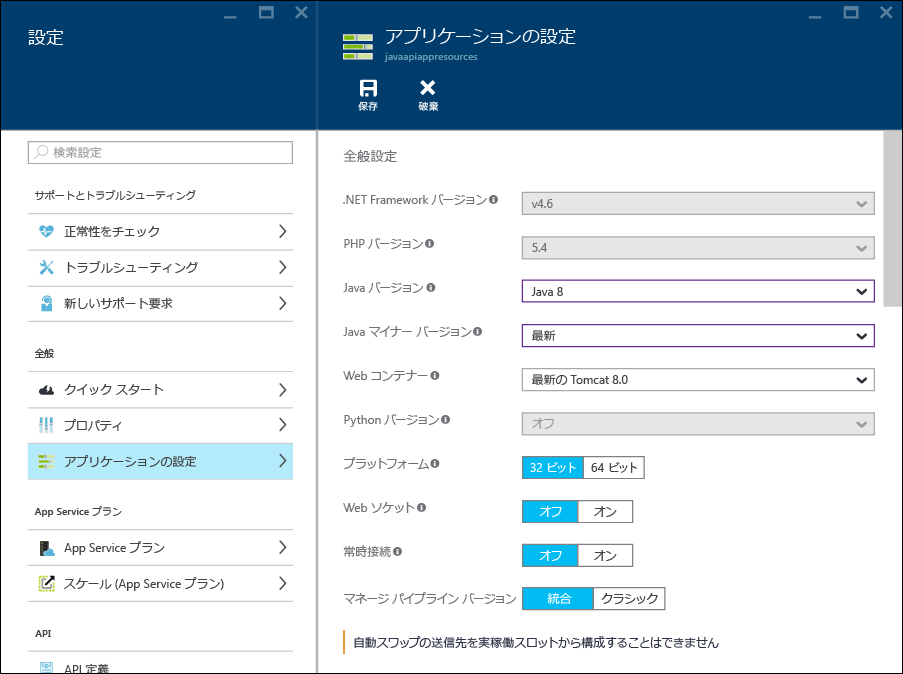
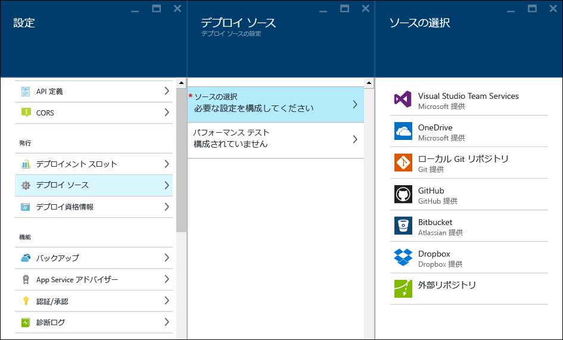
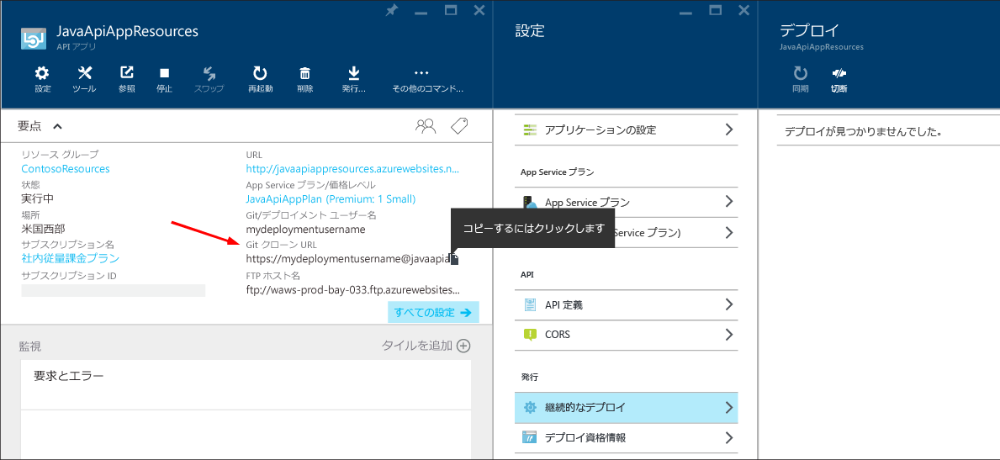
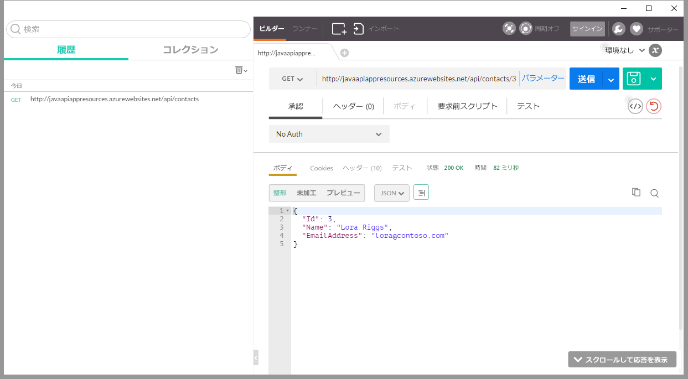

<properties
	pageTitle="Azure App Service での Java API アプリの構築とデプロイ"
	description="Java API アプリ パッケージを作成して Azure App Service にデプロイする方法について説明します。"
	services="app-service\api"
	documentationCenter="java"
	authors="bradygaster"
	manager="mohisri" 
	editor="tdykstra"/>

<tags
	ms.service="app-service-api"
	ms.workload="web"
	ms.tgt_pltfrm="na"
	ms.devlang="java"
	ms.topic="get-started-article"
	ms.date="02/22/2016"
	ms.author="bradygaster"/>

# Azure App Service での Java API アプリの構築とデプロイ

[AZURE.INCLUDE [app-service-api-get-started-selector](../../includes/app-service-api-get-started-selector.md)]

このチュートリアルでは、Java アプリケーションを作成し、[Git](http://git-scm.com) を使用して Azure App Service API Apps にデプロイする方法について説明します。このチュートリアルの手順は、Java を実行できる任意のオペレーティング システムで使用できます。このチュートリアルのコードは、[Maven](https://maven.apache.org/) を使用して作成されています。[Jax-RS](https://jax-rs-spec.java.net/) は RESTful サービスの作成に使用され、[Swagger Editor](http://editor.swagger.io/) を使用して [Swagger](http://swagger.io) メタデータの仕様に基づいて生成されます。

## 前提条件

1. [Java Development Kit 8](http://www.oracle.com/technetwork/java/javase/downloads/jdk8-downloads-2133151.html) (以降)
1. [Microsoft Azure](https://azure.microsoft.com/) の有料または[無料試用版](https://azure.microsoft.com/pricing/free-trial/)サブスクリプション
1. 開発用コンピューターにインストールされた [Maven](https://maven.apache.org/)
1. 開発用コンピューターにインストールされた Git 

## Swagger.IO を使用して API をスキャフォールディングする
swagger.io オンライン エディターを使用して、API の構造を表す Swagger JSON または YAML コードに入力できます。API のセキュリティを設計した後は、さまざまなプラットフォームやフレームワークのコードをエクスポートできます。次のセクションでは、スキャフォールディングされたコードに変更を加え、モック機能を含めます。

このデモでは、初めに Swagger JSON 本文を swagger.io エディターに貼り付け、それと JAX-RS を使って、REST API エンドポイントにアクセスするコードを生成します。次に、スキャフォールディングされたコードを編集してモック データが返されるようにし、データの永続化メカニズムに基づいて構築された REST API をシミュレートします。

1. 次の Swagger JSON コードをクリップボードにコピーします。

		{
			"swagger": "2.0",
			"info": {
				"version": "v1",
				"title": "Contact List",
				"description": "A Contact list API based on Swagger and built using Java"
			},
			"host": "localhost",
			"schemes": [
				"http",
				"https"
			],
			"basePath": "/api",
			"paths": {
				"/contacts": {
					"get": {
						"tags": [
							"Contact"
						],
						"operationId": "contacts_get",
						"consumes": [],
						"produces": [
							"application/json",
							"text/json"
						],
						"responses": {
							"200": {
								"description": "OK",
								"schema": {
									"type": "array",
									"items": {
										"$ref": "#/definitions/Contact"
									}
								}
							}
						},
						"deprecated": false
					}
				},
				"/contacts/{id}": {
					"get": {
						"tags": [
							"Contact"
						],
						"operationId": "contacts_getById",
						"consumes": [],
						"produces": [
							"application/json",
							"text/json"
						],
						"parameters": [
							{
								"name": "id",
								"in": "path",
								"required": true,
								"type": "integer",
								"format": "int32"
							}
						],
						"responses": {
							"200": {
								"description": "OK",
								"schema": {
									"type": "array",
									"items": {
										"$ref": "#/definitions/Contact"
									}
								}
							}
						},
						"deprecated": false
					}
				}
			},
			"definitions": {
				"Contact": {
					"type": "object",
					"properties": {
						"Id": {
							"format": "int32",
							"type": "integer"
						},
						"Name": {
							"type": "string"
						},
						"EmailAddress": {
							"type": "string"
						}
					}
				}
			}
		}
		
1. [オンライン Swagger Editor](http://editor.swagger.io/) に移動します。**[File]、[Paste JSON]** の順にクリックします。

    

1. 前にコピーした Contacts List API Swagger JSON を貼り付けます。

    

1. エディターに表示されるドキュメントのページと API の概要を確認します。

    

1. **[Generate Server]、[JAX-RS]** メニュー オプションの順に選択し、後で編集してモック実装を追加するサーバー側のコードをスキャフォールディングします。

    
	
	コードが生成されると、ダウンロード用の zip ファイルが提供されます。このファイルには、Swagger コード ジェネレーターによってスキャフォールディングされたコードと、関連するすべてのビルド スクリプトが含まれています。ライブラリ全体を開発用ワークステーション上のディレクトリに解凍します。

## コードを編集して API 実装を追加する
このセクションでは、生成されたコードのサーバー側の実装をカスタム コードに置き換えます。新しいコードは、Contact エンティティの ArrayList を呼び出し元のクライアントに返します。

1. [Visual Studio Code](https://code.visualstudio.com) または使い慣れたテキスト エディターを使用して、*src/gen/java/io/swagger/model* フォルダーにある *Contact.java* モデル ファイルを開きます。 

    

1. **Contact** クラスに次のコンストラクターを追加します。

        public Contact(Integer id, String name, String email) 
		{
			this.id = id;
			this.name = name;
			this.emailAddress = email;
		}

1. [Visual Studio Code](https://code.visualstudio.com) または使い慣れたテキスト エディターを使用して、*src/main/java/io/swagger/api/impl* フォルダーにある *ContactsApiServiceImpl.java* サービス実装ファイルを開きます。

    

1. この新しいコードでファイル内のコードを上書きし、サービス コードにモック実装を追加します。

        package io.swagger.api.impl;

        import io.swagger.api.*;
        import io.swagger.model.*;
        import com.sun.jersey.multipart.FormDataParam;
        import io.swagger.model.Contact;
        import java.util.*;
        import io.swagger.api.NotFoundException;
        import java.io.InputStream;
        import com.sun.jersey.core.header.FormDataContentDisposition;
        import com.sun.jersey.multipart.FormDataParam;
        import javax.ws.rs.core.Response;

        @javax.annotation.Generated(value = "class io.swagger.codegen.languages.JaxRSServerCodegen", date = "2015-11-24T21:54:11.648Z")
        public class ContactsApiServiceImpl extends ContactsApiService {
  
            private ArrayList<Contact> loadContacts()
            {
                ArrayList<Contact> list = new ArrayList<Contact>();
                list.add(new Contact(1, "Barney Poland", "barney@contoso.com"));
                list.add(new Contact(2, "Lacy Barrera", "lacy@contoso.com"));
                list.add(new Contact(3, "Lora Riggs", "lora@contoso.com"));
                return list;
            }
  
            @Override
            public Response contactsGet(SecurityContext securityContext)
            throws NotFoundException {
                ArrayList<Contact> list = loadContacts();
                return Response.ok().entity(list).build();
                }
  
            @Override
            public Response contactsGetById(Integer id, SecurityContext securityContext)
            throws NotFoundException {
                ArrayList<Contact> list = loadContacts();
                Contact ret = null;
            
                for(int i=0; i<list.size(); i++)
                {
                    if(list.get(i).getId() == id)
                    {
                        ret = list.get(i);
                    }
                }
                return Response.ok().entity(ret).build();
            }
        }

1. コマンド プロンプトを開きます。

1. 次の Maven コマンドを実行してコードをビルドし、Jetty アプリケーション サーバーを使用してローカルで実行します。

		mvn package jetty:run
		
1. Jetty がポート 8080 でコードを開始したことがコマンド ウィンドウに表示されます。

	
	
1. [Postman](https://www.getpostman.com/) を使用して、http://localhost:8080/api/contacts にある "get all contacts" API メソッドを要求します。

	
	
1. [Postman](https://www.getpostman.com/) を使用して、http://localhost:8080/api/contacts/2 にある "get specific contact" API メソッドを要求します。

	
	
1. 最後に、コンソールで次の Maven コマンドを実行することにより、Java WAR (Web ARchive) ファイルをビルドします。

		mvn package war:war
		
	WAR ファイルをビルドしたら、**target** フォルダーに配置します。**target** フォルダーに移動し、WAR ファイルの名前を **ROOT.war** に変更します (大文字と小文字もこの形式に一致していることを確認してください)。
	
		rename swagger-jaxrs-server-1.0.0.war ROOT.war
		
	最後に、次のコマンドを実行して、WAR ファイルを Azure にデプロイするために使用する **deploy** フォルダーを作成します。
	
		mkdir deploy
		mkdir deploy\webapps
		copy target\ROOT.war deploy\webapps
		cd deploy
	
## 出力を Azure App Service に発行する
このセクションでは、Azure ポータルを使用して新しい API アプリを作成する方法、Java アプリケーションをホストするためにこの API アプリを準備する方法、新しく作成した WAR ファイルを Azure App Service にデプロイして新しい API アプリを実行する方法について説明します。

1. [Azure ポータル](https://portal.azure.com/)で **[新規]、[Web + モバイル]、[API アプリ]** の順にクリックして、新しい API アプリを作成します。
	
	

1. [API アプリ] の [設定] ブレードで、**[アプリケーションの設定]** をクリックします。次に、[Java バージョン] メニューから最新の Java バージョンを選択し、[Web コンテナー] メニューから最新の Tomcat を選択します。

	

1. **[デプロイ資格情報]** 設定メニュー項目をクリックし、API アプリへのファイル発行に使用するユーザー名とパスワードを指定します。

	

1. **[継続的なデプロイ]** 設定メニュー項目をクリックします。**[ソースの選択]** をクリックし、**[ローカル Git リポジトリ]** を選択します。これにより、Azure で実行される、API アプリに関連付けられた Git リポジトリが作成されます。Git リポジトリの*マスター*分岐に対してコードをコミットするたびに、コードは実行中の API アプリ インスタンスに発行されます。

	

1. 新しい Git リポジトリの URL をクリップボードにコピーします。後で重要になるため、これを保存します。

	

1. Git は WAR ファイルをオンラインのリポジトリにプッシュします。そのためには、前に作成した **deploy** フォルダーに移動して、App Service で実行されているリポジトリに簡単にコードをコミットできるようにします。コンソール ウィンドウから webapps フォルダーのあるフォルダーに移動したら、次の Git コマンドを発行してプロセスを起動し、デプロイメントを実行します。

		git init
		git add .
		git commit -m "initial commit"
		git remote add azure [YOUR GIT URL]		
		git push azure master
		
	**プッシュ**要求を発行すると、前にデプロイメント資格情報用に作成したパスワードの入力を求められます。パスワードを入力すると、更新されてデプロイされたポータルが表示されます。
		
1. 再度 Postman を使用して Azure App Service で動作している新しくデプロイされた API アプリにヒットすると、一貫した動作であること、期待どおりの連絡先データが返されていること、Swagger.io でスキャフォールディングされた Java コードへの単純なコード変更が使用されていることを確認できます。

	
	
## 次のステップ
この記事では、初めに Swagger JSON ファイルを使用し、Swagger.io エディターでスキャフォールディングされた Java コードを作成しました。そこから、単純な変更と Git デプロイ プロセスにより、Java で記述された機能的な API アプリを作成しました。API Apps 入門シリーズの次のチュートリアルでは、[CORS を利用し、JavaScript クライアントから API アプリを使用する](app-service-api-cors-consume-javascript.md)方法について学習します。

[Storage SDK for Java](../storage/storage-java-how-to-use-blob-storage.md) についての理解を深めれば、このサンプルを応用して JSON BLOB を永続化することができます。または、[Document DB Java SDK](../documentdb/documentdb-java-application.md) を使用して、Azure Document DB に Contact データを保存することもできます。

Azure での Java の使用に関する詳細については、「[Java デベロッパー センター](/develop/java/)」を参照してください。

<!---HONumber=AcomDC_0302_2016-->