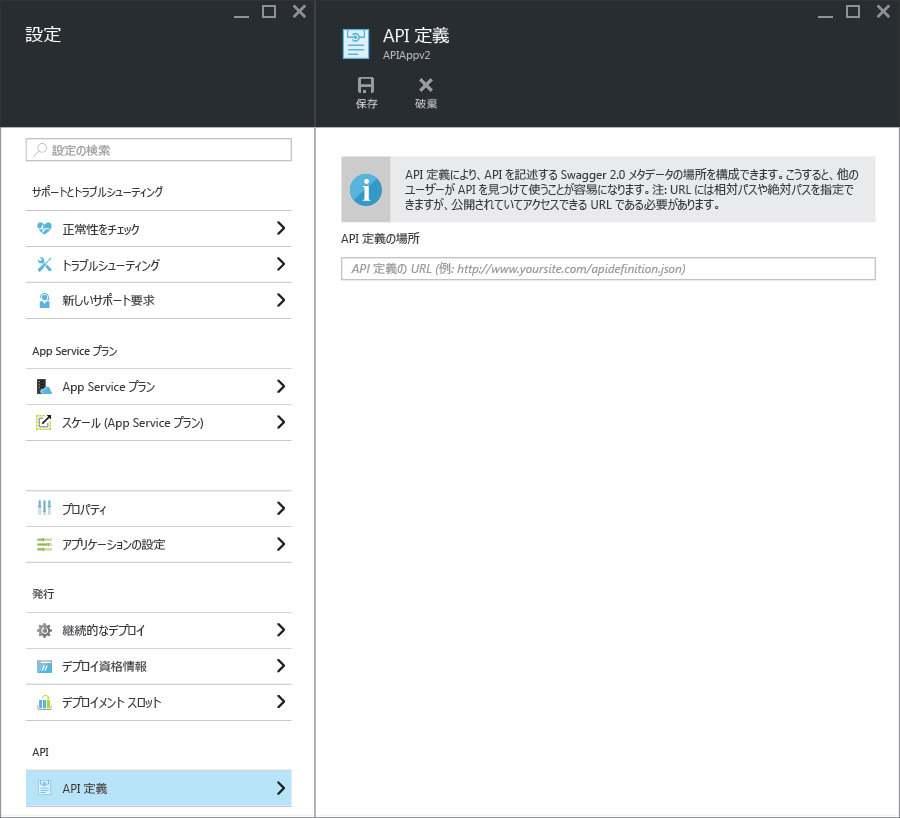

# API の検出とコードの生成用の App Service API Apps メタデータ
[Swagger 2.0](http://swagger.io/) API メタデータのサポートは、App Service API Apps に組み込まれています。 Swagger を使用する必要はありませんが、使用すると、検出と使用をより簡単にする API Apps の機能を活用できます。   

## Swagger のエンドポイント
API アプリのプロパティでは、その API アプリの Swagger 2.0 JSON メタデータを提供するエンドポイントを指定できます。 このエンドポイントは、API アプリのベース URL、または絶対 URL を基準に指定できます。 絶対 URL は、API アプリの外部を示します。 

多くのダウンストリーム クライアント (Visual Studio のコード生成、PowerApps の "API の追加" フローなど) では、URL にパブリックにアクセスできる (ユーザーやサービスの認証で保護されていない) ことが必要です。 つまり、App Service 認証を使用していて、なおかつ API 定義をアプリ内から公開する場合、API に匿名でアクセスするトラフィックを許可する認証オプションを使用する必要があります。 詳細については、 [App Service API Apps の認証と承認](app-service-api-authentication.md)に関するページを参照してください。

### ポータルのブレード
[Azure ポータル](https://portal.azure.com/) の **[API の定義]** ブレードでは、エンドポイントの URL を確認および変更できます。

### Azure リソース マネージャーのプロパティ
API アプリの API 定義 URL は、[リソース エクスプローラー](https://resources.azure.com/)を使うか、コマンド ライン ツール ([Azure PowerShell](/powershell/azureps-cmdlets-docs)、[Azure CLI](../cli-install-nodejs.md) など) から [Azure Resource Manager テンプレート](../azure-resource-manager/resource-group-authoring-templates.md)を使って構成することもできます。 

**リソース エクスプローラー**から **[サブスクリプション]、<該当するサブスクリプション>、[ResourceGroups]、<該当するリソース グループ>、[プロバイダー]、[Microsoft.Web]、[サイト]、<該当サイト>、[構成]、[Web]** の順に移動すると、`apiDefinition` プロパティが表示されます。

        "apiDefinition": {
          "url": "https://contactslistapi.azurewebsites.net/swagger/docs/v1"
        }

`apiDefinition` プロパティを設定する Azure Resource Manager テンプレートの例については、 [To-Do List サンプル アプリケーションの azuredeploy.json ファイル](https://github.com/azure-samples/app-service-api-dotnet-todo-list/blob/master/azuredeploy.json)を参照してください。 前に示した JSON サンプルのようなテンプレートのセクションがあります。

### 既定値
Visual Studio を使用して API アプリを作成すると、API 定義のエンドポイントは、自動的に、その API アプリのベース URL に `/swagger/docs/v1`が追加されたものに設定されます。 これは既定の URL で、ASP.NET Web API プロジェクトの動的に生成された Swagger メタデータを提供するために [Swashbuckle](https://www.nuget.org/packages/Swashbuckle) NuGet パッケージで使用されます。 

## コードの生成
Azure API アプリに Swagger を統合する利点の&1; つは、自動コード生成です。 生成されたクライアント クラスにより、API アプリを呼び出すコードの記述が容易になります。

API アプリのクライアント コードは、Visual Studio を使用して生成するか、コマンド ラインから生成することができます。 Visual Studio で ASP.NET Web API プロジェクトのクライアント クラスを生成する方法については、 [API Apps と ASP.NET の使用](app-service-api-dotnet-get-started.md#codegen)に関するページを参照してください。 サポートされているすべての言語のコマンド ラインからこの操作を実行する方法については、GitHub.com の [Azure/autorest](https://github.com/azure/autorest) リポジトリにある readme ファイルを参照してください。

## 次のステップ
API アプリの作成、デプロイ、使用の手順を説明するステップ バイ ステップ チュートリアルについては、 [Azure App Service での API アプリの使用](app-service-api-dotnet-get-started.md)に関するページを参照してください。

API アプリで Azure API Management を使う場合は、Swagger メタデータを使用して API を API Management にインポートできます。 詳細については、「 [Azure API Management で API の定義を操作と共にインポートする方法](../api-management/api-management-howto-import-api.md)」を参照してください。 

