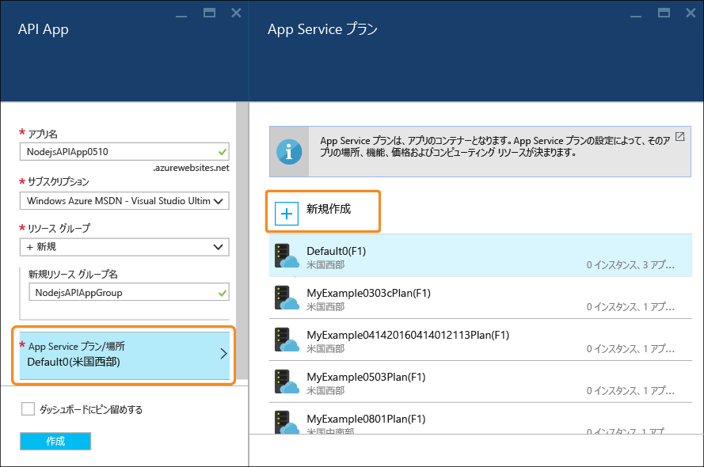
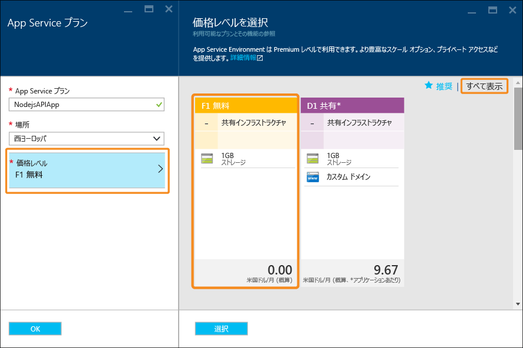

# Node.js RESTful API をビルドして Azure で API アプリにデプロイする
[!INCLUDE [app-service-api-get-started-selector](../../includes/app-service-api-get-started-selector.md)]

このチュートリアルでは、簡単な [Node.js](http://nodejs.org) API を作成し、[Git](http://git-scm.com) を使用してそれを [Azure App Service](../app-service/app-service-value-prop-what-is.md) の [API アプリ](app-service-api-apps-why-best-platform.md)にデプロイする方法について説明します。 Node.js を実行できる任意のオペレーティング システムを使用でき、作業はすべて cmd.exe や bash などのコマンド ライン ツールを使用して実行します。

## 前提条件
1. Microsoft Azure アカウント ([こちらから無料アカウントを作成できます](https://azure.microsoft.com/pricing/free-trial/))
2. [Node.js](http://nodejs.org) のインストール (このサンプルでは Node.js 4.2.2 を想定)
3. [Git](https://git-scm.com/) のインストール
4. [GitHub](https://github.com/) アカウント

App Service では、コードを API アプリにデプロイする方法を数多くサポートしていますが、このチュートリアルでは Git を使用した方法を説明しており、Git の操作方法について基本的な知識があることを前提としています。 その他のデプロイ方法の詳細については、「 [Azure App Service へのアプリのデプロイ](../app-service-web/web-sites-deploy.md)」を参照してください。

## サンプル コードの取得
1. Node.js および Git のコマンドを実行できるコマンド ライン インターフェイスを開きます。
2. ローカルの Git リポジトリとして使用できるフォルダーに移動し、 [サンプル コードを含む GitHub リポジトリ](https://github.com/Azure-Samples/app-service-api-node-contact-list)を複製します。
   
        git clone https://github.com/Azure-Samples/app-service-api-node-contact-list.git
   
    サンプル API には&2; つのエンドポイントがあります。`/contacts` に対して Get 要求を発行すると、名前と電子メール アドレスの一覧が JSON 形式で返されます。`/contacts/{id}` では、選択した連絡先のみが返されます。

## Swagger メタデータに基づく Node.js コードのスキャフォールディング (自動生成)
[Swagger](http://swagger.io/) は、RESTful API を記述するメタデータ用のファイル形式です。 Azure App Service は、[Swagger メタデータのビルトイン サポート](app-service-api-metadata.md)を備えています。 チュートリアルのこのセクションは、API 開発ワークフローをモデルにしています。ここでは最初に Swagger メタデータを作成し、それを使用して API のサーバー コードをスキャフォールディング (自動生成) します。 

> [!NOTE]
> Node.js コードを Swagger メタデータ ファイルからスキャフォールディングする方法について学ぶ必要がない場合、このセクションはスキップしてかまいません。 サンプル コードを新しい API アプリにデプロイするだけでよい場合は、 [Azure での API アプリの作成](#createapiapp) に関するセクションに直接移動してください。
> 
> 

### Swaggerize をインストールして実行する
1. 次のコマンドを実行して、**yo** および **generator-swaggerize** NPM モジュールをグローバルにインストールします。
   
        npm install -g yo
        npm install -g generator-swaggerize
   
    Swaggerize は、Swagger メタデータ ファイルで記述された API のサーバー コードを生成するツールです。 使用する Swagger ファイルは *api.json* という名前で、複製したリポジトリの *start* フォルダーに格納されています。
2. *start* フォルダーに移動し、`yo swaggerize` コマンドを実行します。 Swaggerize によって、いくつかの質問が表示されます。  "**what to call this project**" という質問に対しては「ContactList」と入力し、"**path to swagger document**" に対しては「api.json」、"**Express, Hapi, or Restify**" に対しては「express」と入力します。
   
        yo swaggerize
   
    
   
    **注**: この手順でエラーが発生した場合の対処方法については、次の手順で説明しています。
   
    Swaggerize によって、アプリケーション フォルダー、スキャフォールディング ハンドラー、および構成ファイルが作成され、 **package.json** ファイルが生成されます。 Express ビュー エンジンを使用して、Swagger のヘルプ ページが生成されます。  
3. `swaggerize` コマンドが "unexpected token" または "invalid escape sequence" エラーによって失敗した場合は、生成された *package.json* ファイルを編集してエラーの原因を修正します。 `scripts` の下にある `regenerate` 行で、*api.json* の前にあるバックスラッシュを次の例のようにスラッシュに変更します。
   
         "regenerate": "yo swaggerize --only=handlers,models,tests --framework express --apiPath config/api.json"
4. スキャフォールディングされたコードを含むフォルダーに移動します (この場合は */start/ContactList* サブフォルダー)。
5. `npm install` を実行します。
   
        npm install
6. **jsonpath** NPM モジュールをインストールします。 
   
        npm install --save jsonpath
   
    
7. **swaggerize-ui** NPM モジュールをインストールします。 
   
        npm install --save swaggerize-ui
   
    

### スキャフォールディングされたコードのカスタマイズ
1. **start** フォルダーの **lib** フォルダーを、スキャフォールダーによって作成された **ContactList** フォルダーにコピーします。 
2. **handlers/contacts.js** ファイルのコードを次のコードに置き換えます。 
   
    このコードでは、**lib/contactRepository.js** で生成される **lib/contacts.json** ファイルに保存されている JSON データを使用します。 新しい contacts.js コードは HTTP 要求に応答して、すべての contact を取得し、JSON ペイロードとして返します。 
   
        'use strict';
   
        var repository = require('../lib/contactRepository');
   
        module.exports = {
            get: function contacts_get(req, res) {
                res.json(repository.all())
            }
        };
3. **handlers/contacts/{id}.js** ファイルのコードを次のコードで置き換えます。 
   
        'use strict';
   
        var repository = require('../../lib/contactRepository');
   
        module.exports = {
            get: function contacts_get(req, res) {
                res.json(repository.get(req.params['id']));
            }    
        };
4. **server.js** のコードを次のコードに置き換えます。 
   
    次のコードは、server.js ファイルの変更点がわかるように、コメントで注記を入れています。 
   
        'use strict';
   
        var port = process.env.PORT || 8000; // first change
   
        var http = require('http');
        var express = require('express');
        var bodyParser = require('body-parser');
        var swaggerize = require('swaggerize-express');
        var swaggerUi = require('swaggerize-ui'); // second change
        var path = require('path');
   
        var app = express();
   
        var server = http.createServer(app);
   
        app.use(bodyParser.json());
   
        app.use(swaggerize({
            api: path.resolve('./config/swagger.json'), // third change
            handlers: path.resolve('./handlers'),
            docspath: '/swagger' // fourth change
        }));
   
        // change four
        app.use('/docs', swaggerUi({
          docs: '/swagger'  
        }));
   
        server.listen(port, function () { // fifth and final change
        });

### ローカルで実行される API でのテスト
1. Node.js コマンドラインの実行可能ファイルを使用して、サーバーを起動します。 
   
        node server.js
2. **http://localhost:8000/contacts** を参照すると、連絡先リストの JSON 出力が表示されます (ブラウザーによっては、ダウンロードするように求められます)。 
   
    
3. **http://localhost:8000/contacts/2** を参照すると、その ID 値が示す連絡先が表示されます。
   
    
4. Swagger JSON データは **/swagger** エンドポイント経由で提供されます。
   
    
5. Swagger UI は **/docs** エンドポイント経由で提供されます。 Swagger UI では、豊富な HTML クライアント機能を使用して API をテストできます。
   
    

##  新しい API アプリを作成する
このセクションでは、Azure ポータルを使用して、Azure で新しい API アプリを作成します。 この API アプリは、コードを実行するために Azure が提供するコンピューティング リソースを表しています。 後のセクションでは、新しい API アプリにコードをデプロイします。

1. [Azure ポータル](https://portal.azure.com/)にアクセスします。 
2. **[新規]、[Web + モバイル]、[API アプリ]** の順にクリックします。 
   
    
3. **azurewebsites.net** ドメイン内で一意の *アプリ名* を入力します (NodejsAPIApp に番号を付加するなどして一意にします)。 
   
    たとえば、名前が `NodejsAPIApp` である場合、URL は `nodejsapiapp.azurewebsites.net` です。
   
    既に他のユーザーによって使用されている名前を入力すると、右側に赤い感嘆符が表示されます。
4. **[リソース グループ]** ボックスの一覧の **[新規作成]** をクリックし、**[新しいリソース グループ名]** に「NodejsAPIAppGroup」(またはお好きな名前) を入力します。 
   
    [リソース グループ](../azure-resource-manager/resource-group-overview.md)は、API アプリ、データベース、VM などの Azure リソースをひとまとめにしたものです。 このチュートリアルでは、新しいリソース グループを作成すると便利です。チュートリアルのために作成したすべての Azure リソースを&1; 回の手順で簡単に削除できるからです。
5. **[App Service プラン/場所]** をクリックし、**[新規作成]** をクリックします。
   
    
   
    以降の手順では、新しいリソース グループの App Service プランを作成します。 App Service プランには、API アプリの実行環境となるコンピューティング リソースを指定します。 たとえば、Free レベルを選択した場合、API アプリは共有 VM 上で実行され、一部の有料レベルを選択した場合は専用 VM で実行されます。 App Service プランの詳細については、 [App Service プランの概要](../app-service/azure-web-sites-web-hosting-plans-in-depth-overview.md)に関するページを参照してください。
6. **[App Service プラン]** ブレードに、「NodejsAPIAppPlan」(またはお好きな名前) を入力します。
7. **[場所]** ドロップダウン リストで、現在の所在地に最も近い場所を選択します。
   
    この設定によって、アプリが実行される Azure データ センターが指定されます。 このチュートリアルでは、任意のリージョンを選択することができます。任意のリージョンを選択しても、大きな違いはありません。 ただし運用アプリでは、[待機時間](http://www.bing.com/search?q=web%20latency%20introduction&qs=n&form=QBRE&pq=web%20latency%20introduction&sc=1-24&sp=-1&sk=&cvid=eefff99dfc864d25a75a83740f1e0090)を最小限に抑えるために、アクセスするクライアントに最も近いサーバーを選択することをお勧めします。
8. **[価格レベル]、[すべて表示]、[F1 Free]** の順にクリックします。
   
    無料の価格レベルでこのチュートリアルに十分な性能が提供されます。
   
    
9. **[App Service プラン]** ブレードで、**[OK]** をクリックします。
10. **[API アプリ]** ブレードで、**[作成]** をクリックします。

## Git デプロイ用の新しい API アプリの設定
Azure App Service で Git リポジトリにコミットをプッシュすることによって、API アプリにコードをデプロイします。 チュートリアルのこのセクションでは、Azure でデプロイに使用する資格情報と Git リポジトリを作成します。  

1. API アプリが作成されたら、ポータルのホーム ページで **[App Services]、作成した API アプリ**の順にクリックします。 
   
    ポータルに **[API アプリ]** ブレードと **[設定]** ブレードが表示されます。
   
    
2. **[設定]** ブレードで、下へスクロールして **[発行]** セクションを表示し、**[デプロイ資格情報]** をクリックします。
3. **[デプロイ資格情報の設定]** ブレードで、ユーザー名とパスワードを入力し、**[保存]** をクリックします。
   
    これらの資格情報は、Node.js コードを API アプリに発行するために使用します。 
   
    ![[デプロイ資格情報]](media/app-service-api-nodejs-api-app/deployment-credentials.png)
4. **[設定]** ブレードで、**[展開元]、[ソースの選択]、[ローカル Git リポジトリ]** の順にクリックし、**[OK]** をクリックします。
   
    
5. Git リポジトリが作成されると、ブレードが更新され、アクティブなデプロイが表示されます。 リポジトリは新しいので、一覧にはアクティブなデプロイメントがありません。 
   
    
6. Git リポジトリの URL をコピーします。 コピーするには、新しい API アプリのブレードを開き、ブレードの **[要点]** セクションを確認します。 **[要点]** セクションの **[Git クローン URL]** を見てください。 この URL をポイントすると、URL をクリップボードにコピーするためのアイコンが右側に表示されます。 このアイコンをクリックして URL をコピーします。
   
    
   
    **注**: Git クローン URL は次の手順で必要になるので、どこかの時点で保存しておく必要があります。

これで、Git リポジトリにバックアップされている API アプリができたので、リポジトリにコードをプッシュして、API アプリにコードをデプロイできます。 

## Azure への API コードのデプロイ
このセクションでは、API のサーバー コードを含むローカル Git リポジトリを作成し、そのリポジトリから、前の手順で Azure に作成したリポジトリにコードをプッシュします。

1. `ContactList` フォルダーを、新しいローカル Git リポジトリとして使用できる場所にコピーします。 チュートリアルの最初の部分を実行した場合は `ContactList` を `start` フォルダーからコピーし、そうでない場合は `ContactList` を `end` フォルダーからコピーします。
2. コマンド ライン ツールで、新しいフォルダーに移動し、次のコマンドを実行して新しいローカル Git リポジトリを作成します。 
   
        git init
   
     
3. このチュートリアルの最初の部分を完了し、`ContactList` フォルダーをコピーすると、そのコピーには `node_modules` フォルダーが含まれることがあります。 `node_modules` フォルダーはデプロイ プロセス中に `package.json` ファイルと `npm install` から作成されたものなので、ソース管理には含めたくありません。 したがって、プロジェクト ディレクトリのルートで次のコマンドを実行して、`.gitignore` ファイルを追加します。

         touch .gitignore
      
   .gitignore ファイルを開き、ファイルの最初の行に `node_modules` を追加します。 `git status` を実行しても一覧内にディレクトリが表示されていなければ、`node_modules` フォルダーがソース管理から無視されていることを確認できます。 さらにルールを追加する場合に NodeJS プロジェクトで無視することが推奨されるファイルに関する (GitHub プロジェクト)[https://github.com/github/gitignore/blob/master/Node.gitignore] があります。
 
4. 次のコマンドを実行して、API アプリのリポジトリの Git リモートを追加します。 
   
        git remote add azure YOUR_GIT_CLONE_URL_HERE
   
    **注**: 文字列 "YOUR_GIT_CLONE_URL_HERE" は、前の手順でコピーした Git クローン URL に置き換えます。 
5. 次のコマンドを実行して、すべてのコードを含むコミットを作成します。 
   
        git add .
        git commit -m "initial revision"
   
    
6. Azure にコードをプッシュするコマンドを実行します。 パスワードの入力を求められたら、前に Azure ポータルで作成したパスワードを入力します。
   
        git push azure master
   
    API アプリへのデプロイが開始されます。  
7. ブラウザーで API アプリの **[デプロイ]** ブレードに戻ると、デプロイが実行されていることがわかります。 
   
    
   
    同時に、コマンド ライン インターフェイスにも実行中のデプロイの状態が反映されます。 
   
    
   
    デプロイが完了すると、 **[デプロイ]** ブレードに、コードの変更が API アプリに正常にデプロイされたことが示されます。 

## Azure で実行される API でのテスト
1. API アプリ ブレードの **[要点]** セクションの **[URL]** をコピーします。 
   
    
2. Postman や Fiddler などの REST API クライアント (または Web ブラウザー) を使用して、Contacts API の呼び出し URL、つまり API アプリの `/contacts` エンドポイントを指定します。 URL は `https://{your API app name}.azurewebsites.net/contacts`
   
    このエンドポイントに GET 要求を発行すると、API アプリの JSON 出力が取得されます。
   
    
3. ブラウザーで `/docs` エンドポイントに移動し、Azure で実行されている Swagger UI を使用してみます。

継続的な配信の設定が完了しているので、コードを変更した後は、Azure の Git リポジトリにコミットをプッシュするだけで、Azure にデプロイできます。

## 次のステップ
この時点で、API アプリの作成と、そのアプリへの Node.js API コードのデプロイが正常に完了しました。 次のチュートリアルでは、 [CORS を利用し、JavaScript クライアントから API アプリを使用する](app-service-api-cors-consume-javascript.md)方法について説明します。

