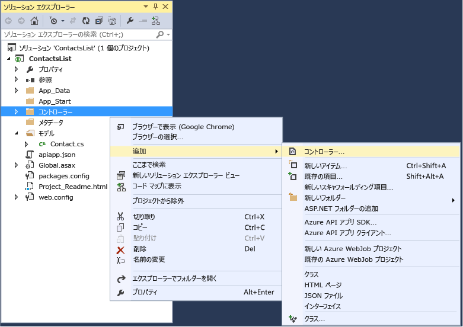
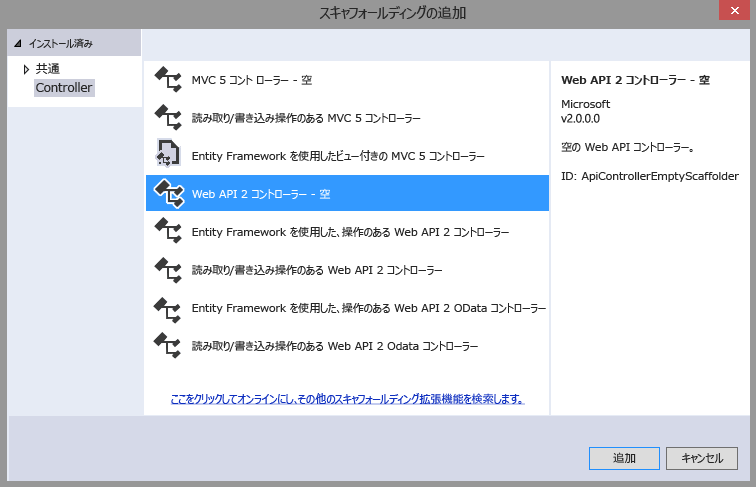
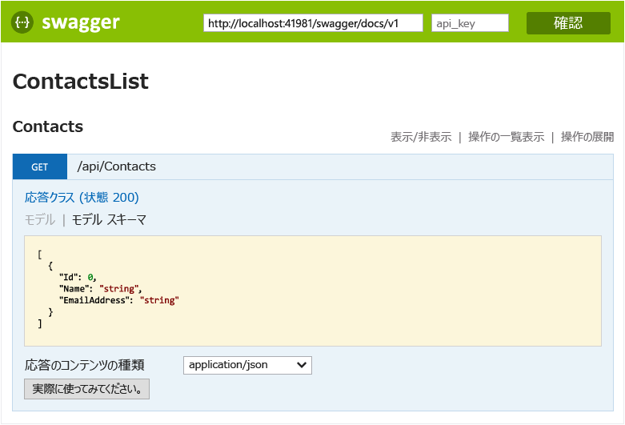
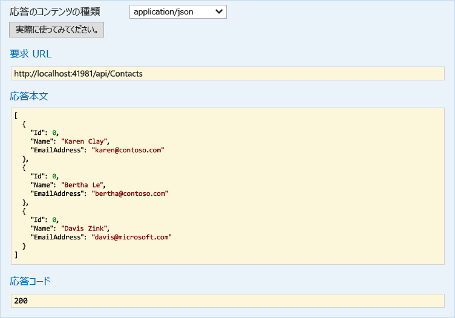

<properties 
	pageTitle="Visual Studio 2015 を使用した Azure App Service での ASP.NET API アプリの作成" 
	description="Visual Studio 2015 を使用して、Azure App Service で ASP.NET API アプリを作成する方法について説明します。" 
	services="app-service\api" 
	documentationCenter=".net" 
	authors="tdykstra" 
	manager="wpickett" 
	editor="jimbe"/>

<tags 
	ms.service="app-service-api" 
	ms.workload="web" 
	ms.tgt_pltfrm="dotnet" 
	ms.devlang="na" 
	ms.topic="article" 
	ms.date="05/19/2015" 
	ms.author="tdykstra"/>

# Visual Studio 2015 を使用した Azure App Service での ASP.NET API アプリの作成

> [AZURE.SELECTOR]
- [Visual Studio 2013](app-service-dotnet-create-api-app.md)
- [Visual Studio 2015 RC](app-service-dotnet-create-api-app-vs2015.md)
- [Visual Studio Code](app-service-create-aspnet-api-app-using-vscode.md)

## 概要

このチュートリアルでは、[Visual Studio 2015 RC](https://www.visualstudio.com/ja-jp/downloads/visual-studio-2015-downloads-vs.aspx) を使用して ASP.NET Web API 2 プロジェクトを作成し、[Azure App Service](../app-service/app-service-value-prop-what-is.md) で [API アプリ](app-service-api-apps-why-best-platform.md)としてクラウドにデプロイできるように構成する方法について説明します。Azure へのプロジェクトのデプロイも行います。このチュートリアルの最後には、API アプリが Azure クラウドで実行するようになります。

このチュートリアルは、Visual Studio の**ソリューション エクスプローラー**でファイルおよびフォルダーを使用する方法を理解していることを前提としています。

このチュートリアルでは、現在リリースされているバージョンの ASP.NET Web API を使用します。ASP.NET MVC 6 API アプリを作成する方法については、ブログ投稿 [https://alexanderzeitler.com/articles/Deploying-a-ASP-NET-MVC-6-API-as-Azure-API-App-in-Azure-App-Services/](https://alexanderzeitler.com/articles/Deploying-a-ASP-NET-MVC-6-API-as-Azure-API-App-in-Azure-App-Services/ "Azure App Services での Azure API アプリとしての ASP.NET MVC 6 API のデプロイ") を参照してください。

[AZURE.INCLUDE [install-sdk-2015-only](../../includes/install-sdk-2015-only.md)]

このチュートリアルでは、Azure SDK for .NET 2.6 以降のバージョンが必要です。

## API アプリ プロジェクトの作成 

Visual Studio 2015 RC にはまだ API アプリ プロジェクト テンプレートがないので、API アプリ プロジェクトを作成するには、Web API プロジェクト テンプレートから始めます。

1. Visual Studio 2015 RC を開きます。

2. **[ファイル]、[新しいプロジェクト]** の順にクリックします。

3. **[テンプレート]** の **[Web]** をクリックし、**[ASP.NET Web アプリケーション]** テンプレートをクリックします。

4. プロジェクトに「*ContactsList*」という名前を付けます。

5. **[Application Insights をプロジェクトに追加]** チェック ボックスがオフになっていることを確認します。

5. **[OK]** をクリックします。

	

6. **[新しい ASP.NET プロジェクト]** ダイアログの **[ASP.NET 4.6 テンプレート]** で、**空**のテンプレートを選択します。

7. **[Web API]** チェック ボックスをオンにします。

8. **[クラウドにホスト]** チェック ボックスをオフにします。

7. **[OK]** をクリックします。

	

## NuGet パッケージの追加

[Microsoft.Azure.AppService.ApiApps.Service](http://www.nuget.org/packages/Microsoft.Azure.AppService.ApiApps.Service/) NuGet パッケージでは、API アプリ用の App Service ランタイムが提供されています。また [Swashbuckle](http://www.nuget.org/packages/Swashbuckle/) NuGet パッケージでは、[Swagger](http://swagger.io/ "公式の Swagger 情報") API メタデータを動的に生成できます。

> **注:** Swashbuckle パッケージをインストールすると、API テスト ページが既定で有効になります。API アプリを発行し、アクセス レベルを **[パブリック (匿名)]** に設定すると、テスト ページの URL を検索したユーザーは、その URL を API の呼び出しに使用できます。このチュートリアルの後半では、テスト ページを使用します。

1. **[ツール]、[Nuget パッケージ マネージャー]、[パッケージ マネージャー コンソール]** の順にクリックします。

2. **[Package Manager Console]** (PMC) で、次のコマンドを入力します。

		install-package Microsoft.Azure.AppService.ApiApps.Service
		install-package Swashbuckle

	PMC が依存関係をチェックしていることを示すメッセージが表示された後、数分待たなければならないことがあります。

## API アプリ メタデータ ファイルの追加

Web API プロジェクトを API アプリとしてデプロイできるようにするメタデータは、*apiapp.json* ファイルおよび *Metadata* フォルダーとそのサブフォルダーおよびファイルに格納されています。次の手順では、既定値でこれらのファイルを追加します。

このチュートリアルの「[API アプリのメタデータ](#api-app-metadata)」セクションで、このメタデータをカスタマイズする方法について説明します。

1. プロジェクト フォルダーに apiapp.json という名前の *.json* ファイルを作成し、新しいファイルの内容を以下の JSON テキストに置き換えます。

		{
		    "$schema": "http://json-schema.org/schemas/2014-11-01/apiapp.json#",
		    "id": "ContactsList",
		    "namespace": "microsoft.com",
		    "gateway": "2015-01-14",
		    "version": "1.0.0",
		    "title": "ContactsListTitle",
		    "summary": "Summary",
		    "author": "Author",
		    "endpoints": {
		        "apiDefinition": "/swagger/docs/v1",
		        "status": null
		    }
		}

3. プロジェクト フォルダーに *Metadata* という名前のフォルダーを作成し、*Metadata* フォルダーに *deploymentTemplates* という名前のフォルダーを作成します。

5. *deploymentTemplates* フォルダーに *apiappconfig.azureresource.json* という名前の *.json* ファイルを作成し、新しいファイルの内容を以下の JSON テキストに置き換えます。

		{
		  "$schema": "http://schemas.management.azure.com/schemas/2014-04-01-preview/deploymentTemplate.json#",
		  "contentVersion": "1.0.0.0",
		  "parameters": {
		    "$system": {
		      "type": "Object"
		    }
		  },
		  "resources": []
		}

## Web API コードの追加

次の手順では、ハード コーディングされた連絡先リストを返す単純な HTTP Get メソッドのコードを追加します。

1. プロジェクト フォルダー内に *[モデル]* フォルダーがない場合は作成します。

2. *[モデル]* フォルダーで、*Contact.cs* という名前のクラス ファイルを追加し、ファイルの内容を次のコードに置き換えます。namespace ContactsList.Models { public class Contact { public int Id { get; set; } public string Name { get; set; } public string EmailAddress { get; set; } } }

5. **[コントローラー]** フォルダーを右クリックしてから、**[追加]、[コントローラー]** の順にクリックします。

	

6. **[スキャフォールディングの追加]** ダイアログで、**[Web API 2 コントローラー - 空]** を選択し、**[追加]** をクリックします。

	

7. コントローラーに **ContactsController** という名前を付け、**[追加]** をクリックします。

	

8. *ContactsController.cs* ファイルが作成されたら、ファイルの内容を次のコードに置き換えます。

		using ContactsList.Models;
		using System;
		using System.Collections.Generic;
		using System.Linq;
		using System.Net;
		using System.Net.Http;
		using System.Threading.Tasks;
		using System.Web.Http;
		
		namespace ContactsList.Controllers
		{
		    public class ContactsController : ApiController
		    {
		        [HttpGet]
		        public IEnumerable<Contact> Get()
		        {
		            return new Contact[]{
						new Contact { Id = 1, EmailAddress = "barney@contoso.com", Name = "Barney Poland"},
						new Contact { Id = 2, EmailAddress = "lacy@contoso.com", Name = "Lacy Barrera"},
	                	new Contact { Id = 3, EmailAddress = "lora@microsoft.com", Name = "Lora Riggs"}
		            };
		        }
		    }
		}

## Web API のテスト

API のテスト ページを表示するには、次の手順に従います。

1. アプリケーションをローカルで実行し (CTRL キーを押しながら f5 キーを押します)、ブラウザーのアドレス バーで URL の末尾に `/swagger` を追加します。 

	

2. **[Contacts]、[Get]、[Try it out]** の順にクリックすると、API が機能しており、予期される結果を返すことを確認できます。

	

## Azure での API アプリの作成

1. [Azure プレビュー ポータル](https://portal.azure.com)で API アプリを作成します。 

	* **[新規]、[Web + モバイル]、[API アプリ]** の順にクリックします。

		

	* **[名前]** に「ContactsList」と入力します。

	* **[App Service プラン]** で **[新規作成]** をクリックし、名前を入力します (例: **ContactsList**)。

		App Service プランの詳細については、「[Azure App Service プランの詳細な概要](azure-web-sites-web-hosting-plans-in-depth-overview.md)」を参照してください。

	* **[価格レベル]、[すべて表示]、[無料]、[選択]** の順にクリックし、無料の価格レベルを選択します。

		有料の価格レベルを使用できますが、このチュートリアルでは必要ありません。

	* **[リソース グループ]** で **[新規作成]** をクリックしてから、ContactsList などの名前を入力します。

		リソース グループの詳細については、[リソース グループを使用した Azure のリソースの管理](resource-group-overview.md)に関するページを参照してください。

	* 複数のサブスクリプションがある場合は、使用するサブスクリプションを選択します。

	* 近くの場所を選択します。

	* **[作成]** をクリックします。

		

2. Azure による API アプリの作成が終了したら、API アプリのアクセス レベルを **[パブリック (匿名)]** に設定します。

	* **[参照]、[リソース グループ]、[作成したリソース グループ]、[作成した API アプリ]** の順にクリックします。

	* **[設定]、[アプリケーションの設定]** の順にクリックします。

	* **[アクセス レベル]** を **[パブリック (匿名)]** に変更します。
	 
	* **[保存]** をクリックします。

		
	
2. API アプリをホストしている基盤の Web アプリの名前を書き留めておきます。Visual Studio プロジェクトをデプロイするときにこれを使用します。

	* **[API アプリ ホスト]** で **ContactsList** をクリックします。

		

	* 名前が **[API アプリ ホスト]** ブレードのタイトルに表示されます。

		

## Azure で新しい API アプリに Web API プロジェクトをデプロイします。
 
API アプリとは本質的に、Azure が Web サービス機能用の追加機能を提供する Web アプリです。Visual Studio 2015 RC では、Web の発行ウィザードに API アプリ専用の選択肢がないため、API アプリの基になっている Web アプリに対して発行します。

2. Visual Studio の**ソリューション エクスプローラー**で、プロジェクトを右クリックし、コンテキスト メニューの **[発行]** をクリックします。

3. **Web の発行**ウィザードの **[プロファイル]** ステップで、**[Microsoft Azure Web Apps]** をクリックします。

	

4. **[既存の Web Apps]** ドロップダウン リストで、前に書き留めた API アプリ名のエントリを選択します。

	

5. **[発行]** をクリックします。

	ブラウザーで Web アプリの URL が開かれ、「API アプリが作成されました」ページが表示されます。

6. ブラウザーのアドレス バーで、URL の最後に "swagger/" を追加します。次に例を示します。

		https://microsoft-apiappb001b62a9033493a33748332233fca2.azurewebsites.net/swagger/

	前にローカルで実行したときと同じ Swagger UI が表示されますが、今度はクラウドで実行しています。

2. **[Contacts]、[Get]、[Try it out]** の順にクリックすると、API が機能しており、予期される結果を返すことを確認できます。

	

## Azure プレビュー ポータルでの API 定義の表示

このセクションでは、ポータルに移動し、先ほど作成した API アプリの API の定義を表示します。

1. [Azure プレビュー ポータル](https://portal.azure.com)で、自分の API アプリの **[API アプリ]** ブレードに移動し、**[参照]、[リソース グループ]、[作成したリソース グループ]、[作成した API アプリ]** の順にクリックします。

4. **[API の定義]** をクリックします。

	アプリの **[API の定義]** ブレードに、アプリを作成したときに定義した API 操作の一覧が表示されます。(このチュートリアルに従った場合には、get 操作のみが表示されます。)

	

## Web API コードに操作を追加します。

5. Visual Studio のプロジェクトに戻り、**ContactsController.cs** ファイルに次のコードを追加します。このコードは、新しい `Contact` インスタンスを API にポストできる **Post** メソッドを追加します。  

		[HttpPost]
		public HttpResponseMessage Post([FromBody] Contact contact)
		{
			// todo: save the contact somewhere
			return Request.CreateResponse(HttpStatusCode.Created);
		}

	

6. 先ほどと同じように、プロジェクトを発行します。**ソリューション エクスプローラー**でプロジェクトを右クリックし、**[発行]** をクリックします。次に、**Web の発行**ウィザードの **[発行]** をクリックします。

12. 発行プロセスが完了したら、ポータルに戻り、先ほどと同じようにゲートウェイを再起動します。

14. ポータルで **[API の定義]** ブレードに戻ります。

	先ほど作成して Azure サブスクリプションにデプロイした新しい API エンドポイントが表示されます。

	

[AZURE.INCLUDE [app-service-api-direct-deploy-metadata](../../includes/app-service-api-direct-deploy-metadata.md)]

## 次のステップ

Visual Studio 2015 RC を使用し、API アプリを作成してデプロイしました。API アプリの詳細については、ページの左側 (ワイド ブラウザー ウィンドウの場合) またはページの上部 (幅の狭いブラウザー ウィンドウの場合) に表示される、ナビゲーション ウィンドウのエントリを参照してください。API アプリ ドキュメントのほとんどでは Visual Studio 2013 が示されていますが、UI は似ていて、記述するコードおよびポータルの UI は同じなので、ほとんどは VS 2015 でも使用できます。
 

<!---HONumber=58_postMigration-->