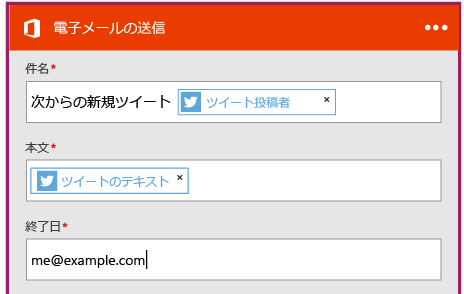

<properties
	pageTitle="ロジック アプリを作成する | Microsoft Azure"
	description="SaaS サービスを接続するロジック アプリの作成方法について説明します。"
	authors="stepsic-microsoft-com"
	manager="dwrede"
	editor=""
	services="app-service\logic"
	documentationCenter=""/>

<tags
	ms.service="app-service-logic"
	ms.workload="na"
	ms.tgt_pltfrm="na"
	ms.devlang="na"
	ms.topic="get-started-article"
	ms.date="03/16/2016"
	ms.author="stepsic"/>

# SaaS サービスを接続する新しいロジック アプリを作成します。

| クイック リファレンス |
| --------------- |
| [Logic Apps の定義言語](https://msdn.microsoft.com/library/azure/mt643789.aspx) |
| [Logic Apps コネクターのドキュメント](../connectors/apis-list.md) |
| [Logic Apps フォーラム](https://social.msdn.microsoft.com/Forums/en-US/home?forum=azurelogicapps) |

このトピックでは、初めての方に向けて [App Service Logic Apps](app-service-logic-what-are-logic-apps.md) の使い方を簡単に説明します。今回は、興味を持ったツイートをメールボックスに保存できるようにするまでの流れを見ていきます。

このシナリオを使用するには、以下が必要です。

- Azure サブスクリプション
- Twitter アカウント
- Office 365 アカウント

## ツイートを電子メールで送信する新しいロジック アプリを作成する

1. Azure ポータルのダッシュボードで **[Marketplace]** を選択します。 
2. [すべて] で「logic apps」を検索し、**[Logic App (プレビュー)]** を選択します。**[新規]**、**[Web + モバイル]** を順に選択して、**[Logic App (プレビュー)]** を選択してもかまいません。 
3. ロジック アプリの名前を入力し、App Service プランを選択して、**[作成]** を選択します。この手順は、読者が既に App Service プランを利用していること、また必要なプロパティについて理解していることを前提としています。それ以外の場合はまず、「[Azure App Service プランの詳細な概要](azure-web-sites-web-hosting-plans-in-depth-overview.md)」をご覧ください。 

4. ロジック アプリを最初に開いたときに、トリガーが必要となります。トリガー検索ボックスで「**twitter**」を検索して選択します。

7. Twitter で検索するキーワードを入力します。

5. プラス記号を選択して **[アクションの追加]** または **[条件の追加]** を選択します。 
6. **[アクションの追加]** を選択すると、利用可能なアクションを含んだすべてのコネクタが一覧表示されます。ここからロジック アプリに追加するコネクタとアクションを選択できます。たとえば、**[Office 365 - 電子メールの送信]** など、さまざまな Office 365 アクションを選択できます。 

7. 今度は、電子メールに使用するパラメーターを入力する必要があります。 

8. 最後に **[保存]** を選択すると、ロジック アプリがライブ状態となります。

## 作成後にロジック アプリを管理する

ここまでの手順で、ロジック アプリが実行できるようになりました。スケジュール設定されているワークフローが実行されるたびに、特定のハッシュタグが含まれるツイートがないかどうかが確認されます。条件に合致するツイートが見つかった場合には、Dropbox に保存されます。ここでは、最後にアプリを無効にしたり、動作内容を確認したりする方法を見ていきます。

1. 画面左側の **[参照]** をクリックし、**[Logic Apps]** を選択します。

2. 新たに作成したロジック アプリをクリックすると、現在の状態や全般的な情報を確認できます。

3. 新しいロジック アプリを編集するには、**[トリガーとアクション]** をクリックします。

5. アプリを無効にするには、コマンド バーで **[無効化]** をクリックします。

クラウド上で実行できる簡単なロジック アプリを 5 分もしないうちに作成できました。Logic Apps の機能の使用について詳しくは、「[ロジック アプリの機能を使用する]」をご覧ください。ロジック アプリの定義自体の詳細については、「[ロジック アプリの定義を作成する](app-service-logic-author-definitions.md)」を参照してください。

<!-- Shared links -->
[Azure portal]: https://portal.azure.com
[ロジック アプリの機能を使用する]: app-service-logic-create-a-logic-app.md

<!---HONumber=AcomDC_0601_2016-->