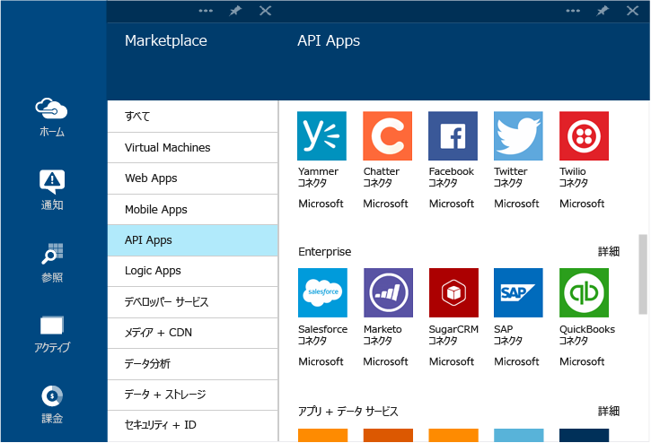

<properties 
	pageTitle="コネクタと BizTalk API Apps とは" 
	description="API Apps、コネクタ、および BizTalk API Apps について説明します。" 
	services="app-service\logic" 
	documentationCenter="" 
	authors="MandiOhlinger" 
	manager="dwrede" 
	editor=""/>

<tags 
	ms.service="app-service-logic" 
	ms.workload="integration" 
	ms.tgt_pltfrm="na" 
	ms.devlang="na" 
	ms.topic="article" 
	ms.date="12/01/2015" 
	ms.author="mandia"/>

# コネクタと BizTalk API Apps とは

Azure App Services は、API Apps を介した拡張性と共通の接続性の原則の上に構築されます。*コネクタ*は、接続に焦点を絞った API アプリの一種です。他の API アプリと同様に、コネクタは Web アプリ、モバイル アプリ、およびロジック アプリから使用されます。コネクタは、既存のサービスとの接続を容易にし、認証の管理、監視、分析などに役立ちます。

開発者は独自の API アプリを作成し、個人的にデプロイできます。将来的には、開発者は独自に作成した API アプリを Marketplace で共有して収益化できます。

開発者が Azure App Service を利用してソリューションを構築しやすいように、Azure チームによって、一般的なシナリオに対応するコネクタがいくつか Marketplace に追加されています。さらに、App Service の対応範囲を複雑で高度な統合シナリオにまで広げるために、Premium と BizTalk の機能も提供されています。

Azure App Service では、さまざまなサービス レベルを提供しています。どのレベルにもすべてのコネクタと API アプリが含まれ、その全機能を使用できます。

[App Service の料金](http://azure.microsoft.com/pricing/details/app-service/)に関するページでは、これらのサービス レベルについて説明し、各レベルに含まれる機能を表にして示しています。次のセクションでは、BizTalk API アプリとコネクタのさまざまなカテゴリについて説明します。

## Standard コネクタ
App Service にはさまざまなコネクタが用意されており、Office 365、SalesForce、Sugar CRM、OneDrive、DropBox、Marketo、Facebook など、今日の有名な SaaS サービスに Web アプリ、モバイル アプリ、ロジック アプリを接続するためのターンキー型の手段を提供します。FTP、SFTP、POP3/IMAP、SMTP、SOAP を使用して外部のサービスと通信するコネクタのセットも含まれており、HTTP 呼び出しの実行と同じくらい簡単です。

## Premium コネクタ 
Premium コネクタによって、企業と SAP、Oracle、DB2、Informix、WebSphere MQ の接続まで、App Services の対応範囲が広がります。

## EAI と EDI サービス
ビジネス クリティカルなアプリの構築に必要なのは、接続だけではありません。BizTalk API Apps は、マイクロソフトの業界屈指の統合プラットフォームである BizTalk Server を基礎にして、Web アプリ、モバイル アプリ、ロジック アプリにスナップできる高度な統合機能を簡単に提供しています。これらの統合機能の一部には、検証、抽出、変換、エンコーダー、取引先管理、EDI 形式 (X12、EDIFACT、AS2 など) のサポートが含まれます。

## ルール
ビジネス ルールには、ビジネス プロセスを制御するポリシーと意思決定がカプセル化されます。通常、ルールは動的で、ビジネス プランや規則などのさまざまな理由により、時間の経過と共に変化します。App Services の BizTalk ルールでは、アプリケーション コードからこれらのポリシーを分離して、より簡単かつ迅速にプロセスを変更できるようにします。

## コネクタと API のアプリの一覧
Standard コネクタ、BizTalk EAI、Premium コネクタなどの各カテゴリに含まれるコネクタと API Apps の完全な一覧については、[コネクタと API Apps の一覧](app-service-logic-connectors-list.md)を参照してください。
 

<!---HONumber=AcomDC_1203_2015-->