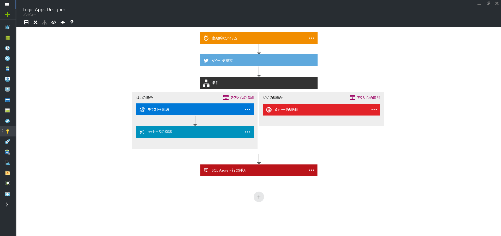

<properties 
	pageTitle="Logic Apps とは" 
	description="App Service Logic Apps ついてさらに詳しく説明します" 
	authors="kevinlam1" 
	manager="dwrede" 
	editor="" 
	services="app-service\logic" 
	documentationCenter=""/>

<tags
	ms.service="app-service-logic"
	ms.workload="na"
	ms.tgt_pltfrm="na"
	ms.devlang="na"
	ms.topic="hero-article" 
	ms.date="04/07/2016"
	ms.author="klam"/>

#Logic Apps とは

| クイック リファレンス |
| --------------- |
| [Logic Apps の定義言語](https://msdn.microsoft.com/library/azure/mt643789.aspx) |
| [Logic Apps のマネージ API 関連ドキュメント](https://azure.microsoft.com/documentation/articles/apis-list) |
| [Logic Apps フォーラム](https://social.msdn.microsoft.com/Forums/home?forum=azurelogicapps) |

Azure App Service は、Web アプリ、モバイル アプリ、統合アプリの作成を容易にする、開発者向けの完全に管理された PaaS (サービスとしてのプラットフォーム) です。Logic Apps はこのスイートの一部であり、技術系ユーザーや開発者が、使いやすいビジュアル デザイナーを使用してビジネス プロセスの実行とワークフローを自動化できます。

特に、Logic Apps を組み込みの[マネージ API][managedapis] と組み合わせることで、扱いが難しい統合シナリオも簡単に解決できるようになります。

既に説明したように、Logic Apps を使うと、ビジネス プロセスを自動化できます。いくつかの例を次に示します。
 
* SQL DB の新しいレコードを自動的にレプリケートし、フロント デスクにメールを送信できます。   
* ネガティブなツイートを自動的に検出し、スラック チャネルに送信できます。

こうしたシナリオはすべてビジュアル デザイナーで、コードを 1 行も記述することなく構成できます。[ロジック アプリの構築を今すぐ開始][create]しましょう。

## なぜ Logic Apps か

開発者は Logic Apps を使用することで、トリガーで開始され、一連のステップを実行するワークフローを設計できます。各ステップでは、認証とベスト プラクティス (チェックポイント処理や永続的な実行など) に確実に対処しながら、API を呼び出します。

ビジネス プロセスの自動化 (ネガティブなツイートを検出して組織内のスラック チャネルに送信する、SQL の新しい顧客レコードが到着したら、そのレコードを CRM システムにレプリケートするなど) が必要な場合、Logic Apps を使用すると、クラウドからオンプレミスに異なるデータ ソースを簡単に統合できます。[マネージ API][managedapis] について確認して何かひらめいたら、[作業を開始][create]して実際に何ができるか確かめましょう。

さらに、[BizTalk マネージ API][biztalk] では、[ルール エンジン][rules]や[取引先管理][tpm]など、数多くの機能を利用して統合シナリオを拡張することができます。

- **使いやすいデザイン ツール** - Logic Apps は、ブラウザーで全体を設計することができます。トリガーで開始 - 単純なスケジュールから会社についてのツイートが表示される各タイミングまで。次に、豊富なコネクタのギャラリーを使用して必要な数のアクションを調整します。

- **SaaS を簡単に構成** - 簡単に説明できるような構成タスクでさえ、コードとして実装するには困難が伴います。Logic Apps を使用すれば異なるシステムへの接続も簡単です。Facebook や Twitter アカウントのアクティビティに基づいて CRM ソフトウェアにタスクを作成しようとしていますか? クラウド マーケティング ソリューションをオンプレミスの請求書作成システムに接続しようとしていますか? Logic Apps は、これらの問題にソリューションを提供する、最も迅速で信頼できる手段です。

- **テンプレートからすばやく開始** - 作業開始を手助けするため、一般的なソリューションを速やかに作成できる[テンプレート ギャラリー][templates]が用意されています。高度な BizTalk ソリューションから単純な SaaS 接続まであるうえ、単なる 'お遊び用' のものも用意しています。Logic Apps の能力を理解するには、このギャラリーが一番の近道です。

- **組み込みの拡張機能** - 必要な API が見つかりませんか? Logic Apps は、API Apps と連携するように設計されています。独自の API アプリを作成してカスタム API として簡単に使用できます。自分だけの新しいアプリを作成するか、Marketplace で共有して収益化してください。

- **真の統合能力** - 手軽に始めて必要に応じて拡張できます。Logic Apps は、Microsoft の業界屈指の統合ソリューション、BizTalk の能力を統合担当者が簡単に利用して必要なソリューションを構築できるようにしています。[Logic Apps で提供される BizTalk の機能][biztalk]について、詳細を確認してください。

## Logic Apps の概念

Logic Apps の機能を構成する主な要素とは次のとおりです。

- **ワークフロー** - Logic Apps では、ビジネス プロセスを一連の手順やワークフローとしてグラフィカルにモデル化できます。
- **マネージ API** - ロジック アプリにはデータとサービスへのアクセスが必要です。マネージ API は、データへの接続とデータの操作を補助するために、特別に作成されます。現時点で使用できる API の一覧については、「[Logic Apps で使用するコネクタと API Apps の一覧][managedapis]」をご覧ください。
- **トリガー** - 一部のマネージ API は、トリガーとしても動作します。トリガーは、電子メールや Azure のストレージ アカウントの変更の到着などの特定のイベントに基づいて、ワークフローの新しいインスタンスを開始します。
-  **アクション** - ワークフローにおけるトリガーの後の各ステップは、アクションと呼ばれます。通常、各アクションはマネージ API アプリまたはカスタム API アプリでの操作にマップされます。
- **BizTalk** - Logic Apps には、高度な統合シナリオ向けに Biztalk の機能が含まれています。Biztalk は、マイクロソフトの業界屈指の統合プラットフォームです。BizTalk API Apps により、Logic Apps ワークフローに検証、変換、ルールなどを簡単に含めることができます。詳細については、[BizTalk API Apps とは何か][biztalk]を説明しているページを参照してください。

## Getting Started (概要)  

 - Logic Apps の使用を開始するには、[ロジック アプリの作成][create]に関するページのチュートリアルに従ってください。  
 - [Logic Apps を使用してビジネス プロセスを自動化する](http://channel9.msdn.com/Events/Build/2016/T694) 
 - [Logic Apps を使用してシステムを統合する方法を説明する](http://channel9.msdn.com/Events/Build/2016/P462)
- Azure App Service プラットフォームの詳細については、[Azure App Service][appservice] に関するページを参照してください。

[biztalk]: app-service-logic-what-are-biztalk-api-apps.md
[appservice]: ../app-service/app-service-value-prop-what-is.md
[create]: app-service-logic-create-a-logic-app.md
[managedapis]: ../connectors/apis-list.md
[tpm]: app-service-logic-create-a-trading-partner-agreement.md
[rules]: app-service-logic-use-biztalk-rules.md
[templates]: app-service-logic-use-logic-app-templates.md

<!---HONumber=AcomDC_0413_2016-->