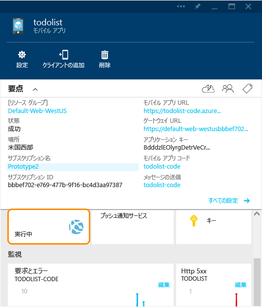
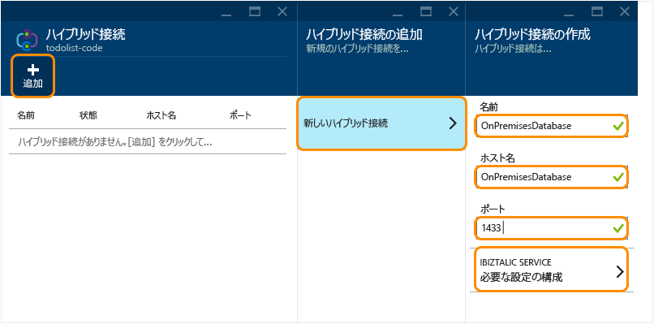
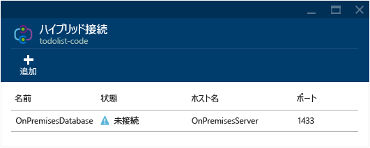
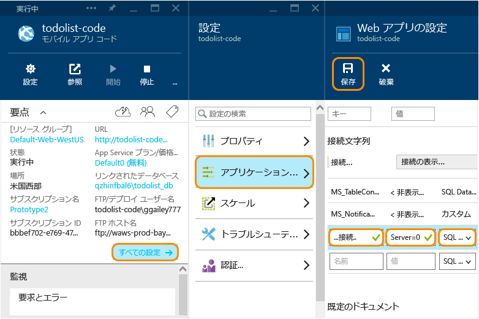

<properties
	pageTitle="ハイブリッド接続を使用して Azure Mobile App をオンプレミスの SQL Server に接続する | Microsoft Azure"
	description="ハイブリッド接続を使用して App Service Mobile App からオンプレミスの SQL Server に接続する方法について説明します。"
	services="app-service\mobile"
	documentationCenter=""
	authors="ggailey777"
	manager="dwrede"
	editor=""/>

<tags
	ms.service="app-service-mobile"
	ms.workload="na"
	ms.tgt_pltfrm="na"
	ms.devlang="multiple"
	ms.topic="get-started-article"
	ms.date="07/30/2015"
	ms.author="glenga"/>

# ハイブリッド接続を使用して Mobile Apps からオンプレミスの SQL Server に接続する

企業がクラウドに移行するときに、すべてのアセットを Azure にすぐに移行できない場合があります。ハイブリッド接続は、Azure App Service の Mobile Apps 機能がオンプレミスのアセットに安全に接続できるようにします。この方法で、モバイル クライアントが Azure を使用することによってオンプレミスのデータにアクセスできるようにします。サポートされているアセットには、Microsoft SQL Server、MySQL、HTTP Web APIs、およびほとんどのカスタム Web サービスなど、静的 TCP ポートで実行されるすべてのリソースが含まれます。ハイブリッド接続では、共有アクセス署名 (SAS) 認証を使用して、モバイル サービスとオンプレミスの Hybrid Connection Manager からハイブリッド接続への接続を保護します。詳細については、[ハイブリッド接続の概要](../integration-hybrid-connection-overview.md)を参照してください。

このチュートリアルでは、サービスでプロビジョニングされた既定の Azure SQL Database の代わりに、ローカルのオンプレミスの SQL Server データベースを使用するように Mobile App の .NET バックエンドを変更する方法について説明します。

[AZURE.INCLUDE [app-service-mobile-to-web-and-api](../../includes/app-service-mobile-to-web-and-api.md)]

## 前提条件 ##

このチュートリアルを完了するには、次のものが必要です。

- **既存の Mobile App バックエンド**  新しい .NET バックエンドの Mobile App を作成し、[Azure ポータル]からダウンロードするには、「[Windows アプリを作成する](app-service-mobile-dotnet-backend-windows-store-dotnet-get-started-preview.md)」に従ってください。

[AZURE.INCLUDE [hybrid-connections-prerequisites](../../includes/hybrid-connections-prerequisites.md)]

## SQL Server Express をインストールし、TCP/IP を有効にして、オンプレミスの SQL Server データベースを作成する

[AZURE.INCLUDE [hybrid-connections-create-on-premises-database](../../includes/hybrid-connections-create-on-premises-database.md)]

## ハイブリッド接続を作成する

モバイル アプリ バックエンドのコード部分 (Web アプリ) 用の新しいハイブリッド接続と BizTalk サービスを作成する必要があります。

1. [Azure ポータル] で、Mobile App を参照し、Web アプリ バックエンド ボタンをクリックします。

	

	これで、Mobile App バックエンド コードを実装する Web アプリに移動します (Mobile App の名前の後ろに `-code` が続きます)。

2. Web アプリのブレードを下にスクロールし、**[ハイブリッド接続]** をクリックします。

	

2. [ハイブリッド接続] ブレードで、**[追加]**、**[新しいハイブリッド接続]** の順にクリックします。

3. **[ハイブリッド接続の作成]** ブレードで、作成するハイブリッド接続の **[名前]** と **[ホスト名]** を指定し、**[ポート]** を [`1433`] に設定します。

	

4. **[Biz Talk Service]** をクリックし、BizTalk サービスの名前を入力し、**[OK]** をクリックします。

	このチュートリアルでは **mobile1** を使用します。新しい BizTalk サービスには一意の名前を指定する必要があります。

	処理が完了すると、**[通知]** 領域に緑色の "**SUCCESS**" という文字が点滅します。**[ハイブリッド接続]** ブレードには、状態が **[未接続]** の新しいハイブリッド接続が表示されます。

	

これで、クラウド ハイブリッド接続インフラストラクチャの重要な部分が完了しました。次に、対応するオンプレミスの部分を作成します。

## オンプレミスの Hybrid Connection Manager をインストールして接続を完了する

[AZURE.INCLUDE [app-service-hybrid-connections-manager-install](../../includes/app-service-hybrid-connections-manager-install.md)]

## SQL Server データベースに接続する Mobile App バックエンド プロジェクトを構成する

このステップでは、オンプレミスのデータベースに接続するための接続文字列を定義し、この接続を使用するように Mobile App バックエンドを変更します。

1. Visual Studio 2013 で、Mobile App バックエンドを定義するプロジェクトを開きます。

	.NET バックエンド プロジェクトのダウンロード方法については、「[Windows アプリを作成する](app-service-mobile-dotnet-backend-windows-store-dotnet-get-started-preview.md)」を参照してください。

2. ソリューション エクスプローラーで、Web.config ファイルを開き、 **connectionStrings** セクションを探し、次のような新しい SqlClient エントリを追加します。このエントリはオンプレミスの SQL Server データベースを指しています。

	    <add name="OnPremisesDBConnection"
         connectionString="Data Source=OnPremisesServer,1433;
         Initial Catalog=OnPremisesDB;
         User ID=HybridConnectionLogin;
         Password=<**secure_password**>;
         MultipleActiveResultSets=True"
         providerName="System.Data.SqlClient" />

	文字列内の `<**secure_password**>` は、*HbyridConnectionLogin* 用に作成したパスワードに置き換えてください。

3. Visual Studio で **[保存]** をクリックして、Web.config ファイルを保存します。

	> [AZURE.NOTE]この接続設定は、ローカル コンピューターで実行されるときに使用されます。Azure で実行される場合、この設定は、ポータルで定義された接続設定によってオーバーライドされます。

4. **Models** フォルダーを展開し、*Context.cs* で終わるデータ モデル ファイルを開きます。

6. **DbContext** を、値 `OnPremisesDBConnection` をベース **DbContext** コンストラクターに渡すように変更します。次のスニペットに似ています。

        public class hybridService1Context : DbContext
        {
            public hybridService1Context()
                : base("OnPremisesDBConnection")
            {
            }
        }

	これで、サービスは、SQL Server データベースへの新しい接続を使用するようになります。

## オンプレミスの接続文字列を使用するように Azure を更新する

次に、この新しい接続文字列用のアプリ設定を追加して、Azure から使用できるようにする必要があります。

1. [Azure ポータル]で Mobile App 用の Web アプリ バックエンド コードに戻り、**[すべての設定]**、**[アプリケーション設定]** の順にクリックします。

3. **[Web アプリの設定]** ブレードで、下にスクロールして **[接続文字列]** を表示し、`OnPremisesDBConnection` という名前の `Server=OnPremisesServer,1433;Database=OnPremisesDB;User ID=HybridConnectionsLogin;Password=<**secure_password**>` などの値が指定された新しい **SQL Server** 接続文字列を追加します。

	`<**secure_password**>` を、オンプレミスのデータベースのセキュリティ保護されたパスワードに置き換えます。

	

2. **[保存]** をクリックして、今作成したハイブリッド接続と接続文字列を保存します。

## Mobile App バックエンドを Azure に発行してテストする

最後に、Mobile App バックエンドを Azure に発行し、ハイブリッド接続を使用してオンプレミスのデータベースにデータを格納することを検証します。

3. Visual Studio でプロジェクトを右クリックし、**[発行]**、**[Web の発行]**、**[Microsoft Azure Websites]** の順にクリックします。

	Visual Studio の代わりに、[Git を使用してバックエンドを発行する](mobile-services-dotnet-backend-store-code-source-control.md)こともできます。

2. Azure の資格情報でサインインし、**[既存の Web サイトの選択]** から目的のサービスを選択します。

	Visual Studio によって、Azure から直接、発行設定がダウンロードされます。

3. 最後に、**[発行]** をクリックします。

	発行が完了すると、サービスが再起動し、バックエンド スタート ページが表示されます。

4. スタート ページの **[今すぐ試す]** ボタンまたは Mobile App に接続されるクライアント アプリを使用して、データベースの変更を生成するいくつかの操作を呼び出します。

	>[AZURE.NOTE] **[今すぐ試す]** ボタンを使用して API のヘルプ ページを起動する場合は、アプリケーション キーをパスワードとして指定します (ユーザー名は空白にします)。

4. SQL Server Management Studio で、SQL Server インスタンスに接続し、オブジェクト エクスプローラーを開き、**OnPremisesDB** データベースを展開し、**[テーブル]** を展開します。

5. **hybridService1.TodoItems** テーブルを右クリックし、**[先頭の 1000 行を選択]** をクリックすると、結果が表示されます。

	クライアント アプリで発生した変更が、Mobile App バックエンドによって、ハイブリッド接続を使用して、オンプレミスのデータベースに保存されていることに注意してください。

## 関連項目 ##

+ [ハイブリッド接続の Web サイト](../../services/biztalk-services/)
+ [ハイブリッド接続の概要](../integration-hybrid-connection-overview.md)
+ [BizTalk Services: [ダッシュボード]、[監視]、[スケール]、[構成]、および [ハイブリッド接続] タブ](../biztalk-dashboard-monitor-scale-tabs.md)
+ [データ モデルの変更を .NET バックエンド モバイル サービスに加える方法](../mobile-services-dotnet-backend-how-to-use-code-first-migrations.md)

<!-- IMAGES -->

<!-- Links -->
[Azure ポータル]: https://portal.azure.com/
[Azure Management Portal]: http://go.microsoft.com/fwlink/p/?linkid=213885
[Get started with Mobile Services]: ../mobile-services-dotnet-backend-windows-store-dotnet-get-started.md

<!---HONumber=Oct15_HO4-->