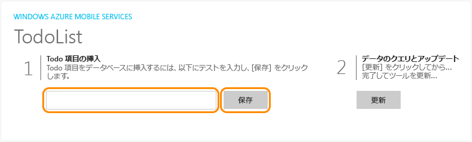
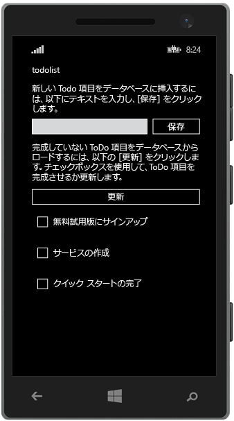

<properties
	pageTitle="Azure Mobile Apps での Windows Runtime 8.1 ユニバーサル アプリの作成"
	description="このチュートリアルでは、C#、VB、または JavaScript で Windows ストア用の開発を行う場合に Azure モバイル アプリ バックエンドを使用する方法を示します。"
	services="app-service\mobile"
	documentationCenter="windows"
	authors="ggailey777"
	manager="dwrede"
	editor=""/>

<tags
	ms.service="app-service-mobile"
	ms.workload="mobile"
	ms.tgt_pltfrm="mobile-windows"
	ms.devlang="dotnet"
	ms.topic="hero-article"
	ms.date="08/14/2015"
	ms.author="glenga"/>

#Create a Windows app (Windows アプリの作成)

[AZURE.INCLUDE [app-service-mobile-selector-get-started-preview](../../includes/app-service-mobile-selector-get-started-preview.md)]&nbsp;[AZURE.INCLUDE [app-service-mobile-note-mobile-services-preview](../../includes/app-service-mobile-note-mobile-services-preview.md)]

##概要

このチュートリアルでは、Azure モバイル アプリ バックエンドを使用して Windows Runtime 8.1 ユニバーサル アプリにクラウドベースのバックエンド サービスを追加する方法を示します。ユニバーサル Windows アプリ ソリューションには、Windows ストア 8.1 と Windows Phone ストア 8.1 の両方のアプリのプロジェクトと、共通の共有プロジェクトが含まれます。

[AZURE.INCLUDE [app-service-mobile-windows-universal-get-started-preview](../../includes/app-service-mobile-windows-universal-get-started-preview.md)]

##前提条件

このチュートリアルを完了するには、以下が必要です。

* アクティブな Azure アカウントアカウントがない場合、Azure 試用版にサインアップして、最大 10 件の無料モバイル アプリを入手できます。このアプリは評価終了後も使用できます。詳細については、[Azure の無料試用版サイト](http://azure.microsoft.com/pricing/free-trial/)を参照してください。

* [Visual Studio Community 2013] 以降のバージョン。

>[AZURE.NOTE]Azure アカウントにサインアップする前に Azure App Service を実際に使ってみるには、[App Service の試用](http://go.microsoft.com/fwlink/?LinkId=523751&appServiceName=mobile)に関するページにアクセスしてください。App Service で、有効期限付きのスターター モバイル アプリをすぐに作成できます。このサービスの利用にあたり、クレジット カードは必要ありません。契約も必要ありません。

##新しい Azure Mobile App バックエンドの作成

[AZURE.INCLUDE [app-service-mobile-dotnet-backend-create-new-service-preview](../../includes/app-service-mobile-dotnet-backend-create-new-service-preview.md)]

## サーバー プロジェクトのダウンロード

1. [Azure ポータル]で **[すべて参照]**、**[Web Apps]** の順にクリックし、作成した Mobile App バックエンドをクリックします。 

2. Mobile App バックエンドで、**[すべての設定]** をクリックし、**[Mobile App]** の下で **[クイック スタート]**、**[Windows (C#)]** の順にクリックします。

3. **[新しいアプリの作成]** の **[サーバー プロジェクトをダウンロードして実行する]** の下で **[ダウンロード]** をクリックし、圧縮されたプロジェクト ファイルをローカル コンピューターに抽出して、Visual Studio でソリューションを開きます。

4. プロジェクトをビルドして、NuGet パッケージを復元します。

##Azure へのサーバー プロジェクトの発行

[AZURE.INCLUDE [app-service-mobile-dotnet-backend-publish-service-preview](../../includes/app-service-mobile-dotnet-backend-publish-service-preview.md)]

##クライアント プロジェクトのダウンロードおよび実行

モバイル アプリ バックエンドを作成すると、Azure ポータルの簡単なクイック スタートに従って、新しいアプリケーションを作成するか、既存のアプリケーションを変更してモバイル アプリ バックエンドに接続することができます。

このセクションでは、Azure Mobile App バックエンドに接続するようにカスタマイズされたユニバーサル Windows アプリ テンプレート プロジェクトをダウンロードします。

1. Mobile App バックエンドのブレードに戻り、**[すべての設定]** をクリックし、**[Mobile App]** の下で **[クイック スタート]**、**[Windows (C#)]** の順にクリックします。 

2.  **[新しいアプリの作成]** の **[HTML/Javascript プロジェクトをダウンロードして実行する]** の下で **[ダウンロード]** をクリックし、圧縮されたプロジェクト ファイルをローカル コンピューターに保存します。
  
3. (省略可能) サーバー プロジェクトとともに、ユニバーサル Windows アプリ プロジェクトをソリューションに追加します。これにより、必要であれば、同じ Visual Studio ソリューションでアプリとバックエンドの両方をより簡単にデバッグおよびテストできるようになります。

4. Windows Store アプリをスタートアップ プロジェクトとして使用し、F5 キーを押してプロジェクトを再作成して、Windows Store アプリを開始します。

5. アプリで、**[Insert a TodoItem]** テキスト ボックスに意味のあるテキスト (たとえば、「*チュートリアルの完了*」) を入力し、**[Save]** をクリックします。

	

	これで、Azure でホストされている新しいモバイル アプリ バックエンドに POST 要求が送信されます。

6. デバッグを停止し、`<your app name>.WindowsPhone` プロジェクトを右クリックして、**[スタートアップ プロジェクトに設定]** をクリックしてから F5 キーをもう一度押します。

	

	Windows アプリの開始後に、前の手順で保存したデータがモバイル アプリから読み込まれることに注目してください。

##次のステップ

* [アプリへの認証の追加](app-service-mobile-dotnet-backend-windows-store-dotnet-get-started-users-preview.md)  ID プロバイダーを使用してアプリケーションのユーザーを認証する方法について説明します。

* [アプリケーションにプッシュ通知を追加する](app-service-mobile-dotnet-backend-windows-store-dotnet-get-started-push-preview.md)  アプリにごく基本的なプッシュ通知を送信する方法について説明します。

<!-- Anchors. -->
<!-- Images. -->
<!-- URLs. -->
[Get started with authentication]: app-service-mobile-dotnet-backend-windows-store-dotnet-get-started-users-preview.md
[Mobile App SDK]: http://go.microsoft.com/fwlink/?LinkId=257545
[Azure ポータル]: https://portal.azure.com/

[Visual Studio Community 2013]: https://go.microsoft.com/fwLink/p/?LinkID=534203
 

<!---HONumber=August15_HO8-->