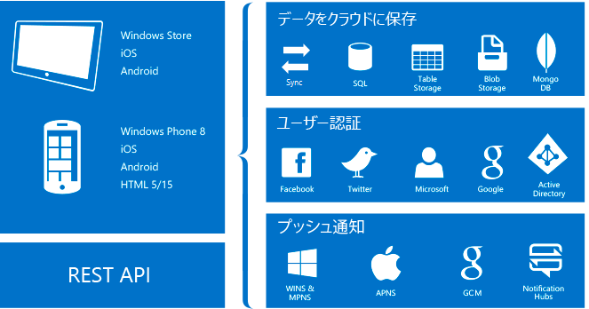

# Azure App Service の Mobile Apps について
Azure App Service は、プロの開発者のためのフル マネージドの[サービスとしてのプラットフォーム](https://azure.microsoft.com/overview/what-is-paas/) (PaaS) 製品であり、 Web、モバイル、および統合シナリオ向けに豊富な機能を提供します。 

Azure App Service の Mobile Apps 機能は、エンタープライズ開発者とシステム インテグレーター向けの、スケーラブルでグローバルに利用できるモバイル アプリケーション開発プラットフォームです。

## モバイル アプリを使用する理由
Mobile Apps の機能を使ってできることを次に示します。

* **ネイティブ アプリとクロスプラットフォーム アプリの構築**:iOS、Android、Windows のネイティブ アプリを構築する場合でも、Xamarin や Cordova (PhoneGap) のクロスプラットフォーム アプリを構築する場合でも、ネイティブ SDK を使用して App Service を活用することができます。
* **エンタープライズ システムへの接続**:Mobile Apps の機能を使用して、企業へのサインインを数分で追加し、企業のオンプレミス リソースまたはクラウド リソースに接続することができます。
* **データ同期を使用したオフライン対応アプリの構築**:オフラインでも動作し、接続時には Mobile Apps を使用して企業のデータ ソースや SaaS (サービスとしてのソフトウェア) API とバックグラウンドでデータを同期するアプリを構築することにより、モバイル ユーザーの生産性が向上します。
* **瞬時に多数のユーザーへプッシュ通知**:顧客のニーズに合わせてカスタマイズされ、適切なタイミングで送信される、任意のデバイスへの即時のプッシュ通知によって顧客の関心を引きます。

## Mobile Apps の機能
クラウド対応のモバイル開発には次の機能が重要です。

* **認証と承認**:Azure Active Directory など、エンタープライズ認証用の ID プロバイダーに加え、Facebook、Google、Twitter、Microsoft アカウントなど、ソーシャル プロバイダーがサポートされます。 Mobile Apps は、各プロバイダーに対して OAuth 2.0 サービスを提供します。 また、プロバイダー固有の機能を実現するために、ID プロバイダーの SDK を統合することもできます。

    [認証機能]の詳細を確認してください。

* **データ アクセス**:Mobile Apps では、Azure SQL Database またはオンプレミス SQL Server にリンクされた、モバイル対応の OData v3 データ ソースが提供されます。 このサービスは Entity Framework に基づいているため、他の NoSQL および SQL データ プロバイダー ([Azure Table Storage]、MongoDB、[Azure Cosmos DB] など) や SaaS API プロバイダー (Office 365、Salesforce.com など) と簡単に統合できます。

* **オフライン同期**:クライアント SDK を使用することで、オフライン データセットを操作する堅牢で応答性の高いモバイル アプリケーションを簡単に構築できます。 このデータ セットは、競合解決のサポートも含め、バックエンド データと自動的に同期できます。

  [データ機能]の詳細を確認してください。

* **プッシュ通知**:クライアント SDK は Azure Notification Hubs の登録機能とシームレスに統合されます。これにより、数百万人のユーザーにプッシュ通知を同時に送信できます。

  [プッシュ通知機能]の詳細を確認してください。

* **クライアント SDK**:ネイティブ開発 ([iOS]、[Android]、[Windows])、クロスプラットフォーム開発 ([Xamarin.iOS と Xamarin.Android]、[Xamarin.Forms])、ハイブリッド アプリケーション開発 ([Apache Cordova]) に対応したクライアント SDK の完全なセットが用意されています。 各クライアント SDK は、オープンソースであり、MIT ライセンスで使用できます。

## Azure App Service の機能
次のプラットフォーム機能は、モバイル運用サイトに役立ちます。

* **自動スケール**:App Service では、スケールアップやスケールアウトをすばやく実行して、将来の顧客負荷に対処することができます。 VM の数やサイズを手動で選択するか、負荷またはスケジュールに基づいてモバイルアプリ バックエンドのスケール設定を行うように自動スケールを設定します。

  [自動スケール]の詳細を確認してください。

* **ステージング環境**:App Service では、サイトの複数のバージョンを実行できるため、A/B テスト、大規模な DevOps 計画の一環としての運用環境でのテスト、新しいバックエンドのインプレース ステージングを実行できます。

  [ステージング環境]の詳細を確認してください。

* **継続的なデプロイ**:App Service は一般的な "_ソース コントロール管理_" (SCM) システムと統合できるため、新しいバージョンのバックエンドを簡単にデプロイすることができます。

  [デプロイ オプション](../app-service/deploy-local-git.md)の詳細を確認してください。

* **仮想ネットワーク**:App Service は、仮想ネットワーク、Azure ExpressRoute、またはハイブリッド接続を使用してオンプレミスのリソースに接続できます。

  [ハイブリッド接続]、[仮想ネットワーク]、[ExpressRoute] の詳細をご覧ください。

* **分離/専用環境**:App Service は、Azure App Service アプリを安全に実行するために、完全に分離された専用環境で実行できます。 この環境は、高スケール、分離、またはセキュリティで保護されたネットワーク アクセスを必要とするアプリケーション ワークロードに最適です。

  [App Service 環境]の詳細を確認してください。

## 次の手順

Azure App Service の Mobile Apps の使用を開始するには、[作業の開始]に関するチュートリアルに従ってください。 このチュートリアルでは、モバイル バックエンドと各種クライアントを作成する方法についての基礎を取り上げています。 また、認証、オフライン同期、プッシュ通知の統合についても取り上げています。 このチュートリアルは、クライアント アプリケーションごとに 1 回ずつ、複数回行うことができます。

Mobile Apps の詳細については、[学習マップ]を確認してください。
Azure App Service プラットフォームの詳細については、[Azure App Service] に関するページを参照してください。

<!-- URLs. -->
[Migrate your mobile service to App Service]: app-service-mobile-migrating-from-mobile-services.md
[作業の開始]: app-service-mobile-ios-get-started.md
[Azure Table Storage]:../cosmos-db/table-storage-how-to-use-dotnet.md
[Azure Cosmos DB]: ../cosmos-db/sql-api-get-started.md
[認証機能]: ./app-service-mobile-auth.md
[データ機能]: ./app-service-mobile-offline-data-sync.md
[プッシュ通知機能]: ../notification-hubs/notification-hubs-push-notification-overview.md
[iOS]: ./app-service-mobile-ios-how-to-use-client-library.md
[Android]: ./app-service-mobile-android-how-to-use-client-library.md
[Windows]: ./app-service-mobile-dotnet-how-to-use-client-library.md
[Xamarin.iOS と Xamarin.Android]: ./app-service-mobile-dotnet-how-to-use-client-library.md
[Xamarin.Forms]: ./app-service-mobile-xamarin-forms-get-started.md
[Apache Cordova]: ./app-service-mobile-cordova-how-to-use-client-library.md
[自動スケール]: ../app-service/web-sites-scale.md
[ステージング環境]: ../app-service/deploy-staging-slots.md
[ハイブリッド接続]: ../biztalk-services/integration-hybrid-connection-overview.md
[仮想ネットワーク]: ../app-service/web-sites-integrate-with-vnet.md
[ExpressRoute]: ../app-service/environment/app-service-app-service-environment-network-configuration-expressroute.md
[App Service 環境]: ../app-service/environment/intro.md
[学習マップ]: https://azure.microsoft.com/documentation/learning-paths/appservice-mobileapps/
