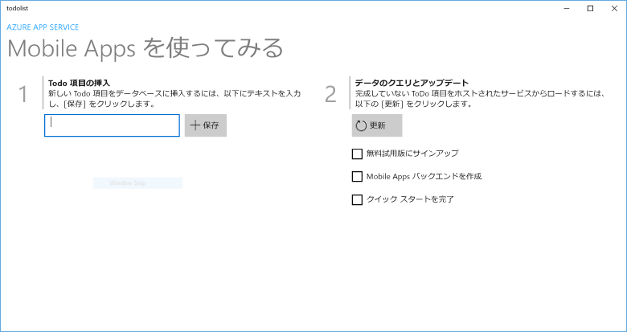

# Create a Windows app (Windows アプリの作成)

[!INCLUDE [app-service-mobile-selector-get-started](../../includes/app-service-mobile-selector-get-started.md)]

## 概要

このチュートリアルでは、Universal Windows Platform (UWP) アプリにクラウドベースのバックエンド サービスを追加する方法を示します。 詳細については、「 [モバイル アプリとは](app-service-mobile-value-prop.md)」を参照してください。 次に示すのは、完了したアプリの画面キャプチャです。

UWP アプリの他のすべての Mobile Apps チュートリアルを行う前に、このチュートリアルを完了する必要があります。

## 前提条件

このチュートリアルを完了するには、以下が必要です。

* アクティブな Azure アカウントアカウントがない場合、Azure 試用版にサインアップして、最大 10 件の無料モバイル アプリを入手できます。 このアプリは評価終了後も使用できます。 詳細については、 [Azure の無料試用版サイト](https://azure.microsoft.com/pricing/free-trial/)を参照してください。
* [Visual Studio Community 2017]。

## 新しい Azure Mobile App バックエンドの作成

新しいモバイル アプリ バックエンドを作成するには、次の手順に従います。

[!INCLUDE [app-service-mobile-dotnet-backend-create-new-service](../../includes/app-service-mobile-dotnet-backend-create-new-service.md)]

これで、モバイル クライアント アプリケーションで使用できる Azure モバイル アプリ バックエンドのプロビジョニングが完了しました。 次は、簡単な "todo list" バックエンドのサーバー プロジェクトをダウンロードして、それを Azure に発行します。

## サーバー プロジェクトの構成

[!INCLUDE [app-service-mobile-configure-new-backend.md](../../includes/app-service-mobile-configure-new-backend.md)]

## クライアント プロジェクトのダウンロードおよび実行

モバイル アプリ バックエンドを構成した後は、新しいクライアント アプリを作成したり、既存のアプリを Azure に接続するように変更したりできます。 このセクションでは、モバイル アプリ バックエンドに接続するようにカスタマイズされた UWP サンプル アプリ プロジェクトをダウンロードします。

1. モバイル アプリ バックエンドの **[クイック スタート]** ブレードに戻り、**[新しいアプリの作成]**  >  **[ダウンロード]** の順にクリックして、圧縮されたプロジェクト ファイルをローカル コンピューターに展開します。

    

2. UWP プロジェクトを開き、F5 キーを押してアプリをデプロイ、実行します。
3. アプリで、**[Insert a TodoItem (TodoItem の挿入)]** ボックスに意味のあるテキスト (たとえば、「"*チュートリアルの完了*"」) を入力し、**[保存]** をクリックします。

    

    これで、Azure でホストされている新しいモバイル アプリ バックエンドに POST 要求が送信されます。

> [!TIP]
> .NET バックエンドを使用している場合、サーバー プロジェクトと同じソリューションに UWP アプリ プロジェクトを追加できます。 これにより、同じ Visual Studio ソリューションでアプリとバックエンドの両方をより簡単にデバッグおよびテストできるようになります。 UWP アプリ プロジェクトをバックエンド ソリューションに追加するには、Visual Studio 2017 を使用する必要があります。

## 次の手順

* [アプリへの認証の追加](app-service-mobile-windows-store-dotnet-get-started-users.md)  
   ID プロバイダーを使用してアプリのユーザーを認証する方法について説明します。
* [アプリへのプッシュ通知の追加](app-service-mobile-windows-store-dotnet-get-started-push.md)  
   アプリにプッシュ通知のサポートを追加して、Azure Notification Hubs を使ってプッシュ通知を送信するようにモバイル アプリ バックエンドを構成する方法について説明します。
* [アプリのオフライン同期の有効化](app-service-mobile-windows-store-dotnet-get-started-offline-data.md)  
  モバイル アプリ バックエンドを使用してオフライン サポートをアプリに追加する方法について説明します。 オフライン同期を使用すると、エンド ユーザーはネットワークにアクセスできなくても、データの表示、追加、変更など、モバイル アプリケーションとやり取りできます。

<!-- Anchors. -->
<!-- Images. -->
<!-- URLs. -->
[Mobile App SDK]: https://go.microsoft.com/fwlink/?LinkId=257545
[Azure portal]: https://portal.azure.com/
[Visual Studio Community 2017]: https://go.microsoft.com/fwLink/p/?LinkID=534203
