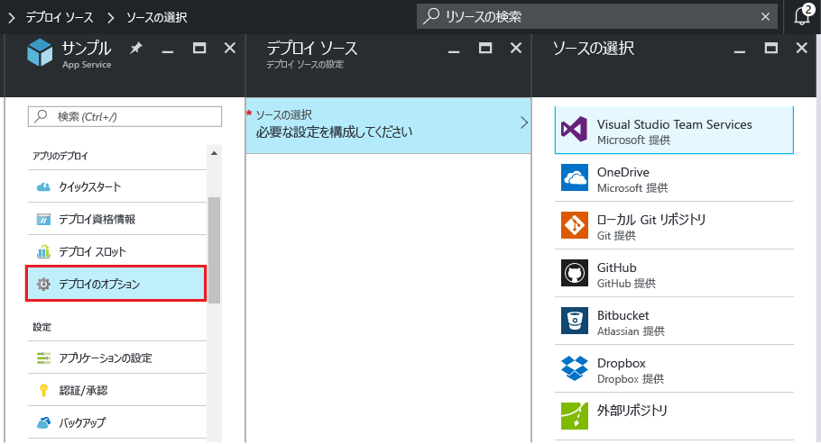
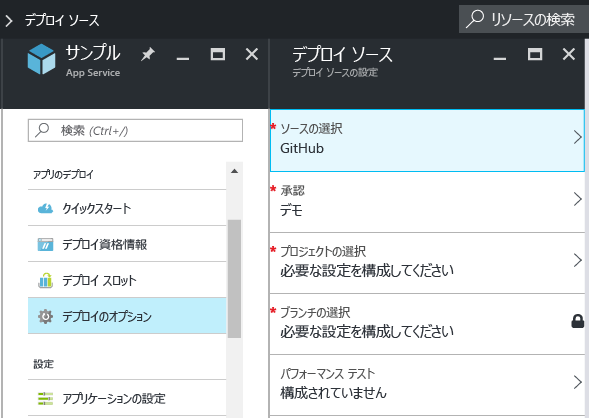
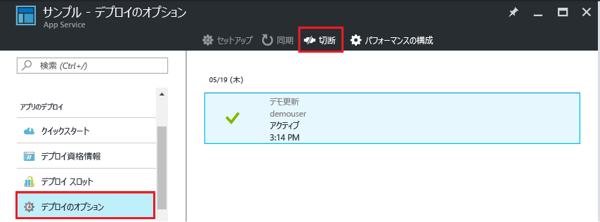

# Azure App Service への継続的なデプロイ
このチュートリアルでは、 [Azure App Service] アプリ向けに継続的なデプロイ ワークフローを構成する方法について説明します。 App Service と BitBucket、GitHub、[Visual Studio Team Services (VSTS)](https://www.visualstudio.com/team-services/) との統合では、Azure で、これらのサービスのいずれかに発行されたプロジェクトから最新の更新プログラムを取り込む場合に、継続的なデプロイのワークフローを有効にすることができます。 複数の頻繁に発生する投稿を統合する場合、継続的なデプロイはプロジェクトに最適なオプションとなります。

Azure Portal で一覧表示されていないクラウド リポジトリ ([GitLab](https://gitlab.com/) など) から継続的なデプロイを手動で構成する方法については、「[Setting up continuous deployment using manual steps (手動による手順を使用した継続的デプロイの設定)](https://github.com/projectkudu/kudu/wiki/Continuous-deployment#setting-up-continuous-deployment-using-manual-steps)」を参照してください。

## 継続的なデプロイの有効化
継続的なデプロイを有効にするには

1. 継続的なデプロイで使用するリポジトリにアプリのコンテンツを発行します。  
    これらのサービスにプロジェクトを発行する方法の詳細については、「[Create a repo (GitHub) (リポジトリの作成 (GitHub))]」、「[Create a repo (BitBucket) (リポジトリの作成 (BitBucket))]」、「[Get started with VSTS (VSTS で作業を始める) (VSTS で作業を始める)]」を参照してください。
2. [Azure Portal] のアプリのメニュー ブレードで、**[アプリのデプロイ] > [デプロイ オプション]** の順にクリックします。 **[ソースの選択]** をクリックし、デプロイ ソースを選択します。  
   
    
   
   > [!NOTE]
   > App Service の VSTS アカウントを構成するには、 [チュートリアル](https://github.com/projectkudu/kudu/wiki/Setting-up-a-VSTS-account-so-it-can-deploy-to-a-Web-App)を参照してください。
   > 
   > 
3. 認証ワークフロー実行する
4. **[デプロイ ソース]** ブレードで、デプロイ元としてプロジェクトと分岐を選択します。 完了したら **[OK]**をクリックします。
   
    
   
   > [!NOTE]
   > GitHub または Bitbucket を使用して継続的なデプロイメントを有効にする場合、パブリック プロジェクトとプライベート プロジェクトの両方が表示されます。
   > 
   > 
   
    App Service では、選択されたリポジトリとの関連付けを作成し、指定された分岐からファイルを取り込み、App Service アプリ用のリポジトリの複製を保持します。 Azure Portal で VSTS の継続的なデプロイを構成すると、統合では App Service の [Kudu デプロイ エンジン](https://github.com/projectkudu/kudu/wiki)が使用されます。このエンジンは、`git push` ごとにビルド & デプロイ タスクを自動的に実行するようになっています。 VSTS では継続的なデプロイを個別に設定する必要はありません。 このプロセスが完了すると、**[デプロイ オプション]** アプリ ブレードに、アクティブなデプロイが表示されます。これは、デプロイが成功したことを示します。
5. アプリが正常にデプロイされたことを確認するには、Azure Portal でアプリのブレードの上部にある **[URL]** をクリックします。
6. 継続的なデプロイが選択したリポジトリから実行されていることを確認するために、変更をリポジトリにプッシュします。 リポジトリへのプッシュが完了すると、すぐにアプリは更新され、変更が反映されます。 更新がプルされていることは、アプリの **[デプロイ オプション]** ブレードで確認できます。

## Visual Studio ソリューションの継続的なデプロイ
Visual Studio ソリューションを Azure App Service にプッシュすることは、単純な index.html ファイルをプッシュすることと同じくらい簡単です。 App Service のデプロイ プロセスでは、NuGet 依存関係の復元やアプリケーション バイナリの構築などのすべての詳細が合理化されます。 Git リポジトリでコードのみを維持し、App Service デプロイメントで残りを処理する、ソース管理のベスト プラクティスに従うことができます。

Visual Studio ソリューションを App Service にプッシュする手順は、ソリューションとリポジトリを次のように構成するのであれば、 [前のセクション](#overview)と同じです。

* 下図に示す Visual Studio のソース制御オプションを使用して `.gitignore` ファイルを生成するか、または [.gitignore サンプル](https://github.com/github/gitignore/blob/master/VisualStudio.gitignore)に類似したコンテンツを含む `.gitignore` ファイルを手動でリポジトリ ルートに追加します。
  
  
* .sln ファイルをリポジトリ ルートに入れて、ソリューションのディレクトリ ツリー全体をリポジトリに追加します。

説明のとおりにリポジトリを設定し、いずれかのオンライン Git リポジトリからの継続的な発行のために Azure のアプリを構成したら、Visual Studio で ASP.NET アプリケーションをローカルで開発し、オンライン Git リポジトリに変更をプッシュするだけで、コードを継続的にデプロイできます。

## 継続的なデプロイの無効化
継続的なデプロイを無効化するには

1. [Azure Portal] のアプリのメニュー ブレードで、**[アプリのデプロイ] > [デプロイ オプション]** の順にクリックします。 **[デプロイ オプション]** ブレードの **[切断]** をクリックします。
   
    
2. 別のソースからの発行を設定する場合、確認メッセージで **[はい]** を選択した後、アプリのブレードに戻り、**[アプリのデプロイ] > [デプロイ オプション]** の順にクリックします。

## その他のリソース
* [継続的なデプロイに関する一般的な問題の調査方法](https://github.com/projectkudu/kudu/wiki/Investigating-continuous-deployment)
* [How to use PowerShell for Azure (Azure 用の PowerShell を使用する方法)]
* [Mac および Linux 用 Azure コマンド ライン ツールの使用方法]
* [Git に関するドキュメント]
* [プロジェクト Kudu](https://github.com/projectkudu/kudu/wiki)
* [Use Azure to automatically generate a CI/CD pipeline to deploy an ASP.NET 4 app](https://www.visualstudio.com/docs/build/get-started/aspnet-4-ci-cd-azure-automatic) (Azure を使用して、ASP.NET 4 アプリをデプロイする CI/CD パイプラインを自動的に生成する)

> [!NOTE]
> Azure アカウントにサインアップする前に Azure App Service の使用を開始したい場合は、「[Azure App Service アプリケーションの作成](https://azure.microsoft.com/try/app-service/)」を参照してください。そこでは、App Service で有効期間の短いスターター Web アプリをすぐに作成できます。 このサービスの利用にあたり、クレジット カードは必要ありません。契約も必要ありません。
> 
> 

[Azure App Service]: https://azure.microsoft.com/en-us/documentation/articles/app-service-changes-existing-services/
[Azure Portal]: https://portal.azure.com
[VSTS Portal]: https://www.visualstudio.com/en-us/products/visual-studio-team-services-vs.aspx
[Installing Git]: http://git-scm.com/book/en/Getting-Started-Installing-Git
[How to use PowerShell for Azure (Azure 用の PowerShell を使用する方法)]: /powershell/azureps-cmdlets-docs
[Mac および Linux 用 Azure コマンド ライン ツールの使用方法]:../cli-install-nodejs.md
[Git に関するドキュメント]: http://git-scm.com/documentation

[Create a repo (GitHub) (リポジトリの作成 (GitHub))]: https://help.github.com/articles/create-a-repo
[Create a repo (BitBucket) (リポジトリの作成 (BitBucket))]: https://confluence.atlassian.com/display/BITBUCKET/Create+an+Account+and+a+Git+Repo
[Get started with VSTS (VSTS で作業を始める) (VSTS で作業を始める)]: https://www.visualstudio.com/docs/vsts-tfs-overview
[Continuous delivery to Azure using Visual Studio Team Services]: ../articles/cloud-services/cloud-services-continuous-delivery-use-vso.md

