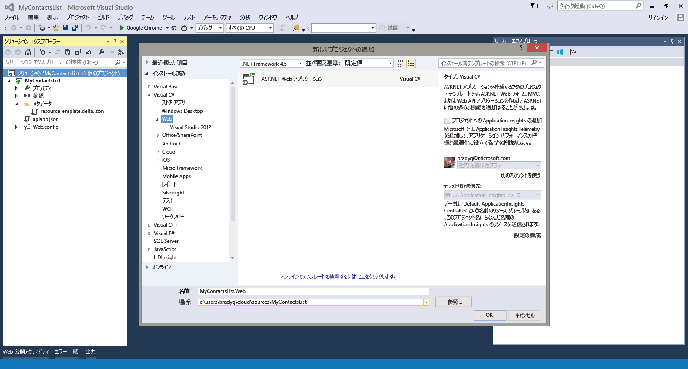
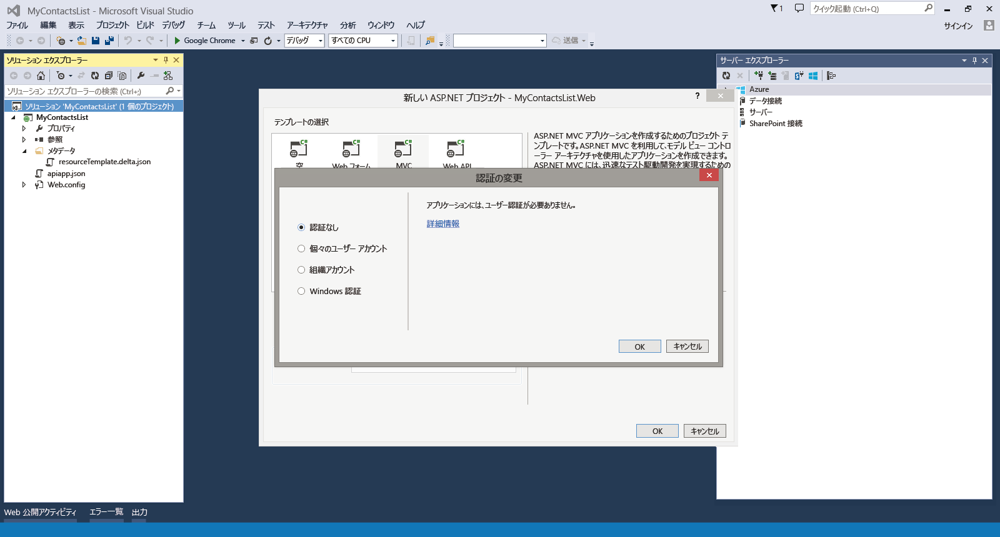
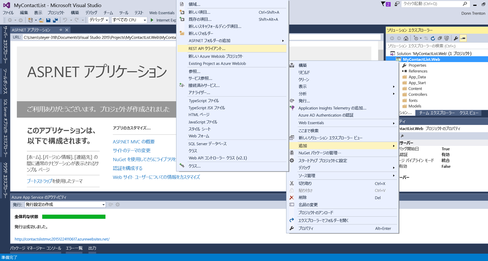
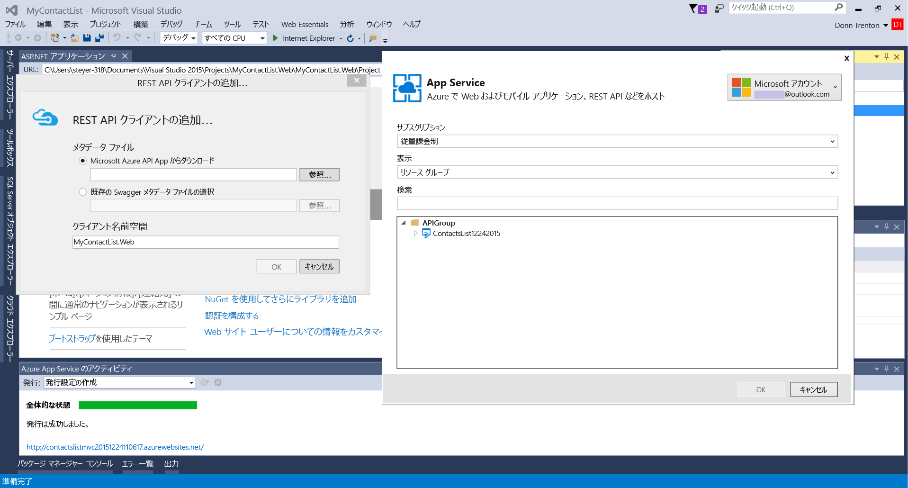
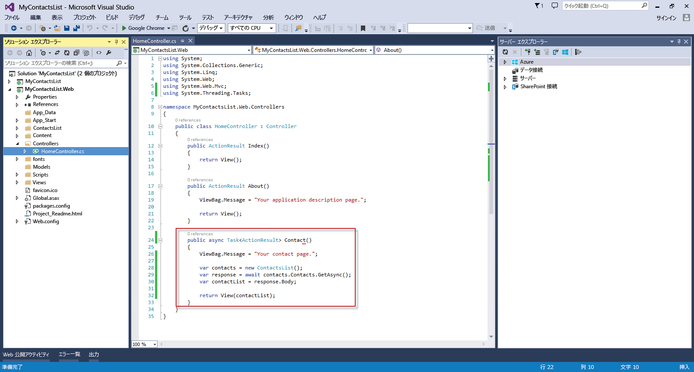
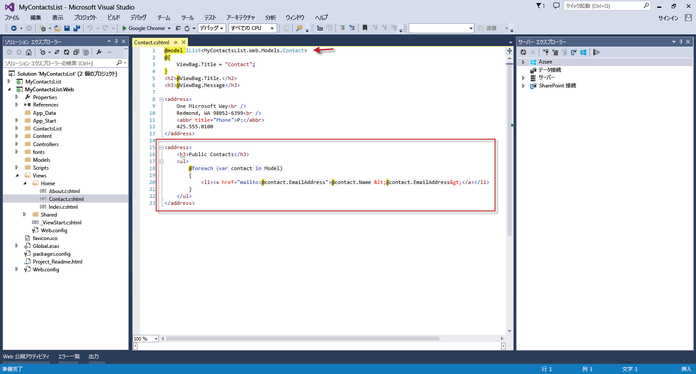

<properties 
	pageTitle="Azure App Service の API アプリに Web アプリを接続する" 
	description="このチュートリアルでは、Azure App Service でホストされる ASP.NET Web アプリから API アプリを使用する方法について示します。" 
	services="app-service\web" 
	documentationCenter=".net" 
	authors="syntaxc4" 
	manager="yochayk" 
	editor="jimbe"/>

<tags
	ms.service="app-service-web"
	ms.devlang="dotnet"
	ms.topic="get-started-article"
	ms.tgt_pltfrm="na"
	ms.workload="na" 
	ms.date="02/26/2016"
	ms.author="cfowler"/>

# Azure App Service の API アプリに Web アプリを接続する

このチュートリアルでは、[App Service](https://azure.microsoft.com/services/app-service/) でホストされる ASP.NET Web アプリから API アプリを使用する方法について示します。

## 前提条件

このチュートリアルは、次の API アプリ チュートリアル シリーズに基づいています。

1. [Azure API アプリの作成](../app-service-dotnet-create-api-app)
3. [Azure API アプリのデプロイ](../app-service-dotnet-deploy-api-app)
4. [Azure API アプリのデバッグ](../app-service-dotnet-remotely-debug-api-app)

## Visual Studio で ASP.NET MVC アプリケーションを作成する

1. Visual Studio を開きます。**[新しいプロジェクト]** ダイアログを使用して、新しい **ASP.NET Web アプリケーション**を追加します。**[OK]** をクリックします。

	

1. **MVC** テンプレートを選択します。**[認証の変更]** をクリックし、**[認証なし]** を選択して **[OK]** を 2 回クリックします。

	

1. ソリューション エクスプローラーで、新しく作成した Web アプリケーション プロジェクトを右クリックし、**[追加]**、**[REST API クライアント]** の順に選択します。

	

1. **[REST API クライアントの追加]** で、[Microsoft Azure API アプリからダウンロード] を選択して、[参照] をクリックし、接続する API アプリを選択します。

	

	>[AZURE.NOTE] API アプリに接続するためのクライアント コードが Swagger API エンドポイントから自動的に生成されます。

1. 生成される API コードを活用するには、HomeController.cs ファイルを開き、`Contact` アクションを次のコードに置き換えます。

	    public async Task<ActionResult> Contact()
        {
            ViewBag.Message = "Your contact page.";

            var contacts = new ContactsList12242015();
            var contactList = await contacts.Contacts.GetAsync();
            
            return View(contactList);
        }

	

1. 連絡先の動的リストを反映するよう、以下のコードで `Contact` ビューを更新します。
	<pre>// ビュー ファイルの最上部に追加
	@model IList&lt;MyContactsList.Web.Models.Contact>
	
	// 既定の電子メール アドレスを以下で置換
	&lt;h3>Public Contacts&lt;/h3>
	&lt;ul>
	    @foreach (var contact in Model)
	    {
	        &lt;li>&lt;a href="mailto:@contact.EmailAddress">@contact.Name &amp;lt;@contact.EmailAddress&amp;gt;&lt;/a>&lt;/li>
	    }
	&lt;/ul> 
	</pre>

	

## App Service の Web Apps に Web アプリケーションをデプロイする

[Azure Web アプリのデプロイ方法](web-sites-deploy.md)に関するページにある手順に従ってください。

>[AZURE.NOTE] Azure アカウントにサインアップする前に Azure App Service の使用を開始する場合は、[App Service の試用](http://go.microsoft.com/fwlink/?LinkId=523751)に関するページにアクセスしてください。App Service で有効期間の短いスターター Web アプリをすぐに作成できます。このサービスの利用にあたり、クレジット カードは必要ありません。契約も必要ありません。

## 変更内容
* Websites から App Service への変更ガイドについては、「[Azure App Service と既存の Azure サービス](http://go.microsoft.com/fwlink/?LinkId=529714)」を参照してください。
 

<!-----HONumber=AcomDC_0302_2016-->