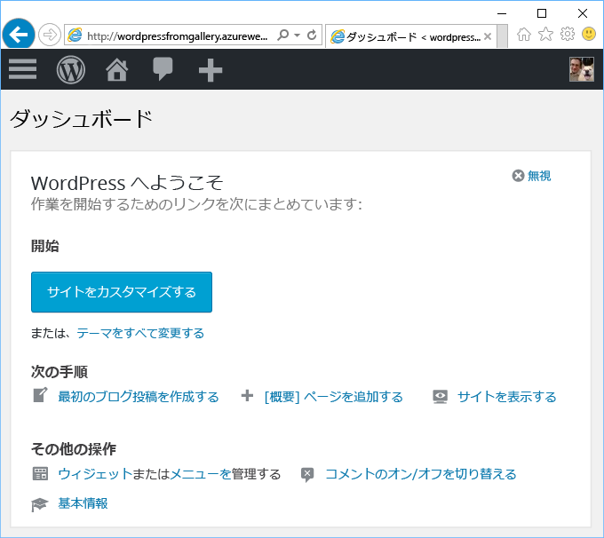

# Azure Marketplace から Web アプリを作成する
<!-- Note: This article replaces web-sites-php-web-site-gallery.md -->

[!INCLUDE [tabs](../../includes/app-service-web-get-started-nav-tabs.md)]

Azure Marketplace では、オープン ソース ソフトウェア コミュニティよって開発されたさまざまな一般的な Web アプリ (WordPress や Umbraco CMS など) を提供しています。 このチュートリアルでは、Azure Marketplace から WordPress アプリを作成する方法について説明します。
ここでは、Azure Web アプリと MySQL データベースを作成します。 

## 開始する前に 

Azure サブスクリプションをお持ちでない場合は、開始する前に [無料アカウント](https://azure.microsoft.com/free/?WT.mc_id=A261C142F) を作成してください。

## Azure Marketplace からデプロイする
Azure Marketplace から WordPress をデプロイするには、次の手順に従います。

### Azure にサインインする
[Azure Portal](https://portal.azure.com) にログインします。

### WordPress テンプレートをデプロイする
Azure Marketplace には、リソースを設定するためのテンプレートが用意されています。[WordPress](https://portal.azure.com/#create/WordPress.WordPress) テンプレートの設定から始めます。
   
WordPress アプリとそのリソースをデプロイするには、次の情報を入力します。

  

| フィールド         | 推奨値           | 説明  |
| ------------- |-------------------------|-------------|
| アプリ名      | mywordpressapp          | **Web アプリ**の一意のアプリ名を入力します。 この名前は、アプリの既定の DNS 名 (`<app_name>.azurewebsites.net`) の一部として使用されます。そのため、Azure のすべてのアプリ間で一意である必要があります。 アプリをユーザーに公開する前に、カスタム ドメイン名をアプリにマップできます。 |
| サブスクリプション  | 従量課金制             | **サブスクリプション**を選択します。 複数のサブスクリプションがある場合は、適切なサブスクリプションを選択します。 |
| リソース グループ| mywordpressappgroup                 |    **リソース グループ**を入力します。 リソース グループとは、Web アプリやデータベース、ストレージ アカウントなどの Azure リソースのデプロイと管理に使用する論理コンテナーです。 新しいリソース グループを作成するか、既存のリソース グループを使用できます。 |
| App Service プラン | myappplan          | App Service プランは、アプリをホストするために使用する物理リソースのコレクションを表しています。 **場所**と**価格レベル**を選択します。 価格の詳細については、「[App Service 価格レベル](https://azure.microsoft.com/pricing/details/app-service/)」を参照してください。 |
| データベース      | mywordpressapp          | MySQL の適切なデータベース プロバイダーを選択します。 Web Apps では、**ClearDB****Azure Database for MySQL**、および **アプリ内 MySQL** をサポートしています。 詳細については、次の「[データベースの構成](#database-config)」セクションを参照してください。 |
| Application Insights | [オン] または [オフ]          | これは省略可能です。 **[オン]** をクリックすると、[Application Insights](https://azure.microsoft.com/en-us/services/application-insights/) による Web アプリの監視サービスが提供されます。|

### データベースの構成
MySQL データベース プロバイダーの選択に基づいて、次の手順に従います。  Web アプリと MySQL データベースは、同じ場所に配置することをお勧めします。

#### ClearDB 
[ClearDB](https://azuremarketplace.microsoft.com/en-us/marketplace/apps/SuccessBricksInc.ClearDBMySQLDatabase?tab=Overview) は、Azure で MySQL サービスに完全に統合されたサード パーティのソリューションです。 ClearDB データベースを使用するには、クレジット カードを [Azure アカウント](http://account.windowsazure.com/subscriptions)に関連付ける必要があります。 ClearDB データベース プロバイダーを選択した場合は、既存のデータベースを一覧を表示して選択するか、**[新規作成]** ボタンをクリックしてデータベースを作成することができます。

#### Azure Database for MySQL (Preview)
[Azure Database for MySQL](https://azure.microsoft.com/en-us/services/mysql) は、アプリの開発とデプロイを行うための管理されたデータベース サービスを提供します。このサービスでは、MySQL データベースを数分で起動し、最も信頼しているクラウドにすばやくスケールできます。 包括的な価格モデルによって、高可用性やセキュリティ、回復などの組み込みのすべての機能を追加コストなしで利用できます。 別の[価格レベル](https://azure.microsoft.com/pricing/details/mysql)を選択するには、**[価格レベル]** をクリックします。 既存のデータベースまたは既存の MySQL サーバーを使用するには、サーバーが存在する既存のリソース グループを使用します。 

> [!NOTE]
>  Azure Database for MySQL (Preview) と Web App on Linux (Preview) は、すべてのリージョンで利用できるわけではありません。 [Azure Database for MySQL (Preview)](https://docs.microsoft.com/en-us/azure/mysql) と [Web App on Linux](./app-service-linux-intro.md) の制限事項については、該当するページを参照してください。 

#### アプリ内 MySQL
[アプリ内 MySQL](https://blogs.msdn.microsoft.com/appserviceteam/2017/03/06/announcing-general-availability-for-mysql-in-app) は、MySql をプラットフォームでネイティブに実行できるようにする App Service の機能です。 機能のリリースでサポートされる主要な機能は次のとおりです。

- MySQL サーバーは、サイトをホストする Web サーバーと同じインスタンスでサイド バイ サイドで実行されます。 これにより、アプリケーションのパフォーマンスが大幅に向上します。
- 記憶域は、MySQL と web アプリ ファイルの間で共有されます。 Free プランと Shared プランでは、実行するアクションに基づいてサイトを使用する場合は、クォータ制限に達する可能性があることに注意してください。 Free プランと Shared プランの[クォータ制限](https://azure.microsoft.com/en-us/pricing/details/app-service/plans/)を確認してください。
- MySQL の低速クエリ ログと全般的なログ記録をオンにすることができます。 これはサイトのパフォーマンスに影響を与える可能性があるため、常時オンにはしないでください。 ログ記録機能は、アプリケーションの問題を調査するために役立ちます。 

詳細については、[こちらの記事](https://blogs.msdn.microsoft.com/appserviceteam/2016/08/18/announcing-mysql-in-app-preview-for-web-apps/ )を参照してください。

WordPress のデプロイ中は、ポータル ページの上部にあるベル アイコンをクリックすることで、進捗状況を監視できます。    

## 新しい Azure Web アプリを管理する

Azure Portal に移動し、作成したばかりの Web アプリを表示します。

そのためには、[https://portal.azure.com](https://portal.azure.com) にサインインします。

左側のメニューで **[App Services (App Services)]** をクリックした後、Azure Web アプリの名前をクリックします。

Web アプリの "_ブレード_" (水平方向に開かれるポータル ページ) が表示されます。

既定では、Web アプリのブレードは **[概要]** ページを表示します。 このページでは、アプリの動作状態を見ることができます。 ここでは、参照、停止、開始、再開、削除のような基本的な管理タスクも行うことができます。 ブレードの左側にあるタブは、開くことができるさまざまな構成ページを示しています。

ブレードのこれらのタブは、Web アプリに追加することができるさまざまな優れた機能を示しています。 次の一覧では、ほんの一部の例を示しています。

* カスタム DNS 名をマップする
* カスタム SSL 証明書をバインドする
* 継続的なデプロイを構成する
* スケールアップとスケールアウトを行う
* ユーザー認証を追加する

WordPress アプリを起動して実行するには、5 分で終了する WordPress インストール ウィザードに従います。 Web アプリの開発については、[Wordpress のドキュメント](https://codex.WordPress.org/)を参照してください。

## アプリの構成 
WordPress アプリを運用環境で使用する前に、複数の管理手順を実行する必要があります。 次の手順に従って、WordPress アプリを構成して管理します。

| 目的 | 方法 |
| --- | --- |
| **大きいファイルのアップロードまたは保存** |[Blob Storage を使用するための WordPress プラグイン](https://wordpress.org/plugins/windows-azure-storage/)|
| **電子メールの送信** |[SendGrid](https://azuremarketplace.microsoft.com/en-us/marketplace/apps/SendGrid.SendGrid?tab=Overview) 電子メール サービスを購入し、[SendGrid を使用するための WordPress プラグイン](https://wordpress.org/plugins/sendgrid-email-delivery-simplified/)を使用して構成します。|
| **カスタム ドメイン名** |[Azure App Service のカスタム ドメイン名の構成](app-service-web-tutorial-custom-domain.md) |
| **HTTPS** |[Web アプリに対する HTTPS を Azure App Service で有効にします](app-service-web-tutorial-custom-ssl.md) |
| **運用前検証** |[Azure App Service で Web アプリのステージングと開発環境を設定します](web-sites-staged-publishing.md)|
| **監視とトラブルシューティング** |[Azure App Service で Web Apps の診断ログ記録を有効にし](web-sites-enable-diagnostic-log.md)、[Azure App Service で Web Apps を監視します](app-service-web-tutorial-monitoring.md)。 |
| **サイトのデプロイ** |[Azure App Service で Web アプリをデプロイします](app-service-deploy-local-git.md) |

## アプリをセキュリティで保護する 
WordPress アプリを運用環境で使用する前に、複数の管理手順を実行する必要があります。 次の手順に従って、WordPress アプリを構成して管理します。

| 目的 | 方法 |
| --- | --- |
| **強力なユーザー名とパスワード**|  パスワードは頻繁に変更してください。 *admin*や *wordpress* のような一般的に使用されるユーザー名は使用しないでください。すべての WordPress ユーザーが一意のユーザー名と強力なパスワードを使用することを強制します。 |
| **常に最新にする** | WordPress のコア、テーマ、プラグインを最新の状態にします。 Azure App service で利用できる最新の PHP ランタイムを使用してください。 |
| **WordPress のセキュリティ キーの更新** | [WordPress のセキュリティ キー](https://codex.wordpress.org/Editing_wp-config.php#Security_Keys)を更新して、Cookie に格納される暗号化を向上させます。|

## パフォーマンスを向上させる
クラウドのパフォーマンスは、主にキャッシュとスケール アウトに依存します。 ただし、Web Apps ホスティングのメモリ、帯域幅、その他の属性も考慮する必要があります。

| 目的 | 方法 |
| --- | --- |
| **App Service インスタンス機能について学ぶ** |[App Service 階層 の機能と料金の詳細](https://azure.microsoft.com/en-us/pricing/details/app-service/)|
| **キャッシュ リソース** |[Azure Redis Cache](https://azure.microsoft.com/en-us/services/cache/) を使用するか、[Azure Store](https://azuremarketplace.microsoft.com) のその他のキャッシュ製品のいずれかを使用します。 |
| **アプリケーションのスケール** |[Azure App Service で Web アプリ](web-sites-scale.md)と MySQL データベースをスケールする必要があります。 アプリ内 MySQL はスケール アウトをサポートしないため、ClearDB または Azure Database for MySQL (Preview) を選択してください。 [Azure database for MySQL (Preview) をスケーリングする](https://azure.microsoft.com/en-us/pricing/details/mysql/)か、[ClearDB High Availability Routing](http://w2.cleardb.net/faqs/) を使用してデータベースをスケールアップします。 |

## 高可用性と障害復旧
高可用性には、ビジネス継続性を維持するためのディザスター リカバリーの側面が含まれています。 クラウドのエラーや障害に備えるには、障害を短時間で見分ける能力が必要です。 これらのソリューションは、高可用性を実現するための戦略の実装に役立ちます。

| 目的 | 方法 |
| --- | --- |
| **サイトの負荷分散**、**サイトの地理的な分散** |[Azure Traffic Manager を使用してトラフィックをルーティングします](https://azure.microsoft.com/en-us/services/traffic-manager/)。 |
| **バックアップおよび復元** |[Azure App Service で Web アプリをバックアップし](web-sites-backup.md)、[Azure App Service で Web アプリを復元します](web-sites-restore.md)。 |

## 次のステップ
[開発とスケールを行うための App Service のさまざまな機能](/app-service-web/)について学習します。
