# 初めての Web アプリに機能を追加する
「[初めての Web アプリを Azure に&5; 分でデプロイする](app-service-web-get-started-cli-nodejs.md)」では、サンプル Web アプリを [Azure App Service](../app-service/app-service-value-prop-what-is.md) にデプロイしました。 この記事では、デプロイした Web アプリにいくつかの優れた機能をわずかな操作で追加します。 数分間で次のことができます。

* ユーザーへの認証の強制
* アプリの自動的なスケール
* アプリのパフォーマンスに関するアラートの取得

前の記事でデプロイしたサンプル アプリに関係なく、チュートリアルの手順を実行できます。

このチュートリアルの&3; つのアクティビティは、Web アプリを App Service に配置した場合に利用できる多くの便利な機能のうちの数例に過ぎません。 多くの機能は、**Free** レベル (初めての Web アプリを実行しているレベル) で使用できます。より高い価格レベルを必要とする機能を試すには、試用版のクレジットを使用できます。 明示的に別の価格レベルに変更しない限り、Web アプリは **Free** レベルのままです。

> [!NOTE]
> Azure CLI で作成した Web アプリは、 **Free** レベルで実行されますが、このレベルではリソース クォータを持つ&1; つの共有 VM インスタンスだけが許可されます。 **Free** レベルで使用できるものの詳細については、「 [App Service の制限](../azure-subscription-service-limits.md#app-service-limits)」を参照してください。
> 
> 

## ユーザーの認証
ここでは、アプリに認証を簡単に追加できることを説明します (詳細については、 [App Service の認証/承認](https://azure.microsoft.com/blog/announcing-app-service-authentication-authorization/)に関するページを参照してください)。

1. 開いたばかりのアプリのポータル ブレードで、**[設定]**  >  **[認証/承認]** の順にクリックします。  
    ![認証 - [設定] ブレード](./media/app-service-web-get-started/aad-login-settings.png)
2. **[オン]** をクリックして認証を有効にします。  
3. **[認証プロバイダー]** で、**[Azure Active Directory]** をクリックします。  
    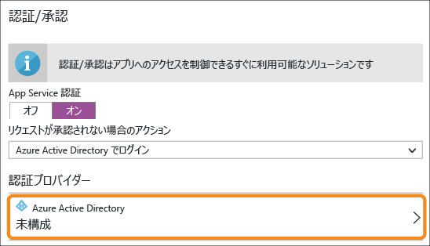
4. **[Azure Active Directory 設定]** ブレードで、**[Express]**、**[OK]** の順にクリックします。 新しい Azure AD アプリケーションが既定の設定で既定のディレクトリに作成されます。  
    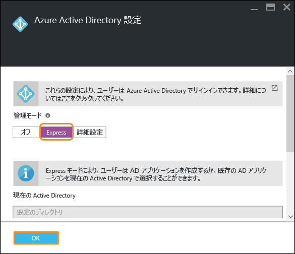
5. **[Save]**をクリックします。  
    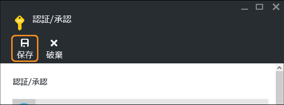
   
    変更が正常に完了すると、通知ベルが緑色に変わり、わかりやすいメッセージが表示されます。
6. アプリのポータル ブレードに戻り、**[URL]** リンク (またはメニュー バーの **[参照]**) をクリックします。 このリンクは HTTP アドレスになっています。  
    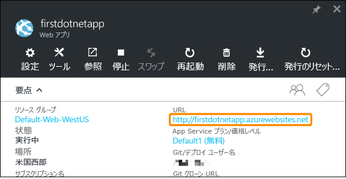  
    ただし、URL をクリックして新しいタブでアプリが開くと、数回のリダイレクトを経て、最終的には HTTPS アドレスでアプリが開かれます。 結果として、Azure サブスクリプションにログインした状態になり、アプリで自動的に認証されます。  
    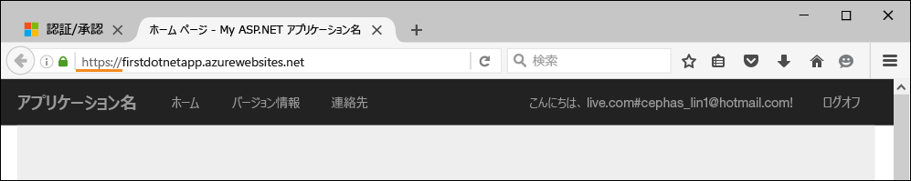  
    そのため、認証されていないセッションを別のブラウザーで開いた場合は、同じ URL に移動するときにログイン画面が表示されます。  
    <!-- 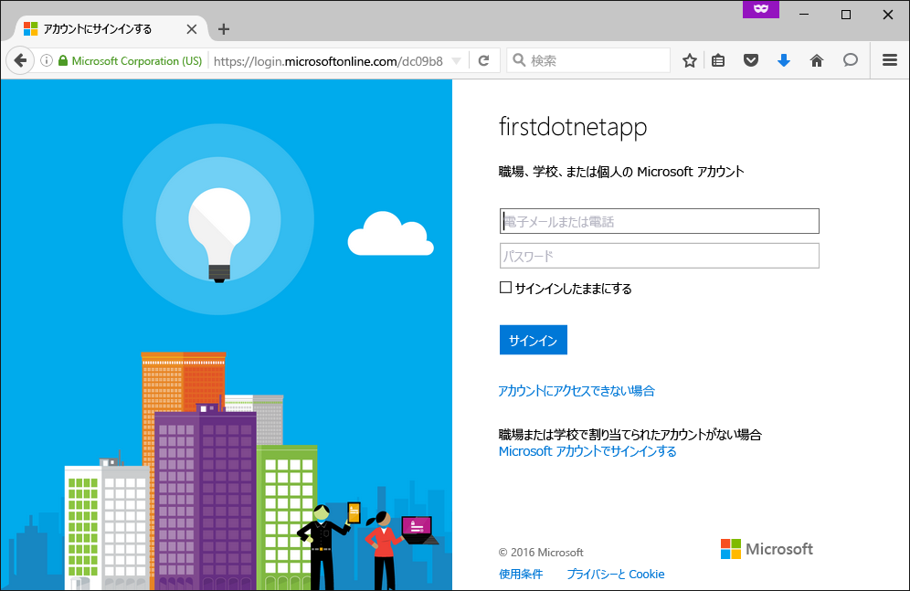  -->
    Azure Active Directory で操作を行ったことがない場合、既定のディレクトリに Azure AD ユーザーが含まれていないことがあります。 その場合、既定のディレクトリに含まれているのは、Azure サブスクリプションのある Microsoft アカウントのみになります。 同一のブラウザーでアプリに自動的にログインされる場合があるのは、このためです。
   その同じ Microsoft アカウントを使用して、このログイン ページにもログインできます。

これで、Web アプリへのすべてのトラフィックが認証されます。

お気付きかもしれませんが、 **[認証/承認]** ブレードでは、他にも次のような多数の操作を行うことができます。

* ソーシャル ログインを有効にする
* さまざまなログイン オプションを有効にする
* ユーザーが最初にアプリに移動したときの既定の動作を変更する

App Service には一般的な認証のニーズの一部に対応した設定不要のソリューションが用意されているため、自分で認証ロジックを提供する必要がありません。
詳細については、 [App Service の認証/承認](https://azure.microsoft.com/blog/announcing-app-service-authentication-authorization/)に関するページを参照してください。

## 必要に応じたアプリの自動的なスケール
次に、アプリを自動スケールして、ユーザーの要求に応じて容量が自動的に調整されるようにしてみましょう (詳細については、「[Azure でのアプリのスケールアップ](web-sites-scale.md)」および「[手動または自動によるインスタンス数のスケール変更](../monitoring-and-diagnostics/insights-how-to-scale.md)」を参照してください)。

Web アプリをスケールする方法は、簡単に言うと次の&2; つです。

* [スケールアップ](https://en.wikipedia.org/wiki/Scalability#Horizontal_and_vertical_scaling): CPU、メモリ、ディスク領域を増やしたり、専用 VM、カスタム ドメインと証明書、ステージング スロット、自動スケールのような拡張機能を追加したりします。 スケールアップするには、アプリが属している App Service プランの価格レベルを変更します。
* [スケールアウト](https://en.wikipedia.org/wiki/Scalability#Horizontal_and_vertical_scaling): アプリを実行する VM インスタンス数を増やします。
  価格レベルに応じて、50 個までのインスタンスにスケールアウトすることができます。

前置きはこのくらいにして、自動スケールを設定しましょう。

1. 最初に、スケールアップして自動スケールを有効にしましょう。 アプリのポータル ブレードで、**[設定]**  >  **[スケール アップ (App Service のプラン)]** の順にクリックします。  
    ![スケールアップ - [設定] ブレード](./media/app-service-web-get-started/scale-up-settings.png)
2. スクロールして、自動スケールをサポートするレベルのうち最も下位のレベルである (スクリーンショットの丸で囲んだところ) **[S1 Standard]** レベルを選択し、**[選択]** をクリックします。  
    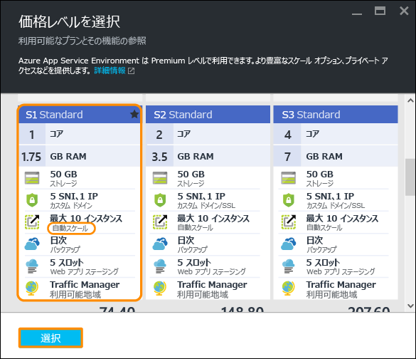
   
    これでスケールアップは完了です。
   
   > [!IMPORTANT]
   > このレベルでは、無料試用版のクレジットが消費されます。 従量課金制のアカウントを使用している場合、アカウントへの課金が発生します。
   > 
   > 
3. 次に、自動スケールを構成します。 アプリのポータル ブレードで、**[設定]**  >  **[スケール アウト (App Service のプラン)]** の順にクリックします。  
    ![スケールアウト - [設定] ブレード](./media/app-service-web-get-started/scale-out-settings.png)
4. **[スケールの基準]** を **[CPU の割合]** に変更します。 ドロップダウン リストの下にあるスライダーが適宜更新されます。 次に、**[インスタンス]** の範囲を **1** ～ **2** に、**[対象範囲]** を **40** ～ **80** に定義します。 これらの値を定義するには、ボックスに入力するか、スライダーを動かします。  
    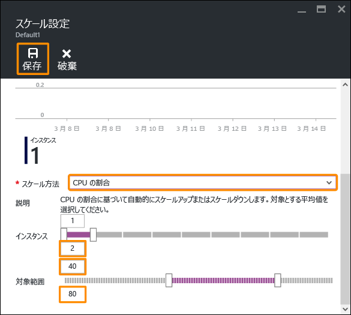
   
    アプリは、この構成に基づいて、CPU 使用率が 80% を超えると自動的にスケールアウトされ、CPU 使用率が 40% を下回るとスケールされます。
5. メニュー バーの **[保存]** をクリックします。

これで、アプリは自動スケールされます。

お気付きかもしれませんが、 **[スケールの設定]** ブレードでは、他にも次のような多数の操作を行うことができます。

* インスタンスを特定の数に手動でスケールする
* メモリの割合やディスク キューなどの他のパフォーマンス メトリックに基づいてスケールする
* パフォーマンス ルールがトリガーされたときのスケーリングの動作をカスタマイズする
* スケジュールに基づいて自動スケールする
* 将来のイベントに対して自動スケールの動作を設定する

アプリのスケールアップの詳細については、 [Azure でのアプリのスケールアップ](web-sites-scale.md)に関するページを参照してください。 スケールアウトの詳細については、「[手動または自動によるインスタンス数のスケール変更](../monitoring-and-diagnostics/insights-how-to-scale.md)」を参照してください。

## アプリのアラートを受信する
これで、アプリは自動スケールされるようになりました。ここで、最大インスタンス数 (2) に達し、CPU 使用率が目的の割合 (80%) を超えた場合はどうなるのでしょうか。
たとえば、この状況を通知するアラートを設定し (詳細については、[アラート通知の受信](../monitoring-and-diagnostics/insights-receive-alert-notifications.md)に関するページをご覧ください)、アプリをさらにスケールアップ/アウトできます。 このシナリオに対してアラートをわずかな操作で設定しましょう。

1. アプリのポータル ブレードで、 **[ツール]** > **[アラート]**にデプロイしました。  
    ![アラート - [設定] ブレード](./media/app-service-web-get-started/alert-settings.png)
2. **[アラートの追加]**をクリックします。 次に、**[リソース]** ボックスで、**(serverfarms)** で終わるリソースを選択します。 これは、ご利用の App Service プランです。  
    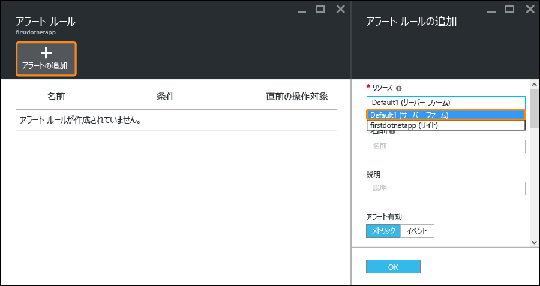
3. **[名前]** を `CPU Maxed` に、**[メトリック]** を **[CPU の割合]** に、**[しきい値]** を `90` に指定し、**[所有者、共同作成者、閲覧者に電子メールを送信]** を選択して、**[OK]** をクリックします。   
    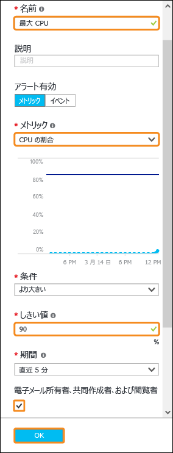
   
    Azure でアラートの作成が完了すると、 **[アラート]** ブレードにアラートが表示されます。  
    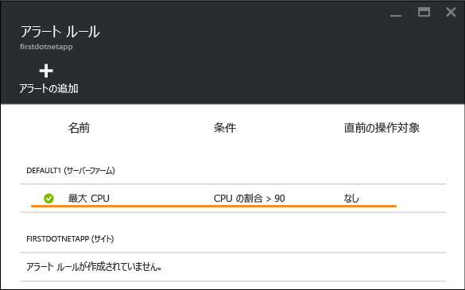

これで、アラートが取得されるようになりました。

このアラート設定では CPU 使用率が&5; 分ごとにチェックされます。 この数値が 90% を超えると、電子メール アラートが届きます。このアラートは、承認されたすべてのユーザーにも送信されます。 アラートを受信する権限のあるすべてのユーザーを表示するには、アプリのポータル ブレードに戻り、**[アクセス]** をクリックします。  
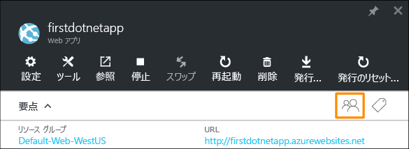

**サブスクリプション管理者**が既にアプリの**所有者**であることが表示されます。 Azure サブスクリプション (試用版サブスクリプションなど) のアカウント管理者もこのグループに含まれます。 Azure のロールベースのアクセス制御の詳細については、「 [Azure のロールベースのアクセス制御](../active-directory/role-based-access-control-configure.md)」を参照してください。

> [!NOTE]
> アラート ルールは、Azure の機能です。 詳細については、[アラート通知の受信](../monitoring-and-diagnostics/insights-receive-alert-notifications.md)に関するページをご覧ください。
> 
> 

## 次のステップ
アラートを構成する際、 **[ツール]** ブレードに豊富なツールのセットが用意されていることに気が付いたことでしょう。 ここでは、問題のトラブルシューティング、パフォーマンスの監視、脆弱性のテスト、リソースの管理、VM コンソールとの対話、有用な拡張機能の追加を実行できます。 これらのツールをそれぞれクリックして、シンプルでありながら強力なツールを実際に確認することをお勧めします。

デプロイしたアプリのさらなる活用方法もご確認ください。 ほんの一部を以下に示します。

* [カスタム ドメイン名を購入し、構成する](custom-dns-web-site-buydomains-web-app.md) - Web アプリ用に、*.azurewebsites.net ドメインの代わりに魅力的なドメインを購入します。 または、既存のドメインを使用します。
* [ステージング環境を設定する](web-sites-staged-publishing.md) - 運用環境に配置する前に、ステージング URL にアプリをデプロイします。 ライブ Web アプリを、動作確認してから更新できます。 複数のデプロイ スロットで複雑な DevOps ソリューションを設定します。
* [継続的なデプロイを設定する](app-service-continuous-deployment.md) - アプリのデプロイをソース管理システムに統合します。 コミットするたびに、Azure にデプロイします。
* [オンプレミス リソースにアクセスする](web-sites-hybrid-connection-get-started.md) - 既存のオンプレミス データベースまたは CRM システムにアクセスします。
* [アプリをバックアップする](web-sites-backup.md) - Web アプリのバックアップと復元を設定します。 予期しない障害と、それからの復旧を準備します。
* [診断ログを有効にする](web-sites-enable-diagnostic-log.md) - Azure またはアプリケーションのトレースからの IIS ログを読みます。 ストリームで読んだり、ダウンロードしたり、ターンキー分析のために [Application Insights](../application-insights/app-insights-overview.md) に取り込んだりします。
* [アプリの脆弱性をスキャンする](https://azure.microsoft.com/blog/web-vulnerability-scanning-for-azure-app-service-powered-by-tinfoil-security/) -
  [Tinfoil Security](https://www.tinfoilsecurity.com/) によって提供されるサービスを使用して、Web アプリの最新の脅威をスキャンします。
* [バックグラウンド ジョブを実行する](../azure-functions/functions-overview.md) - データ処理、レポート作成などのジョブを実行します。
* [App Service の特長](../app-service/app-service-how-works-readme.md)

