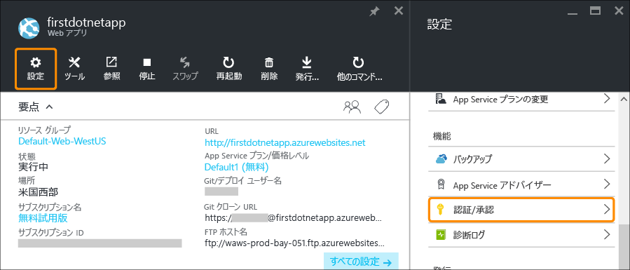
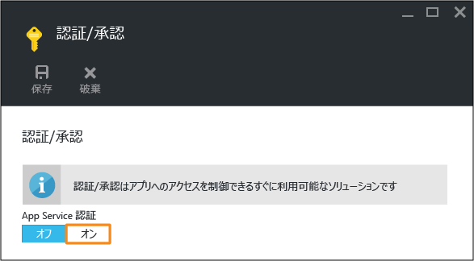
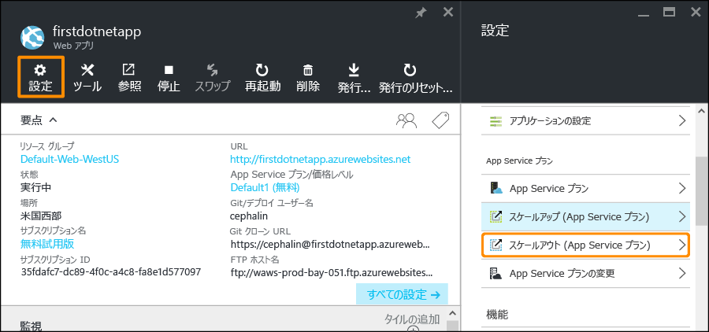
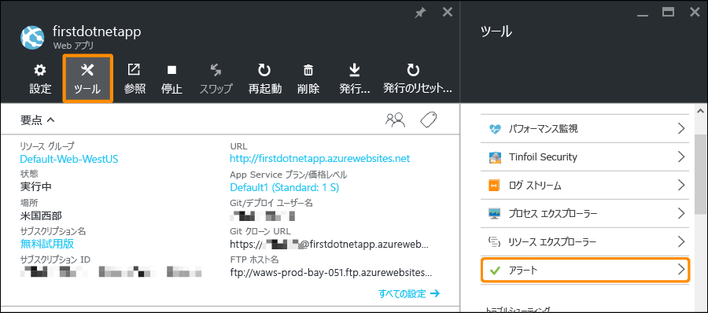

<properties 
	pageTitle="Azure App Service での Web アプリの使用 - 第 2 部" 
	description="App Service で Web アプリに運用上の重要な機能を数回のクリックで追加します。" 
	services="app-service\web"
	documentationCenter=""
	authors="cephalin" 
	manager="wpickett" 
	editor="" 
/>

<tags 
	ms.service="app-service-web" 
	ms.workload="web" 
	ms.tgt_pltfrm="na" 
	ms.devlang="na" 
	ms.topic="hero-article"
	ms.date="03/17/2016" 
	ms.author="cephalin"
/>

# Azure App Service の使用 - 第 2 部

「[Azure App Service の使用](app-service-web-get-started.md)」では、Azure App Service に Web アプリをデプロイしました。この記事では、デプロイしたアプリにいくつかの重要な機能をわずかな操作で追加します。App Service は優れたアプリにエンタープライズ級の機能をもたらし、セキュリティ、拡張性、性能、管理などの面で実世界の需要を満たします。

数回のクリックで次の内容を行う方法を学習します。

- ユーザーへの認証の強制
- アプリの自動スケール
- アプリのパフォーマンスに関するアラートの取得

前の記事でデプロイしたサンプル アプリに関係なく、チュートリアルの手順を実行できます。

## ユーザーの認証

アプリへの認証の追加がどれほど簡単に実現できるかを見てみましょう。

1. 開いたばかりのアプリのポータル ブレードで、**[設定]**、**[認証/承認]** の順にクリックします。 
    
2. **[オン]** をクリックして認証を有効にします。 
    
4. **[認証プロバイダー]** で、**[Azure Active Directory]** をクリックします。 

5. **[Azure Active Directory 設定]** ブレードで **[Express]**、**[OK]** の順にクリックします。新しい Azure AD アプリケーションが既定の設定で既定のディレクトリに作成されます。 

6. **[Save]** をクリックします。

    変更が正常に完了すると、通知ベルが緑色に変わり、わかりやすいメッセージが表示されます。

7. アプリのポータル ブレードに戻り、**[URL]** リンク (またはメニュー バーの **[参照]**) をクリックします。このリンクは HTTP アドレスになっています。 ただし、URL をクリックして新しいタブでアプリが開くと、数回のリダイレクトを経て、最終的には HTTPS アドレスでアプリが開かれます。結果として、Azure サブスクリプションにログインした状態になり、アプリで自動的に認証されます。 そのため、認証されていないセッションを別のブラウザーで開いた場合、同じ URL に移動すると、ログイン画面が表示されます。  Azure Active Directory で何も実行していない場合は、既定のディレクトリに Azure AD ユーザーが含まれていない可能性があります。その場合、既定のディレクトリに含まれているのは、Azure サブスクリプションのある Microsoft アカウントのみになります。同一のブラウザーでアプリに自動的にログインされる場合があるのは、このためです。その同じ Microsoft アカウントを使用して、このログイン ページにもログインできます。

これで、サイトへのすべてのトラフィックが認証されます。

お気付きかもしれませんが、**[認証/承認]** ブレードでは、他にも次のような多数の操作を行うことができます。

- ソーシャル ログインを有効にする
- さまざまなログイン オプションを有効にする
- ユーザーが最初にアプリに移動したときの既定の動作を変更する

App Service には一般的な認証のニーズの一部に対応した設定不要のソリューションが用意されているため、自分で認証ロジックを提供する必要がありません。詳細については、「[Expanding App Service Authentication/Authorization (App Service の認証/承認の拡張)](/blog/announcing-app-service-authentication-authorization/)」を参照してください。

## アプリのスケールアップとスケールアウト

次に、アプリのスケーリングについて見てみましょう。App Service アプリをスケールする方法は 2 つあります。

- [スケールアップ](https://en.wikipedia.org/wiki/Scalability#Horizontal_and_vertical_scaling): App Service アプリをスケールアップするには、アプリが属する App Service プランの価格レベルを変更します。拡張により、CPU、メモリ、ディスク領域が追加されます。専用 VM、自動スケール、99.95% の可用性、カスタムとドメインの証明書、デプロイ スロット、バックアップなどの追加機能も与えられます。レベルが上がるほど、App Service アプリで利用できる機能も増えます。  
- [スケールアウト](https://en.wikipedia.org/wiki/Scalability#Horizontal_and_vertical_scaling): App Service アプリをスケールアウトするには、対象のアプリ (または同じ App Service プラン内の他のアプリ) が実行される VM インスタンスの数を変更します。Standard レベル以上では、パフォーマンス メトリックに基づく VM インスタンスの自動スケールを有効にすることができます。 

前置きはこのくらいにして、アプリの自動スケールを設定しましょう。

1. 最初に、スケールアップして自動スケールを有効にしましょう。アプリのポータル ブレードで、**[設定]**、**[スケール アップ (App Service プラン)]** の順にクリックします。 

2. スクロールして、自動スケールをサポートするレベルのうち最も下位のレベルである (スクリーンショットの丸で囲んだところ) **[S1 Standard]** レベルを選択し、**[選択]** をクリックします。 

    これでスケールアップは完了です。
    
    >[AZURE.IMPORTANT] このレベルでは、無料試用版のクレジットが消費されます。従量課金制のアカウントを使用している場合、アカウントへの課金が発生します。
    
3. 次に、自動スケールを構成します。アプリのポータル ブレードで、**[設定]**、**[スケール アウト (App Service プラン)]** の順にクリックします。 

4. **[スケールの基準]** を **[CPU の割合]** に変更します。ドロップダウン リストの下にあるスライダーが適宜更新されます。次に、**[インスタンス]** の範囲を **1** ～ **2** に、**[対象範囲]** を **40** ～ **80** に定義します。これらの値を定義するには、ボックスに入力するか、スライダーを動かします。 
    
    アプリは、この構成に基づいて、CPU 使用率が 80% を超えると自動的にスケールアウトされ、CPU 使用率が 40% を下回るとスケールされます。
    
5. メニュー バーの **[保存]** をクリックします。

これで、アプリは自動スケールされます。

お気付きかもしれませんが、**[スケールの設定]** ブレードでは、他にも次のような多数の操作を行うことができます。

- インスタンスを特定の数に手動でスケールする
- メモリの割合やディスク キューなどの他のパフォーマンス メトリックに基づいてスケールする
- パフォーマンス ルールがトリガーされたときのスケーリングの動作をカスタマイズする
- スケジュールに基づいて自動スケールする
- 将来のイベントに対して自動スケールの動作を設定する

アプリのスケールアップの詳細については、「[Azure App Service における価格レベルのスケーリング](../app-service/app-service-scale.md)」を参照してください。スケールアウトの詳細については、「[手動または自動によるインスタンス数のスケール変更](../azure-portal/insights-how-to-scale.md)」を参照してください。

## アプリのアラートを受信する

これで、アプリは自動スケールされるようになりました。ここで、最大インスタンス数 (2) に達し、CPU 使用率が目的の割合 (80%) を超えた場合はどうなるのでしょうか。 たとえば、この状況を通知するアラートを設定し、アプリをさらにスケールアップできます。このシナリオに対してアラートをわずかな操作で設定しましょう。

1. アプリのポータル ブレードで、**[ツール]**、**[アラート]** の順にクリックします。 

2. **[アラートの追加]** をクリックします。次に、**[リソース]** ボックスで、**(serverfarms)** で終わるリソースを選択します。これは、ご利用の App Service プランです。 

3. **[名前]** を `CPU Maxed` に、**[メトリック]** を **[CPU の割合]** に、**[しきい値]** を `90` に指定し、**[メールの所有者、投稿者、閲覧者]** を選択して、**[OK]** をクリックします。 
    
    Azure でアラートの作成が完了すると、**[アラート]** ブレードにアラートが表示されます。 

これで、アラートが取得されるようになりました。

このアラート設定では CPU 使用率が 5 分ごとにチェックされます。この数値が 90% を超えると、電子メール アラートが届きます。このアラートは、承認されたすべてのユーザーにも送信されます。アラートを受信する権限のあるすべてのユーザーを表示するには、アプリのポータル ブレードに戻り、**[アクセス]** ボタンをクリックします。 

**サブスクリプション管理者**が既にアプリの**所有者**であることが表示されます。Azure サブスクリプション (試用版サブスクリプションなど) のアカウント管理者もこのグループに含まれます。Azure のロールベースのアクセス制御の詳細については、「[Azure のロールベースのアクセス制御](../active-directory/role-based-access-control-configure.md)」を参照してください。

## 次のステップ

アラートを構成する際、**[ツール]** ブレードに豊富なツールのセットが用意されていることに気が付いたことでしょう。ここでは、問題のトラブルシューティング、パフォーマンスの監視、脆弱性のテスト、リソースの管理、VM コンソールとの対話、有用な拡張機能の追加を実行できます。これらのツールをそれぞれクリックして、シンプルでありながら強力なツールを実際に確認することをお勧めします。

デプロイしたアプリのさらなる活用方法もご確認ください。一覧の一部を次に示します。

- [Azure App Service でのカスタム ドメイン名の購入と構成](custom-dns-web-site-buydomains-web-app.md)
- [Azure App Service の Web アプリのステージング環境を設定する](web-sites-staged-publishing.md)
- [Azure App Service での GIT による継続的なデプロイ](web-sites-publish-source-control.md)
- [Azure App Service での Web アプリのバックアップ](web-sites-backup.md)
- [Azure App Service の Web アプリの診断ログの有効化](web-sites-enable-diagnostic-log.md)
- [Azure App Service のハイブリッド接続を使用してオンプレミスのリソースにアクセスする](web-sites-hybrid-connection-get-started.md)
- [App Service の特長](../app-service/app-service-how-works-readme.md) 

<!---HONumber=AcomDC_0420_2016---->