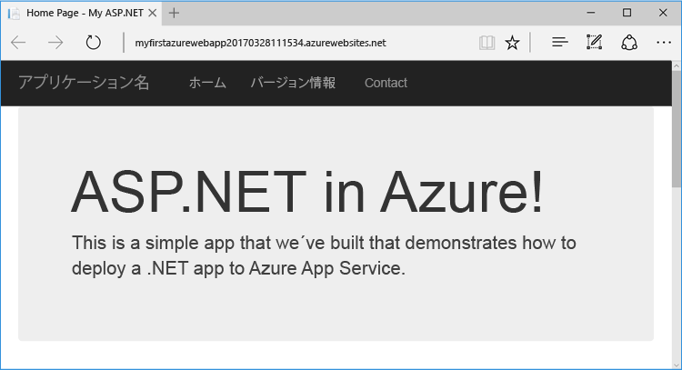
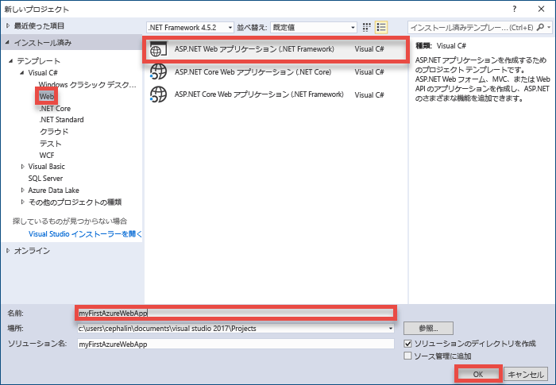
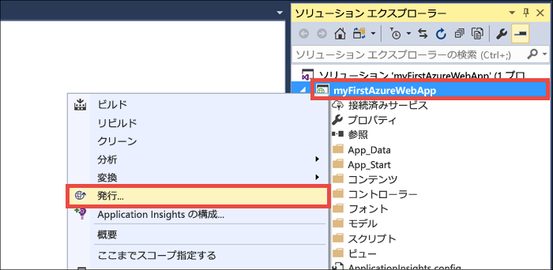
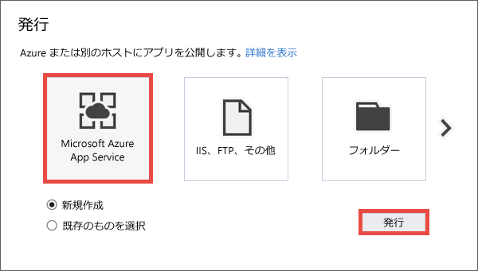
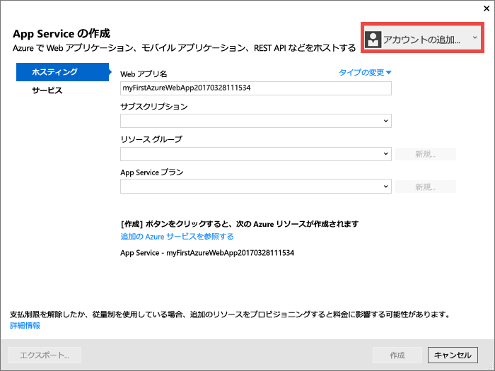
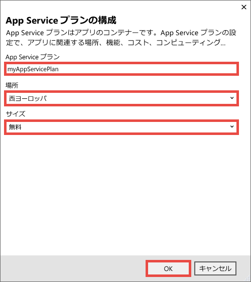
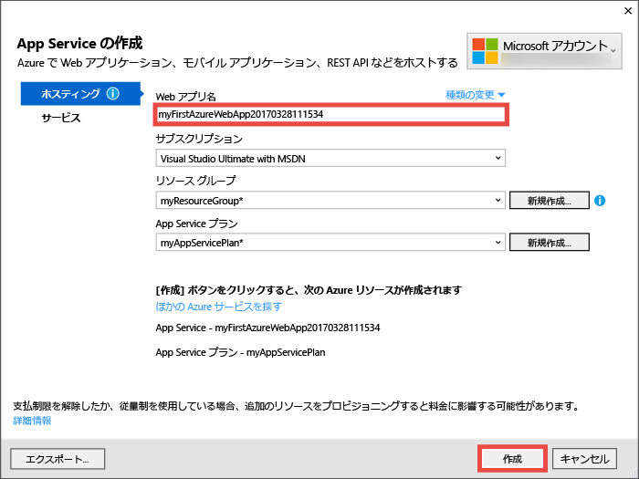
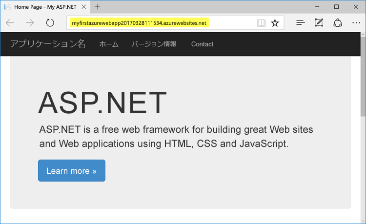
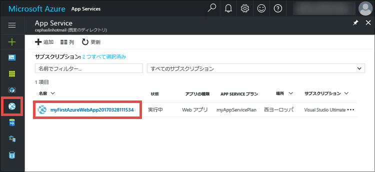
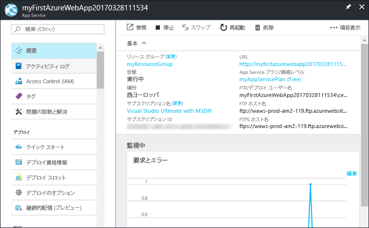

# <a name="create-your-first-aspnet-web-app-in-azure-in-five-minutes"></a>初めての ASP.NET Web アプリを Azure に 5 分で作成する

[!INCLUDE [app-service-web-selector-get-started](../../includes/app-service-web-selector-get-started.md)] 

このクイック スタートを読むと、初めての ASP.NET Web アプリを [Azure App Service](../app-service/app-service-value-prop-what-is.md) に数分でデプロイできるようになります。 完了すると、単純な Web アプリがクラウドで稼働している状態になります。



## <a name="prerequisites"></a>前提条件

このチュートリアルでは、Visual Studio 2017 を使用して ASP.NET Web アプリをビルドし、Azure にデプロイする方法を示します。 まだ Visual Studio 2017 をインストールしていない場合は、**無料**の [Visual Studio 2017 Community エディション](https://www.visualstudio.com/downloads/)をダウンロードして使用できます。 Visual Studio のセットアップ中に、必ず **[Azure の開発]** を有効にしてください。

[!INCLUDE [quickstarts-free-trial-note](../../includes/quickstarts-free-trial-note.md)]

## <a name="create-an-aspnet-web-app"></a>ASP.NET Web アプリを作成する

Visual Studio で、`Ctrl` + `Shift` + `N` キーを押してプロジェクトを作成します。

**[新しいプロジェクト]** ダイアログ ボックスで、**[Visual C#]、[Web]、[ASP.NET Web アプリケーション (.NET Framework)]** の順にクリックします。

アプリケーションに "**myFirstAzureWebApp**" という名前を付けて、**[OK]** をクリックします。
   


任意の種類の ASP.NET Web アプリを Azure にデプロイできます。 このチュートリアルでは、**[MVC]** テンプレートを選択し、認証が **[認証なし]** に設定されていることを確認してください。
      
**[OK]**をクリックします。

![[新しい ASP.NET プロジェクト] ダイアログ ボックス](./media/app-service-web-get-started-dotnet/select-mvc-template.png)

## <a name="publish-to-azure"></a>Azure に発行する

**ソリューション エクスプローラー**で **myFirstAzureWebApp** プロジェクトを右クリックし、**[発行]** を選択します。



**[Microsoft Azure App Service]** が選択されていることを確認し、**[発行]** をクリックします。



**[App Service の作成]** ダイアログ ボックスが表示されます。このダイアログ ボックスでは、Azure で ASP.NET Web アプリを実行するために必要なすべての Azure リソースを作成することができます。

## <a name="sign-in-to-azure"></a>Azure へのサインイン

**[App Service の作成]** ダイアログ ボックスで、**[アカウントの追加]** をクリックし、Azure サブスクリプションにサインインします。 既に Microsoft アカウントにサインインしている場合は、アカウントが Azure サブスクリプションを保持していることを確認します。 サインインしている Microsoft アカウントが Azure サブスクリプションを備えていない場合は、正しいアカウントをクリックして追加します。
   


サインインしたら、このダイアログ ボックスで、Azure Web アプリに必要なすべてのリソースの作成を開始できます。

## <a name="create-a-resource-group"></a>リソース グループの作成

まず、"_リソース グループ_" が必要です。 

> [!NOTE] 
> リソース グループとは、Web アプリ、データベース、ストレージ アカウントなどの Azure リソースのデプロイと管理に使用する論理コンテナーです。
>
>

**[リソース グループ]** の横にある **[新規]** をクリックします。

リソース グループに **myResourceGroup** という名前を付けて、**[OK]** をクリックします。

## <a name="create-an-app-service-plan"></a>App Service プランを作成する

[!INCLUDE [app-service-plan](../../includes/app-service-plan.md)]

**[App Service プラン]** の横にある **[新規]** をクリックします。 

**[App Service プランの構成]** ダイアログ ボックスで、新しい App Service プランを次の設定で構成します。

- **[App Service プラン]**: 「**myAppServicePlan**」と入力します。 
- **[場所]**: **[西ヨーロッパ]**、または最寄りのリージョンを選択します。
- **[サイズ]**: **[無料]**、または他の[価格レベル](https://azure.microsoft.com/pricing/details/app-service/)を選択します。

**[OK]**をクリックします。



## <a name="create-and-publish-the-web-app"></a>Web アプリを作成して発行する

これで、唯一の残りの作業は、Web アプリに名前を付けることです。 **[Web アプリ名]** に一意のアプリ名を入力します。 この名前は、アプリで既定の DNS 名の一部として使用されます (`<app_name>.azurewebsites.net`)。そのため、Azure のすべてのアプリ間で一意である必要があります。 後で、アプリをユーザーに公開する前に、カスタム ドメイン名をアプリにマップできます。

自動的に生成される名前をそのまま使用することもできます。この名前は、既に一意になっています。

**[作成]** をクリックして、Azure リソースの作成を開始します。



ウィザードは、Azure リソースの作成を完了すると、自動的に ASP.NET Web アプリを Azure に初めて発行し、発行された Azure Web アプリを既定のブラウザーで起動します。



URL は、前に指定した Web アプリ名を `http://<app_name>.azurewebsites.net` という形式で使用します。 

初めての ASP.NET Web アプリを Azure App Services でライブ実行することができました。

## <a name="update-the-app-and-redeploy"></a>アプリを更新して再デプロイする

更新と Azure への再デプロイは、とても簡単です。 ホームページを更新してみましょう。

**ソリューション エクスプローラー**で、**Views\Home\Index.cshtml** を開きます。

上部の `<div class="jumbotron">` HTML タグを検索し、タグ全体を次のコードに置き換えます。

```HTML
<div class="jumbotron">
    <h1>ASP.NET in Azure!</h1>
    <p class="lead">This is a simple app that we’ve built that demonstrates how to deploy a .NET app to Azure App Service.</p>
</div>
```

Azure に再デプロイするには、**ソリューション エクスプローラー**で **myFirstAzureWebApp** プロジェクトを右クリックし、**[発行]** を選択します。

発行ページで **[発行]** をクリックします。

Visual Studio を終了すると、更新された Azure Web アプリがブラウザーで起動されます。


## <a name="manage-your-new-azure-web-app"></a>新しい Azure Web アプリを管理する

Azure Portal に移動し、作成したばかりの Web アプリを表示します。 

そのためには、[https://portal.azure.com](https://portal.azure.com) にサインインします。

左側のメニューで **[App Services (App Services)]** をクリックした後、Azure Web アプリの名前をクリックします。



Web アプリの "_ブレード_" (水平方向に開かれるポータル ページ) が表示されます。 

既定では、Web アプリのブレードは **[概要]** ページを表示します。 このページでは、アプリの動作状態を見ることができます。 ここでは、参照、停止、開始、再開、削除のような基本的な管理タスクも行うことができます。  



ブレードの左側にあるタブは、開くことができるさまざまな構成ページを示しています。 次の一覧では、ほんの一部の例を示しています。

- カスタム DNS 名をマップする
- カスタム SSL 証明書をバインドする
- 継続的なデプロイを構成する
- スケールアップとスケールアウトを行う
- ユーザー認証を追加する

## <a name="clean-up-resources"></a>リソースのクリーンアップ

初めての Azure Web アプリを削除するには、**[概要]** ページで **[削除]** をクリックします。 ただし、このクイック スタートで作成した内容をすべて削除するための、より便利な方法があります。 Web アプリの **[概要]** ページでリソース グループをクリックして、ブレードを開きます。 

![[App Service] ブレードからリソース グループにアクセスする](./media/app-service-web-get-started-dotnet/access-resource-group.png)

リソース グループ ブレードに、App Service プランと、Visual Studio によって作成された App Service アプリの両方が表示されます。 

ブレードの上部にある **[削除]** をクリックします。 

<!---->

確認ブレードで、テキスト ボックスにリソース グループ名の「**myResourceGroup**」を入力して確認し、**[削除]** をクリックします。

## <a name="next-steps"></a>次のステップ

> [!div class="nextstepaction"]
> [SQL Database を使用して Azure に ASP.NET アプリを作成する方法について調べる](app-service-web-tutorial-dotnet-sqldatabase.md)

> [!div class="nextstepaction"]
> [Web アプリの PowerShell スクリプト サンプルを見る](app-service-powershell-samples.md)

