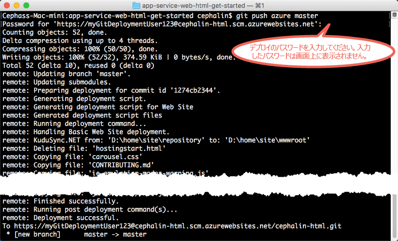

# 初めての HTML Web アプリを Azure に&5; 分でデプロイする
[!INCLUDE [app-service-web-selector-get-started-nodejs-cli](../../includes/app-service-web-selector-get-started-nodejs-cli.md)]  

このチュートリアルでは、シンプルな HTML+CSS Web アプリを [Azure App Service](../app-service/app-service-value-prop-what-is.md)にデプロイします。
App Service を使用すると、Web アプリ、[モバイル アプリ バックエンド](/documentation/learning-paths/appservice-mobileapps/)、および [API アプリ](../app-service-api/app-service-api-apps-why-best-platform.md)を作成できます。

このチュートリアルの内容は次のとおりです。 

* Azure App Service で Web アプリを作成する。
* Web アプリに HTML および CSS をデプロイする。
* 運用環境でライブ実行されているページを確認する。
* [Git コミットをプッシュする](https://git-scm.com/docs/git-push)ときと同じ方法でコンテンツを更新する。

[!INCLUDE [app-service-linux](../../includes/app-service-linux.md)]

## タスクを完了するための CLI バージョン

次のいずれかの CLI バージョンを使用してタスクを完了できます。

- [Azure CLI 1.0](app-service-web-get-started-html-cli-nodejs.md) - クラシック デプロイメント モデルと Resource Manager デプロイメント モデル用の CLI
- [Azure CLI 2.0](app-service-web-get-started-html.md) - Resource Manager デプロイ モデル用の次世代 CLI

## 前提条件
* [Git](http://www.git-scm.com/downloads)。
* [Azure CLI](../cli-install-nodejs.md)。
* Microsoft Azure アカウント。 アカウントを持っていない場合は、[無料試用版にサインアップ](https://azure.microsoft.com/pricing/free-trial/?WT.mc_id=A261C142F)するか [Visual Studio サブスクライバー特典を有効](https://azure.microsoft.com/pricing/member-offers/msdn-benefits-details/?WT.mc_id=A261C142F)にしてください。

> [!NOTE]
> Azure アカウントがなくても、[App Service を試用](https://azure.microsoft.com/try/app-service/)できます。 スターター アプリを作成し、最大&1; 時間使用できます。クレジット カードも契約も不要です。
> 
> 

## シンプルな HTML サイトをデプロイする
1. 新しい Windows コマンド プロンプト、PowerShell ウィンドウ、Linux のシェル、または OS X ターミナルを開きます。 `git --version` と `azure --version` を実行し、Git と Azure CLI がコンピューターにインストールされていることを確認します。
   
    
   
    ツールをインストールしていない場合は、「 [前提条件](#Prerequisites) 」のダウンロード リンクを参照してください。
2. 次のようにして、Azure にログインします。
   
        azure login
   
    ヘルプ メッセージに従って、ログイン プロセスを続行します。
   
    

3. Azure CLI を ASM モードに変更し、App Service のデプロイ ユーザーを設定します。 後で、資格情報を使用してコードをデプロイします。
   
        azure config mode asm
        azure site deployment user set --username <username> --pass <password>

4. 作業ディレクトリに移動 (`CD`) し、次のようにサンプル HTML サイトを複製します。
   
        git clone https://github.com/Azure-Samples/app-service-web-html-get-started.git

5. サンプル アプリのリポジトリに移動します。 
   
        cd app-service-web-html-get-started

6. 一意のアプリ名と、前に構成したデプロイ ユーザーを使用して、Azure で App Service のアプリ リソースを作成します。 メッセージが表示されたら、必要なリージョンの番号を指定します。
   
        azure site create <app_name> --git --gitusername <username>
   
    
   
    これでアプリが Azure で作成されました。 また、現在のディレクトリが Git として初期化され、この新しい App Service アプリに Git リモートとして接続されています。
    アプリの URL (http://&lt;アプリの名前>.azurewebsites.net) を参照すると、既定の美しい HTML ページが表示されますが、ここでは用意したコードを実際に使用しましょう。
7. Git でコードをプッシュする場合と同様に、サンプル コードを Azure アプリにデプロイします。 メッセージが表示されたら、前に構成したパスワードを入力します。
   
        git push azure master
   
    
   
    いずれかの言語フレームワークを使用した場合は、別の出力が表示されます。 `git push` を実行すると、Azure にコードが配置されるだけでなく、デプロイ エンジンのデプロイ タスクがトリガーされるためです。 プロジェクト (リポジトリ) のルートに package.json (Node.js) ファイルまたは requirements.txt (Python) ファイルがある場合、または ASP.NET プロジェクトに packages.config ファイルがある場合は、デプロイメント スクリプトによって必要なパッケージが復元されます。 また、 [Composer 拡張機能を有効にして](web-sites-php-mysql-deploy-use-git.md#composer) 、PHP アプリで composer.json ファイルを自動的に処理することもできます。

これで、Azure App Service にアプリがデプロイされました。

## アプリがライブ実行されるのを確認する
Azure で実稼働しているアプリを確認するには、リポジトリ内の任意のディレクトリから次のコマンドを実行します。

    azure site browse

## アプリを更新する
Git を使用してプロジェクト (リポジトリ) のルートからプッシュして、いつでもライブ サイトを更新することができるようになりました。 これは、初めてコードをデプロイしたときと同様に行います。 たとえば、ローカルでテストした新しい変更をプッシュする場合は、プロジェクト (リポジトリ) のルートから次のコマンドを実行するだけで済みます。

    git add .
    git commit -m "<your_message>"
    git push azure master

## 次のステップ
ご使用の言語フレームワークの推奨される開発とデプロイの手順を確認します。

* [.NET](web-sites-dotnet-get-started.md)
* [PHP](app-service-web-php-get-started-cli-nodejs.md)
* [Node.JS](app-service-web-nodejs-get-started-cli-nodejs.md)
* [Python](web-sites-python-ptvs-django-mysql.md)
* [Java](web-sites-java-get-started.md)

または、最初の Web アプリを活用します。 次に例を示します。

* [Azure にコードをデプロイする他の方法](web-sites-deploy.md)を試してみます。 たとえば、GitHub リポジトリのいずれかからデプロイする場合、**[デプロイ オプション]** の **[ローカル Git リポジトリ]** ではなく、**[GitHub]** を選択します。
* Azure アプリを次のレベルに進めます。 ユーザーを認証します。 必要に応じてスケールを変更したり、 パフォーマンスのアラートを設定したりできます。 いずれも、数回のクリックで実現できます。 「[初めての Web アプリに機能を追加する](app-service-web-get-started-2.md)」を参照してください。

