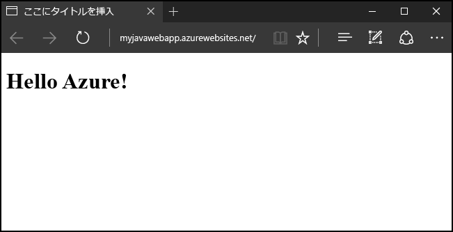
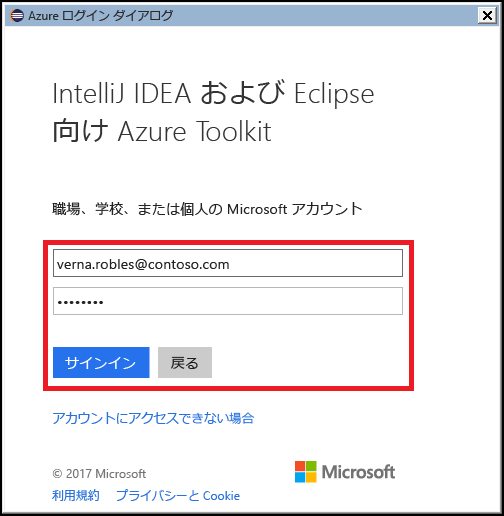
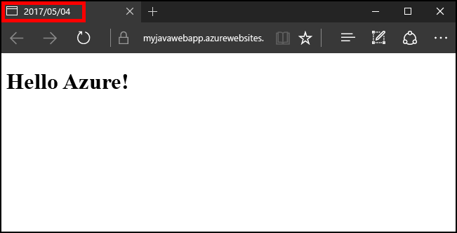

# <a name="create-your-first-java-web-app-in-azure-in-five-minutes"></a>初めての Java Web アプリを Azure に 5 分で作成する

[!INCLUDE [app-service-web-selector-get-started](../../includes/app-service-web-selector-get-started.md)] 

このクイック スタートを読むと、初めての Java Web アプリを [Azure App Service](../app-service/app-service-value-prop-what-is.md) に数分でデプロイできるようになります。 このチュートリアルを完了すると、Java ベースのシンプルな Web アプリがクラウドで稼働している状態になります。



## <a name="before-you-begin"></a>開始する前に

このチュートリアルでは、Eclipse IDE for Java EE Devlopers を使用して Java ベースの Web アプリをビルドし、Azure にデプロイする方法を示します。 Eclipse をまだインストールしていない場合には、http://www.eclipse.org/ から無料でダウンロードできます。

Java ベースの Web アプリを Azure に発行するプロセスを簡略化するため、このチュートリアルの手順では [Azure Toolkit for Eclipse](/azure/azure-toolkit-for-eclipse) を使用します。 このツールキットをインストールする手順については、「[Azure Toolkit for Eclipse のインストール](/azure/azure-toolkit-for-eclipse-installation)」をご覧ください。

> [!NOTE]
>
> このチュートリアルの手順では、JetBrains の [IntelliJ IDEA](https://www.jetbrains.com/idea/) を使用してもかまいません。 この開発環境に使用するものとしては、[Azure Toolkit for IntelliJ](/azure/azure-toolkit-for-intellij) が用意されています。いくつかの手順が多少異なりますが、発行のプロセスを簡素化してくれるという点では同じです。
>

このチュートリアルの手順を完了するには、ほかにも Azure サブスクリプションが必要です。 Azure サブスクリプションをまだお持ちでない場合は、[MSDN サブスクライバーの特典](https://azure.microsoft.com/pricing/member-offers/msdn-benefits-details/)を有効にするか、[Azure の無料アカウント](https://azure.microsoft.com/pricing/free-trial/)にサインアップしてください。

## <a name="create-a-dynamic-web-project-in-eclipse"></a>Eclipse で動的 Web プロジェクトを作成する

Eclipse IDE で、**[File (ファイル)]**、**[New (新規)]**、**[Dynamic Web Project (動的 Web プロジェクト)]** の順にクリックします。


[Dynamic Web Project (動的 Web プロジェクト)] ダイアログ ボックスが表示されたら、アプリケーションに **MyFirstJavaOnAzureWebApp** という名前を付けて、**[Finish (完了)]** をクリックします。
   
![[Dynamic Web Project (動的 Web プロジェクト)] ダイアログ ボックス](./media/app-service-web-get-started-java/new-dynamic-web-project-dialog-box.png)

> [!NOTE]
>
> ローカルに [Apache Tomcat](https://tomcat.apache.org/) などのランタイム環境がインストールされている場合には、**[Target runtime (ターゲット ランタイム)]** フィールドでそのランタイム環境を指定できます。
>

動的 Web プロジェクトを作成した後は、新しい JSP ページを追加します。これには、Project Explorer でそのプロジェクトを展開し、**[WebContent]** フォルダーを右クリックして、**[New (新規)]**、**[JSP File (JSP ファイル)]** の順にクリックします。


[New JSP File (新しい JSP ファイル)] ダイアログ ボックスが表示されたら、ファイルに **index.jsp** という名前を付け、親フォルダーは **MyFirstJavaOnAzureWebApp/WebContent** のままにして **[Next (次へ)]** をクリックします。

![[New JSP File (新しい JSP ファイル)] ダイアログ ボックス](./media/app-service-web-get-started-java/new-jsp-file-dialog-box-page-1.png)

[New JSP File (新しい JSP ファイル)] ダイアログ ボックスの 2 ページ目で、ファイルに **index.jsp** という名前を付け、親フォルダーは **MyFirstJavaOnAzureWebApp/WebContent** のままにして **[Finish (完了)]** をクリックします。

![[New JSP File (新しい JSP ファイル)] ダイアログ ボックス](./media/app-service-web-get-started-java/new-jsp-file-dialog-box-page-2.png)

Eclipse で新しいページが開いたら、既存の `<body></body>` セクションの内容を以下のコードで置き換えます。

```jsp
<body>
<h1><% out.println("Java on Azure!"); %></h1>
</body>
```

ページの変更内容を保存します。


## <a name="publish-your-web-app-to-azure"></a>Azure に Web アプリを発行する

Web アプリを Azure にデプロイするときには、Azure Toolkit for Eclipse の機能をいくつか使用します。

まずは発行プロセスを開始するため、次のいずれかの方法を使用します。

* Eclipse の **Project Explorer** でプロジェクトを右クリックし、**[Azure]**、**[Publish as Azure Web App (Azure Web アプリとして発行)]** の順にクリックします。

   ![[Publish as Azure Web App (Azure Web アプリとして発行)] コンテキスト メニュー](./media/app-service-web-get-started-java/publish-as-azure-web-app-context-menu.png)

* Eclipse のツールバーで **[Publish (発行)]** アイコンをクリックし、**[Publish as Azure Web App (Azure Web アプリとして発行)]** をクリックします。

   ![[Publish as Azure Web App (Azure Web アプリとして発行)] ドロップダウン メニュー](./media/app-service-web-get-started-java/publish-as-azure-web-app-drop-down-menu.png)

まだ Azure アカウントにサインインしていない場合には、サインインを求めるメッセージが表示されます。 そのためには、次の手順を実行してください。

1. Azure アカウントへのサインインには、2 つのオプションがあります。このチュートリアルでは、**[対話型]** を選択します。

   ![[Azure Sign In (Azure サインイン)] ダイアログ ボックス](./media/app-service-web-get-started-java/azure-signin-dialog-box.png)

1. Azure の資格情報を入力し、**[サインイン]** をクリックします。

   

1. Azure サブスクリプションを選択し、**[選択]** をクリックします。

   

> [!NOTE]
>
> **[対話型]** と **[自動]** の 2 つのサインインの詳しい手順は、記事「[Azure Sign In Instructions for the Azure Toolkit for Eclipse (Azure Toolkit for Eclipse で Azure にサインインする場合の手順)](https://go.microsoft.com/fwlink/?linkid=846174)」で説明しています。
>

Azure アカウントにサインインしたら、**[Deploy Web App (Web アプリのデプロイ)]** ダイアログ ボックスが表示されます。 Web アプリを Azure に発行するのが初めてであれば、App Service が 1 つも表示されないはずです。 この場合 (または、新しい App Service を作成する場合)、次の手順は新しい App Service の作成になります。 これを行うには、**[作成]** をクリックします。

![[Deploy Web App (Web アプリのデプロイ)] ダイアログ ボックス](./media/app-service-web-get-started-java/deploy-web-app-dialog-box.png)

**[App Service の作成]** ダイアログ ボックスが表示されたら、初期データとして以下を入力します。

* Web アプリの一意の名前。これは、その Web アプリの DNS アドレスになります。たとえば、**MyJavaWebApp** であれば *myjavawebapp.azurewebsites.net* となります。

* Web アプリが使用する Web コンテナー。たとえば、**Newest Tomcat 8.5** です。

* Azure サブスクリプション。

   ![[App Service の作成] ダイアログ ボックス](./media/app-service-web-get-started-java/create-app-service-dialog-box.png)

既存の App Service プランがない場合、または新しいサービス プランを作成する場合には、以下の情報を入力する必要があります。

* 新しいサービス プランの一意の名前。ここで設定した名前は、将来 Azure Toolkit を使用する Web アプリを発行したときや、[Azure Portal](https://portal.azure.com) でアカウントを管理するときに表示されます。

* サービス プランを作成する場所。

* サービス プランの価格レベル。

   

次に、**[リソース グループ]** タブをクリックします。 既存のリソース グループがない場合、または新しいリソース グループを作成する場合には、新しいリソース グループに対して一意の名前を指定する必要があります。リソース グループを新たに作成しない場合には、ドロップダウン メニューから既存のリソース グループを選択します。


最後に、**[JDK]** タブをクリックします。 このタブにはいくつかのオプションが用意されており、サードパーティまたは独自の Java 開発キット (JDK) を指定できます。もっとも、このチュートリアルでは **[既定]** を選択して、**[作成]** をクリックします。


Azure Toolkit により、新しい App Service の作成が開始されます。処理が行われている間は、進行状況を示すダイアログ ボックスが表示されます。

![[Create App Service Progress (App Service の作成の進行状況)] バー](./media/app-service-web-get-started-java/create-app-service-progress-bar.png)

新しい App Service サービスの作成が終わったら、最後のオプションとして、Web アプリを Web サイトのルートにデプロイするかどうかを選択する必要があります。 たとえば、App Service が *wingtiptoys.azurewebsites.net* に存在している場合に、ルートにデプロイしないことを選択すると、Web アプリ **MyFirstJavaOnAzureWebApp** が *wingtiptoys.azurewebsites.net/MyFirstJavaOnAzureWebApp* にデプロイされます。


ここまでの手順がすべて完了したら、**[デプロイ]** をクリックして Web アプリを Azure に発行します。


ご利用ありがとうございます。 Azure に Web アプリが正常にデプロイされました。 これで、Azure の Web サイトで Web アプリをプレビューできます。


## <a name="updating-your-web-app"></a>Web アプリの更新

ここまでの手順では、Web アプリを Azure に発行しました。Web アプリの更新は、これよりも格段にシンプルなプロセスとなっています。以下の手順では、Web アプリに対する変更を発行するプロセスを 1 つずつ説明します。

まず、先ほども使用したサンプルの JSP コードを変更します。具体的には、タイトルを今日の日付に変更します。

```jsp
<%@ page
    language="java"
    contentType="text/html; charset=ISO-8859-1"
    pageEncoding="ISO-8859-1"
    import="java.text.SimpleDateFormat"
    import="java.util.Date" %>
<!DOCTYPE html PUBLIC "-//W3C//DTD HTML 4.01 Transitional//EN" "http://www.w3.org/TR/html4/loose.dtd">
<html>
<head>
<meta http-equiv="Content-Type" content="text/html; charset=ISO-8859-1">
<% SimpleDateFormat date = new SimpleDateFormat("yyyy/MM/dd"); %>
<title><% out.println(date.format(new Date())); %></title>
</head>
<body>
<h1><% out.println("Java on Azure!"); %></h1>
</body>
</html>
```


ページの変更内容を保存したら、Eclipse の **Project Explorer** でプロジェクトを右クリックし、**[Azure]**、**[Publish as Azure Web App (Azure Web アプリとして発行)]** の順にクリックします。


**[Deploy Web App (Web アプリのデプロイ)]** ダイアログ ボックスが表示され、先ほどデプロイした App Service が表示されます。 Web アプリを更新するうえで必要な操作は、App Service を強調表示し、**[デプロイ]** をクリックするだけです。これで、変更が発行されます。


> [!NOTE]
>
> Web アプリを App Service のルートにデプロイしている場合には、変更を発行するたびに **[Deploy to root (ルートにデプロイ)]** をオンにし直す必要があります。
>

変更内容を発行すると、ブラウザーでページのタイトルが今日の日付に変更されていることがわかります。



## <a name="deleting-your-web-app"></a>Web アプリの削除

Web アプリを削除するには、**Azure Explorer** を使用します。Azure Explorer は、Azure Toolkit に含まれるツールです。 **[Azure Explorer]** ビューがEclipse に表示されていない場合には、以下の手順に従って表示します。

1. **[Window (ウィンドウ)]**、**[Show View (ビューの表示)]**、**[Other (その他)]** の順にクリックします。

   ![[Show View (ビューの表示)] メニュー](./media/app-service-web-get-started-java/show-azure-explorer-view-1.png)

2. **[Show View (ビューの表示)]** ダイアログ ボックスが表示されたら、**[Azure Explorer]** を選択して **[OK]** をクリックします。

   ![[Show View (ビューの表示)] ダイアログ ボックス](./media/app-service-web-get-started-java/show-azure-explorer-view-2.png)

Azure Explorer から Web アプリを削除するには、**[Web アプリ]** ノードを展開し、該当する Web アプリを右クリックして **[削除]** をクリックします。


Web アプリの削除を求めるメッセージが表示されたら、**[OK]** をクリックします。

## <a name="next-steps"></a>次のステップ

Azure Toolkits for Java IDE の詳細については、次のリンクをご覧ください。

* [Azure Toolkit for Eclipse (この記事)](../azure-toolkit-for-eclipse.md)
  * [Azure Toolkit for Eclipse の新機能](../azure-toolkit-for-eclipse-whats-new.md)
  * [Azure Toolkit for Eclipse のインストール](../azure-toolkit-for-eclipse-installation.md)
  * [Azure Toolkit for Eclipse のサインイン手順](https://go.microsoft.com/fwlink/?linkid=846174)
* [Azure Toolkit for IntelliJ](../azure-toolkit-for-intellij.md)
  * [Azure Toolkit for IntelliJ の新機能](../azure-toolkit-for-intellij-whats-new.md)
  * [Azure Toolkit for IntelliJ のインストール](../azure-toolkit-for-intellij-installation.md)
  * [Azure Toolkit for IntelliJ のサインイン手順](https://go.microsoft.com/fwlink/?linkid=846179)

Java での Azure の使用の詳細については、 [Azure Java デベロッパー センター](https://azure.microsoft.com/develop/java/) と[Java Tools for Visual Studio Team Services](https://java.visualstudio.com/) を参照してください。

