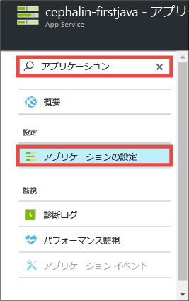
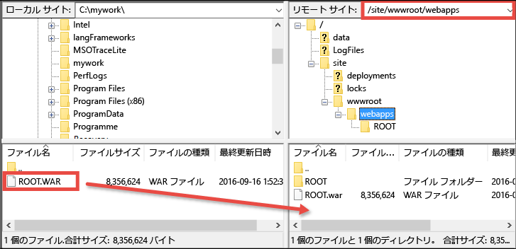

<properties 
	pageTitle="初めての Java Web アプリを Azure に 5 分でデプロイする | Microsoft Azure" 
	description="サンプル アプリをデプロイして、App Service での Web アプリの実行がいかに簡単であるかを説明します。実際の開発を速やかに開始し、すぐに成果を確認できます。" 
	services="app-service\web"
	documentationCenter=""
	authors="cephalin"
	manager="wpickett"
	editor=""
/>

<tags
	ms.service="app-service-web"
	ms.workload="web"
	ms.tgt_pltfrm="na"
	ms.devlang="na"
	ms.topic="hero-article"
	ms.date="09/16/2016" 
	ms.author="cephalin"
/>
	
# 初めての Java Web アプリを Azure に 5 分でデプロイする

このチュートリアルでは、シンプルな Java Web アプリを [Azure App Service](../app-service/app-service-value-prop-what-is.md) にデプロイします。App Service を使用すると、Web アプリ、[モバイル アプリ バックエンド](/documentation/learning-paths/appservice-mobileapps/)、および [API アプリ](../app-service-api/app-service-api-apps-why-best-platform.md)を作成できます。

このチュートリアルの内容は次のとおりです。

- Azure App Service で Web アプリを作成する。
- サンプルの Java アプリケーションをデプロイする。
- 運用環境でライブ実行されているコードを確認する。

## 前提条件

- [FileZilla](https://filezilla-project.org/) などの FTP/FTPS クライアントを取得します。
- Microsoft Azure アカウントを取得します。アカウントを持っていない場合は、[無料試用版にサインアップする](/pricing/free-trial/?WT.mc_id=A261C142F)か [Visual Studio サブスクライバー特典を有効](/pricing/member-offers/msdn-benefits-details/?WT.mc_id=A261C142F)にしてください。

>[AZURE.NOTE] Azure アカウントがなくても、[App Service を試用](http://go.microsoft.com/fwlink/?LinkId=523751)できます。スターター アプリを作成し、最大 1 時間使用できます。クレジット カードも契約も不要です。

## Web アプリを作成する

1. Azure アカウントで [Azure Portal](https://portal.azure.com) にサインインします。

2. 左側のメニューで、**[新規]**、**[Web + モバイル]**、**[Web アプリ]** の順にクリックします。

    

3. アプリ作成ブレードでは、新しいアプリに次の設定を使用します。

    - **[アプリ名]**: 一意の名前を入力します。
    - **[リソース グループ]**: **[新規作成]** を選択し、リソース グループに名前を付けます。
    - **[App Service プラン/場所]**: このオプションをクリックし、**[新規作成]** をクリックして、App Service プランの名前、場所、価格レベルを設定します。**Free** 価格レベルを自由に使用してください。

    設定が完了すると、アプリ作成ブレードは次のようになります。

    

3. 下部にある **[作成]** をクリックします。上部にある **[通知]** アイコンをクリックすると、進行状況を確認できます。

    

4. デプロイが完了すると、次の通知メッセージが表示されます。メッセージをクリックして、デプロイメントのブレードを開きます。

    

5. **[デプロイメントに成功しました]** ブレードで、**[リソース]** のリンクをクリックして、新しい Web アプリのブレードを開きます。

    

## Web アプリに Java アプリをデプロイする

次に、FTPS を使用して Azure に Java アプリをデプロイしましょう。

5. [Web アプリ] ブレードで、下にスクロールして **[アプリケーションの設定]** を表示するかこれを探してクリックします。

    

6. **[Java バージョン]** で、**[Java 8]** を選択して **[保存]** をクリックします。

    

    **[Web アプリ設定が正常に更新されました]** という通知が表示されたら、http://*&lt;appname>*.azurewebsites.net に移動して、アクティブな既定の JSP サーブレットを確認します。

7. [Web アプリ] ブレードに戻り、下にスクロールして **[デプロイ資格情報]** を表示するかこれを探してクリックします。

8. デプロイ資格情報を設定し、**[保存]** をクリックします。

7. [Web アプリ] ブレードに戻り、**[概要]** をクリックします。**[FTP/デプロイメント ユーザー名]** と **[FTPS ホスト名]** の横にある **[コピー]** ボタンをクリックして、これらの値をコピーします。

    

    これで FTPS を使用して Java アプリをデプロイする準備ができました。

8. FTP/FTPS クライアントで、最後の手順でコピーした値を使用して、Azure の Web アプリの FTP サーバーにログインします。以前に作成したデプロイ パスワードを使用してください。

    次のスクリーンショットは、FileZilla を使用したログインを示しています。

    

    Azure から認識されない SSL 証明書のセキュリティ警告が表示される場合があります。続行してください。

9. [このリンク](https://github.com/Azure-Samples/app-service-web-java-get-started/raw/master/webapps/ROOT.war)をクリックして、WAR ファイルをローカル コンピューターにダウンロードします。

9. FTP/FTPS クライアントで、リモート サイトの **/site/wwwroot/webapps** に移動して、ローカル コンピューターにダウンロードした WAR ファイルをそのリモート ディレクトリにドラッグします。

    

    **[OK]** をクリックして、Azure のファイルを上書きします。

    >[AZURE.NOTE] Tomcat の既定の動作に従って、/site/wwwroot/webapps のファイル名 **ROOT.war** が、ルートの Web アプリ (http://*&lt;appname>*.azurewebsites.net) となり、ファイル名 ***&lt;anyname>*.war** が名前付き Web アプリ (http://*&lt;appname>*.azurewebsites.net/*&lt;anyname>*) になります。

これで完了です。 Azure で Java アプリがライブ実行されています。ブラウザーで http://*&lt;appname>*.azurewebsites.net に移動して、実行中のコードを確認します。

## アプリを更新する

更新の必要があるときには、FTP/FTPS クライアントと同じリモート ディレクトリに新しい WAR ファイルをアップロードします。

## 次のステップ

[Azure Marketplace にあるテンプレートから Java Web アプリを作成します](app-service-web-java-get-started.md#marketplace)。完全にカスタマイズ可能な Tomcat コンテナーを取得して、使い慣れたマネージャー UI を使用できます。

[IntelliJ](app-service-web-debug-java-web-app-in-intellij.md) か [Eclipse](app-service-web-debug-java-web-app-in-eclipse.md) で、Azure Web アプリを直接デバッグします。

または、最初の Web アプリを活用します。次に例を示します。

- [Azure にコードをデプロイする他の方法](../app-service-web/web-sites-deploy.md)を試してみます。たとえば、GitHub リポジトリのいずれかからデプロイする場合、**[デプロイ オプション]** の **[ローカル Git リポジトリ]** ではなく、**[GitHub]** を選択します。
- Azure アプリを次のレベルに進めます。ユーザーを認証します。必要に応じてスケールを変更したり、パフォーマンスのアラートを設定したりできます。いずれも、数回のクリックで実現できます。「[初めての Web アプリに機能を追加する](app-service-web-get-started-2.md)」を参照してください。

<!-----HONumber=AcomDC_0920_2016-->