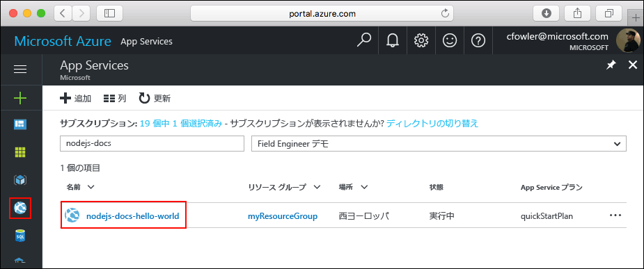

# <a name="create-a-nodejs-application-on-web-app"></a>Web アプリでの Node.js アプリケーションの作成

このクイック スタート チュートリアルでは、Node.js アプリを開発し、Azure にデプロイする方法について説明します。 [Azure App Service プラン](https://docs.microsoft.com/azure/app-service/azure-web-sites-web-hosting-plans-in-depth-overview)を使用してアプリを実行し、Azure CLI を使用してその内部に新しい Web アプリを作成および構成します。 次に、Git を使用して、Node.js アプリを Azure にデプロイします。


以下の手順は、Mac、Windows、または Linux コンピューターを使用して実行できます。 以下の手順全体を、約 5 分で完了できます。

## <a name="prerequisites"></a>前提条件

このサンプルを作成する前に、次のものをダウンロードしてインストールします。

* [Git](https://git-scm.com/)
* [Node.js および NPM](https://nodejs.org/)
* [Azure CLI 2.0](https://docs.microsoft.com/cli/azure/install-azure-cli)

[!INCLUDE [quickstarts-free-trial-note](../../includes/quickstarts-free-trial-note.md)]

## <a name="download-the-sample"></a>サンプルのダウンロード

Hello World サンプル アプリ リポジトリをローカル コンピューターにクローンします。

```bash
git clone https://github.com/Azure-Samples/nodejs-docs-hello-world
```

サンプル コードが含まれているディレクトリに移動します。

```bash
cd nodejs-docs-hello-world
```

## <a name="run-the-app-locally"></a>アプリをローカルで実行する

ターミナル ウィンドウを開き、サンプルの `npm start` スクリプトを使用してローカルでアプリケーションを実行し、組み込みの Node.js http サーバーを起動します。

```bash
npm start
```

Web ブラウザーを開き、サンプルに移動します。

```bash
http://localhost:1337
```

ページに表示されているサンプル アプリの **Hello World** メッセージが表示されます。


ターミナル ウィンドウで **Ctrl + C** キーを押して、Web サーバーを終了します。

## <a name="log-in-to-azure"></a>Azure へのログイン

ターミナル ウィンドウで Azure CLI 2.0 を使用して、Azure で Node.js アプリをホストするために必要なリソースを作成します。 [az login](/cli/azure/#login) コマンドで Azure サブスクリプションにログインし、画面上の指示に従います。

```azurecli
az login
```

<!-- ## Configure a Deployment User -->
[!INCLUDE [login-to-azure](../../includes/configure-deployment-user.md)]

## <a name="create-a-resource-group"></a>リソース グループの作成

[az group create](/cli/azure/group#create) でリソース グループを作成します。 Azure リソース グループとは、Web アプリ、データベース、ストレージ アカウントなどの Azure リソースのデプロイと管理に使用する論理コンテナーです。

```azurecli
az group create --name myResourceGroup --location westeurope
```

## <a name="create-an-azure-app-service-plan"></a>Azure App Service プランの作成

[az appservice plan create](/cli/azure/appservice/plan#create) コマンドで、"無料の" [App Service プラン](../app-service/azure-web-sites-web-hosting-plans-in-depth-overview.md)を作成します。

<!--
 An App Service plan represents the collection of physical resources used to ..
-->
[!INCLUDE [app-service-plan](../../includes/app-service-plan.md)]

次の例では、**Free** 価格レベルを使用して、`quickStartPlan` という名前の App Service プランを作成します。

```azurecli
az appservice plan create --name quickStartPlan --resource-group myResourceGroup --sku FREE
```

App Service プランが作成されると、Azure CLI によって、次の例のような情報が表示されます。

```json
{
    "id": "/subscriptions/00000000-0000-0000-0000-000000000000/resourceGroups/myResourceGroup/providers/Microsoft.Web/serverfarms/quickStartPlan",
    "location": "West Europe",
    "sku": {
    "capacity": 1,
    "family": "S",
    "name": "S1",
    "tier": "Standard"
    },
    "status": "Ready",
    "type": "Microsoft.Web/serverfarms"
}
```

## <a name="create-a-web-app"></a>Web アプリの作成

App Service プランが作成されたので、`quickStartPlan` App Service プラン内に [Web アプリ](https://docs.microsoft.com/azure/app-service-web/app-service-web-overview)を作成します。 Web アプリにより、コードをデプロイするためのホスト領域が取得され、デプロイされたアプリケーションを表示するための URL が提供されます。 Web アプリを作成するには、[az appservice web create](/cli/azure/appservice/web#create) コマンドを使用します。

次のコマンドで、`<app_name>` プレースホルダーを独自の一意のアプリ名に置き換えてください。 `<app_name>` は、Web アプリの既定の DNS サイトで使用されます。 `<app_name>` が一意でない場合は、"Website with given name <app_name> already exists (指定された名前 <app_name> を持つ Web サイトが既に存在します)" というわかりやすいエラー メッセージが表示されます。

<!-- removed per https://github.com/Microsoft/azure-docs-pr/issues/11878
You can later map any custom DNS entry to the web app before you expose it to your users.
-->

```azurecli
az appservice web create --name <app_name> --resource-group myResourceGroup --plan quickStartPlan
```

Web アプリが作成されると、Azure CLI によって次の例のような情報が表示されます。

```json
{
    "clientAffinityEnabled": true,
    "defaultHostName": "<app_name>.azurewebsites.net",
    "id": "/subscriptions/00000000-0000-0000-0000-000000000000/resourceGroups/myResourceGroup/providers/Microsoft.Web/sites/<app_name>",
    "isDefaultContainer": null,
    "kind": "app",
    "location": "West Europe",
    "name": "<app_name>",
    "repositorySiteName": "<app_name>",
    "reserved": true,
    "resourceGroup": "myResourceGroup",
    "serverFarmId": "/subscriptions/00000000-0000-0000-0000-000000000000/resourceGroups/myResourceGroup/providers/Microsoft.Web/serverfarms/quickStartPlan",
    "state": "Running",
    "type": "Microsoft.Web/sites",
}
```

サイトを参照して、新たに作成された Web アプリを表示します。

```bash
http://<app_name>.azurewebsites.net
```


これで、Azure に空の新しい Web アプリが作成されました。

## <a name="configure-local-git-deployment"></a>ローカル Git デプロイの構成

Web アプリにデプロイするには、FTP、ローカル Git や GitHub、Visual Studio Team Services、Bitbucket など、さまざまな方法があります。

Web アプリへのローカル Git アクセスを構成するには、[az appservice web source-control config-local-git](/cli/azure/appservice/web/source-control#config-local-git) コマンドを使用します。

```azurecli
az appservice web source-control config-local-git --name <app_name> --resource-group myResourceGroup --query url --output tsv
```

次の手順で使用するため、ターミナルからの出力をコピーしておきます。

```bash
https://<username>@<app_name>.scm.azurewebsites.net:443/<app_name>.git
```

## <a name="push-to-azure-from-git"></a>Git から Azure へのプッシュ

ローカル Git リポジトリに Azure リモートを追加します。

```bash
git remote add azure <paste-previous-command-output-here>
```

アプリをデプロイするために、Azure リモートにプッシュします。 前にデプロイ ユーザーを作成するときに指定したパスワードの入力を求めるメッセージが表示されます。 Azure Portal にログインするために使用するパスワードではなく、「[デプロイ ユーザーの構成](#configure-a-deployment-user)」で作成したパスワードを入力するようにしてください。

```bash
git push azure master
```

デプロイ中、Azure App Service は進行状況について Git と通信します。

```bash
Counting objects: 23, done.
Delta compression using up to 4 threads.
Compressing objects: 100% (21/21), done.
Writing objects: 100% (23/23), 3.71 KiB | 0 bytes/s, done.
Total 23 (delta 8), reused 7 (delta 1)
remote: Updating branch 'master'.
remote: Updating submodules.
remote: Preparing deployment for commit id 'bf114df591'.
remote: Generating deployment script.
remote: Generating deployment script for node.js Web Site
remote: Generated deployment script files
remote: Running deployment command...
remote: Handling node.js deployment.
remote: Kudu sync from: '/home/site/repository' to: '/home/site/wwwroot'
remote: Copying file: '.gitignore'
remote: Copying file: 'LICENSE'
remote: Copying file: 'README.md'
remote: Copying file: 'index.js'
remote: Copying file: 'package.json'
remote: Copying file: 'process.json'
remote: Deleting file: 'hostingstart.html'
remote: Ignoring: .git
remote: Using start-up script index.js from package.json.
remote: Node.js versions available on the platform are: 4.4.7, 4.5.0, 6.2.2, 6.6.0, 6.9.1.
remote: Selected node.js version 6.9.1. Use package.json file to choose a different version.
remote: Selected npm version 3.10.8
remote: Finished successfully.
remote: Running post deployment command(s)...
remote: Deployment successful.
To https://<app_name>.scm.azurewebsites.net:443/<app_name>.git
 * [new branch]      master -> master
```

## <a name="browse-to-the-app"></a>アプリの参照

Web ブラウザーを使用して、デプロイされたアプリケーションを参照します。

```bash
http://<app_name>.azurewebsites.net
```

今回は、Azure App Service Web アプリとして実行されている Node.js コードを使用して、Hello World メッセージを表示するページが実行されています。

## <a name="updating-and-deploying-the-code"></a>コードの更新とデプロイ

ローカルのテキスト エディターを使用して、Node.js アプリ内の `index.js` ファイルを開き、`response.end` の呼び出し内のテキストを少し変更します。

```nodejs
response.end("Hello Azure!");
```

変更を Git にコミットし、コード変更を Azure にプッシュします。

```bash
git commit -am "updated output"
git push azure master
```

デプロイが完了したら、「**アプリの参照**」の手順で開いた元のブラウザー ウィンドウに切り替えて、更新をクリックします。


## <a name="manage-your-new-azure-web-app"></a>新しい Azure Web アプリの管理

Azure Portal に移動し、作成したばかりの Web アプリを表示します。

そのためには、[https://portal.azure.com](https://portal.azure.com) にサインインします。

左側のメニューで **[App Services (App Services)]** をクリックした後、Azure Web アプリの名前をクリックします。



Web アプリの "_ブレード_" (水平方向に開かれるポータル ページ) が表示されます。

既定では、Web アプリのブレードは **[概要]** ページを表示します。 このページでは、アプリの動作状態を見ることができます。 ここでは、参照、停止、開始、再開、削除のような基本的な管理タスクも行うことができます。 ブレードの左側にあるタブは、開くことができるさまざまな構成ページを示しています。


ブレードのこれらのタブは、Web アプリに追加することができるさまざまな優れた機能を示しています。 次の一覧では、ほんの一部の例を示しています。

* カスタム DNS 名をマップする
* カスタム SSL 証明書をバインドする
* 継続的なデプロイを構成する
* スケールアップとスケールアウトを行う
* ユーザー認証を追加する

**お疲れさまでした。** App Service に初めての Node.js アプリをデプロイしました。

[!INCLUDE [cli-samples-clean-up](../../includes/cli-samples-clean-up.md)]

> [!div class="nextstepaction"]
> [Web アプリの CLI スクリプト サンプルを見る](app-service-cli-samples.md)

