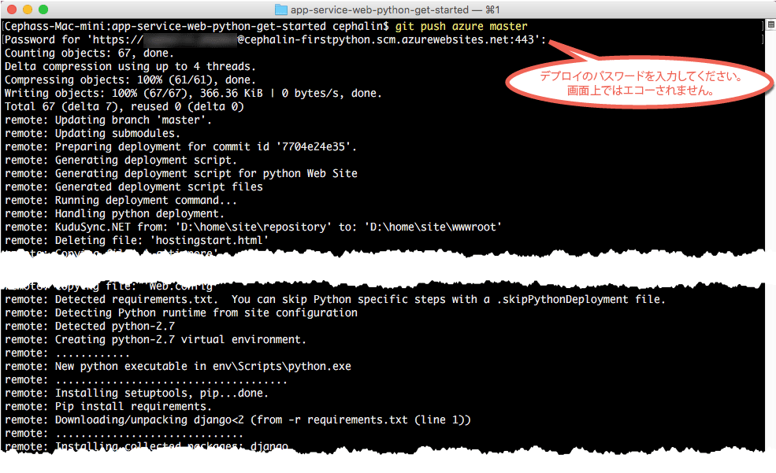

# 初めての Python Web アプリを Azure に 5 分でデプロイする (CLI 2.0 プレビュー)

> [!div class="op_single_selector"]
> * [初めての HTML サイト](app-service-web-get-started-html.md)
> * [初めての .NET アプリ](app-service-web-get-started-dotnet.md)
> * [初めての PHP アプリ](app-service-web-get-started-php.md)
> * [初めての Node.js アプリ](app-service-web-get-started-nodejs.md)
> * [初めての Python アプリ](app-service-web-get-started-python.md)
> * [初めての Java アプリ](app-service-web-get-started-java.md)
> 
> 

このチュートリアルでは、初めての Python Web アプリを [Azure App Service](../app-service/app-service-value-prop-what-is.md)にデプロイします。
App Service を使用すると、Web アプリ、[モバイル アプリ バックエンド](/documentation/learning-paths/appservice-mobileapps/)、および [API アプリ](../app-service-api/app-service-api-apps-why-best-platform.md)を作成できます。

このチュートリアルの内容は次のとおりです。 

* Azure App Service で Web アプリを作成する。
* Python のサンプル コードをデプロイする。
* 運用環境でライブ実行されているコードを確認する。
* [Git コミットをプッシュする](https://git-scm.com/docs/git-push)ときと同じ方法で Web アプリを更新する。

[!INCLUDE [app-service-linux](../../includes/app-service-linux.md)]

## タスクを完了するための CLI バージョン

次のいずれかの CLI バージョンを使用してタスクを完了できます。

- [Azure CLI 1.0](app-service-web-get-started-python-cli-nodejs.md) - クラシック デプロイメント モデルと Resource Manager デプロイメント モデル用の CLI
- [Azure CLI 2.0 (プレビュー)](app-service-web-get-started-python.md) - Resource Manager デプロイメント モデル用の次世代 CLI

## 前提条件
* [Git](http://www.git-scm.com/downloads)。
* [Azure CLI 2.0 プレビュー](/cli/azure/install-az-cli2)。
* Microsoft Azure アカウント。 アカウントを持っていない場合は、[無料試用版にサインアップ](https://azure.microsoft.com/pricing/free-trial/?WT.mc_id=A261C142F)するか [Visual Studio サブスクライバー特典を有効](https://azure.microsoft.com/pricing/member-offers/msdn-benefits-details/?WT.mc_id=A261C142F)にしてください。

> [!NOTE]
> Azure アカウントがなくても、[App Service を試用](https://azure.microsoft.com/try/app-service/)できます。 スターター アプリを作成し、最大&1; 時間使用できます。クレジット カードも契約も不要です。
> 
> 

## Python Web アプリをデプロイする
1. 新しい Windows コマンド プロンプト、PowerShell ウィンドウ、Linux のシェル、または OS X ターミナルを開きます。 `git --version` と `azure --version` を実行し、Git と Azure CLI がコンピューターにインストールされていることを確認します。
   
    
   
    ツールをインストールしていない場合は、「 [前提条件](#Prerequisites) 」のダウンロード リンクを参照してください。
2. 次のようにして、Azure にログインします。
   
        az login
   
    ヘルプ メッセージに従って、ログイン プロセスを続行します。
   
    

3. App Service のデプロイ ユーザーを設定します。 後で、これらの資格情報を使用してコードをデプロイします。
   
        az appservice web deployment user set --user-name <username> --password <password>

3. 新しい[リソース グループ](../azure-resource-manager/resource-group-overview.md)を作成します。 この最初の App Service のチュートリアルでは、実際にその内容を把握している必要はありません。

        az group create --location "<location>" --name my-first-app-group

    `<location>` に使用できる値を確認するには、CLI コマンド `az appservice list-locations` を使用してください。

3. 新しい "Free" [App Service プラン](../app-service/azure-web-sites-web-hosting-plans-in-depth-overview.md)を作成します。 この最初の App Service のチュートリアルでは、このプランの Web アプリに対しては課金されないことを把握しておくだけでかまいません。

        az appservice plan create --name my-free-appservice-plan --resource-group my-first-app-group --sku FREE

4. `<app_name>` に一意の名前を指定して新しい Web アプリを作成します。

        az appservice web create --name <app_name> --resource-group my-first-app-group --plan my-free-appservice-plan

4. 次に、デプロイするサンプル Python コードを取得します。 作業ディレクトリに移動 (`CD`) し、次のようにサンプル アプリを複製します。
   
        cd <working_directory>
        git clone https://github.com/Azure-Samples/app-service-web-python-get-started.git

5. サンプル アプリのリポジトリに移動します。 For example:
   
        cd app-service-web-python-get-started
5. 次のコマンドを使用して、App Service Web アプリのローカル Git デプロイを構成します。

        az appservice web source-control config-local-git --name <app_name> --resource-group my-first-app-group

    次のような JSON 出力が表示されます。これは、リモート Git リポジトリが構成されていることを意味します。

        {
        "url": "https://<deployment_user>@<app_name>.scm.azurewebsites.net/<app_name>.git"
        }

6. この URL を、ローカル リポジトリの Git リモートとして JSON に追加します (Git リモートは、わかりやすくするために `azure` という名前にしています)。

        git remote add azure https://<deployment_user>@<app_name>.scm.azurewebsites.net/<app_name>.git
   
7. Git でコードをプッシュする場合と同様に、サンプル コードを Azure アプリにデプロイします。 メッセージが表示されたら、前に構成したパスワードを入力します。
   
        git push azure master
   
    
   
    `git push` を実行すると、Azure にコードが配置されるだけでなく、デプロイ エンジンのデプロイ タスクがトリガーされます。 
    プロジェクト (リポジトリ) のルートに何らかの requirements.txt (Python) ファイルがある場合は、デプロイ スクリプトが必要なパッケージを復元します。 

これで、Azure App Service にアプリがデプロイされました。

## アプリがライブ実行されるのを確認する
Azure で実稼働しているアプリを確認するには、リポジトリ内の任意のディレクトリから次のコマンドを実行します。

    azure site browse

## アプリを更新する
Git を使用してプロジェクト (リポジトリ) のルートからプッシュして、いつでもライブ サイトを更新することができるようになりました。 これは、初めてコードをデプロイしたときと同様に行います。 たとえば、ローカルでテストした新しい変更をプッシュする場合は、プロジェクト (リポジトリ) のルートから次のコマンドを実行するだけで済みます。

    git add .
    git commit -m "<your_message>"
    git push azure master

## 次のステップ
[Visual Studio で Django Web アプリを作成および構成して、Azure にデプロイします](web-sites-python-ptvs-django-mysql.md)。 このチュートリアルでは、Azure で Python Web アプリを実行するのに必要となる、以下のような基本的なスキルを学習します。

* テンプレートを使用して、Python アプリを作成してデプロイする。
* Python バージョンを設定する。
* 仮想環境を作成する。
* データベースに接続する。

または、最初の Web アプリを活用します。 次に例を示します。

* [Azure にコードをデプロイする他の方法](web-sites-deploy.md)を試してみます。 たとえば、GitHub リポジトリのいずれかからデプロイする場合、**[デプロイ オプション]** の **[ローカル Git リポジトリ]** ではなく、**[GitHub]** を選択します。
* Azure アプリを次のレベルに進めます。 ユーザーを認証します。 必要に応じてスケールを変更したり、 パフォーマンスのアラートを設定したりできます。 いずれも、数回のクリックで実現できます。 「[初めての Web アプリに機能を追加する](app-service-web-get-started-2.md)」を参照してください。

<!--HONumber=Feb17_HO3-->

