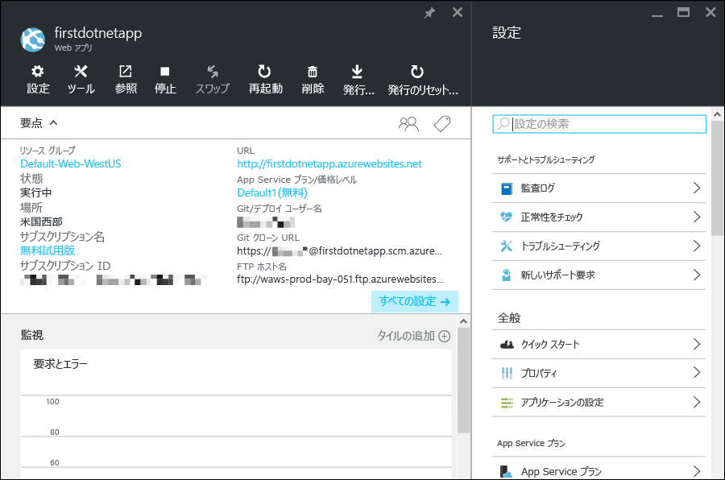

<properties 
	pageTitle="Azure App Service での Web アプリの使用" 
	description="App Service で Web アプリをライブ実行する簡単な方法について説明します。実際の開発を 5 分で開始し、すぐに成果を確認できます。" 
	services="app-service\web"
	documentationCenter=""
	authors="cephalin" 
	manager="wpickett" 
	editor="" 
/>

<tags 
	ms.service="app-service-web" 
	ms.workload="web" 
	ms.tgt_pltfrm="na" 
	ms.devlang="na" 
	ms.topic="hero-article"
	ms.date="04/04/2016" 
	ms.author="cephalin"
/>
	
# Azure App Service での Web アプリの使用

このチュートリアルでは、Web アプリを [Azure App Service](../app-service/app-service-value-prop-what-is.md) に短時間でデプロイする方法について説明します。必要な操作は次のようにわずかです。

- サンプルの Web アプリケーションをデプロイする (ASP.NET、PHP、Node.js、Java、Python から選択する)。
- すぐにアプリがライブ実行されるのを確認する。
- [Git](http://www.git-scm.com/) コミットをプッシュする場合と同じ方法で Web アプリを更新する。

また、[Azure ポータル](https://portal.azure.com)を確認し、使用可能な機能を調べます。

## 前提条件

このチュートリアルを完了するには、次のものが必要です。

- Gitインストール バイナリを[こちら](http://www.git-scm.com/downloads)でダウンロードできます。任意のコマンドライン ターミナルから `git --version` を実行できます。 
- Git の基本的な知識。
- Azure CLI。インストールの手順については、[こちら](../xplat-cli-install.md)を参照してください。任意のコマンドライン ターミナルから `azure --version` を実行できます。
- Microsoft Azure アカウント。アカウントを持っていない場合は、[無料試用版にサインアップする](/pricing/free-trial/?WT.mc_id=A261C142F)か [Visual Studio サブスクライバー特典を有効](/pricing/member-offers/msdn-benefits-details/?WT.mc_id=A261C142F)にしてください。

>[AZURE.NOTE] Azure アカウントにサインアップする前に実際の Azure App Service を確認したい場合は、「[Azure App Service を使ってみる](http://go.microsoft.com/fwlink/?LinkId=523751)」を参照してください。有効期間が短いスターター アプリを App Service ですぐに作成できます。このサービスの利用にあたり、クレジット カードや契約は必要ありません。

## Web アプリをデプロイする

Azure App Service に Web アプリをデプロイしましょう。

1. Windows コマンド プロンプト、Linux シェル、または OS X ターミナルを新しく開き、`CD` を実行して作業ディレクトリに移動し、次のようにしてサンプル アプリを複製します。

        git clone <github_sample_url>

    *&lt;github\_sample\_url>* には、好みのフレームワークに応じて次の URL のいずれかを使用します。

    - ASP.NET: [https://github.com/Azure-Samples/app-service-web-dotnet-get-started.git](https://github.com/Azure-Samples/app-service-web-dotnet-get-started.git)
    - PHP (CodeIgniter): [https://github.com/Azure-Samples/app-service-web-php-get-started.git](https://github.com/Azure-Samples/app-service-web-php-get-started.git)
    - Node.js (Express): [https://github.com/Azure-Samples/app-service-web-nodejs-get-started.git](https://github.com/Azure-Samples/app-service-web-nodejs-get-started.git) 
    - Java: [https://github.com/Azure-Samples/app-service-web-java-get-started.git](https://github.com/Azure-Samples/app-service-web-java-get-started.git)
    - Python (Django): [https://github.com/Azure-Samples/app-service-web-python-get-started.git](https://github.com/Azure-Samples/app-service-web-python-get-started.git)

2. `CD` を実行してサンプル アプリのルート ディレクトリに移動します。たとえば、次のように入力します。

        cd app-service-web-dotnet-get-started

3. 次のようにして、Azure にログインします。

        azure login
    
    画面の指示に従い、Azure サブスクリプションのある Microsoft アカウントを使用してブラウザーでログイン操作を進めます。

4. 次のコマンドを使用し、一意のアプリ名で Azure に App Service アプリ リソースを作成します。

        azure site create --git <app_name>
      
    >[AZURE.NOTE] Azure サブスクリプションのデプロイ資格情報がまだ設定されていない場合は、それらを作成するように求められます。これらの資格情報 (Azure アカウント資格情報ではありません) は App Service で Git のデプロイと FTP のログインのみに使用されます。
    
    これでアプリが Azure で作成されました。また、現在のディレクトリが Git として初期化され、この新しい App Service アプリに Git リモートとして接続されています。アプリの URL (http://&lt;app_name>.azurewebsites.net) を参照すると既定の美しい HTML ページが表示されますが、ここでは用意したコードを実際に使用しましょう。

4. Git でコードをプッシュする場合と同じように、サンプル コードを新しい App Service アプリにデプロイします。

        git push azure master 
    
    >[AZURE.NOTE] デプロイ用パスワードの入力を求められます。App Service を初めて利用する場合は、作成したデプロイ用パスワードを入力して続行します。
    
    `git push` を実行すると、Azure にコードが配置されるだけでなく、デプロイ エンジンのデプロイ タスクがトリガーされます。プロジェクト (リポジトリ) のルートに package.json (Node.js) または requirements.txt (Python) がある場合、または ASP.NET プロジェクトに packages.config がある場合は、デプロイメント スクリプトによって必要なパッケージが復元されます。また、[Composer 拡張機能を有効にして](web-sites-php-mysql-deploy-use-git.md#composer)、PHP アプリで composer.json ファイルを自動的に処理することもできます。

これで、Azure App Service にアプリがデプロイされました。

## アプリがライブ実行されるのを確認する

Azure で実稼働しているアプリを確認するには、リポジトリ内の任意のディレクトリから次のコマンドを実行します。

    azure site browse

## アプリを更新する

Git を使用してプロジェクト (リポジトリ) のルートからプッシュして、いつでもライブ サイトを更新することができるようになりました。その方法は、初めて Azure にアプリをデプロイしたときの方法と同じです。たとえば、ローカルでテストした新しい変更をプッシュする場合は、プロジェクト (リポジトリ) のルートから次のコマンドを実行するだけで済みます。
    
    git add .
    git commit -m "<your_message>"
    git push azure master

## 別のデプロイ方法

Web アプリのデプロイにはさまざまな方法があり、ローカル リポジトリからの Git によるデプロイはその 1 つにすぎません。Visual Studio から直接デプロイしたり、GitHub から継続的にデプロイしたりできるほか、DropBox または OneDrive から同期したり、FTP 経由でアップロードしたりできます。デプロイ オプションの詳細については、「[Azure App Service へのアプリのデプロイ](../app-service-web/web-sites-deploy.md)」を参照してください。

## Azure ポータルでのアプリの確認

Azure ポータルにアクセスして、作成したアプリを確認しましょう。

1. Azure サブスクリプションのある Microsoft アカウントを使用して [Azure ポータル](https://portal.azure.com)にログインします。

2. 左側のバーで **[App Services]** をクリックします。

3. 作成した App Service アプリをクリックして、ポータルでそのページを開きます ([ブレード](../azure-portal-overview.md)と呼ばれています)。既定で **[設定]** ブレードが開くので便利です。

    

App Service アプリのポータル ブレードには、アプリの構成、監視、セキュリティ保護、トラブルシューティングを実行するための豊富な設定とツールが表示されます。簡単なタスクをいくつか実行して、このインターフェイスについて理解を深めてください。

- アプリを停止する
- アプリを再起動する
- **[リソース グループ]** リンクをクリックし、リソース グループにデプロイされたすべてのリソースを表示する
- **[設定]**、**[プロパティ]** の順にクリックし、アプリに関するその他の情報を表示する
- **[ツール]** をクリックし、監視とトラブルシューティングに役立つツールにアクセスする  

## 次のステップ

デプロイしたアプリをさらにレベル アップさせましょう。アプリを認証で保護したり、必要に応じてスケールを変更したり、パフォーマンスのアラートを設定したりできます。いずれも、数回のクリックで実現できます。「[Azure App Service の使用 - 第 2 部](app-service-web-get-started-2.md)」を参照してください。

また、特定の言語フレームワークで App Service の Web アプリを作成する方法について詳しく調べてください。

- [Azure App Service での ASP.NET Web アプリの作成](web-sites-dotnet-get-started.md)
- [Azure App Service で PHP Web アプリを作成する](web-sites-php-mysql-deploy-use-git.md)
- [Azure App Service での Node.js Web アプリの作成](web-sites-nodejs-develop-deploy-mac.md)
- [Azure App Service での Java Web アプリの作成](web-sites-java-get-started.md)
- [Azure App Service での Python Web アプリの作成](web-sites-python-ptvs-django-mysql.md)

また、Web アプリ、モバイル アプリ バックエンド、API アプリなど、Azure App Service で構築できるさまざまなアプリについて説明したコンテンツも用意されています。

- [Web アプリの作成](/documentation/learning-paths/appservice-webapps/)
- [モバイル アプリの作成](/documentation/learning-paths/appservice-mobileapps/)
- [API アプリの作成](../app-service-api/app-service-api-apps-why-best-platform.md)

<!----HONumber=AcomDC_0420_2016-->