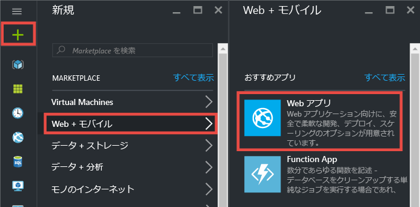
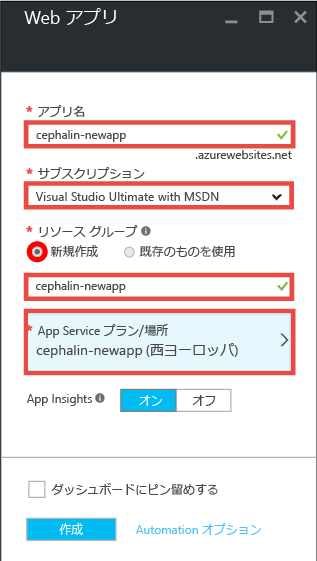
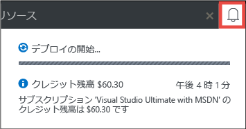
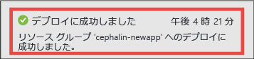
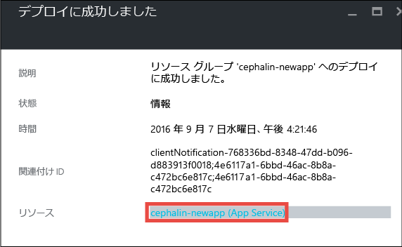
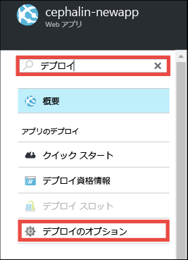
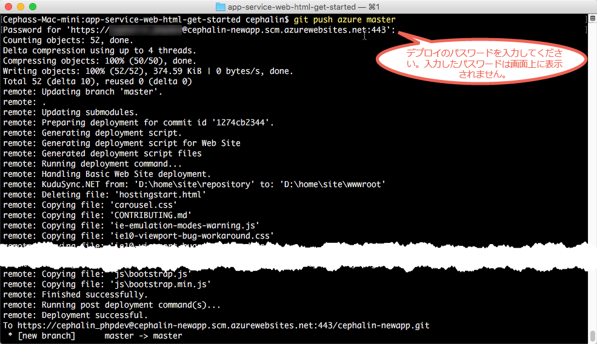

<properties 
	pageTitle="初めての Web アプリを Azure に 5 分でデプロイする | Microsoft Azure" 
	description="サンプル アプリをデプロイして、App Service での Web アプリの実行がいかに簡単であるかを説明します。実際の開発を速やかに開始し、すぐに成果を確認できます。" 
	services="app-service\web"
	documentationCenter=""
	authors="cephalin"
	manager="wpickett"
	editor=""
/>

<tags
	ms.service="app-service-web"
	ms.workload="web"
	ms.tgt_pltfrm="na"
	ms.devlang="na"
	ms.topic="hero-article"
	ms.date="09/09/2016" 
	ms.author="cephalin"
/>
	
# 初めての Web アプリを Azure に 5 分でデプロイする

このチュートリアルでは、初めての Web アプリを [Azure App Service](../app-service/app-service-value-prop-what-is.md) にデプロイします。App Service を使用すると、Web アプリ、[モバイル アプリ バックエンド](/documentation/learning-paths/appservice-mobileapps/)、および [API アプリ](../app-service-api/app-service-api-apps-why-best-platform.md)を作成できます。

このチュートリアルの内容は次のとおりです。

- Azure App Service で Web アプリを作成する。
- サンプル コードをデプロイする (ASP.NET、PHP、Node.js、Java、Python の中から選択する)。
- 運用環境でライブ実行されているコードを確認する。
- [Git コミットをプッシュする](https://git-scm.com/docs/git-push)ときと同じ方法で Web アプリを更新する。

## 前提条件

- [Git をインストールします](http://www.git-scm.com/downloads)。新しい Windows コマンド プロンプト、PowerShell ウィンドウ、Linux のシェル、または OS X ターミナルから `git --version` を実行して、インストールが正常に完了したことを確認します。
- Microsoft Azure アカウントを取得します。アカウントを持っていない場合は、[無料試用版にサインアップする](/pricing/free-trial/?WT.mc_id=A261C142F)か [Visual Studio サブスクライバー特典を有効](/pricing/member-offers/msdn-benefits-details/?WT.mc_id=A261C142F)にしてください。

>[AZURE.NOTE] Azure アカウントがなくても、[App Service を試用](http://go.microsoft.com/fwlink/?LinkId=523751)できます。スターター アプリを作成し、最大 1 時間使用できます。クレジット カードも契約も不要です。

## Web アプリを作成する

1. Azure アカウントで [Azure Portal](https://portal.azure.com) にサインインします。

2. 左側のメニューで、**[新規]**、**[Web + モバイル]**、**[Web アプリ]** の順にクリックします。

    

3. アプリ作成ブレードでは、新しいアプリに次の設定を使用します。

    - **[アプリ名]**: 一意の名前を入力します。
    - **[リソース グループ]**: **[新規作成]** を選択し、リソース グループに名前を付けます。
    - **[App Service プラン/場所]**: このオプションをクリックし、**[新規作成]** をクリックして、App Service プランの名前、場所、価格レベルを設定します。**Free** 価格レベルを自由に使用してください。

    設定が完了すると、アプリ作成ブレードは次のようになります。

    

3. 下部にある **[作成]** をクリックします。上部にある **[通知]** アイコンをクリックすると、進行状況を確認できます。

    

4. デプロイが完了すると、次の通知メッセージが表示されます。メッセージをクリックして、デプロイメントのブレードを開きます。

    

5. **[デプロイメントに成功しました]** ブレードで、**[リソース]** のリンクをクリックして、新しい Web アプリのブレードを開きます。

    

## Web アプリにコードをデプロイする

次に、Git を使用して Azure にコードをデプロイしましょう。

5. [Web アプリ] ブレードで、下にスクロールして **[デプロイ オプション]** を表示するかこれを探してクリックします。

    

6. **[ソースの選択]**、**[ローカル Git リポジトリ]**、**[OK]** の順にクリックします。

7. [Web アプリ] ブレードに戻り、**[デプロイ資格情報]** をクリックします。

8. デプロイ資格情報を設定し、**[保存]** をクリックします。

7. [Web アプリ] ブレードに戻り、下にスクロールして **[プロパティ]** を表示するかこれを探してクリックします。**[Git URL]** の横の **[コピー]** ボタンをクリックします。

    

    これで Git を使用してコードをデプロイする準備ができました。

1. コマンド ライン端末で、作業ディレクトリに移動し (`CD`)、次のようにサンプル アプリを複製します。

        git clone <github_sample_url>

    

    *&lt;github\_sample\_url>* には、好みのフレームワークに応じて次の URL のいずれかを使用します。

    - HTML + CSS + JS: [https://github.com/Azure-Samples/app-service-web-html-get-started.git](https://github.com/Azure-Samples/app-service-web-html-get-started.git)
    - ASP.NET: [https://github.com/Azure-Samples/app-service-web-dotnet-get-started.git](https://github.com/Azure-Samples/app-service-web-dotnet-get-started.git)
    - PHP (CodeIgniter): [https://github.com/Azure-Samples/app-service-web-php-get-started.git](https://github.com/Azure-Samples/app-service-web-php-get-started.git)
    - Node.js (Express): [https://github.com/Azure-Samples/app-service-web-nodejs-get-started.git](https://github.com/Azure-Samples/app-service-web-nodejs-get-started.git)
    - Java: [https://github.com/Azure-Samples/app-service-web-java-get-started.git](https://github.com/Azure-Samples/app-service-web-java-get-started.git)
    - Python (Django): [https://github.com/Azure-Samples/app-service-web-python-get-started.git](https://github.com/Azure-Samples/app-service-web-python-get-started.git)

2. サンプル アプリのリポジトリに移動します。たとえば、次のように入力します。

        cd app-service-web-html-get-started

3. いくつか前の手順でポータルからコピーした Azure アプリの Git URL に対応する Git リモートを構成します。

        git remote add azure <giturlfromportal>

4. Git でコードをプッシュする場合と同様に、サンプル コードを Azure アプリにデプロイします。

        git push azure master

    

    いずれかの言語フレームワークを使用した場合は、別の出力が表示されます。`git push` を実行すると、Azure にコードが配置されるだけでなく、デプロイ エンジンのデプロイ タスクがトリガーされるためです。プロジェクト (リポジトリ) のルートに package.json (Node.js) ファイルまたは requirements.txt (Python) ファイルがある場合、または ASP.NET プロジェクトに packages.config ファイルがある場合は、デプロイメント スクリプトによって必要なパッケージが復元されます。また、[Composer 拡張機能を有効にして](web-sites-php-mysql-deploy-use-git.md#composer)、PHP アプリで composer.json ファイルを自動的に処理することもできます。

これで完了です。 Azure でコードがライブ実行されています。ブラウザーで http://*&lt;appname>*.azurewebsites.net に移動して、実行中のコードを確認します。

## アプリを更新する

Git を使用してプロジェクト (リポジトリ) のルートからプッシュして、いつでもライブ サイトを更新することができるようになりました。これは、初めてコードをデプロイしたときと同様に行います。たとえば、ローカルでテストした新しい変更をプッシュする場合は、プロジェクト (リポジトリ) のルートから次のコマンドを実行するだけで済みます。

    git add .
    git commit -m "<your_message>"
    git push azure master

## 次のステップ

ご使用の言語フレームワークの推奨される開発とデプロイの手順を確認します。

> [AZURE.SELECTOR]
- [.NET](web-sites-dotnet-get-started.md)
- [PHP](app-service-web-php-get-started.md)
- [Node.JS](app-service-web-nodejs-get-started.md)
- [Python](web-sites-python-ptvs-django-mysql.md)
- [Java](web-sites-java-get-started.md)

または、最初の Web アプリを活用します。次に例を示します。

- [Azure にコードをデプロイする他の方法](../app-service-web/web-sites-deploy.md)を試してみます。たとえば、GitHub リポジトリのいずれかからデプロイする場合、**[デプロイ オプション]** の **[ローカル Git リポジトリ]** ではなく、**[GitHub]** を選択します。
- Azure アプリを次のレベルに進めます。ユーザーを認証します。必要に応じてスケールを変更したり、パフォーマンスのアラートを設定したりできます。いずれも、数回のクリックで実現できます。「[初めての Web アプリに機能を追加する](app-service-web-get-started-2.md)」を参照してください。

<!---HONumber=AcomDC_1005_2016-->