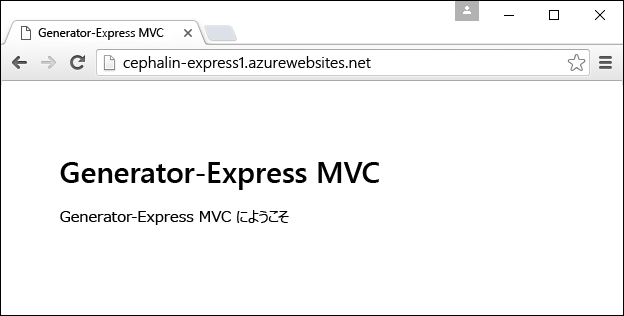
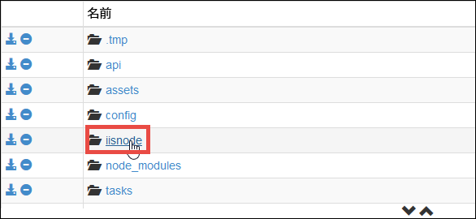
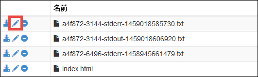
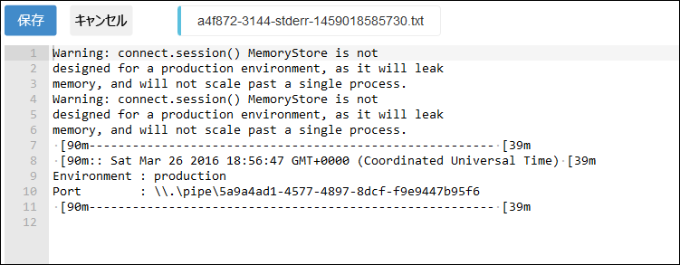

<properties
	pageTitle="Azure App Service での Node.js Web アプリの使用"
	description="Node.js アプリケーションを Azure App Service の Web アプリにデプロイする方法を説明します。"
	services="app-service\web"
	documentationCenter="nodejs"
	authors="cephalin"
	manager="wpickett"
	editor=""/>

<tags
	ms.service="app-service-web"
	ms.workload="web"
	ms.tgt_pltfrm="na"
	ms.devlang="nodejs"
	ms.topic="get-started-article"
	ms.date="03/31/2016"
	ms.author="cephalin;robmcm"/>

# Azure App Service での Node.js Web アプリの使用

> [AZURE.SELECTOR]
- [.NET](web-sites-dotnet-get-started.md)
- [Node.JS](app-service-web-nodejs-get-started.md)
- [Java](web-sites-java-get-started.md)
- [PHP - Git](web-sites-php-mysql-deploy-use-git.md)
- [PHP - FTP](web-sites-php-mysql-deploy-use-ftp.md)
- [Python](web-sites-python-ptvs-django-mysql.md)

このチュートリアルでは、簡単な [Node.js](http://nodejs.org) アプリケーションを作成し、cmd.exe や bash などのコマンド ラインを使用して [Azure App Service](../app-service/app-service-value-prop-what-is.md) の [Web アプリ](app-service-web-overview.md)にデプロイする方法について説明します。このチュートリアルの手順は、Node.js を実行できる任意のオペレーティング システムで使用できます。

<a name="prereq"/>
## 前提条件

- Node.js。インストール用のバイナリは[こちら](https://nodejs.org/)にあります。
- Yoeman。インストールの手順については、[こちら](http://yeoman.io/)を参照してください。
- Gitインストール用のバイナリは[こちら](http://www.git-scm.com/downloads)にあります。
- Azure CLI。インストールの手順については、[こちら](../xplat-cli-install.md)を参照してください。
- Microsoft Azure アカウント。アカウントを持っていない場合は、[無料試用版にサインアップする](/pricing/free-trial/?WT.mc_id=A261C142F)か [Visual Studio サブスクライバー特典を有効](/pricing/member-offers/msdn-benefits-details/?WT.mc_id=A261C142F)にしてください。

## 単純な Node.js Web アプリの作成とデプロイ

1. 任意のコマンドライン端末を開いて、[Express generator for Yoeman](https://github.com/petecoop/generator-express) をインストールします。

        npm install -g generator-express

2. `CD` で作業ディレクトリに移動し、次のように express アプリを生成します。

        yo express
        
    プロンプトで次のオプションを選択します。

    `? Would you like to create a new directory for your project?` **Yes** `? Enter directory name` **&lt;appname>** `? Select a version to install:` **MVC** `? Select a view engine to use:` **Jade** `? Select a css preprocessor to use (Sass Requires Ruby):` **None** `? Select a database to use:` **None** `? Select a build tool to use:` **Grunt**

3. `CD` で新しいアプリのルート ディレクトリに移動し、アプリを起動して開発環境で動作することを確認します。

        npm start

    ブラウザーで [http://localhost:3000](http://localhost:3000) に移動し、Express のホーム ページが表示されることを確認します。アプリが適切に実行されることを確認したら、`Ctrl-C` を使用してアプリを停止します。
    
1. 次のようにして Azure にログインします (この操作には [Azure CLI](#prereq) が必要です)。

        azure login

    画面の指示に従い、Azure サブスクリプションのある Microsoft アカウントを使用してブラウザーでログイン操作を進めます。

2. まだアプリのルート ディレクトリにいることを確認します。次のコマンドを使用し、一意のアプリ名で Azure に App Service アプリ リソースを作成します。Web アプリの URL は http://&lt;appname>.azurewebsites.net になります。

        azure site create --git <appname>

    プロンプトに従って、デプロイ先の Azure リージョンを選択します。まだ Azure サブスクリプションに Git/FTP デプロイの資格情報を設定していない場合は、資格情報を作成するように求められます。

3. config/config.js を開いて運用環境のポートを `process.env.port` に変更します。運用環境の JSON オブジェクトは次のようになります。

        production: {
            root: rootPath,
            app: {
                name: 'express1'
            },
            port: process.env.port,
        }

    これにより Node.js アプリは、iisnode がリッスンする既定のポートで Web 要求に応答できるようになります。
    
4. 変更内容を保存し、git を使用してアプリを Azure にデプロイします。

        git add .
        git commit -m "<your commit message>"
        git push azure master

    Express generator によって .gitignore ファイルがあらかじめ提供されているため、`git push` が node\_modules/ ディレクトリのアップロードを試みることによる帯域消費は発生しません。

5. 後は、ブラウザーで実稼働用の Azure アプリを起動します。

        azure site browse

    これで対象の Node.js Web アプリが Azure App Service でライブ実行されていることを確認できます。
    
    

## Node.js Web アプリの更新

App Service で実行されている Node.js Web アプリを更新するときは、デプロイするときと同様に、`git add`、`git commit`、`git push` を実行するだけです。
     
## App Service における Node.js アプリのデプロイ

Azure App Service では、Node.js アプリを実行するために [iisnode](https://github.com/tjanczuk/iisnode/wiki) が使用されます。Node.js アプリの開発とデプロイは、Azure CLI と Kudu エンジン (Git デプロイ) を組み合わせることでコマンド ラインから効率的に行うことができます。

- `azure site create --git` は、server.js または app.js の一般的な Node.js パターンを認識し、iisnode.yml をルート ディレクトリに作成します。このファイルを使用して iisnode をカスタマイズできます。
- `git push azure master` では、次のデプロイ タスクが Kudu によって自動化されます。

    - package.json がリポジトリのルートに存在する場合、`npm install --production` を実行します。
    - package.json 内の起動スクリプトで指定されたアプリの起動ファイル (server.js、app.js など) を参照する Web.config を iisnode に対して生成します。
    - Node-Inspector でアプリをデバッグできるよう Web.config をカスタマイズします。
    
## Node.js フレームワークの使用

[Sails.js](http://sailsjs.org/) や [MEAN.js](http://meanjs.org/) などの広く使われている Node.js フレームワークを使用して開発したアプリは、App Service にデプロイすることができます。広く使われている Node.js フレームワークには、それぞれ独自のくせがあり、パッケージの依存関係も絶えず更新されます。しかし App Service では、stdout と stderr のログが利用できるようになっているため、アプリで起こっていることを正確に把握し、それに応じた変更を加えることができます。詳細については、「[Get stdout and stderr logs from iisnode (iisnode から stdout ログと stderr ログを取得する)](#iisnodelog)」をご覧ください。

以下のチュートリアルには、App Service における特定のフレームワークの使用方法がわかりやすく解説されています。

- [Deploy a Sails.js web app to Azure App Service (Sails.js Web アプリを Azure App Service にデプロイする)](app-service-web-nodejs-sails.md)
- [Azure App Service での Socket.IO を使用する Node.js チャット アプリケーションの構築](web-sites-nodejs-chat-app-socketio.md)
- [Azure App Service Web Apps で io.js を使用する方法](web-sites-nodejs-iojs.md)

## 特定の Node.js エンジンの使用

App Service には、通常のワークフローでいつものように package.json で、特定の Node.js エンジンの使用を指示できます。次に例を示します。

    "engines": {
        "node": "5.5.0"
    }, 

Kudu デプロイ エンジンは、使用する Node.js エンジンを次の順序で決定します。

- まず iisnode.yml を参照し、`nodeProcessCommandLine` が指定されているかどうかを確認します。指定されている場合はそれを使用します。
- 次に package.json を参照し、`engines` オブジェクトに `"node": "..."` が指定されているかどうかを確認します。指定されている場合はそれを使用します。
- 特に指定されていない場合、既定の Node.js バージョンを選択します。

<a name="iisnodelog" />
## iisnode から stdout ログと stderr ログを取得する

iisnode ログを読み取るには、次の手順を実行します。

1. Azure CLI によって生成された iisnode.yml ファイルを開きます。

2. 次の 2 つのパラメーターを設定します。

        loggingEnabled: true
        logDirectory: iisnode
    
    この 2 つのパラメーターを組み合わせることで、stdout と stderror の出力先が D:\\home\\site\\wwwroot**iisnode** ディレクトリとなるよう、App Service 内の iisnode に伝えられます。

3. 次の Git コマンドで変更内容を保存し、Azure にプッシュします。

        git add .
        git commit -m "<your commit message>"
        git push azure master
   
   これで iisnode の構成は完了です。以下、これらのログにアクセスする方法を説明します。
     
4. ブラウザーでアプリの Kudu デバッグ コンソールにアクセスします。URL は次のとおりです。

        https://<appname>.scm.azurewebsites.net/DebugConsole 

5. D:\\home\\site\\wwwroot\\iisnode に移動します。

    

6. 読み取り対象ログの **[編集]** アイコンをクリックします。必要に応じて **[ダウンロード]** または **[削除]** をクリックすることもできます。

    

    これでログを参照できるようになりました。ログを基に App Service のデプロイをデバッグすることができます。
    
    

## Node-Inspector によるアプリのデバッグ

Node.js アプリのデバッグに Node-Inspector を使用している場合、実稼働の App Service アプリに Node-Inspector を使用できます。Node-Inspector は、App Service の iisnode のインストールでプレインストールされます。また、デプロイに Git を使用している場合、Kudu によって自動生成された Web.config には既に、Node-Inspector を有効にするうえで必要な構成がすべて含まれています。

Node-Inspector を有効にするには、次の手順を実行します。

1. リポジトリのルートにある iisnode.yml を開いて、次のパラメーターを指定します。 

        debuggingEnabled: true
        debuggerExtensionDll: iisnode-inspector.dll

3. 次の Git コマンドで変更内容を保存し、Azure にプッシュします。

        git add .
        git commit -m "<your commit message>"
        git push azure master
   
4. 後は、package.json 内の起動スクリプトで指定されたアプリの起動ファイルに移動するだけです。URL の最後に /debug を付けてください。たとえば、次のように入力します。

        http://<appname>.azurewebsites.net/server.js/debug
    
    または、
    
        http://<appname>.azurewebsites.net/app.js/debug

## その他のリソース

- [Azure アプリケーションでの Node.js のバージョンの指定](../nodejs-specify-node-version-azure-apps.md)
- [Azure App Service で Node.js Web アプリをデバッグする方法](web-sites-nodejs-debug.md)
- [Azure アプリケーションでの Node.js モジュールの使用](../nodejs-use-node-modules-azure-apps.md)
- [Azure App Service Web Apps: Node.js](http://blogs.msdn.com/b/silverlining/archive/2012/06/14/windows-azure-websites-node-js.aspx)
- [Node.js デベロッパー センター](/develop/nodejs/)
- [Azure App Service での Web アプリの使用](app-service-web-get-started.md)

<!---HONumber=AcomDC_0413_2016-->