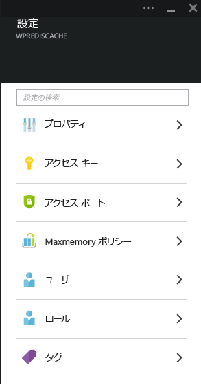
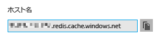
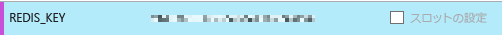
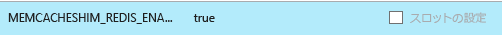
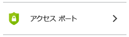
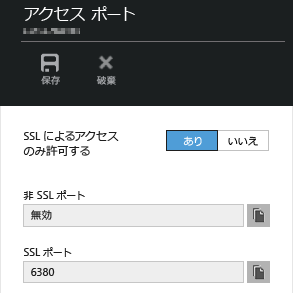
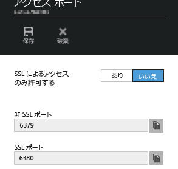

<properties
	pageTitle="Memcache プロトコルを経由して Azure App Service の Web アプリを Redis Cache に接続する | Microsoft Azure"
	description="Memcache プロトコルを使用して Azure App Service の Web アプリを Redis Cache に接続する"
	services="app-service\web"
	documentationCenter="php"
	authors="SyntaxC4"
	manager="wpickett"
	editor="riande"/>

<tags
	ms.service="app-service-web"
	ms.devlang="php"
	ms.topic="get-started-article"
	ms.tgt_pltfrm="windows"
	ms.workload="na"
	ms.date="12/24/2015"
	ms.author="cfowler"/>

# Memcache プロトコルを経由して Azure App Service の Web アプリを Redis Cache に接続する

この記事では、[Memcache][13] プロトコルを使用して [Azure App Service](http://go.microsoft.com/fwlink/?LinkId=529714) の WordPress Web アプリを [Azure Redis Cache][12] に接続する方法について説明します。メモリ内のキャッシュに Memcached サーバーを使用する Web アプリがすでにある場合、Azure App Service に移行して、アプリケーション コードへの変更がほとんど、もしくはまったくない状態で Microsoft Azure でファースト パーティーのキャッシュ ソリューションが使用できます。さらに、.NET、PHP、Node.js、Java、Python などの一般的なアプリケーション フレームワークを使用しながら、既存の Memcache の知識を利用してメモリ内のキャッシュ用に Azure Redis Cache を使い、Azure App Service で拡張性の高い分散型アプリを作成できます。

App Service Web Apps により、Web Apps の Memcache shim でこのアプリケーション シナリオが有効になります。Memcache shim はローカルの Memcached サーバーで、Azure Redis Cache への呼び出しをキャッシュする Memcache プロキシの役割を果たします。これにより、Memcache プロトコルを使用して通信するアプリでは Redis Cache を使用してデータをキャッシュできるようになります。この Memcache shim はプロトコル レベルで動作するので、Memcache プロトコルを使用して通信する限り、あらゆるアプリケーションやアプリケーション フレームワークで使用できます。

[AZURE.INCLUDE [app-service-web-to-api-and-mobile](../../includes/app-service-web-to-api-and-mobile.md)] 

## 前提条件

Web Apps の Memcache shim は、Memcache プロトコルを使用して通信することを条件に、あらゆるアプリケーションで使用できます。この特定の例では、参照アプリケーションは、Azure Marketplace からプロビジョニングできるスケーラブルな WordPress サイトです。

次の記事で説明されている手順に従います。

* [Azure Redis Cache Service のインスタンスをプロビジョニングする][0]
* [Azure でスケーラブルな WordPress サイトをデプロイする][1]

スケーラブルな WordPress サイトをデプロイして、Redis Cache インスタンスをプロビジョニングしたら、Azure App Service Web Apps で Memcache shim を有効にできるようになります。

## Web Apps の Memcache shim を有効にする

Memcache shim を構成するためには 3 つのアプリ設定を作成する必要があります。これは、[Azure ポータル](http://go.microsoft.com/fwlink/?LinkId=529715)、[クラシック ポータル][3]、[Azure PowerShell コマンドレット][5]、[Azure コマンドライン インターフェイス][5]などのさまざまな手法を使用して実行できます。この記事では、[Azure ポータル][4]を使用してアプリ設定を行います。次の値は Redis Cache インスタンスの **[設定]** ブレードから取得できます。



### REDIS_HOST アプリ設定の追加

最初に、**REDIS\_HOST** アプリ設定を作成する必要があります。この設定では、shim がキャッシュ情報を転送する場所を設定します。REDIS\_HOST アプリ設定に必要な値は、Redis Cache インスタンスの **[プロパティ]** ブレードから取得できます。



アプリ設定のキーを **REDIS\_HOST** に設定し、アプリ設定の値を Redis Cache インスタンスの**ホスト名**に設定します。


### REDIS_KEY アプリ設定の追加

次に、**REDIS\_KEY** アプリ設定を作成する必要があります。この設定では、Redis Cache インスタンスに安全にアクセスするために必要な認証トークンを提供します。REDIS\_KEY アプリ設定に必要な値は、Redis Cache インスタンスの **[アクセス キー]** ブレードから取得できます。


アプリ設定のキーを **REDIS\_KEY** に設定し、アプリ設定の値を Redis Cache インスタンスの **Primary Key** に設定します。



### MEMCACHESHIM_REDIS_ENABLE アプリ設定の追加

最後のアプリ設定は Web Apps で Memcache Shim を有効にするために使用します。REDIS_HOST と REDIS_KEY を使用して Azure Redis Cache に接続し、キャッシュの呼び出しを転送します。アプリ設定のキーを **MEMCACHESHIM\_REDIS\_ENABLE** に設定し、値を **true** に設定します。



3 つのアプリ設定の追加が完了したら、**[保存]** をクリックします。

## PHP で Memcache 拡張機能を有効にする

アプリケーションで Memcache プロトコルを使用するには、PHP (WordPress サイトの言語フレームワーク) に Memcache 拡張機能をインストールする必要があります。

### php_memcache 拡張機能のダウンロード

[PECL][6] を参照します。キャッシュ カテゴリで [[memcache]][7] をクリックします。[Downloads] 列で [DLL] のリンクをクリックします。


Web Apps で有効な PHP バージョンの 非スレッド セーフ (NTS) x86 のリンクをダウンロードします(既定は PHP 5.4)。


### php_memcache 拡張機能を有効にする

ファイルをダウンロードしたら、**php\_memcache.dll** を解凍して **D:\\home\\site\\wwwroot\\bin\\ext\** ディレクトリにアップロードします。php_memcache.dll を Web アプリにアップロードしたら、PHP ランタイムで拡張機能を有効にする必要があります。Azure ポータルで Memcache 拡張機能を有効にするには、Web アプリの **[アプリケーション設定]** ブレードを開き、**PHP\_EXTENSIONS** のキーと **bin\\ext\\php_memcache.dll** という値を持つ新しいアプリ設定を追加します。


> [AZURE.NOTE]Web アプリで複数の PHP 拡張機能をロードする必要がある場合、PHP\_EXTENSIONS の値は、DLL ファイルへの相対パスをコンマ区切りのリストにする必要があります。


完了したら、**[保存]** をクリックします。

## Memcache WordPress プラグインのインストール

> [AZURE.NOTE] [Memcached Object Cache プラグイン](https://wordpress.org/plugins/memcached/)を WordPress.org からダウンロードすることもできます。

WordPress プラグインのページで、**[新規追加]** をクリックします。


検索ボックスに「**memcached**」と入力し、**Enter** キーを押します。


一覧で **[Memcached Object Cache]** を見つけ、**[今すぐインストール]** をクリックします。


### Memcache WordPress プラグインを有効にする

>[AZURE.NOTE]ブログ記事の「[Web Apps でサイト拡張機能を有効にする方法][8]」の手順に従って Visual Studio Team Services をインストールします。

`wp-config.php` ファイルで、ファイルの最後にある編集の終了コメントの上に次のコードを追加します。

```php
$memcached_servers = array(
	'default' => array('localhost:' . getenv("MEMCACHESHIM_PORT"))
);
```

このコードが貼り付けられると、モナコではドキュメントを自動的に保存します。

次のステップは、オブジェクト キャッシュのプラグインを有効にすることです。これを行うには、**object-cache.php** を **wp-content/plugins/memcached** フォルダーから **wp-content** フォルダーにドラッグ アンド ドロップして、Memcache オブジェクト キャッシュ機能を有効にします。


これで **object-cache.php** ファイルが **wp-content** フォルダに格納され、Memcached オブジェクト キャッシュが有効になりました。


## Memcache オブジェクト キャッシュ プラグインが機能していることを確認する

Web Apps の Memcache shim を有効にするためのすべての手順が完了しました。最後にデータが Redis Cache インスタンスに入力されていることを確認します。

### Azure Redis Cache で非 SSL ポートのサポートを有効にする

>[AZURE.NOTE]この記事を書いている時点では、Redis CLI では SSL 接続がサポートされていないため、次の手順が必要になります。

Azure ポータルで、この Web アプリ用に作成した Redis Cache インスタンスを参照します。キャッシュのブレードが開いたら、**[設定]** アイコンをクリックします。

![Azure Redis Cache の [設定] ボタン](./media/web-sites-connect-to-redis-using-memcache-protocol/15-azure-redis-cache-settings-button.png)

リストから **[アクセス ポート]** を選択します。



**[SSL 経由のみでアクセスを許可]** で **[いいえ]** をクリックします。



非 SSL ポートが設定されたことが確認できます。**[保存]** をクリックします。



### redis-cli から Azure Redis Cache に接続する

>[AZURE.NOTE]この手順では、ｒedis が開発用コンピューターにローカルでインストールされていることを前提としています。[こちらの手順に従って Redis をインストールします。][9]

任意のコマンドライン コンソールを開き、次のコマンドを入力します。

```shell
redis-cli –h <hostname-for-redis-cache> –a <primary-key-for-redis-cache> –p 6379
```

**&lt;hostname-for-redis-cache&gt;** を実際の xxxxx.redis.cache.windows.net というホスト名に、**&lt;primary-key-for-redis-cache&gt;** をキャッシュ用のアクセス キーにそれぞれ置き換え、**Enter** キーを押します。CLI が Redis Cache インスタンスに接続されたら、任意の redis コマンドを発行します。次のスクリーンショットでは、キーの一覧表示を選択しています。


キーを一覧表示する呼び出しは、値を返す必要があります。返さない場合は、Web アプリに移動してもう一度試します。

## まとめ

ご利用ありがとうございます。 これで、WordPress アプリには一元的なメモリ内キャッシュが導入され、増加するスループットをサポートできるようになりました。Web Apps の Memcache Shim は、プログラミング言語やアプリケーション フレームワークに関係なく、あらゆる Memcache クライアントで使用できることを忘れないでください。Web Apps の Memcache shim に関するフィードバックや質問は、[MSDN フォーラム][10] や [Stackoverflow][11] にご投稿願います。

>[AZURE.NOTE]Azure アカウントにサインアップする前に Azure App Service の使用を開始する場合は、[App Service の試用](http://go.microsoft.com/fwlink/?LinkId=523751)に関するページにアクセスしてください。App Service で有効期間の短いスターター Web アプリをすぐに作成できます。このサービスの利用にあたり、クレジット カードは必要ありません。契約も必要ありません。

## 変更内容
* Websites から App Service への変更ガイドについては、「[Azure App Service と既存の Azure サービス](http://go.microsoft.com/fwlink/?LinkId=529714)」を参照してください。


[0]: ../redis-cache/cache-dotnet-how-to-use-azure-redis-cache.md#create-a-cache
[1]: http://bit.ly/1t0KxBQ
[2]: http://manage.windowsazure.com
[3]: http://portal.azure.com
[4]: ../powershell-install-configure.md
[5]: /downloads
[6]: http://pecl.php.net
[7]: http://pecl.php.net/package/memcache
[8]: http://blog.syntaxc4.net/post/2015/02/05/how-to-enable-a-site-extension-in-azure-websites.aspx
[9]: http://redis.io/download#installation
[10]: https://social.msdn.microsoft.com/Forums/home?forum=windowsazurewebsitespreview
[11]: http://stackoverflow.com/questions/tagged/azure-web-sites
[12]: /services/cache/
[13]: http://memcached.org

<!---HONumber=AcomDC_0107_2016--->