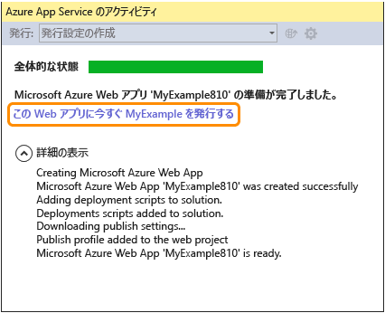
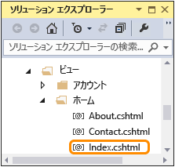
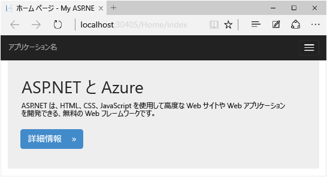

<properties
	pageTitle="Azure App Service での ASP.NET Web アプリの作成 | Microsoft Azure"
	description="このチュートリアルでは、Visual Studio 2013 で ASP.NET Web プロジェクトを作成したり、それを Azure App Service の Web アプリにデプロイしたりする方法について説明します。"
	services="app-service\web"
	documentationCenter=".net"
	authors="tdykstra"
	manager="wpickett"
	editor="jimbe"/>

<tags
	ms.service="app-service-web"
	ms.workload="web"
	ms.tgt_pltfrm="na"
	ms.devlang="dotnet"
	ms.topic="hero-article"
	ms.date="08/10/2015"
	ms.author="tdykstra"/>

# Azure App Service での ASP.NET Web アプリの作成

## 概要

このチュートリアルでは、Visual Studio 2015 または Visual Studio 2013 を使用して、ASP.NET Web アプリケーションを作成し、[Azure App Service の Web アプリ](app-service-web-overview.md)にデプロイする方法を紹介します。このチュートリアルは、Azure または ASP.NET を使用した経験がない読者を対象に作成されています。このチュートリアルでは、クラウドで動作する単純な Web アプリケーションを作成します。

次の図に、完成したアプリケーションを示します。

学習内容:

* Azure SDK をインストールして、Azure 向け開発用にコンピューターを準備する方法
* Visual Studio の ASP.NET Web プロジェクトを作成して Azure Web アプリにデプロイする方法
* Web プロジェクトを変更して、アプリケーションを再デプロイする方法
* [Azure ポータル](/overview/preview-portal/)を使用して Web アプリを監視および管理する方法

##Microsoft Azure にサインアップする

このチュートリアルを完了するには、Azure アカウントが必要です。そのための方法は次のとおりです。

* [無料で Azure アカウントを開きます](/pricing/free-trial/?WT.mc_id=A261C142F)。Azure の有料サービスを試用できるクレジットが提供されます。このクレジットを使い切ってもアカウントは維持されるため、Azure App Service の Web Apps 機能など、無料の Azure サービスと機能を利用できます。
* [MSDN サブスクライバーの特典を有効にします](/pricing/member-offers/msdn-benefits-details/?WT.mc_id=A261C142F)。MSDN サブスクリプションにより、有料の Azure サービスを利用できるクレジットが毎月与えられます。

> [AZURE.NOTE]Azure アカウントにサインアップする前に Azure App Service を開始する場合は、「[Azure App Service を使ってみる](http://go.microsoft.com/fwlink/?LinkId=523751)」にアクセスしてください。有効期間が短いスターター Web アプリを App Service ですぐに作成できます。このサービスの利用にあたり、クレジット カードは必要ありません。契約も必要ありません。

このビデオでは、Scott Hanselman が Microsoft Azure の無料試用版に簡単にサインアップできることを説明します。(時間: 1:58)

> [AZURE.VIDEO sign-up-for-microsoft-azure]

[AZURE.INCLUDE [install-sdk-2015-2013](../../includes/install-sdk-2015-2013.md)]

## ASP.NET Web アプリケーションを作成する

最初の手順では、Visual Studio で Web プロジェクトを作成し、Azure App Service で Web アプリケーションを作成します。作成が完了したら、インターネットで Web アプリを公開できるように、そのプロジェクトを Web アプリにデプロイします。

次の図では、作成とデプロイの手順の内容を示しています。

1. Visual Studio 2015 または Visual Studio 2013 を開きます。

	Visual Studio 2013 を使用する場合は、画面がスクリーンショットと若干異なる可能性がありますが、基本的に手順は同じです。

2. **[ファイル]** メニューの **[新しいプロジェクト]** をクリックします。

3. **[新しいプロジェクト]** ダイアログ ボックスで、**[C#]、[Web]、[ASP.NET Web アプリケーション]** の順にクリックします。必要に応じて、**[Visual Basic]** を選択することもできます。

3. ターゲット フレームワークとして **.NET Framework 4.5.2** が選択されていることを確認します。

4.  [Azure Application Insights](app-insights-overview.md) は、Web アプリの可用性、パフォーマンス、および利用状況を監視します。Application Insights を使わない場合は、**[Application Insights をプロジェクトに追加する]** チェック ボックスをオフにします。

4. アプリケーションに「**MyExample**」という名前を付けます。

5. **[OK]** をクリックします。

	

5. **[新しい ASP.NET プロジェクト]** ダイアログ ボックスで、**[MVC]** テンプレートを選択します。

	[MVC](http://www.asp.net/mvc) は Web アプリを開発するための ASP.NET のフレームワークです。

7. **[認証の変更]** をクリックします。

	

6. **[認証の変更]** ダイアログ ボックスで、**[認証なし]** をクリックし、**[OK]** をクリックします。

	![[認証なし]](./media/web-sites-dotnet-get-started/GS13noauth.png)

	作成しているサンプル アプリケーションでは、ユーザーはログインできません。「[次のステップ](#next-steps)」セクションは、認証と承認を実装するチュートリアルにリンクしています。

5. **[新しい ASP.NET プロジェクト]** ダイアログ ボックスで、**[Microsoft Azure]** の設定はそのままにして、**[OK]** をクリックします。

	

	既定の設定は、Visual Studio が Web プロジェクトのための Azure Web アプリを作成することを指定しますチュートリアルの次のセクションでは、Web プロジェクトを新しく作成した Web アプリにデプロイします。

5. Azure にまだサインインしていない場合は、サインインを求めるメッセージが表示されます。Azure サブスクリプションを管理するために使用するアカウントの ID とパスワードを使用してサインインします。

	サインインすると、**[Microsoft Azure Web アプリの設定を構成する]** ダイアログ ボックスが表示され、作成するリソースが求められます。

	

3. **[Microsoft Azure Web アプリの設定を構成する**] ダイアログ ボックスで、*azurewebsites.net* ドメイン内で一意である **Web アプリ名**を入力します。たとえば、MyExample という名前の右側に番号を付加して一意にすることができます (例: MyExample810)。既定の Web 名が作成される場合は、それが一意になるため、そのまま使用することができます。

	入力した名前が既に使用されている場合は、右側に緑色のチェック マークではなく赤色の感嘆符が表示されます。この場合、別の名前を入力する必要があります。

	Azure では、この名前がアプリケーションの URL のプレフィックスとして使用されます。URL 全体は、この名前に *.azurewebsites.net* を追加して構成されます (**[Web アプリ名]** ボックスの横を参照)。たとえば、名前が `MyExample810` である場合、URL は `MyExample810.azurewebsites.net` です。URL は一意であることが必要です。

4. **[App Service プラン]** ボックスの一覧で、**[新しい App Service プランの作成]** を選択します。

	「[次のステップ](#next-steps)」セクションには、App Service プランに関する情報へのリンクがあります。

5. プラン名には、「**MyExamplePlan**」、または必要に応じて別の名前を入力します。

6. **[リソース グループ]** ボックスの一覧で、**[新規リソース グループの作成]** を選択します。

	「[次のステップ](#next-steps)」セクションには、リソース グループに関する情報へのリンクがあります。

5. リソース グループ名には、「**MyExampleGroup**」、または必要に応じて別の名前を入力します。

5. **[リージョン]** ドロップダウン リストで、最も近い場所を選択します。

	この設定によって、Web アプリが実行される Azure データ センターが指定されます。このチュートリアルでは、任意のリージョンを選択することができます。任意のリージョンを選択しても、大きな違いはありません。ただし、運用 Web アプリでは、サイトにアクセスするブラウザーに最も近い Web サーバーを選択して[待機時間](http://www.bing.com/search?q=web%20latency%20introduction&qs=n&form=QBRE&pq=web%20latency%20introduction&sc=1-24&sp=-1&sk=&cvid=eefff99dfc864d25a75a83740f1e0090)を最小にします。

5. データベース フィールドは変更せずそのままにします。

	このチュートリアルでは、データベースは使用しません。「[次のステップ](#next-steps)」セクションには、データベースの使用方法を示したチュートリアルへのリンクがあります。

6. **[OK]** をクリックします。

	

	Visual Studio により、指定したフォルダーに Web プロジェクトが数秒で作成され、指定した Azure リージョンに Web アプリが作成されます。

	**[ソリューション エクスプローラー]** ウィンドウには、新しいプロジェクトのファイルとフォルダーが表示されます

	

	**[Azure App Service アクティビティ]** ウィンドウには、Web アプリが作成されたことが表示されます。

	

	作成された Web アプリが**サーバー エクスプローラー**に表示されます。

	

## Azure にアプリケーションをデプロイする

7. **[Azure App Service アクティビティ]** ウィンドウで、**[今すぐ MyExample をこの Web アプリに発行する]** をクリックします。

	

	数秒で、**Web の発行**ウィザードが表示されます。

	Visual Studio がプロジェクトを Azure にデプロイするために必要な設定が、*発行プロファイル*に保存されます。このウィザードを使用して、これらの設定を確認し、変更できます。

8. **Web の発行**ウィザードの **[接続]** タブで、**[次へ]** をクリックします。

	Visual Studio には、Azure の Web アプリにデプロイする必要がある設定がすべて用意されています。

	

10. **[設定]** タブの **[次へ]** をクリックします。

	**[構成]** および **[ファイル発行オプション]** には既定値を使用できます。

	**[構成]** ボックスの一覧を使用して、リモート デバッグ用のデバック ビルドをデプロイできます。「[次のステップ](#next-steps)」セクションは、リモートのデバッグ モードで Visual Studio を実行する方法を示したチュートリアルにリンクしています。

	

11. **[プレビュー]** タブで、**[発行]** をクリックします。

	Azure にコピーされるファイルを確認するには、**[発行]** をクリックする前に **[プレビューの開始]** をクリックします。

	

	Azure サーバーにファイルをコピーする処理が開始されます。

	**[出力]** ウィンドウと **[Azure App Service アクティビティ]** ウィンドウでは、実行されたデプロイ操作が表示され、デプロイが問題なく完了したことが報告されます。

	

	デプロイが成功すると、自動的に既定のブラウザーが開き、デプロイ先の Web アプリの URL にアクセスします。これで、作成したアプリケーションはクラウドで実行されています。ブラウザー アドレス バーの URL は、インターネットから読み込まれた Web アプリを示します。

	

13. ブラウザーを閉じます。

## 変更を加えて、再デプロイする

このセクションは省略可能です。ここでは、ホーム ページの **h1** 見出しを変更し、開発用コンピューターで、プロジェクトをローカルで実行して変更を確認します。その後、変更を Azure にデプロイします。

2. **ソリューション エクスプローラー**の **Views/Home/Index.cshtml** ファイルまたは **.vbhtml** ファイルを開き、**h1** 見出しを「ASP.NET」から「ASP.NET および Azure」に変更して、ファイルを保存します。

	

	

1. Ctrl キーを押しながら F5 キーを押してローカル コンピューターで Web アプリを実行し、更新した見出しを確認します。

	

	`localhost` URL には、ローカル コンピューターで実行中であることが表示されます。既定では、IIS Express で実行されます。これは、Web アプリケーションの開発での使用を想定した、IIS の軽量バージョンです。

1. ブラウザーを閉じます。

1. **[ソリューション エクスプローラー]** でプロジェクトを右クリックし、**[発行]** を選択します。

	

	**Web の発行**ウィザードの **[プレビュー]** タブが表示されます。発行設定を変更する必要がある場合、異なるタブを選択できますが、今は同じ設定で再デプロイします。

2. **Web の発行**ウィザードで、**[発行]** をクリックします。

	

	Visual Studio ではプロジェクトが Azure にデプロイされ、既定のブラウザーで Web アプリが開きます。

	

**ヒント:** 簡易デプロイの場合も、**[Web の 1 クリック発行]** ツール バーを有効にできます。**[表示]、[ツール バー]** の順にクリックし、**[Web の 1 クリック発行]** を選択します。ツール バーを使用してプロファイルを選択し、ボタンをクリックして発行するか、ボタンをクリックして **Web の発行**ウィザードを開くことができます。

## Azure ポータルで Web アプリを監視および管理する

[Azure ポータル](/services/management-portal/)は、作成した Web アプリなどの Azure のサービスを管理および監視するために使用できる Web インターフェイスです。チュートリアルのこのセクションでは、ポータルで何ができるかを確認します。

1. ブラウザーで、[https://portal.azure.com](https://portal.azure.com) に移動し、Azure 資格情報でサインインします。

2. **[すべて参照]、[Web Apps]** の順にクリックした後、Web アプリの名前をクリックします。

	**[Web アプリ]** ブレードには、Web アプリの設定と利用統計の概要が表示されます。

	

	この時点では、Web アプリにはトラフィックがそれほど存在しないため、グラフには何も表示されない可能性があります。アプリケーションにアクセスし、何回かページを更新してから、ポータル ページを更新すると、統計が表示されます。

3. **[設定]** をクリックすると、Web アプリの構成についてさらに多くのオプションが表示されます。

	設定のタイプの一覧が表示されます。

	

4. **[アプリケーション設定]** をクリックすると、ポータルで構成できる設定値の種類の例が表示されます。

	たとえば、Web アプリで使用される .NET のバージョンを制御したり、[WebSocket](/blog/2013/11/14/introduction-to-websockets-on-windows-azure-web-sites/) などの機能を有効にしたりすることができます。また、[接続文字列値](/blog/2013/07/17/windows-azure-web-sites-how-application-strings-and-connection-strings-work/)を設定できます。

	

これらは、ポータル機能の一部にすぎません。新しい Web アプリを作成したり、既存の Web アプリを削除したり、Web アプリを停止して再起動したり、データベースや仮想マシンなど、その他の種類の Azure サービスを管理したりできます。

## 次のステップ

このチュートリアルでは、Azure の Web アプリに単純な Web アプリケーションを作成してデプロイする方法について説明しました。Azure App Service の Web アプリの詳細についての関連トピックとリソースがあります。

* Web プロジェクトをデプロイする他の方法

	このチュートリアルでは、Web アプリを作成して、オールインワン操作ですべてをデプロイする最も簡単な方法を説明しました。Visual Studio を使用した、または[ソース管理システム](http://www.asp.net/aspnet/overview/developing-apps-with-windows-azure/building-real-world-cloud-apps-with-windows-azure/source-control)からの[デプロイの自動化](http://www.asp.net/aspnet/overview/developing-apps-with-windows-azure/building-real-world-cloud-apps-with-windows-azure/continuous-integration-and-continuous-delivery)による他のデプロイ方法の概要については、[Azure Web アプリをデプロイする方法](web-sites-deploy.md)に関するページを参照してください。

	Visual Studio により、デプロイを自動化するために使用可能な Windows PowerShell スクリプトも生成できます。詳細については、「[Automate Everything (Building Real-World Cloud Apps with Azure) (すべてを自動化 - Azure での実際のクラウド アプリケーションのビルド)](http://www.asp.net/aspnet/overview/developing-apps-with-windows-azure/building-real-world-cloud-apps-with-windows-azure/automate-everything)」を参照してください。

* Visual Studio での Web アプリの管理方法

	**サーバー エクスプローラー**で実行できる Web アプリ管理機能については、[Visual Studio での Azure Web アプリのトラブルシューティング](web-sites-dotnet-troubleshoot-visual-studio.md)に関するページを参照してください。

* Web アプリのトラブルシューティングの方法

	Visual Studio には、リアルタイムで生成される Azure ログの表示を容易にする機能があります。Azure では、リモートでデバッグ モードを使用して実行することもできます。詳細については、[Visual Studio での Azure Web アプリのトラブルシューティング](web-sites-dotnet-troubleshoot-visual-studio.md)に関するページを参照してください。

* データベースと承認の機能を追加する方法

	データベースにアクセスして、一部のアプリケーション機能を許可されたユーザーのみに制限する方法を示すチュートリアルについては、[メンバーシップ、OAuth、および SQL Database によりセキュリティ保護された ASP.NET MVC アプリの Azure Web アプリへのデプロイ](/develop/net/tutorials/web-site-with-sql-database/)に関するページを参照してください。

* カスタム ドメイン名および SSL の追加方法

	SSL および独自のドメイン (contoso.azurewebsites.net の代わりに www.contoso.com など) の使用方法については、次のリソースを参照してください。

	* [Azure App Service のカスタム ドメイン名の構成](web-sites-custom-domain-name.md)
	* [Azure の Web サイトでの HTTPS の有効化](web-sites-configure-ssl-certificate.md)

* アイドル時間終了後のウェイクアップの待機時間を回避する方法

	既定では、アイドル状態がしばらく続いている Web アプリはアンロードされます。Web アプリがアンロードされた後の初回要求は、Web アプリが再度読み込まれるまで待機する必要があります。この待機時間を回避するために、AlwaysOn 機能を有効にすることができます。詳細については、[Web アプリの構成方法](web-sites-configure.md)に関するページで構成オプションを参照してください。

* リアルタイム機能 (チャットなど) の追加方法

	Web アプリでリアルタイム機能 (チャット サービス、ゲーム、株価情報など) を使用する場合は、[WebSocket](/blog/2013/11/14/introduction-to-websockets-on-windows-azure-web-sites/) の転送方法で [ASP.NET SignalR](http://www.asp.net/signalr) を使用すると、パフォーマンスが最大になります。詳細については、[Azure Web Apps での SignalR の使用](http://www.asp.net/signalr/overview/signalr-20/getting-started-with-signalr-20/using-signalr-with-windows-azure-web-sites)に関するページを参照してください。

* Web アプリケーションに対する App Service、Azure Cloud Services、および Azure Virtual Machines の選択方法

	Azure では、このチュートリアルで示したように App Service Web Apps で、または Cloud Services や Virtual Machines で、Web アプリケーションを実行することができます。詳細については、[Azure の Web アプリ、クラウド サービス、VM のうち、いつどれを使用するか](/manage/services/web-sites/choose-web-app-service/)を説明したページを参照してください。

* [App Service プランを選択または作成する方法](../app-service/azure-web-sites-web-hosting-plans-in-depth-overview.md)

* [リソース グループを選択または作成する方法](../azure-preview-portal-using-resource-groups.md)

## 変更内容
* Websites から App Service への変更ガイドについては、「[Azure App Service と既存の Azure サービス](http://go.microsoft.com/fwlink/?LinkId=529714)」を参照してください。
* 以前のポータルから新しいポータルへの変更ガイドについては、「[Azure ポータル内の移動に関するリファレンス](http://go.microsoft.com/fwlink/?LinkId=529715)」を参照してください。

<!-----HONumber=September15_HO1-->