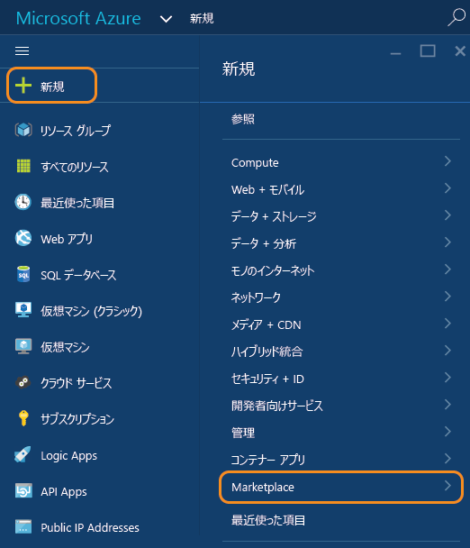
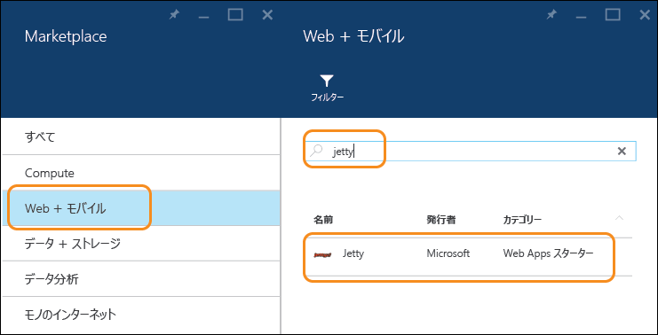
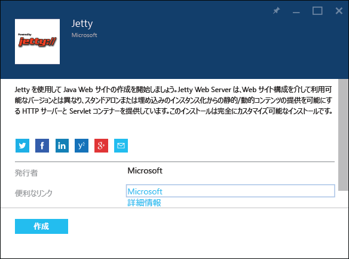
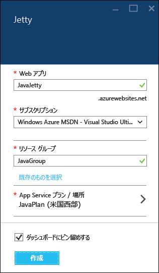
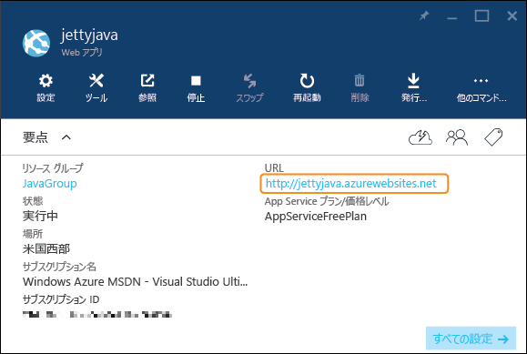
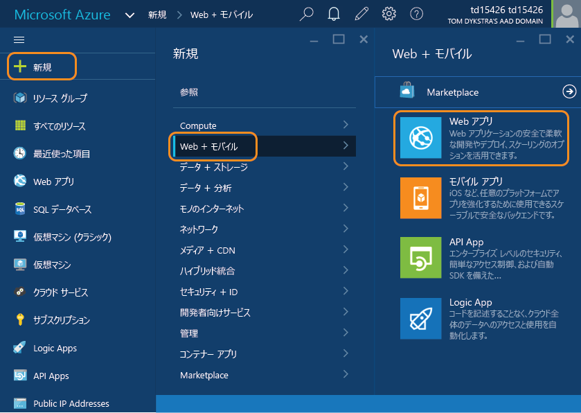
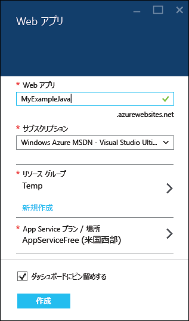
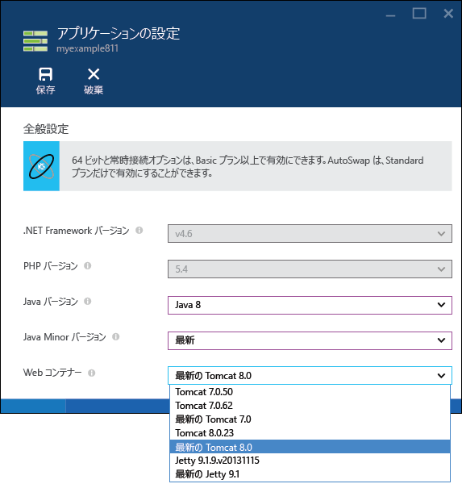

<properties
	pageTitle="Azure App Service での Java Web アプリの作成 | Microsoft Azure"
	description="このチュートリアルでは、Java Web アプリを Azure App Service にデプロイする方法を示します。"
	services="app-service\web"
	documentationCenter="java"
	authors="rmcmurray"
	manager="wpickett"
	editor="jimbe"/>
<tags
	ms.service="app-service-web"
	ms.workload="web"
	ms.tgt_pltfrm="na"
	ms.devlang="Java"
	ms.topic="hero-article"
	ms.date="10/20/2015"
	ms.author="robmcm"/>

# Azure App Service での Java Web アプリの作成

> [AZURE.SELECTOR]
- [.Net](web-sites-dotnet-get-started.md)
- [Node.js](web-sites-nodejs-develop-deploy-mac.md)
- [Java](web-sites-java-get-started.md)
- [PHP - Git](web-sites-php-mysql-deploy-use-git.md)
- [PHP - FTP](web-sites-php-mysql-deploy-use-ftp.md)
- [Python](web-sites-python-ptvs-django-mysql.md)

このチュートリアルでは、[Azure プレビュー ポータル](https://portal.azure.com/)を使用して [Azure App Service で Java Web アプリ](http://go.microsoft.com/fwlink/?LinkId=529714)を作成する方法について説明します。Azure プレビュー ポータルは、Azure リソースの管理に使用できる Web インターフェイスです。

> [AZURE.NOTE]このチュートリアルを完了するには、Microsoft Azure アカウントが必要です。アカウントを持っていない場合は、[MSDN サブスクライバーの特典を有効にする][]か、[無料試用版にサインアップ][]してください。
>
> Azure アカウントにサインアップせずに Azure App Service の使用を開始する場合は、[App Service の試用][]に関するページに移動してください。有効期間が短いスターター Web アプリを App Service ですぐに作成できます。このサービスの利用にあたり、クレジット カードは必要ありません。契約も必要ありません。

## Java アプリケーション オプション

複数の方法で Java アプリケーションを App Service Web アプリにセットアップできます。

1. Azure Marketplace からテンプレートを使用する。

	Azure Marketplace には、Java Web アプリを自動的に作成して Tomcat または Jetty Web コンテナーで管理するテンプレートが含まれています。テンプレートによってセットアップされる Web コンテナーは、構成可能です。詳細については、このチュートリアルの「[Azure Marketplace にある Java テンプレートの使用](#marketplace)」セクションを参照してください。
 
1. アプリを作成して**アプリケーション設定**を構成する。

	App Service では、複数のバージョンの Tomcat と Jetty が既定の構成で提供されています。ホストするアプリケーションが組み込みバージョンの Web コンテナーで動作するようであれば、この方法で Web コンテナーをセットアップするのが最も簡単です。ただし、他の方法で利用できる各種構成機能を利用できません。この方法では、ポータルでアプリを作成した後、アプリの **[アプリケーション設定]** ブレードに移動して、お使いの Java のバージョンと目的の Java Web コンテナーを選びます。この方法を使用する場合、アプリをホストするために worker によって使用されるローカル ハード ドライブからアプリが実行されるため、テナントのディスク スペースは使用されません。このモデルを使用する場合、ファイル システムのこの部分のファイルを編集するためのアクセス権はありません。つまり、*server.xml* ファイルを構成したり、*/lib* フォルダーにライブラリ ファイルを追加したりすることはできません。詳細については、このチュートリアルの後半の「[Java Web アプリの作成と構成](#appsettings)」セクションを参照してください。
  
3. アプリを作成してから構成ファイルを手動でコピーして編集する。

	App Service によって提供されるどの Web コンテナーにもデプロイしないカスタム Java アプリケーションをホストすることがあります。例として、次にその理由をいくつか示します。
	
	* お使いの Java アプリケーションに必要な Tomcat または Jetty のバージョンが App Service によって直接サポートされていないか、ギャラリーで提供されていない。
	* お使いの Java アプリケーションが HTTP 要求を受け取り、WAR として既存の Web コンテナーにデプロイされない。
	* 最初から自分で Web コンテナーを構成したい。 
	* App Service でサポートされていないバージョンの Java を使用して自分でアップロードしたい。

	これらの場合は、ポータルを使ってアプリを作成して、適切なランタイム ファイルを手動で指定できます。このとき、ファイルは App Service プランのストレージ領域クォータに対してカウントされます。詳細については、[Azure へのカスタム Java Web アプリのアップロード](https://acom-sandbox.azurewebsites.net/ja-JP/documentation/articles/web-sites-java-custom-upload/)に関するページを参照してください。

##  Azure Marketplace にある Java テンプレートの使用

このセクションでは、Azure Marketplace を使用して Java Web アプリを作成する方法について説明します。Java ベースのモバイル アプリや API アプリを作成する場合にも、同様の一般的なフローを利用できます。

1. [Azure プレビュー ポータル](https://portal.azure.com/)にサインインします。

2. **[新規]、[Marketplace]** の順にクリックします。

	

3. **[Web + モバイル]** をクリックします。

	左へスクロールして **[Marketplace]** ブレードを表示すると、**[Web + モバイル]** を選択できます。

4. 検索テキスト ボックスに、**Apache Tomcat** や **Jetty** など、Java アプリケーション サーバーの名前を入力して、Enter キーを押します。

5. 検索結果で、Java アプリケーション サーバーをクリックします。

	

6. 最初の **[Apache Tomcat]** ブレードまたは **[Jetty]** ブレードで、**[作成]** をクリックします。

	

7. 次の **[Apache Tomcat]** ブレードまたは **[Jetty]** ブレードで、**[Web アプリ]** ボックスに Web アプリの名前を入力します。

	Web アプリの URL は {name}.azurewebsites.net のようになるため、この名前は azurewebsites.net ドメイン内で一意である必要があります。入力した名前が一意でない場合は、テキスト ボックスに赤色の感嘆符が表示されます。

8. **リソース グループ**を選択するか、新しく作成します。

	リソース グループの詳細については、「[Azure プレビュー ポータルを使用した Azure リソースの管理](../resource-group-portal.md)」を参照してください。

9. **App Service プラン/場所**を選択するか、新しく作成します。

	App Service プランの詳細については、[Azure App Service プランの概要](../azure-web-sites-web-hosting-plans-in-depth-overview.md)に関するページを参照してください。

10. **[作成]** をクリックします。

	

	短時間 (通常は 1 分未満) で、新しい Web アプリの作成が完了します。

11. **[Web アプリ]、{作成した新しい Web アプリ}** の順にクリックします。

12. **[URL]** をクリックして新しいサイトを参照します。

	

	Tomcat には既定のページ セットが用意されているため、Tomcat を選択した場合は次の例のようなページが表示されます。

	

	Jetty を選択した場合は、次のようなページが表示されます。Jetty には既定のページ セットが用意されていないため、空の Java サイトに使用されるのと同じ JSP がここでも使用されます。

	

これで、Web アプリとアプリ コンテナーが作成されました。アプリケーションを Web アプリにアップロードする方法については、「[次のステップ](#next-steps)」セクションを参照してください。

##  Java Web アプリの作成と構成

このセクションでは、Web アプリを作成し、ポータルの **[アプリケーション設定]** ブレードを使用して Java 向けに構成する方法について説明します。

1. [Azure プレビュー ポータル](https://portal.azure.com/)にサインインします。

2. **[新規]、[Web + モバイル]、[Web アプリ]** の順にクリックします。

	

4. Web アプリの名前を **[Web アプリ]** ボックスに入力します。

	Web アプリの URL は {name}.azurewebsites.net のようになるため、この名前は azurewebsites.net ドメイン内で一意である必要があります。入力した名前が一意でない場合は、テキスト ボックスに赤色の感嘆符が表示されます。

5. **リソース グループ**を選択するか、新しく作成します。

	リソース グループの詳細については、「[Azure プレビュー ポータルを使用した Azure リソースの管理](../resource-group-portal.md)」を参照してください。

6. **App Service プラン/場所**を選択するか、新しく作成します。

	App Service プランの詳細については、[Azure App Service プランの概要](../azure-web-sites-web-hosting-plans-in-depth-overview.md)に関するページを参照してください。

7. **[作成]** をクリックします。

	
 
8. Web アプリが作成されたら、**[Web アプリ]、{作成した Web アプリ}** の順にクリックします。
 
	

9. **[Web アプリ]** ブレードで、**[設定]** をクリックします。

10. [**アプリケーションの設定**] をクリックします。

11. 目的の **[Java バージョン]** を選択します。

12. 目的の **[Java マイナー バージョン]** を選択します。**[最新]** を選択すると、お使いのアプリで、その Java メジャー バージョン向けの App Service で使用できる最新のマイナー バージョン使用することになります。

12. 目的の **[Web コンテナー]** を選択します。"**最新**" で始まるコンテナー名を選択すると、お使いのアプリは、App Service で使用できる Web コンテナー メジャー バージョンの最新バージョンに保たれます。

	

13. **[保存]** をクリックします。

	お使いの Web アプリはすぐに Java ベースになり、選んだ Web コンテナーを使用するように構成されます。

14. **[Web アプリ]、{作成した新しい Web アプリ}** の順にクリックします。

15. **[URL]** をクリックして新しいサイトを参照します。

	表示された Web ページで、Java ベースの Web アプリが作成されたことを確認します。

## 次のステップ

この時点で、Java アプリケーション サーバーは Azure App Service の Web アプリで動作しています。独自のコードを Web アプリにデプロイするには、[Java Web アプリへのアプリケーションまたは Web ページの追加](web-sites-java-add-app.md)に関するページを参照してください。

Azure での Java アプリケーションの開発の詳細については、[Java デベロッパー センター](/develop/java/)を参照してください。

<!-- External Links -->
[MSDN サブスクライバーの特典を有効にする]: http://go.microsoft.com/fwlink/?LinkId=623901
[無料試用版にサインアップ]: http://go.microsoft.com/fwlink/?LinkId=623901

[App Service の試用]: http://go.microsoft.com/fwlink/?LinkId=523751

<!---HONumber=Nov15_HO2-->